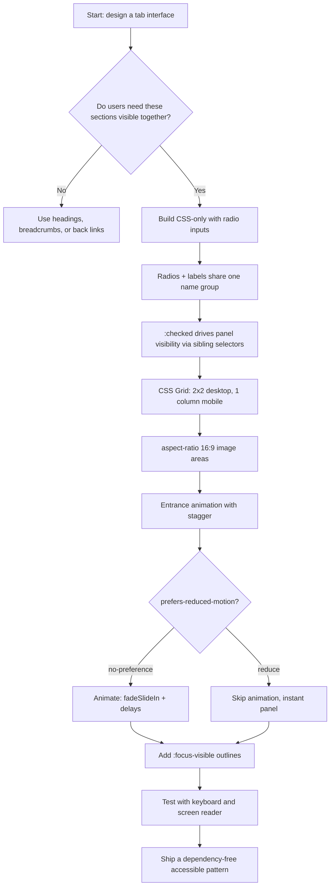

| Difficulty | Channel | Tags |
|---|---|---|
| beginner | frontend | css, flexbox, grid, animations |

GOV.UK is the digital front door of a nation, serving roughly 17 million users every week under the legal weight of WCAG 2.2 AA compliance [1][8]. So when the GOV.UK Design System's own documentation advises developers to 'do not use the tabs component' for the majority of content, that verdict demands your attention [1]. Yet the interview prompt still comes around: build a CSS-only tab panel with radio inputs and zero JavaScript. This is the story of why the UK's most rigorous design team nearly banned tabs — and how you can still build the pattern responsibly with nothing but CSS.

---

> ### Real-World Case — GOV.UK / UK Government Digital Service (GDS)
>
> GDS builds the GOV.UK Design System that every UK government digital service must use, and gov.uk serves roughly 17 million users a week while being legally required to meet WCAG 2.2 AA under the Public Sector Bodies Accessibility Regulations 2018. When researching tabs, they also found a documented case in the 'Publish teacher training courses' service where users consistently missed tabbed navigation and lost access to significant features.
>
> | | |
> |---|---|
> | **Challenge** | How to build a tab panel (including the popular pure-CSS radio-input hack with :checked + sibling selectors) that survives real accessibility requirements and user research, when tab panels hide content and need proper keyboard/screen-reader semantics. |
> | **Solution** | GDS rejected the CSS-only radio hack outright: radio inputs can't carry tab semantics (a screen reader announces 'radio button, one of three'), provide no roving tabindex or focus management, and offer no no-JS fallback. Their shipped Tabs component requires JavaScript with WAI-ARIA roles (tablist/tab/tabpanel), roving tabindex, aria-selected, a URL fragment per tab so the back button works, and when JS is unavailable the panels render all on one page in reading order with a table of contents - the exact opposite of hiding them with CSS. Their published guidance tells teams 'Do not use tabs' in most cases and to test content without tabs first. |
> | **Outcome** | The component documentation explicitly says 'Do not use the tabs component' for the majority of content, tab labels that mislead were found to hide critical features in user research (teams like Publish teacher training courses removed tabs entirely and switched to breadcrumbs/back links), and the pattern and guidance were adopted across DWP, HMCTS, Defra and copied by the NHS digital design system - a decision tree used by thousands of government services. |
> | **Lesson** | The 'clever' pure-CSS tab panel is an accessibility anti-pattern at real scale: interactive components need JS for semantics, focus management, and progressive enhancement. As GDS puts it, tabs hide content, not everyone notices them, and you should exhaust content restructuring before ever reaching for a CSS-only interactive widget. |

---

## Hook — The tab component that told developers to stop

You are 30 minutes into a frontend interview. The prompt: build a CSS-only tab panel for a design-system docs page. No JavaScript, no libraries, no excuses. Most developers freeze at the word 'tabs' — because everyone has been burned by a tab component that hides content, breaks focus, or silently fails for keyboard users. But here is the twist: the most rigorous digital team on the planet, GOV.UK's Government Digital Service, investigated this exact pattern and concluded that the majority of teams reaching for tabs should reach for something else entirely [1]. Meanwhile, the rest of the web keeps shipping tabbed interfaces that make users miss entire features. So which side are you on — and can a humble radio input be the hero this story needs?

## Problem — Tabs look innocent. That's exactly the danger.

Tabs look innocent. A row of headings, a click, and content swaps. What could go wrong? Plenty. For starters, tabs hide content by design — and hidden content is content users forget exists. Worse, the 'classic' tabs recipe from old tutorials leans on JavaScript hacks: click handlers, ARIA role='tablist', arrow-key navigation, and manual focus management [9]. Get any of it wrong and screen-reader users get silence, keyboard users get lost, and mobile users get an unusable row of slivers. The radio-input trick offers a genuinely different route: native input state, zero JavaScript, and semantics that are impossible to break. However, it comes with its own rules — and that is exactly where most attempts go off the rails. You might think any CSS that 'just works' is fine. Accessibility reviewers think otherwise, and they are grading your DOM order, your labels, and your focus outlines [4].

## Real-World Case — GOV.UK / UK Government Digital Service (GDS)

Now for the story that frames everything. GOV.UK serves roughly 17 million users a week, and under the Public Sector Bodies Accessibility Regulations 2018, every one of those pages is legally required to meet WCAG 2.2 AA [1][8]. That is not a nice-to-have; it is a statutory duty with real enforcement teeth. When the GDS team researched the tabs pattern, the evidence was damning. In the 'Publish teacher training courses' service, user research found people consistently missed tabbed navigation entirely — tab labels that seemed perfectly clear in design mockups were effectively invisible in the field, hiding significant features. The teams did not respond by adding more animation or fancier CSS. They deleted the tabs, replaced them with breadcrumbs and back links, and watched users find what they needed [1]. Consequently, the guidance spread: the decision tree in the GOV.UK Design System now steers teams away from tabs, and it has been adopted by DWP, HMCTS, and Defra, and copied by the NHS digital design system — a pattern decision consulted by thousands of services [1][10]. The punchline? Tabs are not evil. Thoughtless tabs are. And that distinction is the entire point of this article.

## Deep Dive — How a radio input quietly becomes a tab bar

Building on that story, let's look under the hood. The radio-based tab panel is a masterpiece of CSS's oldest trick: state stored in the DOM, not in JavaScript. Each tab is an  with a shared name attribute, and each panel is a sibling that stays visible only while its radio is :checked [2]. Because only one radio in a group can be selected at a time, the browser performs the tab switching for you — no code to run, nothing to break. The general sibling combinator (~) connects the checked input to its panel, and every unselected panel simply stops being displayed [6]. Then come the three refinements that separate a demo from a production pattern. First, responsive layout: CSS Grid with repeat(2, 1fr) produces the 2x2 desktop grid, and a single media query collapses it to one column on small screens [7]. Second, the image area: aspect-ratio: 16 / 9 keeps every card's visual weight identical no matter the content width [3]. Third, motion: the entrance animation runs only when the user has not requested reduced motion, via the prefers-reduced-motion media query — and the stagger comes from nth-child animation-delays [5]. Here is the real tradeoff:

| Radio-based CSS tabs | JavaScript ARIA tabs |
|---|---|
| Zero JS, cannot break at runtime | Full ARIA tabs pattern [9] |
| Browser-native selection state | Requires arrow-key handlers |
| Basic but dependable semantics | Richer but more failure modes |
| Ideal for simple docs toggles | Better for complex app UIs |

Many developers assume 'no JavaScript' means 'less accessible'. Actually, the opposite can be true: a native radio gives you checked/unchecked semantics for free, while a botched JS tab pattern leaves assistive technology with nothing to announce. The radio approach is not a toy — it is a disciplined constraint.

## Workflow — Five moves from blank file to audited panel

However, building it is only half the battle; building it in the right order keeps you sane. Here is the workflow that takes you from a blank file to an accessible panel in five moves, and the diagram below captures the full journey — including the hardest decision, which happens before you write a single line of CSS.

[See diagram: Tab Interface Decision Flow]

The steps:

1. Decide first. Ask whether tabs genuinely help. If users need to compare content side by side, or the sections are hidden extras, use headings, breadcrumbs, or back links instead — like the teacher-training teams did [1].
2. Structure the HTML. Radios first, labels next, panels after — sibling order is what makes the CSS selectors work [6].
3. Drive visibility with :checked. Hide every panel that is not checked; the browser enforces exclusivity for you [2].
4. Layer the responsive grid. repeat(2, 1fr) first, then a 768px media query collapses everything to a single column [7].
5. Polish accessibility and motion last. Add focus-visible outlines, then wrap the animation in prefers-reduced-motion so nothing moves for users who asked for calm [4][5].

Every step checks off a box that a reviewer — or a WCAG audit — will look for. Consequently, when you reach the end, you are not crossing your fingers about compliance; you built it in.

## Code Example — The complete CSS-only tab panel

Now for the payoff — the complete CSS-only tab panel. This example combines the HTML structure and the styles into a single document, with comments marking the load-bearing lines. Read it top to bottom: the radios come first, the panels follow as siblings, and the CSS leans entirely on the checked state.

```html
<!-- Radio tabs: the shared name group enforces single selection -->
<div class="tabs">
  <input type="radio" id="tab-overview" name="tabs" checked>
  <label for="tab-overview">Overview</label>

  <input type="radio" id="tab-docs" name="tabs">
  <label for="tab-docs">Docs</label>

  <input type="radio" id="tab-api" name="tabs">
  <label for="tab-api">API</label>

  <!-- Panels are siblings of the radios, so ~ selectors can target them -->
  <section class="panel">
    <article class="card">
      <div class="card__image"></div>
      <h3 class="card__title">Card Title</h3>
      <p class="card__meta">Meta information</p>
    </article>
    <article class="card">
      <div class="card__image"></div>
      <h3 class="card__title">Card Title</h3>
      <p class="card__meta">Meta information</p>
    </article>
    <article class="card">
      <div class="card__image"></div>
      <h3 class="card__title">Card Title</h3>
      <p class="card__meta">Meta information</p>
    </article>
    <article class="card">
      <div class="card__image"></div>
      <h3 class="card__title">Card Title</h3>
      <p class="card__meta">Meta information</p>
    </article>
  </section>
</div>

<style>
  .tabs .panel {
    display: grid;
    grid-template-columns: repeat(2, 1fr); /* 2x2 on desktop */
    gap: 1.5rem;
  }

  @media (max-width: 768px) {
    .tabs .panel {
      grid-template-columns: 1fr; /* single column on mobile */
    }
  }

  /* Hide every panel whose radio is not checked */
  .tabs input:not(:checked) ~ .panel {
    display: none;
  }

  .card__image {
    aspect-ratio: 16 / 9; /* fixed image area, no layout shift */
    background: #eee;
  }

  /* Motion only for users who did not request reduced motion */
  @media (prefers-reduced-motion: no-preference) {
    .card {
      animation: fadeSlideIn 0.3s ease-out backwards;
    }
    .card:nth-child(2) { animation-delay: 0.1s; }
    .card:nth-child(3) { animation-delay: 0.2s; }
    .card:nth-child(4) { animation-delay: 0.3s; }
  }

  @keyframes fadeSlideIn {
    from { opacity: 0; transform: translateY(10px); }
    to   { opacity: 1; transform: translateY(0); }
  }

  /* Keyboard-visible outline without permanent decoration */
  :focus-visible {
    outline: 2px solid currentColor;
  }
</style>
```

Let's walk through it piece by piece. The .tabs container holds three radios with the same name attribute — that shared name is what makes the browser enforce 'only one selected at a time', giving you tab behavior with zero script [2]. Each label is tied to its radio with a for/id pair, so clicking the label toggles the input; that is also why the labels stay clickable after the panels hide. The grid lives on .panel, using repeat(2, 1fr) to build the 2x2 layout on desktop and switching to a single column at 768px [7]. Each card's .card__image gets aspect-ratio: 16 / 9, which pins the image area to a fixed proportion before any image loads — no layout shift, no reflow [3]. The animation is gated behind prefers-reduced-motion: no-preference, so users who request reduced motion get a static, instantly-visible panel while everyone else sees the 0.3s fadeSlideIn with 0.1s stagger increments [5]. Finally, :focus-visible restores a visible outline for keyboard users without littering the design with permanent rings [4]. Consequently, this is a tab panel that a screen reader understands, a keyboard user can operate, and a strict reviewer cannot easily break — because there is no script to break.

## Lessons Learned — What the GOV.UK story and a radio input teach us

So after all this, what should you take away? Here is what the GOV.UK story and this pattern together teach:

- Tabs hide things. Before building them, ask whether hiding is a feature or a bug [1].
- CSS-only does not mean 'less capable'. The radio input is native state, native semantics, and event handling you cannot forget to wire up [2].
- Fixed proportions matter. aspect-ratio: 16 / 9 prevents janky layout shifts on the cards [3].
- Motion is a privilege. Staggered animations delight only the users who want them; respect prefers-reduced-motion [5].
- Focus is non-negotiable. :focus-visible keeps keyboard users oriented without ugly permanent outlines [4].

If this feels like a lot for one little component, you are not alone — it is. But that is exactly why teams like GDS treat tabs as a decision, not a default. Tomorrow, before you add tabs to anything, run the two-question check: do users need to see these sections together, and does this content survive being hidden? If either answer is no, you just saved your users from missing something important. If the answer is yes, you now have a pattern that holds up under WCAG review and works everywhere JavaScript is a liability [8].

---

## Tab Interface Decision Flow



<details>
<summary><strong>Original Interview Question</strong></summary>

**Q:** Build a CSS-only tab panel for a design-system docs page. Use radio inputs to switch tabs (no JavaScript). Desktop: a 2x2 grid of cards under each tab; mobile: single column. Each card has a fixed 16:9 image area, a title, and a short meta line. Add a subtle entrance animation with a stagger and keep focus-visible outlines; ensure prefers-reduced-motion is respected?

**A:** Use a set of radio inputs with a shared `name` attribute and corresponding `` elements for each tab section. The `:checked` state of each radio controls visibility of its associated panel via adjacent sibling selectors. Each panel renders a 2×2 card grid on desktop and collapses to a single column on mobile. Cards use `aspect-ratio: 16/9` for fixed image containers, with a title and meta line below.

</details>

## Conclusion

The journey started with a government that nearly banned tabs and ended with a pattern that honors their caution. Radio-based CSS tabs will never replace the full ARIA tabs pattern for complex applications — but for a design-system docs page, they are a tiny, robust, and legally-defensible choice. What you should do differently tomorrow is simple: stop reaching for tabs on autopilot, start asking whether hiding content is actually helping, and when you do build tabs, let the HTML and CSS carry the weight. The one insight worth sharing with your team? The best tab implementation is often the one you never ship — and the second best is one that works with JavaScript switched off.

---

## References

1. [GOV.UK / UK Government Digital Service (GDS) incident report](https://github.com/alphagov/govuk-design-system/blob/main/src/components/tabs/index.md) — article
2. [MDN: :checked CSS pseudo-class](https://developer.mozilla.org/en-US/docs/Web/CSS/:checked) — documentation
3. [MDN: aspect-ratio CSS property](https://developer.mozilla.org/en-US/docs/Web/CSS/aspect-ratio) — documentation
4. [MDN: :focus-visible CSS pseudo-class](https://developer.mozilla.org/en-US/docs/Web/CSS/:focus-visible) — documentation
5. [MDN: prefers-reduced-motion media query](https://developer.mozilla.org/en-US/docs/Web/CSS/@media/prefers-reduced-motion) — documentation
6. [MDN: Adjacent sibling combinator](https://developer.mozilla.org/en-US/docs/Web/CSS/Adjacent_sibling_combinator) — documentation
7. [MDN: CSS grid layout](https://developer.mozilla.org/en-US/docs/Web/CSS/CSS_grid_layout) — documentation
8. [Web Content Accessibility Guidelines](https://en.wikipedia.org/wiki/Web_Content_Accessibility_Guidelines) — documentation
9. [MDN: ARIA tab role](https://developer.mozilla.org/en-US/docs/Web/Accessibility/ARIA/Roles/tab_role) — documentation
10. [GOV.UK Design System repository](https://github.com/alphagov/govuk-design-system) — documentation

---

**Author:** Satishkumar Dhule — [GitHub](https://github.com/satishkumar-dhule) · [LinkedIn](https://linkedin.com/in/satishkumar-dhule) · [Website](https://satishkumar-dhule.github.io)
