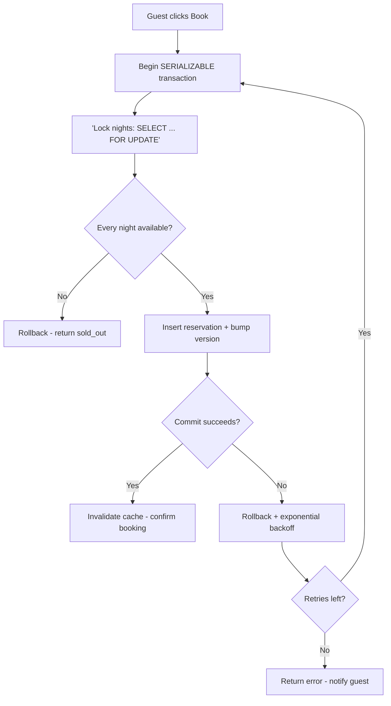

| Difficulty | Channel | Tags |
|---|---|---|
| intermediate | database | acid, isolation-levels, mvcc |

A guest clicks 'Book,' then clicks it again out of habit. Their card is charged twice — a double payment Airbnb engineers had to chase across dozens of payment microservices [1]. Now transplant that same race one layer deeper: two guests, one property, one night. Both transactions read 'available,' both write 'booked,' and suddenly you have sold the same weekend twice. This is the story of how databases stop double bookings at scale — and what isolation levels, row locks, and version columns actually buy you when real money is on the line.

---

> ### Real-World Case — Airbnb
>
> In Airbnb's distributed payments system, a guest clicking 'Book' twice, a timed-out request, or a lost response could cause the same reservation to be charged multiple times. As Airbnb migrated to a service-oriented architecture, guaranteeing that money moves 'at most once' across dozens of payment microservices became critical.
>
> | | |
> |---|---|
> | **Challenge** | Making booking/payment operations atomic and exactly-once across distributed services with unreliable network calls, while keeping ultra-low latency and avoiding custom per-use-case solutions for every payment product. |
> | **Solution** | Airbnb built a generic idempotency framework called Orpheus. Every request gets a unique idempotency key; the pre-RPC intent is recorded in the same ACID transaction that updates local state, then the external charge (RPC) runs, then the response is recorded. Each request acquires a row-level lock on its idempotency key, errors are classified as retryable vs non-retryable, and all idempotency reads/writes are forced to the primary database (never replicas), sharded by key. In a later rebuild, every workflow became a DAG of retryable idempotent steps. |
> | **Outcome** | The rebuilt payment orchestration, designed around Orpheus, achieved five 9s (99.999%) of consistency for payments, and Kafka's at-least-once delivery was upgraded to exactly-once via the idempotency framework. Airbnb processes payments for a global community of millions of hosts and guests. |
> | **Lesson** | The plot twist: idempotency keys alone are not enough — if a retry reads the idempotency record from a replica, even a few seconds of replication lag makes the system think the request 'does not exist' and execute a duplicate charge. All idempotency state must be read from the master, and idempotency must be treated as a concurrency boundary, not a cache. |

---

## Hook — The 8:12pm Double-Click

It is 8:12pm on a Thursday. A popular listing just reopened its calendar, and two guests — one in Berlin, one in Singapore — hit 'Book' milliseconds apart. Both screens say *Available*. Both cards process. But there is only one apartment and one weekend.

Without the right concurrency controls, one of two things happens: you rent the same night twice, or you strand a guest at the airport with a reservation that quietly evaporated. The distance between those two outcomes is measured in milliseconds — and controlled by a single database transaction.

Here is the uncomfortable truth: the moment two users can touch the same row, every line of code between them is a potential crime scene. Ever wondered why seasoned backend engineers get nervous around booking features? This is why.

## Problem — The read-modify-write race

Here is the crux of the challenge: a booking is a read-modify-write cycle. Read availability → check it is free → write 'booked.' When two requests run that cycle concurrently, nothing stops both from reading 'free' before either writes 'booked.' That is the classic race condition, and it is the reason 'just check if it's available' is not a strategy.

The naive fixes fail in instructive ways. A unique index on (property_id, date) stops the duplicate write, sure — but the guest-facing flow already told both users it was available, and now one of them gets a confusing error after their money moved. An application-level `if available: book` check outside a transaction is even worse: it is two separate operations, and a single context switch between them is all the chaos needs.

The stakes are brutal. Double bookings produce refunds, chargebacks, angry guests, support fires, and legal exposure. At Airbnb's scale — millions of hosts and guests — even a 0.1% failure rate means thousands of wrecked trips a day [1]. Sound familiar? If this feels overwhelming, you are not alone; this is precisely the problem that separates hobbyist apps from production systems.

## Real-World Case — Airbnb's double-payment war

Airbnb faced this exact shape of problem, and the resource being contested was money. In its distributed payments system, a guest clicking 'Book' twice, a request timing out, or a response being lost could cause the same reservation to be charged multiple times [1]. As the company migrated to a service-oriented architecture, guaranteeing that money moved 'at most once' across dozens of payment microservices became mission-critical.

The fix was a rebuilt payment orchestration designed around a system called Orpheus — and it delivered staggering numbers: five nines (99.999%) of consistency for payments [1]. Kafka's at-least-once delivery was upgraded to exactly-once semantics through an idempotency framework, meaning every event, however many times it was delivered, was processed exactly once [1].

The lesson transfers directly to booking: a reservation is a resource that must move at most once, just like money. Moreover, the tooling is the same — idempotency keys, retries, and strong consistency around the critical write. What Airbnb fixed at the orchestration layer, your database must also enforce at the row level. This leads to the technical core of the problem.

## Deep Dive — Isolation levels, MVCC, and the art of the lock

Building on Airbnb's story, the 'at most once' discipline has a database-level answer, and it starts with isolation levels. By default, most databases run READ COMMITTED: every query sees a fresh snapshot, which is great for throughput but useless against races — both guests read 'free' because neither sees the other's uncommitted write [3]. SERIALIZABLE isolation, in contrast, executes transactions as if they ran one after another [2][3]. PostgreSQL implements it with Serializable Snapshot Isolation (SSI): MVCC snapshots plus conflict detection that aborts one of the competing transactions [4].

Here is the trade-off, in black and white:

| Concern | READ COMMITTED | SERIALIZABLE |
| --- | --- | --- |
| Phantom reads | Possible | Prevented [3] |
| Overbooking protection | None on its own | Built-in conflict detection [3] |
| Throughput under contention | Higher | Lower |
| Best used for | Dashboards, reads | Money, inventory, bookings |

But SERIALIZABLE alone means more aborts under heavy contention — and aborts are expensive when a guest is mid-checkout. This leads to locks. `SELECT ... FOR UPDATE` takes row-level locks that make a competing transaction block until the first commits [5]. Locks turn the read-modify-write race into a serialized critical section, trading a few milliseconds of latency for correctness.

Not every system wants pessimistic locking, though. Optimistic concurrency control skips the locks entirely: read a version column, do the work, then `UPDATE ... WHERE version = ` [6]. If the row count is zero, someone else won, and the transaction retries. Here is the plot twist: optimistic locking collapses under heavy contention (constant retries), while pessimistic locking collapses under long lock-waits (constant blocking). Same enemy, different costume.

| Strategy | Locking | Failure mode | Best for |
| --- | --- | --- | --- |
| Pessimistic (SELECT FOR UPDATE) | Row locks [5] | Blocked transactions, wait timeouts | Hot, contested resources |
| Optimistic (version column) | None | Aborts + retries [6] | Moderate contention, low write volume |

And when booking sprawls across microservices, coordination often moves to distributed consensus stores like etcd, the backbone of Kubernetes [8]. Whatever the topology, the pattern holds: one authoritative transaction around the critical write, plus fast reads on the edges.

⚠️ Watch Out: read replicas are not a free win. A fast-path availability check against a replica is fine, but the authoritative check and the write must run against the primary inside one transaction. Validate against a replica, and you are racing stale data.

🔥 Hot Take: 'SERIALIZABLE is too slow for production' is a myth — it is too slow for *careless* production. Correctly scoped, with short transactions and targeted locks, it is the cheapest insurance a booking team can buy.

## Workflow — From click to confirmed in eight steps

Now assemble everything into a coherent flow. The diagram below — the **Booking Transaction Flow** — maps the full journey from click to confirmation:

1. **Fast path**: read availability from cache or a read replica. If it looks booked, reject immediately — no transaction burned.
2. **Looks free?** Begin a transaction at SERIALIZABLE isolation.
3. **Lock the nights**: `SELECT ... FOR UPDATE` on the availability calendar for the exact date range. This is the critical section.
4. **Validate**: every night must exist and read 'available.' A missing row is a data-integrity red flag — fix it, don't book around it.
5. **Write**: insert the reservation and bump the version column in the same transaction. One commit, all-or-nothing.
6. **Commit or retry**: on a serialization failure, roll back and retry with exponential backoff — 50ms, 100ms, 200ms, then give up. Instant retries create a thundering herd [6].
7. **Invalidate**: on success, clear the cache so the next fast-path read sees fresh state.
8. **Watch the vitals**: monitor lock-wait time and conflict rate per property. Hot listings get circuit breakers or a small queue so one apartment cannot drag down the database [8].

The order of operations matters more than any single tool. Validate before locking and the race is already lost; lock first, and the database does the arguing for you. Consequently, this is exactly why the code in the next section looks the way it does.

## Code Example — The booking transaction

Here is the practical version of everything above, in a single function that runs the entire booking inside one SERIALIZABLE transaction. It locks the contested nights, validates every one, writes the reservation, and retries with backoff on serialization failure. The code below implements the workflow's critical section.

## Lessons Learned — Battle scars and the road ahead

Here is what the battlefield taught teams who shipped this to production:

- **Never validate outside the transaction.** The `if available: book` pattern is two operations pretending to be one.
- **Retries without idempotency create duplicates.** Airbnb learned this with payments: every retried event needed an idempotency key so 'delivered twice' meant 'processed once' [1].
- **Forget cache invalidation and guests see ghosts.** Availability reads 'free' from a stale cache while the row is long gone.
- **Version columns belong on the availability rows**, not on a properties table — guard the resource being contested, not the container holding it.
- **Backoff is non-negotiable.** Instant retries under contention are a denial-of-service attack you wrote yourself [6].
- **Test the failure, not just the happy path.** Simulate two concurrent bookings for the same night in a load test; the conflicts you are not looking for are the ones that ship.

Tomorrow, here is what to do differently: pick one hot resource in your system, wrap its read-modify-write in a SERIALIZABLE transaction, add a version column, and write one idempotency test.

🎯 Key Point: correctness under concurrency is not a database setting you flip once — it is a habit you engineer into every write path.

---

## Booking Transaction Flow

<strong>Original Interview Question</strong>

**Q:** You're building a booking system for Airbnb where multiple users can reserve the same property simultaneously. How would you design the transaction handling to prevent double bookings while maintaining high availability?

**A:** Use SERIALIZABLE isolation with optimistic concurrency control. Implement row-level locks on property availability tables, use MVCC snapshot reads for checking availability, and apply application-level validation to ensure atomic booking operations.

## Conclusion

Airbnb's engineers learned that a double charge is not a billing bug — it is a consistency failure, and consistency is an engineering discipline, not a database setting [1]. The same discipline that made payments 'at most once' is exactly what keeps two guests from renting one night. Starting tomorrow: wrap every read-modify-write in a SERIALIZABLE transaction, add a version column, and treat retry logic as an idempotency problem, not an afterthought. Here is the insight to share with your team: a booking is like money — once you let it move twice, trust is gone.

---

## References

1. [Airbnb incident report](https://medium.com/airbnb-engineering/avoiding-double-payments-in-a-distributed-payments-system-2981f6b070bb) — article
2. [ACID](https://en.wikipedia.org/wiki/ACID) — documentation
3. [Isolation (database systems)](https://en.wikipedia.org/wiki/Isolation_(database_systems)) — documentation
4. [Multiversion concurrency control](https://en.wikipedia.org/wiki/Multiversion_concurrency_control) — documentation
5. [Two-phase locking](https://en.wikipedia.org/wiki/Two-phase_locking) — documentation
6. [Optimistic concurrency control](https://en.wikipedia.org/wiki/Optimistic_concurrency_control) — documentation
7. [sqlite3 — Python transaction control](https://docs.python.org/3/library/sqlite3.html) — documentation
8. [etcd — Distributed key-value store](https://github.com/etcd-io/etcd) — documentation

---

**Author:** Satishkumar Dhule — [GitHub](https://github.com/satishkumar-dhule) · [LinkedIn](https://linkedin.com/in/satishkumar-dhule) · [Website](https://satishkumar-dhule.github.io)
