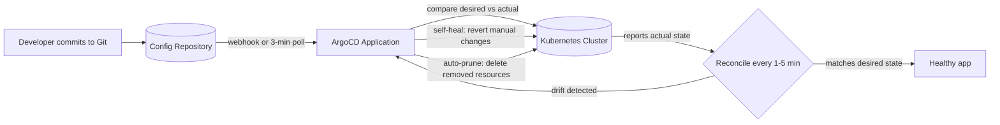

| Difficulty | Channel | Tags |
|---|---|---|
| beginner | devops | argocd, flux, declarative |

On August 25, 2021, a Skyscanner engineer pushed a change they believed was a harmless no-op. Two curly braces were missing around a template variable, and ArgoCD dutifully reconciled the corrupted configuration — mass-deleting services across every namespace, availability zone, and region on the planet [1]. The travel site and mobile app went dark for 4.5 hours, and full restoration took until the next day [1]. That incident frames the story this article tells: GitOps automation is a superpower, and like every superpower, it cuts both ways.

---

> ### Real-World Case — Skyscanner
>
> On August 25, 2021, a Skyscanner engineer submitted what was intended to be a no-op change to their infrastructure templating system. The change was missing `{{ }}` characters around a variable, which silently broke the template that generates namespace configurations. ArgoCD reconciled the corrupted config and, as designed, began mass-deleting all services across every namespace, AZ, and region worldwide.
>
> | | |
> |---|---|
> | **Challenge** | Skyscanner used a single root 'cells' configuration file that rolled out globally. Because the templating broke, all namespaces across all clusters were rendered invalid, and ArgoCD's auto-sync treated every existing service as drift to be pruned. |
> | **Solution** | ArgoCD was configured as their GitOps deployment system with auto-sync and self-healing — the declarative model where Git is the single source of truth. When the broken manifest was pushed and reconciled, ArgoCD faithfully enforced the (corrupted) desired state, deleting 478 microservices in all namespaces across all AZs and regions. Engineers restored one region and critical services first, then the rest over the following days, and added mitigations like validation guards on mass deletions. |
> | **Outcome** | A full global outage lasting 4.5 hours on 25 August 2021 — skyscanner.net and the mobile app were completely down; it took until the next day to fully restore all regions and non-critical services. The incident directly demonstrates the double-edged nature of GitOps: declarative auto-reconciliation both prevents drift and amplifies a single bad commit. |
> | **Lesson** | GitOps self-healing is exactly as dangerous as it is powerful: when Git becomes the source of truth, ArgoCD will dutifully destroy production to match a corrupt commit. Declarative reconciliation can't be left unguarded — 'configuration is code' means a missing `{{ }}` can be as catastrophic as a bad code deploy, so mass-deletion guardrails, canary config rollouts, and validation before sync are essential. |

---

## Hook — Two Missing Characters, One Global Outage

Picture the scene: an innocent-looking pull request, a quick review, a merge. The engineer who pressed merge had no idea their "no-op" change would take an entire platform offline. But that is exactly what happened — a missing `{{` and `}}` silently corrupted a template, and the automation built to keep the system healthy became the instrument of its undoing [1].

Here is the uncomfortable question every DevOps engineer should ask: what happens when your safety net becomes the thing that trips you? Sound familiar? If you have ever watched a pipeline do exactly what it was told and still take you down, this article is for you.

The stakes are not theoretical. This is the price of automation without understanding — and you are about to learn how to pay it, or how to avoid it entirely.

## Problem — The Drift That Haunts Every Cluster

Before GitOps, running Kubernetes meant running a cluster like a game of whack-a-mole. An engineer SSHes into a box, runs `kubectl scale deploy payments --replicas=5`, and the cluster obeys. The problem? Nobody else knows [5]. The docs go stale, the diagrams lie, and the person who made the change left at 6 PM.

That is configuration drift, and it is the silent killer of reliability. Environments diverge — production looks nothing like staging, "it works in QA" becomes the least reliable sentence in engineering, and rollbacks turn into archaeology expeditions through terminal history [4].

The imperative approach — direct `kubectl` commands — feels fast precisely because it is dangerous. Every manual change bypasses version control, auditability, and collaboration. You might think one small tweak is harmless. That is exactly what the Skyscanner engineer thought [1].

This leads to the core question: how do you get the speed of automation without handing it the keys to everything?

## Real-World Case — Skyscanner

On August 25, 2021, an engineer at Skyscanner submitted a change to their infrastructure templating system — a change intended to be a complete no-op. But it was missing the `{{ }}` characters around a variable, which silently broke the template that generates namespace configurations [1].

ArgoCD did exactly what it was built to do. It noticed the desired state in Git no longer matched the live cluster, and it reconciled. As designed, it began mass-deleting services across every namespace, availability zone, and region worldwide [1].

The impact was brutal: a full global outage lasting 4.5 hours, with skyscanner.net and the mobile app completely down. It took until the next day to fully restore all regions and non-critical services [1].

Here is the plot twist: nobody did anything wrong in the automation sense. The pipeline worked flawlessly. The incident directly demonstrates the double-edged nature of GitOps — declarative auto-reconciliation both prevents drift and amplifies a single bad commit [1].

Before judging that team too harshly, ask yourself: does your pipeline have a similar failure mode? More importantly, do you know what it is?

## Deep Dive — Declarative vs Imperative: The Real Tradeoff

Building on the Skyscanner story, consider the two philosophies at war in every Kubernetes cluster.

In the declarative world, you define the complete desired state — YAML manifests, Helm charts, or Kustomize overlays — and commit it to Git [3][4]. ArgoCD continuously monitors the cluster, compares actual state to desired state, and reconciles the difference. Nobody SSHes into a node to fix things; the fix is a pull request [2].

In the imperative world, you issue direct commands: `kubectl run`, `kubectl scale`, `kubectl delete`. It is instant, interactive, and completely undocumented [5].

Many developers assume declarative is simply "better." The Skyscanner incident says otherwise — declarative automation has its own failure mode: it executes bad intent at scale, flawlessly [1].

| Aspect | Declarative (ArgoCD/Flux) | Imperative (kubectl) |
|---|---|---|
| Source of truth | Git repository | Your terminal history |
| Audit trail | Full commit history | Nothing |
| Rollback | `git revert` + auto-sync | Manual re-apply of old manifests |
| Speed of change | Minutes (sync interval) | Seconds |
| Failure mode | One bad commit, applied everywhere | Unreviewed change, applied once |
| Team collaboration | Built-in via pull requests | Depends on tribal knowledge |

The uncomfortable truth: the tradeoff is not "automatic vs manual." It is "amplified mistakes vs hidden ones." Imperative mistakes are small and local; declarative mistakes are loud and global. ArgoCD is a fork in the road — the question is which edge you fall off [2].

## Workflow — The Sync Loop, Step by Step

Now that you understand the tradeoff, here is the practical path to a GitOps pipeline that stays on the safe side of the edge.

The workflow looks like this (see the GitOps Sync and Reconciliation Loop diagram below): you commit manifests to Git, ArgoCD detects the change via webhook or polling, compares it against the live cluster, and applies the diff. Then the reconciliation loop runs every 1-5 minutes, checking actual state against desired state, self-healing drift, and pruning anything that no longer exists in Git [2].

- **Store the truth**: put YAML, Helm charts, or Kustomize bases in a dedicated repo [7][8].
- **Define an Application**: an Application CRD points to the repo path, target revision, and destination namespace [2].
- **Turn on auto-sync**: with a health check interval of 1-5 minutes — 3 minutes is a solid default.
- **Enable self-heal**: any manual `kubectl` change gets reverted on the next reconciliation, because yes, developers will try.
- **Monitor deployment health**: ArgoCD polls Kubernetes so a "synced" app does not mean a healthy app [6].

Here is the part most tutorials skip: auto-prune. It is what turned one bad commit into a global deletion at Skyscanner. With `prune: true`, anything removed from Git is deleted from the cluster — including, apparently, an entire production fleet [1][2].

The diagram below is the loop that either saves you or sinks you.

## Code Example — Declaring Your Desired State

Let's turn the workflow into something you can run tonight. The centerpiece is an Application CRD — a declarative object that tells ArgoCD what Git means to your cluster. This example wires up a `payments` service from a Helm chart with automated sync, self-heal, and pruning enabled.

The heredoc below writes the Application manifest and `kubectl apply` registers it with the cluster. From that moment on, Git is the single source of truth for the `payments` namespace [2][4]. `repoURL` and `targetRevision` pin the exact source and branch; `path` points at the Helm chart. ArgoCD renders the chart, diffs it against the live cluster, and reconciles [7].

The `syncPolicy` block is where teams get into trouble — `selfHeal: true` reverts manual tweaks, `prune: true` deletes anything Git no longer declares. Those two flags are precisely why the Skyscanner rollout deleted services, so enable them deliberately, behind review gates, not as a silent default [1][2].

Pro tip: run `argocd app sync --dry-run` first and keep `selfHeal` off while you build confidence. Trust in GitOps is earned one commit at a time.

## Lessons Learned — Five Takeaways From a 4.5-Hour Outage

The Skyscanner outage is not a story about a bad engineer; it is a story about how systems amplify small mistakes [1]. Here is what to take back to your team:

🎯 **Key Point — Automation is neutral.** ArgoCD did its job perfectly; the pipeline obeyed a corrupted desired state. The failure was upstream, in the process around the pipeline [1].

⚠️ **Watch Out — Prune is a loaded gun.** Auto-prune plus auto-sync means deletion is now an automated, one-commit operation. Add human review gates, staging environments, and rollout windows [2].

💡 **Insight — Treat Git like production.** Require reviews, enforce branch protection, sign commits. If a single commit message is the only barrier between you and a global outage, the barrier is too thin [3][4].

🔥 **Hot Take — Pure GitOps without safety rails is reckless.** The best ArgoCD teams pair it with progressive delivery, health gates, and "fail the sync" policies. Declarative does not mean hands-off [2][6].

Building on everything so far, the pattern is clear: declarative GitOps gives you auditability, collaboration, and self-healing — but it concentrates risk into the commit message. The solution is not to abandon GitOps; it is to add the guardrails the automation is too dumb to add for itself.

---

## GitOps Sync and Reconciliation Loop

<strong>Original Interview Question</strong>

**Q:** You're setting up GitOps for a microservices deployment. How would you configure ArgoCD to automatically sync changes from your Git repository to Kubernetes, and what's the difference between declarative and imperative approaches in this context?

**A:** I'd configure ArgoCD by setting up a Git repository containing Kubernetes manifests or Helm charts, creating an Application CRD that points to the Git repository, enabling auto-sync with a health check interval of 3 minutes, and implementing self-healing to automatically revert any manual changes. The declarative approach involves defining the desired state in Git through YAML manifests, Helm charts, or Kustomize configurations, where ArgoCD continuously reconciles the actual state with the desired state. In contrast, the imperative approach uses kubectl commands to make direct changes to the cluster, bypassing the Git repository as the single source of truth.

## Conclusion

Every automation superpower has a kryptonite. For GitOps, it is the two characters you did not write. The Skyscanner story is a reminder that declarative reconciliation amplifies both your best practices and your worst mistakes [1]. So tomorrow, do three things: turn on self-healing deliberately, keep auto-prune behind a review gate, and run your sync loop in staging until you trust it. Then go make a commit — the whole cluster is watching.

---

## References

1. [Skyscanner incident report](https://medium.com/@SkyscannerEng/how-a-couple-of-characters-brought-down-our-site-356ccaf1fbc3) — article
2. [Argo CD Documentation](https://argo-cd.readthedocs.io/en/stable/) — documentation
3. [GitOps on Wikipedia](https://en.wikipedia.org/wiki/GitOps) — documentation
4. [Kubernetes Declarative Management](https://kubernetes.io/docs/tasks/manage-kubernetes-objects/declarative-config/) — documentation
5. [Kubernetes Imperative Management](https://kubernetes.io/docs/tasks/manage-kubernetes-objects/imperative-command/) — documentation
6. [Argo CD GitHub Repository](https://github.com/argoproj/argo-cd) — documentation
7. [Helm Documentation](https://helm.sh/docs/) — documentation
8. [Kustomize GitHub Repository](https://github.com/kubernetes-sigs/kustomize) — documentation
9. [Flux v2 GitHub Repository](https://github.com/fluxcd/flux2) — documentation
10. [Kubernetes Deployments Documentation](https://kubernetes.io/docs/concepts/workloads/controllers/deployment/) — documentation

---

**Author:** Satishkumar Dhule — [GitHub](https://github.com/satishkumar-dhule) · [LinkedIn](https://linkedin.com/in/satishkumar-dhule) · [Website](https://satishkumar-dhule.github.io)
