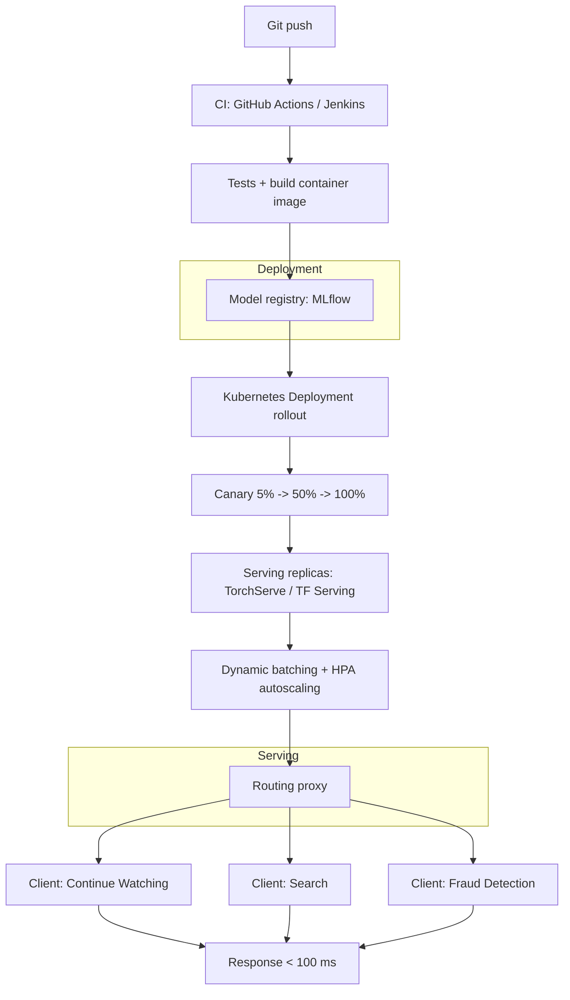

| Difficulty | Channel | Tags |
|---|---|---|
| beginner | devops | mlops, deployment |

Netflix's member-facing ML systems — the Continue Watching rankings on your homepage, the search suggestions, even payment fraud detection — need to change constantly. Every experiment, every tweak to a ranking algorithm is a new model version, and historically every client service integrated with models directly, creating tight coupling that made rapid iteration nearly impossible [1]. By 2025, Netflix's centralized serving platform runs hundreds of model types and versions at 1 million requests per second across 30+ client services [1]. This story is about the difference between model deployment and model serving — and why confusing them quietly caps your ML ambitions.

---

> ### Real-World Case — Netflix
>
> Netflix's member-facing ML use cases (homepage Continue Watching ranking, search, payment fraud detection) required rapid model iteration, but each client service historically integrated with models directly, creating tight coupling. As of 2025 the centralized platform they built to fix this serves hundreds of model types and versions at 1 million requests per second across 30+ client services.
>
> | | |
> |---|---|
> | **Challenge** | Netflix needed to separate 'model serving' (end-to-end workflow execution: pre/post-processing, feature computation, inference) from model deployment, while solving request routing to the right model instance on the right cluster shard for the right user and use case. They needed model versioning, A/B experimentation, canary releases, shadow mode, and instant rollback without exposing that complexity to client microservices. |
> | **Solution** | They built Switchboard, a custom centralized routing proxy handling over 1M RPS, offering context-aware routing (device, locale, surface type, A/B cell), dynamic traffic splitting for canary deployments, shadow-mode testing, and instant rollback — with researchers defining routing rules in a JavaScript config decoupled from serving code. When Switchboard's added 10-20ms of serialization latency per request, single-point-of-failure risk, and reduced tenant isolation became unacceptable, they evolved to the Lightbulb architecture: routing was pulled out of the request path entirely, Envoy does cluster/VIP routing via a routingKey header, and Lightbulb only resolves model-selection metadata (model id, request config), keeping the benefits without the latency or availability risk. |
> | **Outcome** | The serving platform sustains 1 million requests per second across hundreds of model types/versions for 30+ client services. The architecture evolution removed the 10-20ms per-request latency overhead from the central routing proxy and eliminated a single point of failure that could have degraded every ML-powered experience at once, while preserving one-time client integration and opaque model iteration. |
> | **Lesson** | A centralized routing/API layer in the serving data path looks clean but doesn't scale operationally: it adds measurable latency (10-20ms) on every inference and becomes a shared point of failure for all ML experiences. Netflix's answer was to move routing decisions out of the hot path (decentralize into Envoy + a lightweight metadata service), proving that serving architecture should optimize the data plane for latency and availability while keeping config/rules in a separate control plane. |

---

## Hook — One million requests a second and nowhere to hide

Picture this: you shipped a model to production. The deployment pipeline is pristine — CI/CD, Kubernetes, a model registry, the works. Then real traffic arrives. Continue Watching reranking needs 50ms, search needs 30ms, payment fraud detection needs 99.99% uptime. Different models, different latency budgets, different consumers — all flowing through one routing layer. Now imagine that layer fails. Every ML-powered experience on the platform degrades at once. That is exactly the nightmare Netflix's platform team designed against [1].

The stakes are not abstract. At 1 million requests per second, even 10-20ms of per-request overhead is a tax you pay a billion times a day. Consequently, teams who understand only deployment — and not serving — build systems that look great in demos and crumble under load. So what separates the two jobs, and why do so many teams collapse them into one?

## Problem — The day "deploy it" stopped being enough

Many developers hit this wall the same way: the model scores beautifully in a notebook, the nightly batch job runs fine, and then a product manager asks for it in an API. The confusion between deployment and serving is almost universal in early ML teams — and it is exactly where the pain begins.

Deployment is the infrastructure lifecycle: how the model gets built, tested, shipped, monitored, and rolled back, using tools like Kubernetes, Docker, Terraform, MLflow, and SageMaker [7][9]. Serving is what happens at runtime: how requests are routed, models loaded into memory, responses optimized, and replicas autoscaled, using frameworks like TensorFlow Serving, TorchServe, or BentoML [5][6][8].

Treat them as one thing and you reproduce Netflix's original problem: tight coupling. Each client service calls the model directly. New model version? Coordinate a client release. Model format changed? Every downstream team updates. Ever wondered why model iteration at your company feels glacial? Tight coupling is usually the answer. Moreover, it is a quiet killer — nothing breaks loudly, everything just slows down.

🎯 Key Point: deployment ends where serving begins. The fix starts with drawing that line on purpose.

## Real-World Case — Netflix's serving platform

Netflix's platform team documented the evolution of their model serving architecture, and the details are worth a close read [1]. Historically, member-facing ML use cases — Continue Watching ranking, search, payment fraud detection — integrated with models directly. Rapid model iteration was hard, and every consumer had to understand model internals. The centralized platform they built changed the rules: a single serving layer that sustains 1 million requests per second across hundreds of model types and versions for 30+ client services [1].

The numbers tell the story. The architecture evolution removed 10-20ms of per-request latency overhead from the central routing proxy — at 1M RPS, that single optimization frees the equivalent of roughly 10,000 to 20,000 CPU-seconds of work for every wall-clock second [1]. Equally important, it eliminated a single point of failure that could have degraded every ML-powered experience at once, while preserving one-time client integration and opaque model iteration [1].

Here is the plot twist: the centralized proxy — the thing that looked like the cleanest possible architecture — was itself the thing they had to eliminate. The solution that organizes your traffic is also the thing that can take the whole system down. Therefore, every routing decision you make is a bet: what are you optimizing for, and what are you risking?

## Deep Dive — Deployment and serving: two jobs, one word

Here is the thing: deployment and serving answer different questions. Deployment asks, "how does a model version move safely from a notebook to production?" Serving asks, "how does a request get the right answer in under 100ms?" Consequently, they optimize for different failure modes.

| Dimension | Model Deployment | Model Serving |
|---|---|---|
| Core job | Ship and manage the model lifecycle | Execute runtime inference on demand |
| Key tools | Kubernetes, Docker, Terraform, MLflow, SageMaker | TF Serving, TorchServe, BentoML, FastAPI, gRPC |
| Primary concern | Reproducibility, rollback, monitoring | Latency, throughput, memory, batching |
| Cadence | Event-driven — every release | Continuous — every single request |
| Scale unit | Pipeline runs | Requests per second |
| Failure mode | A failed rollout | A P99 latency spike or a cold start |

Now layer in scaling, and the trade-offs sharpen.

Horizontal scaling means more pod replicas behind a load balancer, orchestrated by Kubernetes [3][4]. Vertical scaling means giving each replica more GPU memory or CPU. The two are not interchangeable: horizontal handles traffic spikes gracefully, vertical handles a single heavyweight model. Then there are the latency budgets: under 100ms for real-time inference, under 1s for batch — and they force completely different architectures.

⚠️ Watch Out: cold starts are the silent budget-killer. A 3GB model can take tens of seconds to load into GPU memory, so every replica your autoscaler spins up pays that tax before it can answer a single request [4].

Finally, the counterintuitive insight: batch inference is not always the enemy of latency. When your budget is under 1s, collecting 32 requests into one GPU call can slash throughput costs by an order of magnitude while still meeting the SLO — the core insight of systems like Clipper [2]. And once you have batching, A/B testing becomes traffic splitting: 5% of requests hit the challenger model, you watch error rate and latency, then ramp gradually [3].

## Workflow — From git push to a sub-100ms response

So how does a real team assemble this end to end? The pipeline below is the pattern Netflix-style platforms converge on, and it has eight moving parts.

1. Commit code and model artifacts — CI (GitHub Actions, Jenkins) triggers on every push.
2. Tests run and a container image is built — golden tests on a fixed evaluation set.
3. Model and metadata are registered in a model registry like MLflow [7].
4. Kubernetes applies the Deployment manifest with rolling update strategy [3].
5. Canary rollout routes 5% of traffic to the new version, watching error rates before ramping to 100%.
6. Serving replicas run the model server — TorchServe or TensorFlow Serving — with dynamic batching enabled [5][6].
7. Horizontal Pod Autoscaling scales replicas on utilization or queue depth [4].
8. A routing proxy fans requests to the correct model version, so clients never know which version answered.

The mermaid diagram below — "Deployment to Serving Pipeline" — shows this flow as one picture. Notice that the CI/CD layer (steps 1-5) is pure deployment, while steps 6-8 are pure serving. The two halves meet at the registry, and that seam is the line you should never blur.

🔥 Hot Take: if your serving layer knows about your CI/CD pipeline — or worse, your clients know about your model formats — you have already lost the architecture argument. Opaque model iteration means clients ship once and never care again [1].

## Code Example — Dynamic batching in 30 lines

Enough theory. Here is the pattern that turns the Deep Dive into practice: a FastAPI endpoint that collects requests into batches, runs one inference call per batch, and still answers every caller in well under 100ms.

```python
# serve.py — a FastAPI model endpoint with dynamic batching
import asyncio
import time
from dataclasses import dataclass, field
from typing import Any

from fastapi import FastAPI
from pydantic import BaseModel

BATCH_WINDOW_MS = 25          # hold requests briefly to build a batch
MODEL_ID = "rec/v3.2.1"       # pinned model version served by this replica

app = FastAPI(title="recommendation-serving")

class PredictRequest(BaseModel):
    user_id: str
    context: list[int]

@dataclass
class BatchItem:
    payload: PredictRequest
    future: asyncio.Future = field(default_factory=asyncio.Future)

queue: asyncio.Queue[BatchItem] = asyncio.Queue()

async def predict_batch(items: list[PredictRequest]) -> list[list[float]]:
    """One GPU call for the whole batch instead of one call per request."""
    # In production this maps to a TorchServe or TensorRT batch invocation.
    await asyncio.sleep(0.005)  # simulated model compute
    return [[0.9, 0.05, 0.04, 0.01]] * len(items)

async def batch_worker() -> None:
    """Drain the queue in windows; resolve every future after one inference."""
    while True:
        first: BatchItem = await queue.get()
        window_end = time.monotonic() + BATCH_WINDOW_MS / 1000
        batch: list[BatchItem] = [first]
        while time.monotonic() < window_end:
            try:
                batch.append(queue.get_nowait())
            except asyncio.QueueEmpty:
                await asyncio.sleep(0.001)
        scores = await predict_batch([i.payload for i in batch])
        for item, score in zip(batch, scores):
            item.future.set_result(score)

@app.on_event("startup")
async def spawn_worker() -> None:
    asyncio.create_task(batch_worker())

@app.post("/predict")
async def predict(req: PredictRequest) -> dict:
    """Enqueue the request; the worker resolves it once its batch runs."""
    item = BatchItem(payload=req)
    await queue.put(item)
    result = await item.future
    return {"scores": result, "model": MODEL_ID}
```

Here is how it works, piece by piece. `BATCH_WINDOW_MS` defines a 25ms collection window — the maximum latency you are willing to add to a single request in exchange for batch efficiency. `BatchItem` wraps each incoming request with an `asyncio.Future`; the caller awaits that future, so no one has to poll. The `batch_worker` coroutine grabs the first item off the queue, then drains everything that arrives within the window into one list, calls `predict_batch` exactly once, and resolves every future with a slice of the results [11]. The `startup` hook spawns the worker, and `/predict` simply enqueues and awaits.

The design decisions matter. Dynamic batching amortizes per-request GPU overhead into one call per window — the exact mechanism Clipper proved reduces serving cost by an order of magnitude at fixed latency [2]. Version pinning via `MODEL_ID` gives you Netflix-style opaque iteration: clients never learn which model answered, so you can swap v3.2.1 for v3.3.0 with zero client changes [1]. And the pattern scales horizontally — run N replicas each with its own queue and window, put a load balancer in front, and let Kubernetes HPA scale on queue depth [4].

## Lessons Learned — What three years of serving will teach you

By now, the thread should be clear: Netflix did not succeed by having better models. It succeeded by decoupling model iteration from client integration [1]. Here is what to take back to your team.

✅ Keep the seam clean — deployment tools (Kubernetes, MLflow, SageMaker) build and ship; serving frameworks (TorchServe, TensorFlow Serving, BentoML) answer requests [5][6][8]. If they start leaking into each other, tighten the boundary.

✅ Budget latency before you choose architecture — under 100ms real-time, under 1s batch. Those two numbers dictate everything from batching strategy to GPU sizing [2].

✅ Treat cold starts as a first-class cost — warm your replicas and set autoscaling hysteresis so a traffic spike does not pay a 30-second model-load tax [4].

✅ Route, but do not let routing become the single point of failure — Netflix had to eliminate its own central proxy. Design the proxy to be stateless, replicated, and cheap to route through [1].

✅ Pin versions and keep clients ignorant — one-time client integration plus opaque model iteration is the operational contract that makes fast iteration safe [1].

Now the "so what?" Tomorrow, pick one model in production and ask: can I ship a new version without touching a single client? Can I answer in under 100ms during a traffic spike? If the answer is no, you now know exactly which layer to fix first.

One memorable insight to share with your team: you cannot serve your way out of a bad deployment, and you cannot deploy your way out of a bad serving layer. The two are partners, not synonyms.

---

## Deployment to Serving Pipeline



<details>
<summary><strong>Original Interview Question</strong></summary>

**Q:** Explain the key differences between model serving and model deployment in ML systems, including specific technologies, scaling considerations, and real-world implementation patterns?

**A:** Deployment encompasses CI/CD pipelines, infrastructure setup, and monitoring using tools like Kubernetes, MLflow, and SageMaker. Serving focuses on runtime inference APIs with frameworks like TensorFlow Serving, TorchServe, or BentoML, handling request routing, model versioning, and autoscaling. Key trade-offs include latency vs throughput, batch vs real-time inference, and cold start optimization.

</details>

## Conclusion

The moral of the story is that model quality was never Netflix's bottleneck — the plumbing around the models was [1]. Deployment and serving are two jobs that sound like one: deployment ships models safely through CI/CD, Kubernetes, and registries; serving answers requests with low latency, high throughput, and graceful scaling. Your next step is concrete: pick one production model and audit it against the two questions that matter. Can you ship a new version without touching a single client? Can you answer in under 100ms during a traffic spike? If either answer is no, you know exactly which layer to fix — and you now have the architecture, the workflow, and the code to fix it. Share the insight with your team: you cannot serve your way out of a bad deployment, and you cannot deploy your way out of a bad serving layer.

---

## References

1. [Netflix incident report](https://netflixtechblog.com/state-of-routing-in-model-serving-16e22fe18741) — article
2. [Clipper: A Low-Latency Online Prediction Serving System](https://arxiv.org/abs/1612.03079) — paper
3. [Kubernetes Deployments](https://kubernetes.io/docs/concepts/workloads/controllers/deployment/) — documentation
4. [Kubernetes Horizontal Pod Autoscaling](https://kubernetes.io/docs/tasks/run-application/horizontal-pod-autoscale/) — documentation
5. [TensorFlow Serving](https://github.com/tensorflow/serving) — documentation
6. [TorchServe](https://github.com/pytorch/serve) — documentation
7. [MLflow](https://github.com/mlflow/mlflow) — documentation
8. [BentoML](https://github.com/bentoml/BentoML) — documentation
9. [Amazon SageMaker real-time inference endpoints](https://docs.aws.amazon.com/sagemaker/latest/dg/realtime-endpoints.html) — documentation
10. [An Introduction to Kubernetes](https://www.digitalocean.com/community/tutorials/an-introduction-to-kubernetes) — documentation
11. [asyncio — Asynchronous I/O](https://docs.python.org/3/library/asyncio.html) — documentation
12. [gRPC](https://github.com/grpc/grpc) — documentation

---

**Author:** Satishkumar Dhule — [GitHub](https://github.com/satishkumar-dhule) · [LinkedIn](https://linkedin.com/in/satishkumar-dhule) · [Website](https://satishkumar-dhule.github.io)
