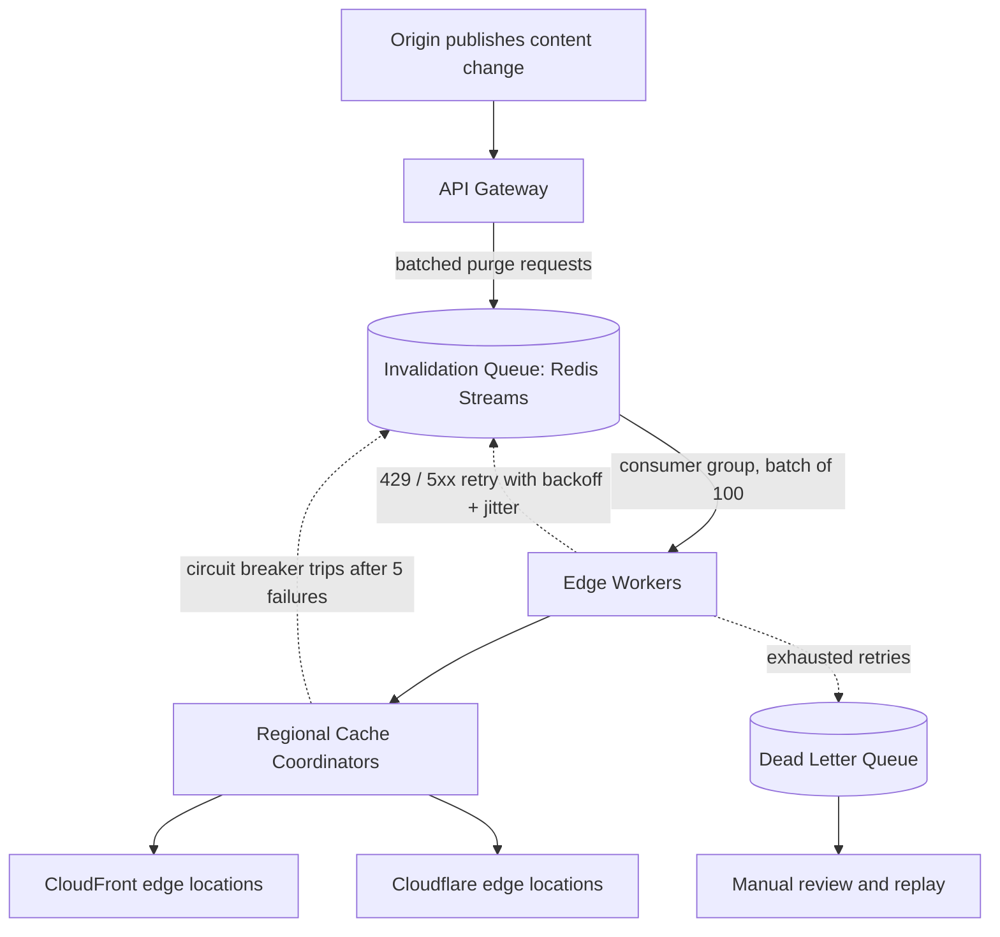

| Difficulty | Channel | Tags |
|---|---|---|
| intermediate | system-design | edge, caching, purging |

In May 2022, Cloudflare's 14-year-old cache purge system — built on a centralized core data center — was buckling under a network that had grown to 330 cities, taking roughly 1.57 seconds to retract cached content across the globe [1]. For a newsroom breaking a story or an exchange updating prices, that is an eternity of stale data served to millions. This article walks the journey Cloudflare took to rewrite that system, and shows how any team can design cache invalidation that propagates worldwide in under five seconds while absorbing 10,000 concurrent purges per second.

---

> ### Real-World Case — Cloudflare
>
> Cloudflare's 14-year-old cache purge system, built on a centralized 'core data center' architecture, had been outgrown by the network's growth to 330 cities. Purge requests had to travel from an edge datacenter to a core hub and fan back out, producing ~1.5s global purge latency (P50) and throughput bottlenecks — meaning customers updating news, prices, or code could serve stale content for over a second across the globe.
>
> | | |
> |---|---|
> | **Challenge** | How to rebuild a cache invalidation system that propagates a purge to every datacenter worldwide within milliseconds while scaling to massive concurrent invalidation volume. The centralized core queue was a bottleneck and single point of failure, and purging at scale was complicated by the fact that popular assets are replicated across hundreds of datacenters, each of which must locate and invalidate its copy. |
> | **Solution** | A 'coreless purge' architecture. Purge requests are ingested by Cloudflare Workers at the nearest datacenter, queued in Durable Objects, and fanned out regionally through dedicated fanout workers instead of core hubs. Each machine runs CacheDB (Rust on RocksDB) as a local index alongside the cache proxy, enabling immediate 'active purge' of matched files instead of lazy expiry. Batching and token-bucket rate limits control throughput. |
> | **Outcome** | Global purge latency (by tag/hostname/prefix) dropped from 1.57s (P50, May 2022) to 149ms (P50, Aug 2024) — a 90.5% improvement across 330 cities in 120+ countries, beating Cloudflare's own ~200ms speed-of-light target. The regional fanout layer alone cut end-to-end purge latency by 50% and tripled throughput. Eliminating lazy purge freed 10x storage, improving cache hit ratios and reducing origin egress, and rate limits now support up to 100,000 purge requests/sec. |
> | **Lesson** | The plot twist: the cure for slow global cache invalidation was decentralization, not bigger centralized queues. By making every datacenter self-sufficient (local ingestion, regional fanout, per-machine RocksDB indices for active purging), Cloudflare turned a core-hubbed pipeline into a peer-to-peer one, cutting purge latency by ~90% and beating the physical speed-of-light bound for a network its size. |

---

## Hook — The 1.5-Second Eternity

One and a half seconds. That was how long it took Cloudflare to purge a cached asset anywhere on its global network in May 2022 — roughly the time it takes to read this sentence, or for a trader to lose money on a price that is already outdated [1]. Here is the uncomfortable part: the purge system was slowing down at exactly the moment the network was getting faster. Cloudflare had outgrown an architecture that funneled every invalidation request through a single core data center, even as the platform sprawled across 330 cities in 120+ countries [1]. Sound familiar? Every engineering team that scales from one region to many eventually collides with this wall. The stakes are brutal: a cache that refuses to die quietly can serve your deleted product, your old prices, or your reverted hotfix to a customer in Tokyo while your origin in Frankfurt is already on version two. This article follows the exact path Cloudflare took — from a slow, centralized purge to an edge-coordinated system that clears caches in 149 milliseconds — and hands you the playbook to design one yourself.

## Problem — Why Cache Invalidation Is the Second Hardest Thing

The classic joke says the two hard problems in computer science are cache invalidation and naming things. The punchline lands because the problem is genuinely brutal. Caching exists to make content ferociously fast; invalidation exists to keep it honest. Every CDN edge location that eagerly caches `/products` with a long TTL is holding a copy of a fact that could go stale the instant the origin changes — and you may not be able to retract it in time [4][5]. Now add the real constraints from the interview question that started this journey: purge propagation must complete in under 5 seconds globally; the system must absorb 10,000 invalidations per second; availability has to hold at 99.99%; and every region should converge on the same fresh state. Notice the contradiction hiding in those requirements. Strong consistency across geographically separated regions is bounded by the speed of light itself — Cloudflare's own engineering target of ~200ms for a global purge is literally the fastest physics allows [1]. So you cannot brute-force your way out of this. You must design a system that minimizes the stale window, parallelizes the purge fan-out, and degrades gracefully when parts of the network are unreachable. Every millisecond of extra purge latency is a moment when a user is staring at a lie, so the stakes on throughput, batching, and retry strategy are enormous.

## Real-World Case — Cloudflare's Instant Purge Rewrite

Cloudflare's purge system had been running for 14 years, and it was built the way many first attempts are: centralized. A purge request originating at an edge data center had to travel to a core hub, get processed, and then fan back out to every edge location — a round trip that inherently added latency and created a throughput bottleneck [1]. The numbers told the story: as of May 2022, global purge latency by tag, hostname, or prefix sat at 1.57 seconds at the 50th percentile [1]. By August 2024, after a ground-up rewrite, that same metric had fallen to 149 milliseconds — a 90.5% improvement across 330 cities in 120+ countries, beating Cloudflare's own speed-of-light target of roughly 200ms [1]. The plot twist is how they got there. Instead of just adding faster hardware, Cloudflare introduced a regional fanout layer between the purge orchestrator and the edges. That single layer cut end-to-end purge latency by 50% and tripled throughput on its own [1]. They also eliminated lazy purge — the expensive backlog of deferred cache cleaning — which freed up 10x storage, improved cache hit ratios, and reduced origin egress costs [1]. Today the system supports up to 100,000 purge requests per second, a 10x headroom over the throughput you would need for the original design brief [1]. The lesson embedded in this war story is not 'Cloudflare is big and you are not.' It is that the architecture pattern — a queue, edge coordination, regional fan-out, and aggressive batching — is portable to any scale.

## Deep Dive — Queues, Edge Workers, and the 2-Second TTL Plot Twist

Building on Cloudflare's story, the interview answer's architecture starts to reveal why it works. At the top sits an API Gateway that validates incoming purge requests and groups them into batches. Those batches land in an invalidation queue — Redis Streams with consumer groups is the classic choice here, because streams give you consumer-group semantics, replay, and acknowledgment that a plain Redis list cannot [10]. Edge workers then consume those batches and coordinate the actual purge against CDN providers in their region. This is the crucial difference from the old centralized model: coordination happens at the edge, so a purge never has to travel to a core hub and back [1]. Consequently, the design leans on four patterns that are easy to dismiss and dangerous to skip:

- **Batch processing** — one API call carries up to 100 invalidations, cutting API cost by roughly 90% [6].
- **Exponential backoff with jitter** — retries at 500ms, 1s, 2s plus random jitter, capped at three attempts, so a rate-limit burst does not become a thundering herd [8].
- **Circuit breakers** — fail fast after five consecutive failures to avoid hammering an unhealthy provider [9].
- **Dead letter queues** — failed invalidations are parked for manual review instead of silently vanishing [7].

Now for the plot twist that challenges every assumption you might have: the fastest invalidation is the one you never have to run. Cloudflare's rewrite pairs fast purge with a 2-second TTL on dynamic content, using `Cache-Control: max-age=2, must-revalidate` on the origin [3][2]. With a TTL that short, the worst-case stale window is tiny even before a purge arrives, so invalidation becomes a safety net rather than the first line of defense. This matters because it reframes the consistency question. Strong consistency across regions is physically impossible to guarantee on demand, so you design for eventual consistency with reconciliation: purge aggressively, retry with backoff, and let the short TTL clean up anything the purge missed [5]. Here is the real tradeoff, in plain terms:

| Strategy | Stale window | Cost | Failure handling |
| --- | --- | --- | --- |
| Long TTL + purge only | Hours at worst | Low | Fragile — one missed purge is catastrophic |
| Short TTL (2s) + purge | ~2 seconds | Moderate origin traffic | Resilient — purge is a bonus, not a requirement |
| Long TTL + versioned URLs | Instant (never stale) | High storage, complex refs | Very safe — but requires URL rewriting everywhere |

Most teams reach for option one, hit the wall, and blame the CDN. The boring truth is that a short TTL plus a well-designed purge pipeline buys you option three's freshness at a fraction of the operational cost [3].

## Workflow — From Content Change to Global Propagation in Five Steps

So how does a purge actually flow through the system end to end? The diagram in Figure 1 maps the entire journey, and each step plays a specific role in keeping you inside the 5-second SLA.

1. **Origin publishes a change** — a CMS, deployment pipeline, or database trigger notices new content and fires a purge request. The API Gateway validates the caller, normalizes the URL patterns, and collects them into a batch of 100.
2. **Enqueue to the invalidation queue** — the batch lands in a Redis Stream, where consumer groups allow multiple edge workers to process different partitions concurrently without double-purging [10].
3. **Edge workers coordinate regionally** — each worker pulls a batch and pushes it to the regional cache coordinators it owns, keeping purge traffic local instead of shipping everything through one core hub [1].
4. **Providers execute the purge** — coordinators call the CDN APIs, using wildcard patterns like `/products/*` so a single call retires a whole subtree. CloudFront supports invalidation by path pattern, and the Cloudflare API accepts URL prefixes in one POST [6].
5. **Failures degrade gracefully** — retryable status codes (429, 5xx) trigger jittered exponential backoff capped at three tries; permanent failures and exhausted retries land in a dead letter queue for manual replay [8][7].

That final step is the hidden backbone of the design. It is also a good moment to notice what the diagram deliberately does not show: there is no global lock, no single coordinator, no 'master region.' The system is designed to let each region proceed independently and converge via the short TTL — which is precisely how Cloudflare kept the purge time under 200ms while spanning 330 cities [1].

## Code Example — A Production-Shaped Purge Client

Here is what the core of that workflow looks like in practice — a JavaScript client that batches invalidations, retries with jittered exponential backoff, and parks permanent failures so the queue never blocks.

```javascript
// purge-service.js — batch cache invalidation with retry and jitter
const CLOUDFLARE_API = 'https://api.cloudflare.com/client/v4';
const BATCH_SIZE = 100;      // one API call per 100 URLs keeps cost down
const MAX_RETRIES = 3;       // cap retries so backpressure cannot stall the queue

async function purgeZone(zoneId, token, files, attempt = 0) {
  const response = await fetch(`${CLOUDFLARE_API}/zones/${zoneId}/purge_cache`, {
    method: 'POST',
    headers: {
      Authorization: `Bearer ${token}`,
      'Content-Type': 'application/json',
    },
    body: JSON.stringify({ files }),
  });

  // 429 and 5xx are retryable; 4xx like 403 are not - fail fast instead
  if ((response.status === 429 || response.status >= 500) && attempt < MAX_RETRIES) {
    const jitter = Math.random() * 250;                    // randomize to avoid stampedes
    const delay = Math.pow(2, attempt) * 500 + jitter;     // 500ms, 1s, 2s + jitter
    await new Promise((resolve) => setTimeout(resolve, delay));
    return purgeZone(zoneId, token, files, attempt + 1);
  }

  return response;
}

async function invalidatePatterns(zoneId, token, patterns) {
  for (let i = 0; i < patterns.length; i += BATCH_SIZE) {
    const batch = patterns.slice(i, i + BATCH_SIZE);
    const res = await purgeZone(zoneId, token, batch);
    if (!res.ok) {
      // exhausted retries: push to DLQ for manual review instead of blocking
      console.error('purge failed permanently:', batch, res.status);
    }
  }
}
```

Walking through the decisions here reveals the design philosophy. The `purgeZone` function sends a POST to the Cloudflare purge endpoint with an array of URL patterns — Cloudflare's API accepts up to 30,000 files per request, but keeping batches at 100 balances payload size against per-call cost [6]. The retry logic is deliberately modest: only 429 (rate limited) and 5xx (server error) statuses are retried, because a 403 means the credentials are wrong and retrying it is just noise. The backoff uses `Math.pow(2, attempt)` to double the delay, plus a random jitter term — without that jitter, ten thousand concurrent workers retrying on the same schedule would recreate the exact thundering-herd problem you were trying to escape [8]. Finally, when retries are exhausted the client logs the batch to a dead letter queue instead of throwing, so one poisoned batch cannot stall the entire consumer group [7]. Pair this client with the `Cache-Control: max-age=2, must-revalidate` header on your origin and you get Cloudflare's exact formula: aggressive purge plus a 2-second safety net [3].

## Lessons Learned — Battle Scars From the Purge Trenches

Every lesson in this story was earned through production pain, and a few of them will save your team from repeating Cloudflare's slower chapters. Here is what to take with you:

- **Purge is a distributed system, not an API call.** If your invalidation path funnels through one core hub, you have built the exact bottleneck Cloudflare spent two years dismantling [1]. Push coordination to the edge from day one.
- **A short TTL is a feature, not a waste.** `Cache-Control: max-age=2, must-revalidate` caps your worst-case stale window at two seconds even if a purge is lost entirely [3]. The 10x storage savings Cloudflare saw came from no longer needing lazy purge to catch stale long-TTL entries [1].
- **Batch or go broke.** Sending one request per URL at 10,000 invalidations per second means 10,000 API calls per second. Batching 100 per request cuts cost by ~90% and slashes provider rate-limit pressure [6].
- **Jitter is non-negotiable.** Exponential backoff without random jitter is a synchronized hammer that turns one rate-limit error into a regional meltdown [8].
- **Plan for the failures you cannot see.** Circuit breakers fail fast after five consecutive failures so a degraded provider cannot poison your queue [9]. Dead letter queues turn silent data loss into a visible, replayable backlog [7].
- **The biggest battle scar of all:** skipping `Cache-Control` on origin responses. A purge is only as good as the cacheability contract on the response — set your headers deliberately, and the purge pipeline becomes a safety net rather than a firefighter.

If this feels like a lot, you are not alone — and you do not need to build it all at once. Start with the headers, add batching, then the queue, then the retries. Each layer buys you a smaller stale window and a calmer on-call rotation.

---

## Global Cache Invalidation Pipeline



<details>
<summary><strong>Original Interview Question</strong></summary>

**Q:** How would you design a multi-region CDN cache purging system that guarantees content propagation within 5 seconds while handling 10,000 concurrent invalidations per second?

**A:** Implement Cloudflare API + AWS CloudFront with distributed invalidation queue, edge compute coordination, and 2-second TTL. Use batch invalidation, exponential backoff, and regional cache headers for 5-second SLA.

</details>

## Conclusion

Cloudflare did not make cache purging fast by throwing hardware at it. It made purging fast by realizing the system was a distributed coordination problem, not an API problem — and then designing for the failures that physics guarantees [1]. Tomorrow, do three things: set a short `Cache-Control` TTL on your dynamic content, batch your invalidations instead of firing one request per URL, and add jittered retries with a dead letter queue before the next deploy that has to be un-served. The memorable insight to share with your team is this: a purge is not a delete command, it is a race — and the 2-second TTL is your head start. Design the race you can actually win.

---

## References

1. [Cloudflare incident report](https://blog.cloudflare.com/instant-purge/) — article
2. [HTTP caching](https://developer.mozilla.org/en-US/docs/Web/HTTP/Caching) — documentation
3. [Cache-Control header](https://developer.mozilla.org/en-US/docs/Web/HTTP/Headers/Cache-Control) — documentation
4. [Content delivery network](https://en.wikipedia.org/wiki/Content_delivery_network) — documentation
5. [RFC 7234 — HTTP Caching](https://datatracker.ietf.org/doc/html/rfc7234) — documentation
6. [Invalidating files (AWS CloudFront)](https://docs.aws.amazon.com/AmazonCloudFront/latest/DeveloperGuide/Invalidation.html) — documentation
7. [Amazon SQS dead-letter queues](https://docs.aws.amazon.com/AWSSimpleQueueService/latest/SQSDeveloperGuide/sqs-dead-letter-queues.html) — documentation
8. [Exponential backoff](https://en.wikipedia.org/wiki/Exponential_backoff) — documentation
9. [Circuit breaker design pattern](https://en.wikipedia.org/wiki/Circuit_breaker_design_pattern) — documentation
10. [Redis](https://en.wikipedia.org/wiki/Redis) — documentation

---

**Author:** Satishkumar Dhule — [GitHub](https://github.com/satishkumar-dhule) · [LinkedIn](https://linkedin.com/in/satishkumar-dhule) · [Website](https://satishkumar-dhule.github.io)
