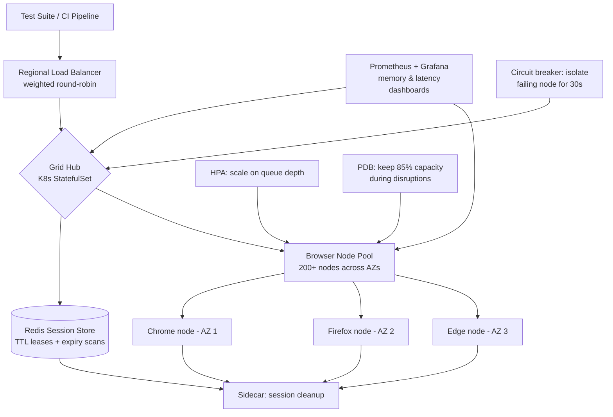

| Difficulty | Channel | Tags |
|---|---|---|
| advanced | system-design | selenium, webdriver, grid |

Every engineering team hits the same wall eventually: the browser tests that started as a cozy little suite now stretch into thousands of cases, and the Selenium Grid keeping them alive is quietly leaking memory into the night. Zalando's engineering productivity team lived this exact nightmare — their grid of docker-selenium VMs and paid cloud credits was, in their own words, 'complicated' and 'hard to maintain over time' [1]. They escaped by making sessions disposable by design, and their open-source solution Zalenium became one of the most widely adopted Selenium grids in the community. This article walks the same path: from a leaky 10,000-session grid to a self-healing, Kubernetes-native architecture that survives node failures, network partitions, and 3am pager alerts.

---

> ### Real-World Case — Zalando
>
> Zalando's Engineering Productivity team provided UI test execution for dozens of product teams via docker-selenium VMs plus paid Sauce Labs credits. Keeping a stable Selenium Grid that covered all browsers and platforms was, in their own words, 'complicated' and 'hard to maintain over time' — persistent browser nodes accumulated memory leaks and stale state, and teams burned cloud credits even for routine Chrome/Firefox runs.
>
> | | |
> |---|---|
> | **Challenge** | How to run a scalable Selenium Grid with clean session lifecycle and no browser memory leaks, without the operational cost of babysitting long-lived VM nodes or paying a cloud testing vendor for every single test. |
> | **Solution** | They built Zalenium (open source): a Selenium hub that dynamically spins up a fresh Docker browser container on demand for each test session and destroys it the moment the test finishes. One test per container means leaked memory and cross-test state are structurally impossible. It auto-scales nodes up/down with demand, records videos, provides a live preview and dashboard, enforces per-container CPU/memory limits, and proxies requests for non-Chrome/Firefox browsers (Safari, IE) to Sauce Labs/BrowserStack so cloud credits are only spent on capabilities local containers can't provide. Kubernetes support was added later. |
> | **Outcome** | Sessions became disposable by design, eliminating the memory-leak and stale-node maintenance treadmill. Zalando teams ran suites 'much faster' on local Firefox/Chrome nodes and used their paid cloud service 'in a smarter way.' Zalenium became one of the most widely adopted community Selenium grids (open-sourced by Zalando, with third-party production deployments documented at companies like Mercari on Azure AKS), and Zalando presented it at SeleniumConf. |
> | **Lesson** | Don't nurse failing nodes — make sessions ephemeral. Destroying each browser container after one test is simpler and more robust than tuning GC, restarting nodes, or chasing memory leaks in persistent infrastructure, and it keeps cost proportional to actual test demand. |

---

## Hook — It Was 2:47am When the Grid Started Dying

It was 2:47am when the pager went off. Not a deploy, not a database — a *browser*. Session 9,841 of 10,000 just timed out, and now the dashboards show the tell-tale sawtooth: memory climbing, nodes freezing, sessions piling up like unclosed tabs. Sound familiar? Every team that has scaled Selenium Grid beyond a few hundred sessions has stared at this graph. The ugly truth is that Selenium's hub-node model gives you a clean architecture on paper and a graveyard of zombie browser processes in production [2]. The stakes are brutal: at 10,000 concurrent sessions with a 99.9% uptime promise, every leaked session costs you a real test result, a red CI pipeline, and an engineer's lost morning. The good news? The failure is mechanical, and mechanical failures have mechanical fixes — if you're willing to rethink what a session even *is*.

## Problem — The Memory Leak That Eats CI/CD

Here is the thing nobody puts on the architecture diagram: a browser node is a stateful snowflake. Chrome holds onto renderer processes, Firefox leaks cache, and WebDriver sessions linger as orphaned objects when a test dies mid-step. Many developers think the answer is simply 'kill the containers more often' — but with long-lived nodes, you are fighting entropy with a broom. You might think throwing more RAM at nodes fixes the leak. Actually, it just delays the crash and inflates the bill. The real problem is that *sessions* are treated as precious, long-lived resources when they should be treated like postage stamps: cheap, single-use, and thrown away without ceremony. Multiply that by dozens of product teams sharing one grid — each running different browsers, different platforms, different test conventions — and you get what Zalando's team called a system that was 'complicated' and 'hard to maintain' [1]. Every team burns credits on routine runs. Every node carries the memory scars of yesterday's failures. Every 3am session crash is someone else's test flake.

## Real-World Case — Zalando: The Grid That Made Sessions Disposable

Zalando's Engineering Productivity team ran UI tests for dozens of product teams on docker-selenium VMs plus paid Sauce Labs credits, and the maintenance burden was relentless. Their own post-mortem is refreshingly blunt: keeping a stable Selenium Grid covering all browsers and platforms was 'complicated' and 'hard to maintain over time' [1]. Persistent browser nodes accumulated memory leaks and stale state, and teams burned expensive cloud credits even for routine Chrome and Firefox runs. Their plot twist? They stopped fighting the leaks and started designing for disposal. Instead of nursing long-lived nodes, Zalenium spins up a fresh, containerized browser per test on demand — sessions became disposable by design, which eliminated the memory-leak and stale-node maintenance treadmill entirely [1]. The results: Zalando teams ran suites 'much faster' on local Firefox/Chrome nodes and used their paid cloud service 'in a smarter way.' Zalenium was open-sourced, presented at SeleniumConf, and picked up in production by companies like Mercari on Azure AKS [1]. The lesson that scales to your grid: the most reliable browser node is the one that never lives long enough to rot.

## Deep Dive — Anatomy of a Self-Healing Grid

Building on Zalando's insight, here is the architecture you can reason about at 10,000 sessions. Start with Kubernetes: a central hub (a StatefulSet so browser pods get stable identities) spreads nodes across multiple availability zones [7]. The math is unforgiving — 10,000 sessions at 50 sessions per node means 200 nodes minimum, each capped at 2GB RAM and 1 CPU, for a 400GB baseline plus a 30% buffer: roughly 520GB of cluster memory. Sessions go into a Redis cluster with TTL-based expiration, connection pooling, and automatic cleanup — the lease expires, the key dies, the memory comes home. Prometheus scrapes memory trends and session duration metrics so you can watch leaks form in real time instead of discovering them in the pager alert. Circuit breakers (the Hystrix pattern) isolate a failing node for a 30-second recovery window instead of letting it poison every request that lands on it [5]. Horizontal pod autoscaling reacts to queue depth, not CPU — because a queue of 3,000 waiting tests is the real signal that you need more nodes [3]. The counterintuitive part: the health checks. Each node exposes a /status endpoint polled every 10 seconds, and three consecutive failures remove it instantly. That means a grid this size must be *designed to lose nodes gracefully*, not to keep them alive at any cost. Network partitions? Leader election prevents split-brain [6]. Version upgrades? Canary deployments with traffic splitting mean a bad build only hurts 5% of sessions, not 100% [9].

## Workflow — From Test Click to Browser Session

Building on the deep dive, here is the full lifecycle as a story — the Mermaid diagram below is the map. Your CI pipeline fires a test, and a weighted round-robin load balancer routes the request to the regional hub based on node capacity and response time. The hub acquires a Redis session lease with a TTL, then hands off to a browser node in the pool. Meanwhile, three guardians watch everything: the HPA scales the pool when queue depth crosses its threshold [3], the Pod Disruption Budget guarantees at least 85% capacity even during upgrades and node drains [4], and the circuit breaker silently removes any node with three consecutive health-check failures for its 30-second cooldown [5]. When the test finishes — or crashes — a sidecar container and the Redis TTL purge the session key, and an init container sweeps stale Docker volumes on the next node start [8]. Every five minutes, Redis runs an expiration scan over session keys; every week, nodes get a rolling restart to reset any residual state; every time memory crosses 80%, Grafana screams before you do. The whole system is designed around one sentence: *nothing in this grid is meant to live forever.*

## Code Example — A Leak-Proof Session Client

Now translate that philosophy into code. This Python client implements the three pillars of the architecture: a TTL-backed lease in Redis, a circuit breaker around session creation, and guaranteed cleanup in a finally block. It is production-shaped — the same pattern drives Zalando's disposable-session model and the session-lifecycle contract you'd enforce in any distributed grid.

## Lessons Learned — What You Can Ship Tomorrow

After the journey from leaky VMs to a self-healing grid, the takeaways are surprisingly portable. First, treat sessions as disposable — a lease with a TTL beats a 'reusable' session that never quite recovers; this is the single insight that unblocked Zalando [1]. Second, automate the cleanup at the infrastructure layer: init containers, sidecars, and Redis expiration scans mean the fix doesn't depend on a developer remembering to call driver.quit(). Third, scale on queue depth, not CPU — autoscaling on the wrong signal is how you end up with 200 idle nodes and a 10-minute wait [3]. Fourth, embrace losing nodes: circuit breakers, health checks, and Pod Disruption Budgets that guarantee 85% capacity make failures boring, which is exactly what you want at 3am [4][5]. ⚠️ Watch out: a weekly rolling restart is a crutch, not a cure — if you depend on it, your sessions still leak, you've just scheduled the cleanup. 💡 Insight: your monitoring should be able to *predict* a leak (memory trend slopes up 80% before it hurts) rather than just report one. 🔥 Hot take: if your grid still uses long-lived browser nodes and you're paying premium cloud credits for routine Chrome runs, you are paying Zalando's old tax. 🎯 Key point: 99.9% uptime at this scale is not about keeping every node healthy — it's about making node failure irrelevant.

---

## Grid Lifecycle Architecture

<strong>Original Interview Question</strong>

**Q:** Design a scalable Selenium Grid architecture to handle 10,000 concurrent test sessions with 99.9% uptime, ensuring zero memory leaks through automatic session lifecycle management, real-time monitoring, and graceful node failure recovery across multiple data centers?

**A:** Deploy Kubernetes cluster with auto-scaling node pools, Redis session store with TTL policies, Prometheus metrics for memory monitoring, circuit breakers for node isolation, and sidecar containers for session cleanup. Implement health checks, resource quotas, and rolling updates.

## Conclusion

The story arcs from a 2:47am pager alert to a grid where individual nodes are as interchangeable as the sessions they run. Zalando proved the counterintuitive truth: you don't achieve 99.9% uptime by making nodes immortal, you achieve it by making their deaths inconsequential — disposable sessions, TTL leases, circuit breakers, and autoscaling that answers to queue depth instead of CPU [1][3][5]. So tomorrow, pick one change: add a TTL lease to your session store, or wrap session creation in a breaker, or check whether your autoscaler is watching the right signal. The full 10,000-session architecture is just that first change, scaled and made boring. And the one insight worth sharing with your team? The best browser node is the one that never lives long enough to leak.

---

## References

1. [Zalando incident report](https://engineering.zalando.com/posts/2017/02/zalenium-a-disposable-and-flexible-selenium-grid-infrastructure.html) — article
2. [Selenium (software)](https://en.wikipedia.org/wiki/Selenium_(software)) — documentation
3. [Horizontal Pod Autoscaling](https://kubernetes.io/docs/tasks/run-application/horizontal-pod-autoscale/) — documentation
4. [Pod Disruption Budgets](https://kubernetes.io/docs/concepts/workloads/pods/disruptions/) — documentation
5. [Circuit breaker design pattern](https://en.wikipedia.org/wiki/Circuit_breaker_design_pattern) — documentation
6. [Understanding the CAP Theorem](https://www.digitalocean.com/community/tutorials/understanding-the-cap-theorem) — documentation
7. [StatefulSets](https://kubernetes.io/docs/concepts/workloads/controllers/statefulset/) — documentation
8. [Init Containers](https://kubernetes.io/docs/concepts/workloads/pods/init-containers/) — documentation
9. [Chaos engineering](https://en.wikipedia.org/wiki/Chaos_engineering) — documentation

---

**Author:** Satishkumar Dhule — [GitHub](https://github.com/satishkumar-dhule) · [LinkedIn](https://linkedin.com/in/satishkumar-dhule) · [Website](https://satishkumar-dhule.github.io)
