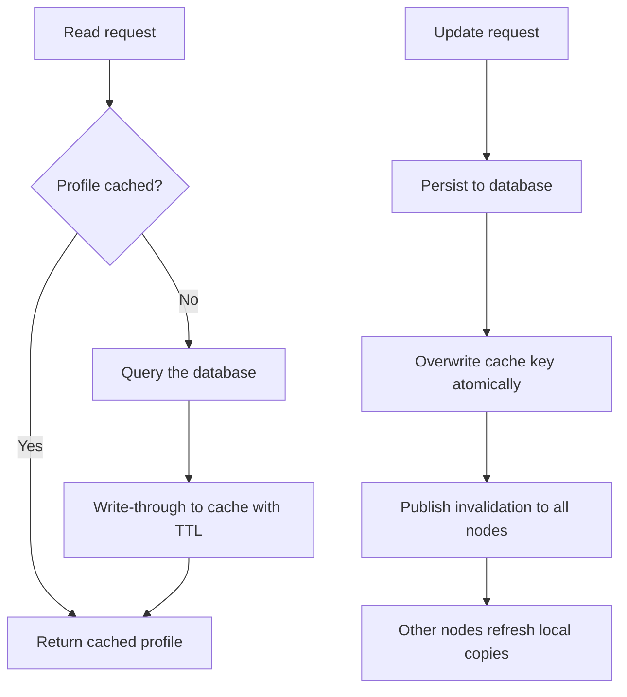

| Difficulty | Channel | Tags |
|---|---|---|
| beginner | backend | redis, memcached, cache-invalidation |

By 2013, Facebook had crossed a billion users, and every one of those users expected their profile page to load in the blink of an eye — so the company built one of the largest caching fleets ever documented: roughly 3,000 memcached servers across 1,000+ clusters, serving billions of requests per second [1]. In that world, cache invalidation stopped being a background worry and became a billion-user business problem. This article walks through the write-through strategy, the Redis versus Memcached trade-offs, and the exact patterns you can copy before your cache starts serving yesterday's data to today's users.

---

> ### Real-World Case — Facebook
>
> By 2013, Facebook had scaled to over a billion users whose profile pages, friend lists, and post data must be served with sub-millisecond latency. They built one of the largest memcached deployments ever documented — thousands of servers across many geographically distributed clusters serving billions of requests per second — and had to solve cache invalidation at massive scale.
>
> | | |
> |---|---|
> | **Challenge** | Facebook needed a cache for hot user data (profiles, edges) where reads dwarf writes, but had to keep cached data consistent as writes flowed in from MySQL across hundreds of clusters. Naive delete-based invalidation raced against concurrent reads, letting stale values get written back into the cache (the cache-aside race), and 'thundering herds' of identical misses could hammer MySQL when a popular key expired. |
> | **Solution** | Facebook standardized on Memcached (not Redis) specifically because its multi-threaded server, low memory overhead per key, and simplicity fit the read-heavy workload. For invalidation they delete cache keys on writes rather than update them, replicate those deletes across regions, and tail MySQL binary logs (mcsqueal) to invalidate every dependent key. To close the remaining consistency gaps they added cache 'leases': a client must hold a lease token to repopulate a key, so a stale read racing with a delete can't resurrect old data — the token is revoked on any invalidating write. |
> | **Outcome** | The fleet grew to roughly 3,000 memcached servers in 1,000+ clusters serving hundreds of billions of requests per day (billions of requests per second at peak), carrying the overwhelming majority of all data reads and cutting average data-fetch latency from tens of milliseconds to sub-millisecond for cached values. The 'Scaling Memcache at Facebook' paper became the most-cited reference on production cache invalidation. |
> | **Lesson** | Deleting is safer than updating for cache invalidation (a failed set silently stores wrong data; a failed delete just reloads on the next miss), but delete alone is not enough — you also need mechanisms like leases to prevent stale repopulation races and binary-log-driven invalidation to catch every writer, plus TTLs as a safety net. |

---

## Hook — the profile that would not update

It starts so innocently. You add one cache layer, your profile endpoint drops from 50ms to under 1ms, and you feel like a performance genius. Then a user edits their bio, and the app cheerfully serves the old bio to the next 200,000 visitors. Sound familiar? This is cache invalidation — the problem that tops every joke list of 'two hard things in computer science' right next to naming things — and it is quietly the most common source of 'works on my machine' bugs in production. The stakes are not abstract: every second you serve a stale profile, real users see wrong data, and the fix is a lot more nuanced than deleting a key.

## Problem — fast reads versus the write that never stops

Here is the core tension: caches exist to make reads fast, but writes never take a break [5]. The moment a user updates their profile, every cached copy of that profile becomes a lie, and serving that lie is a consistency bug you may not notice until customers start filing tickets about 'lost' changes. The obvious escape routes have their own costs. Don't cache at all? You lose the entire performance win. Set a one-second TTL? Your hit ratio collapses and your database melts under the load. Therefore, you are balancing two failure modes — stale data on one side, a thundering herd on the other — and most teams only discover the balance point after a 2am pager wake-up call. The problem is so universal that even HTTP has a dedicated RFC spelling out exactly when a cached response may be reused, a reminder that invalidation semantics matter in every layer of the stack [7]. The good news: this balancing act has a repeatable shape, and it starts with understanding what the biggest systems on earth actually do.

## Real-World Case — Facebook

Nobody has wrestled with this balancing act at greater scale than Facebook. By 2013, the social network had crossed one billion users, and its engineering team had built one of the largest memcached fleets ever documented to serve those users' profile pages, friend lists, and post data with sub-millisecond latency [1]. The numbers are staggering: roughly 3,000 memcached servers across 1,000+ geographically distributed clusters, carrying the overwhelming majority of all data reads and cutting average data-fetch latency from tens of milliseconds to sub-millisecond for cached values [1]. But here is the plot twist: Facebook did not rely on exotic distributed invalidation protocols. Instead, the 'Scaling Memcache at Facebook' paper describes pragmatic machinery — leases to prevent thundering herds, and a 'stale set' that serves slightly old data while a refresh is in flight [1]. The lesson from the world's most-cited caching paper is that invalidation at scale is not about cleverness; it is about engineering every edge case until stale data becomes the exception, not the rule.

## Deep Dive — cache-aside, write-through, and the Redis vs Memcached trade-off

Building on Facebook's experience, let's break down the two caching patterns you will actually reach for — no first-person anecdotes required, just patterns. The cache-aside pattern checks the cache first and only touches the database on a miss; it is simple, lazy, and the default for most teams [6]. The write-through pattern, in contrast, updates the database and the cache together on every write, so the cache never strays far from the truth [6]. The interview answer's strategy is a hybrid: cache-aside for reads, write-through for profile updates, and a TTL as a final safety net that guarantees staleness never lives forever.

But which cache do you run it on? That is where the Redis versus Memcached debate stops being trivia. Memcached is a focused, minimal key-value cache — lower memory overhead, simpler horizontal scaling, and famously fast for pure caching workloads [2][3]. Redis brings pub/sub for automatic distributed invalidation, built-in persistence, and richer data structures [8]. Consequently, the real trade-off is not raw speed — both are fast — it is how much coordination you want the cache to do for you.

| Concern | Memcached | Redis |
|---|---|---|
| Best at | Pure, simple caching | Caching + data structures + pub/sub |
| Distributed invalidation | Manual coordination across nodes [3] | Built-in pub/sub [4] |
| Persistence | None by design | Optional durability [8] |
| Memory overhead | Lower | Higher |
| TTL support | Yes (expire) | Yes (expire, setex) |

That leaves one more knob: the TTL itself. For user profiles, a 5–30 minute window is the sweet spot — long enough to deliver real hit ratios, short enough that even a missed invalidation self-heals [6]. TTL-based expiry is one of several cache replacement policies, but unlike pure eviction it guarantees bounded staleness [9]. Many developers treat TTL as a second-class citizen; in practice, it is your last line of defense against a correctness bug that no invalidation logic can catch.

💡 Insight: A TTL is not a substitute for invalidation — it is a backstop. Design your invalidation to be correct *without* the TTL, then let the TTL catch the edge cases you missed.

⚠️ Watch Out: Deleting a key on update looks safer than overwriting, but it briefly doubles latency for the next reader and can trigger thundering herds — precisely the failure mode Facebook's lease mechanism exists to stop [1].

🔥 Hot Take: 'Distributed cache invalidation is a solved problem' is what people say right before they deploy a cache-busting bug at 3pm on a Friday.

## Workflow — the hybrid read and update flow

Here is how those pieces fit into a production flow. The diagram below shows the full journey of both a read and an update through the hybrid strategy.

[See Figure: Cache Read and Invalidation Flow — mermaid diagram shown in the article]

1. A read request arrives — the cache is checked first (cache-aside).
2. On a hit, serve the value with sub-millisecond latency; on a miss, load from the database and write through to the cache with a TTL.
3. An update request arrives — persist to the database first, so the source of truth is always correct.
4. Overwrite the cache key atomically with the fresh value using setex, so no stale read can slip in between the database write and the cache write.
5. Publish an invalidation event to every other app server via pub/sub, so replicas refresh or drop their copies [4].
6. Monitoring loop — track cache hit rates and miss latency, because the moment the hit rate drops, the database is the one feeling the pain.

The pattern mirrors what makes distributed caches work in production: reads are cheap and local, writes are coordinated, and the TTL cleans up whatever the coordination misses.

## Code Example — write-through caching in Python with pub/sub invalidation

This is where it becomes concrete. The Python snippet below implements the hybrid strategy end-to-end: cache-aside reads, write-through updates, a TTL safety net, and a pub/sub broadcast so every app server learns about the change [4][6].

[code]

Step-by-step, here is what is happening. get_profile implements cache-aside: it reads the key, returns immediately on a hit, and only on a miss falls through to the database before seeding the cache with setex — which sets a value and its TTL in one atomic call. update_profile inverts the flow: it persists to the database first, then atomically overwrites the cache key so a concurrent reader can never observe a stale value, and finally publishes a channel message so other servers can refresh or drop their own copies. That last step is where Redis's pub/sub earns its keep — memcached would require you to build that fan-out yourself [4]. One battle scar worth repeating: never write to the cache before the database. Do it backwards, and a crash between the two steps leaves the cache holding data the database never committed — a lie with no TTL quick enough to hide.

## Lessons Learned — five rules from production fires

So what should you actually do differently tomorrow? Start with these five rules, forged in production fires:

- Write-through on updates, cache-aside on reads — the hybrid beats single-pattern thinking.
- Invalidate by overwriting with setex, not by blind delete — avoid the extra miss and the thundering herd [1].
- Set a real TTL (5–30 minutes for profiles) as a backstop, never as the primary mechanism [6].
- Choose Redis when you need pub/sub coordination or persistence; choose Memcached when you want minimal, pure caching [2][4].
- Monitor hit rate, miss rate, and stale-data incidents — you cannot fix what you are not measuring.

If this feels like a lot, you are not alone — even the team running 3,000 memcached servers spends its energy on edge cases, not exotic algorithms [1]. The memorable line to take back to your team: a cache that is always fresh is a database with extra steps; the art is being almost-always fresh at sub-millisecond speed.

---

## Cache Read and Invalidation Flow

<strong>Original Interview Question</strong>

**Q:** You're building a user profile service that caches frequently accessed profiles. How would you implement cache invalidation when a user updates their profile, and what trade-offs would you consider between Redis and Memcached?

**A:** Implement write-through caching with TTL-based expiration. On profile update, invalidate the cache by deleting the key and writing new data to both the database and cache. Redis offers pub/sub for automatic distributed invalidation, while Memcached requires manual coordination across nodes.

## Conclusion

Every developer ends up here eventually — staring at a cached response that is technically fast and factually wrong. Facebook's answer, after scaling caching past a billion users, was not a magic protocol but a disciplined hybrid: cache-aside reads, write-through updates, a TTL backstop, and pub/sub coordination when you need it [1][4]. The next time someone asks about cache invalidation in an interview — or, worse, in a code review at 5pm on a Friday — you now have more than a textbook answer. You have a war story, a diagram, and a runnable pattern. Go make your reads sub-millisecond, and make sure your writes never lie.

---

## References

1. [Facebook incident report](https://www.usenix.org/conference/nsdi13/technical-sessions/presentation/nishtala) — article
2. [Memcached project wiki](https://github.com/memcached/memcached/wiki) — documentation
3. [Memcached — Wikipedia](https://en.wikipedia.org/wiki/Memcached) — documentation
4. [Redis Pub/Sub documentation](https://redis.io/docs/latest/develop/use/pubsub/) — documentation
5. [Cache (computing) — Wikipedia](https://en.wikipedia.org/wiki/Cache_(computing)) — documentation
6. [Caching strategies — AWS ElastiCache documentation](https://docs.aws.amazon.com/AmazonElastiCache/latest/dg/Strategies.html) — documentation
7. [RFC 9111 — HTTP Caching](https://datatracker.ietf.org/doc/html/rfc9111) — documentation
8. [Redis — Wikipedia](https://en.wikipedia.org/wiki/Redis) — documentation
9. [Cache replacement policies — Wikipedia](https://en.wikipedia.org/wiki/Cache_replacement_policies) — documentation

---

**Author:** Satishkumar Dhule — [GitHub](https://github.com/satishkumar-dhule) · [LinkedIn](https://linkedin.com/in/satishkumar-dhule) · [Website](https://satishkumar-dhule.github.io)
