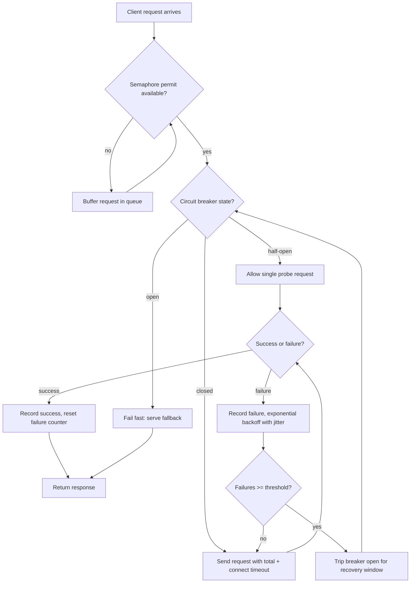

| Difficulty | Channel | Tags |
|---|---|---|
| advanced | backend | asyncio, aiohttp, concurrency |

Netflix's API brokers catalog and metadata between dozens of internal services and hundreds of device types, handling over a billion incoming calls per day that fan out to several billion downstream requests — peaking above 100,000 dependency calls per second [1]. A single slow dependency had the power to saturate every request thread and take the entire API down. Netflix's answer — thread isolation, circuit breakers, and graceful fallbacks — proved so effective that video views barely moved even when 157 of 200 instances were serving degraded fallbacks [1]. That is the journey this article walks you through, translated into a production-grade aiohttp connection pool you can actually run.

---

> ### Real-World Case — Netflix
>
> Netflix's API is the last hop before the user — it brokers catalog and metadata between dozens of internal services and hundreds of device types, receiving 1+ billion incoming calls per day that fan out at a 1:6 ratio to several billion downstream requests (peaking over 100k dependency calls/sec). Any single slow or failing dependency could cascade: one latent service would rapidly saturate all Tomcat request threads and take down the entire API. Netflix even did the math that 30 dependencies each at 99.99% uptime still meant ~2 hours of downtime a month (99.7% combined uptime).
>
> | | |
> |---|---|
> | **Challenge** | A production connection/resilience layer needed to isolate dozens of dependency calls, prevent any one slow endpoint from blocking request threads, and gracefully degrade so a failing service doesn't become an outage. They couldn't just retry harder — retry loops and hung connections against a struggling service would only pound it further. |
> | **Solution** | Netflix built Hystrix, a per-dependency fault-tolerance wrapper combining exactly the patterns in the topic: aggressive network timeouts plus retries, per-dependency thread pools as bulkheads (semaphore-style concurrency limiting via tryAcquire rather than blocking), circuit breakers that trip at a ~50% error rate over a 10-second rolling window and short-circuit to cached fallbacks while the dependency recovers, and 'fail fast' responses to shed load instead of queuing. Each API instance ran 40+ thread pools of 5-20 threads, with timeouts sized near the 99.5th percentile so bad requests get cut off immediately. |
> | **Outcome** | The system handled over 10 billion thread-isolated and 200+ billion semaphore-isolated command executions per day. In a documented production incident, engineers disabled a shared cache to fix a data bug and were throttled by their database for excess traffic — the circuit breakers auto-tripped (157 of 200 instances serving fallbacks), requests short-circuited to a local query cache, and video views barely moved. Netflix reports the approach had 'a dramatic effect' on tolerating system failures without impacting user experience; Hystrix later became one of the most widely copied resilience libraries in the industry. |
> | **Lesson** | The circuit breaker is a 'release valve', not a performance knob — when it trips, fix the root cause, don't enlarge pools/timeouts or you'll effectively DDOS yourself. And the biggest plot twist: the near-miss was self-inflicted (their own cache-disable), proving that graceful degradation protects you from your own mistakes as much as from external failures. The insight generalizes directly to async clients like aiohttp: a semaphore caps concurrency, a circuit breaker fails fast and sheds load so healthy dependencies stay available, and retries with backoff only make sense once a broken dependency has been given time to recover. |

---

## Hook — It's 3 a.m. and Your Pager Just Went Off

It's 3:00 a.m. and the pager is screaming. The deploy looked fine. Load tests passed. Yet every API health check is now red, and the incident channel is filling with the same message: "What did we break?" Here is the uncomfortable truth — maybe nothing in your code broke at all. A single downstream service, one you call a thousand times a minute, went latent. And because your HTTP client never thought about failure, it dragged your entire API down with it. This is not a rare story. It is the most common failure mode in distributed systems, and it plays out in every language, at every scale. Sound familiar? Then keep reading, because the fix isn't a bigger timeout. The fix is a complete rethink of how your connection pool behaves when the world around it starts failing.

## Problem — One Slow Dependency Is All It Takes

Here is what happens when you call an HTTP service with a naive pool: every request grabs a socket, waits on a response, and — if the response never comes — waits for the timeout. Now multiply that by your concurrent load. Each stalled request is holding a slot that could serve a healthy request. Before long, the pool is 100% occupied by requests that are all waiting on the same dead service. That is a cascade failure: healthy endpoints become unreachable because the pool is full of zombies. Many developers reach for two fixes, and both are traps. Raising the timeout buys latency, not reliability. Adding unbounded retries is worse — it amplifies the load on a struggling dependency until it's fully crushed. Worse still, a retry storm on the caller side is a distributed denial-of-service attack, except the attacker is your own code. The stakes are quantified in a brutal piece of math: 30 dependencies, each at 99.99% uptime, combine to roughly 99.7% — about two hours of downtime every month [1]. At that level, you don't need an outage; you need one slow request.

## Real-World Case — Netflix, the Last Hop Before the User

Netflix's API sits at the last hop before the user, brokering catalog and metadata between dozens of internal services and hundreds of device types [1]. It receives over 1 billion incoming calls per day, fanning out at a 1:6 ratio to several billion downstream requests, with a peak above 100,000 dependency calls per second [1]. Every one of those calls consumed a Tomcat request thread — a finite, precious resource. Netflix engineers calculated that a single latent dependency would rapidly saturate all request threads and take down the whole API [1]. Their solution became legendary: each dependency call was isolated behind a thread pool, a circuit breaker, and a fallback. The system eventually handled over 10 billion thread-isolated and 200+ billion semaphore-isolated command executions per day [1]. In one documented production incident, engineers disabled a shared cache to fix a data bug and were throttled by their database for excess traffic. The circuit breakers auto-tripped — 157 of 200 instances short-circuited to a local query cache — and video views barely moved [1]. Netflix credits the approach with 'a dramatic effect' on tolerating system failures without impacting user experience [1]. Before you object that you don't run Netflix scale, consider this: the dynamics are identical at 40 requests per second. One slow dependency, a finite pool, and the same cascade. The scale differs; the math doesn't.

## Deep Dive — Three Patterns, One Goal: Fail Soft

Building on the Netflix story, three patterns do the heavy lifting: a semaphore, a circuit breaker, and exponential backoff. First, the semaphore. An asyncio.Semaphore caps how many concurrent connections your pool opens, so a slow dependency can never monopolize every socket [2]. It is the same idea as the semaphore-isolated commands Netflix runs 200+ billion times per day — concurrency is a budget, and a semaphore is your accountant [1]. Second, the circuit breaker. This is the plot twist: when a service is failing, the smartest move is to stop calling it. A breaker has three states — closed (normal traffic flows), open (fail fast for a recovery window), and half-open (let one probe through to test the waters) [5]. When open, requests short-circuit instantly to a fallback instead of burning pool slots [5]. It feels counterintuitive — you spent all that effort building calls, and now you refuse to make them. That is exactly the point. Third, exponential backoff. When you do retry, wait 0.2s, then 0.4s, then 0.8s, with random jitter to prevent synchronized retry waves [6]. Timeouts matter too, but they are not a strategy — they are a floor. A connection timeout of 2 seconds and a total timeout of 5 seconds stop the pool from being held hostage [4]. Two watch-outs: unbounded retries turn you into the attacker, and a leaked connection that never returns to the pool quietly eats capacity [3]. The table below shows the real trade-off between the naive and resilient approaches.

## Workflow — A Request's Journey Through the Pool

This leads to a concrete workflow, and the diagram below tells the visual story: a request enters, is gated by a semaphore, inspected by the breaker, sent with a timeout, and on failure bounces through exponential backoff before the breaker decides the service needs a time-out. Step one, gate: the semaphore grants a permit or buffers the request when the pool is saturated [2]. Step two, inspect: the circuit breaker checks its state; if open, the request fails fast and serves a fallback instead of consuming a slot [5]. Step three, send: with a total timeout and a connection timeout, the request goes out and the socket returns to the pool afterward via the session's keepalive [8]. Step four, learn: a success resets the failure counter; a failure increments it and triggers a backoff delay [6]. Step five, protect: once failures cross the threshold, the breaker trips open for a recovery window, then half-open probes with a single request to decide whether to close [5]. Each step has a job, and each job exists because the next step cannot save you on its own. The semaphore can't tell a healthy request from a dying one — that's the timeout's job. The timeout can't stop a retry storm — that's backoff's job. And backoff alone can't prevent a slow dependency from eating every thread — that's the breaker's job.

## Code Example — A Pool That Bends Instead of Breaking

Now that the workflow is clear, here is the implementation. The full code example below is a production-leaning aiohttp pool: a three-state circuit breaker, a semaphore cap, exponential backoff with jitter, and a graceful shutdown path — the pieces that let your service degrade instead of collapse. Pay attention to the three battle scars baked into it. First, the session is created with a keepalive connector and a hard timeout, so sockets are reused and no request can hang forever [4][8]. Second, the semaphore wraps the entire attempt loop, so a retrying request doesn't re-enter the pool unchecked [2]. Third, close() drains the session on shutdown — an unclosed session is a leak, and leaked connections are how pools silently die [3]. A request that exhausts its retries returns the fallback, which mirrors Netflix's local query cache: degraded, but alive [1].

## Lessons Learned — What to Change Tomorrow Morning

So what should you do differently tomorrow? First, assume every dependency will eventually fail — not might, will. Design the failure mode before the incident, because at 3 a.m. you will not be thinking clearly. Second, treat concurrency as a budget. If you cannot measure how many concurrent connections your pool holds, you cannot reason about whether a dependency is starving it. Third, stop retrying blindly. Backoff with jitter, bounded retries, and a circuit breaker are the difference between a graceful blip and a retry storm that takes down your database [6]. Fourth, add a fallback at every critical call site — Netflix's 157 degraded instances still served users because every dependency had a fallback path [1]. If this feels overwhelming, you are not alone; distributed systems resilience is a discipline, not a hack. Start with one service, add the semaphore, then the breaker, then the backoff. Watch the metrics move. The one insight worth sharing with your team: you don't need Netflix's traffic to need Netflix's thinking — three patterns and the humility to assume the worst is all it takes.

---

## Connection Pool Request Flow

<strong>Original Interview Question</strong>

**Q:** How would you implement a connection pool manager for aiohttp that handles graceful degradation under high load and connection timeouts?

**A:** Implement a connection pool manager for aiohttp using a semaphore to limit concurrent connections, exponential backoff for retrying failed requests, and circuit breaker pattern to gracefully degrade under high load and connection timeouts.

## Conclusion

The story comes full circle: Netflix survived billions of dependency calls by assuming every one of them could fail — and building thread isolation, circuit breakers, and fallbacks so that when the worst happened, users barely noticed [1]. Your stack is not Netflix's, but the failure math is the same. Tomorrow, take one service, wrap it in a semaphore, add a timeout, then a circuit breaker, then backoff with jitter. Measure the difference before and after. The memorable insight to carry to your team: resilience is not about making requests faster — it is about making failure cheap, and a request that fails fast to a fallback is cheaper than a request that hangs for thirty seconds. Build for the 3 a.m. pager today, and that pager might never ring.

---

## References

1. [Netflix incident report](https://netflixtechblog.com/fault-tolerance-in-a-high-volume-distributed-system-91ab4faae74a) — article
2. [Python asyncio synchronization primitives (Semaphore)](https://docs.python.org/3/library/asyncio-sync.html) — documentation
3. [aiohttp ClientSession reference](https://docs.aiohttp.org/en/stable/client_reference.html) — documentation
4. [aiohttp client timeouts](https://docs.aiohttp.org/en/stable/client_advanced.html) — documentation
5. [Circuit breaker design pattern](https://en.wikipedia.org/wiki/Circuit_breaker_design_pattern) — documentation
6. [Exponential backoff](https://en.wikipedia.org/wiki/Exponential_backoff) — documentation
7. [Python asyncio tasks](https://docs.python.org/3/library/asyncio-task.html) — documentation
8. [HTTP connection management (keep-alive)](https://developer.mozilla.org/en-US/docs/Web/HTTP/Connection_management) — documentation
9. [Python asyncio event loop](https://docs.python.org/3/library/asyncio-eventloop.html) — documentation

---

**Author:** Satishkumar Dhule — [GitHub](https://github.com/satishkumar-dhule) · [LinkedIn](https://linkedin.com/in/satishkumar-dhule) · [Website](https://satishkumar-dhule.github.io)
