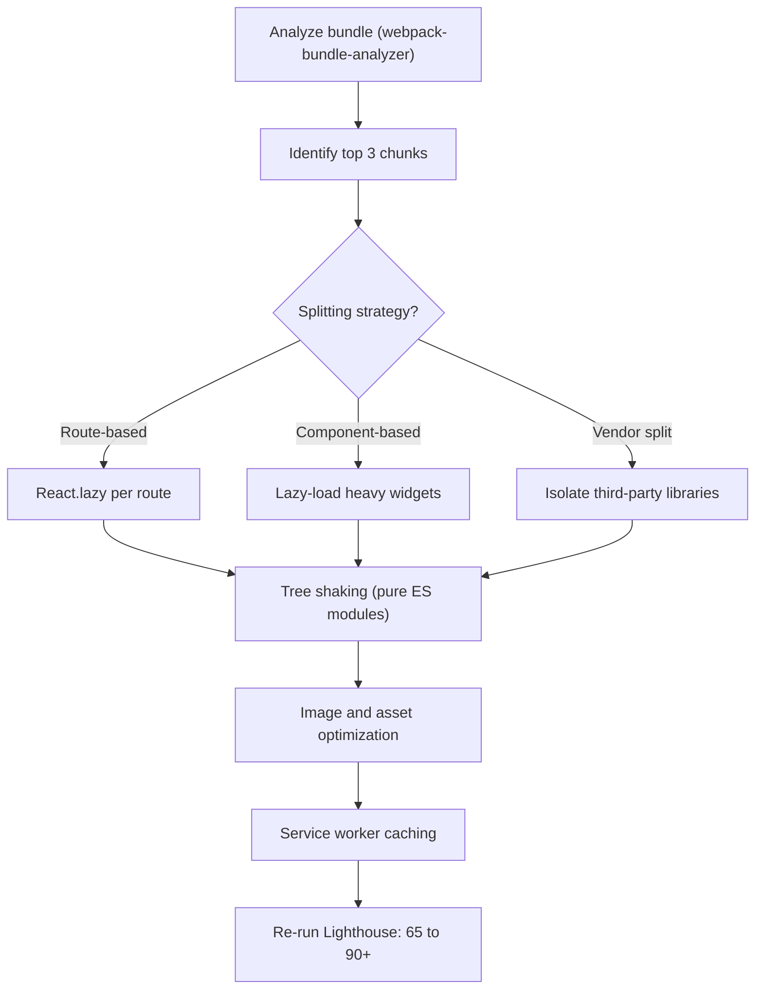

| Difficulty | Channel | Tags |
|---|---|---|
| intermediate | frontend | lighthouse, bundle, lazy-loading |

Pinterest's mobile web app was once a cautionary tale: a JavaScript-heavy React SPA whose bundle had ballooned so badly that users on slow networks downloaded megabytes of code 'just in case' they ever clicked a button. Audits showed brutal mobile metrics that crushed engagement, especially in international markets where data is precious [1]. The team's turnaround became a legend — their core bundle dropped from 650KB to 150KB and Time to Interactive collapsed from 23 seconds to 5.6 seconds, with signups climbing as a direct result [1]. Sound familiar? Your 2.1MB bundle with its 4.2-second TTI is living that same story right now.

---

> ### Real-World Case — Pinterest
>
> Pinterest's mobile web app was a JavaScript-heavy React SPA whose bundle had ballooned as features grew, forcing users to download multi-megabyte bundles 'just in case' they clicked a button. Lighthouse/performance audits showed terrible mobile metrics that hurt engagement, especially in international markets on slow networks.
>
> | | |
> |---|---|
> | **Challenge** | Core webpack bundle was ~650KB (many megabyte bundles total), Time To Interactive was 23s and First Meaningful Paint was 4.2s. They needed to cut initial-load JavaScript while keeping a route-heavy React SPA snappy — without knowing where all the weight actually lived in their dependency tree. |
> | **Solution** | They split bundles into three webpack chunk categories (vendor chunk ~73KB for react/redux/router, entry chunk ~72KB, and small async route chunks of 13-18KB), added route-based code splitting via React Router, lazy-loaded heavy advertiser features, built Bonsai (an open-source webpack-bundle-analyzer-style tool) to find bloated dependency trees, and even split single methods out of huge helper libraries. The counterintuitive move: they moved duplicated code out of async chunks into the entry chunk, increasing it by 20% while shrinking all lazily-loaded chunks by up to 90% — a faster cacheable main bundle plus tiny route loads beat a uniformly smaller bundle. |
> | **Outcome** | Core bundle shrank from 650KB to 150KB; homepage JS payload went from ~490KB to ~190KB. First Meaningful Paint dropped from 4.2s to 1.8s and Time To Interactive from 23s to 5.6s — with big lifts in engagement and signups that Pinterest tied directly to the performance work. |
> | **Lesson** | Bundling is a tradeoff game, not just 'make it smaller': aggressively deduplicating and shifting shared code into the cacheable entry chunk (even at +20% entry size) made all lazy chunks up to 90% smaller, which dramatically cut real-world load and TTI. It also proves that tooling like a bundle analyzer is a prerequisite — you can't optimize what you can't see. |

---

## Hook — The Number That Keeps Frontend Engineers Up at Night

Here is the number that haunts every performance review: **4.2 seconds**. That is how long your users stare at a blank screen before your React app becomes interactive — if they don't give up and close the tab first. And the 2.1MB bundle behind it? Every user downloads every byte of it *'just in case'* they click something. This is the trap every feature-rich SPA falls into, one harmless-looking dependency at a time. The good news: the path out is well-trodden, and Pinterest left a very public trail to follow [1]. The stakes are not vanity metrics — a slow app doesn't just fail an audit, it fails the business.

## Problem — You Are Shipping Code Nobody Asked For

The core problem isn't bundle size — it's the *psychology* of the single-page app. Every dependency you add feels harmless. A charting library here, a date picker there. Each one is 20KB, what could go wrong? Then feature teams ship, routes multiply, and suddenly that 'harmless' charting library is being parsed and executed on every page load — even for users who never see a chart. Many developers discover the damage too late, when a Lighthouse audit flips to red and the product manager wants answers. Here is the counterintuitive part: the real cost isn't the download. Modern networks can move megabytes in a blink. The damage is **parse, compile, and execution time** on low-end devices, where every additional 100KB of JavaScript adds visible seconds to Time to Interactive [8]. On a slow 3G connection in a market with feature phones, your 'optimized' SPA feels like it's frozen. Sound familiar? If you've ever debugged a slow route by splitting the wrong chunk, you know exactly how this story starts.

## Real-World Case — Pinterest

Enter Pinterest. By the late 2010s, Pinterest's mobile web app was exactly this cautionary tale — a React SPA whose bundle had ballooned as features multiplied [1]. The team shipped a 'just in case' bundle: every user downloaded code for every feature, whether they used it or not. The pain was worst in international markets, where users paid for data by the megabyte and hit performance ceilings on mid-range hardware. What happened next is the plot twist: Pinterest committed to a year-long performance push, and the numbers are the stuff of conference talks. Their core bundle dropped from **650KB to 150KB**, and homepage JavaScript went from roughly **490KB to 190KB**. First Meaningful Paint fell from **4.2 seconds to 1.8 seconds**, while Time to Interactive collapsed from a jaw-dropping **23 seconds to 5.6 seconds** [1]. The kicker? Engagement and signups rose — Pinterest directly tied the performance work to business growth, not just green Lighthouse scores. That is the shift that changes everything: performance stopped being an engineering nicety and became a revenue lever.

## Deep Dive — The Four Levers of a Fast React App

Building on Pinterest's example, the techniques they used are the same four levers in every modern performance playbook — and they all trace back to one principle: **don't ship code the user didn't ask for**. Specifically:

- **Route-based code splitting** — lazy-load each route's code only when that route is visited [4]
- **Component-level splitting** — lazy-load heavy widgets (charts, editors, maps) only when they actually render
- **Vendor splitting** — isolate large third-party libraries so one vendor bundle doesn't block everything
- **Tree shaking** — eliminate dead exports so unused code never reaches users [5]

Here is the thing though: many developers think code splitting is a 'set it and forget it' win. The reality is more nuanced. The first step is always measurement — you cannot split what you cannot see. webpack-bundle-analyzer visualizes exactly which chunks are devouring your budget [6]. Most teams discover the same surprise: a single heavy dependency — charting, date pickers, drag-and-drop — accounts for 30-40% of the entire bundle.

| Strategy | What it splits | When to use it | Typical impact |
|---|---|---|---|
| Route-based | Whole route modules | Apps with many routes | Best first move; biggest win |
| Component-level | Individual widgets | Charts, editors, maps | Only pays off if the widget is genuinely heavy |
| Vendor splitting | Third-party libraries | Stable, rarely-changing deps | Great for caching, limited initial-load win |
| Tree shaking | Dead exports | Every ES-module build | Free win, but requires pure ES modules [5] |

And the plot twist: **there is a counterintuitive limit to splitting.** Too many tiny chunks can create more HTTP requests and worse cache behavior than a few well-sized ones. The goal isn't minimal bundle size — it's minimal *time to interactive*. Sometimes a 300KB well-cached bundle beats a 150KB one that loads fresh on every visit.

## Workflow — From 65 to 90+ in Nine Steps

The journey from a 65 Lighthouse score to 90+ is a loop, not a linear sprint. Here is the sequence that Pinterest-style teams follow (mapped in the diagram below):

**Step 1 — Measure.** Run Lighthouse in both the lab and the field, and record your baseline: bundle 2.1MB, TTI 4.2s [10].
**Step 2 — Analyze.** Run webpack-bundle-analyzer to identify the largest chunks [6].
**Step 3 — Prioritize.** Tackle the top 3 chunks first — 80% of the gain usually comes from 20% of the work.
**Step 4 — Split routes.** Convert routes to React.lazy() + Suspense [2][3].
**Step 5 — Split components.** Lazy-load heavy widgets on demand [7].
**Step 6 — Trim dependencies.** Remove unused packages and migrate to tree-shakeable ES modules [5].
**Step 7 — Optimize assets.** Compress images and lazy-load below-the-fold media.
**Step 8 — Cache.** Add a service worker so repeat visits skip the network entirely [9].
**Step 9 — Re-measure.** The loop closes where it began — metrics are the only source of truth [10].

The diagram below maps the whole flow. The detail to notice: analysis gates every optimization, and measurement closes the loop. Skip Step 1 and you're optimizing blind.

## Code Example — Route-Based Splitting, Done Right

This is where the rubber meets the road. The single highest-leverage change — the one Pinterest-style teams reach for first — is route-based splitting. React.lazy() converts a static import into a dynamic one: the code downloads only when the route actually renders [2][3]. The pattern looks like this:

## Lessons Learned — What to Do Differently Tomorrow

After this journey, a few truths stick. **First, measurement is not optional** — you need a before and after to know what actually worked [10]. **Second, split for the user, not the audit.** The objective is time-to-interactive, not a number on a screen. **Third, splitting is a maintenance habit, not a one-time task.** Every new feature should ask the same question: does this need to ship on first load?

Battle scars to avoid:
- ⚠️ Splitting everything, then discovering your entry chunk still loads a 500KB vendor library because you never split vendors.
- ⚠️ Forgetting error boundaries, then watching a chunk-load failure white-screen your app during a deploy [7].
- ⚠️ Adding a service worker after 'optimization' and accidentally caching stale assets forever [9].

🎯 Key Point: the cheapest performance win is **not shipping code at all.** Before you minify another byte, ask whether that byte needs to be downloaded in the first place [4][7].

🔥 Hot Take: if your Lighthouse score is 65 and your bundle is 2.1MB, you don't have a performance problem — you have a *shipping* problem. The fix isn't harder engineering; it's saying no to eager downloads.

---

## Bundle Optimization Flow

<strong>Original Interview Question</strong>

**Q:** You're tasked with improving a React app's Lighthouse performance score from 65 to 90+. The bundle size is 2.1MB and Time to Interactive is 4.2s. What specific steps would you take to optimize the bundle and implement lazy loading?

**A:** Implement code splitting with React.lazy() and Suspense, analyze bundle composition with webpack-bundle-analyzer to identify largest chunks, remove unused dependencies and optimize imports, add dynamic imports for heavy components and third-party libraries, implement route-based splitting for better initial load times, and utilize tree shaking with proper ES module configuration.

## Conclusion

Pinterest's numbers — 650KB to 150KB, TTI from 23s to 5.6s — weren't magic. They were the compounding result of measuring, splitting, and caching relentlessly [1]. The playbook is public and the tools are free, so the only thing standing between you and a 90+ Lighthouse score is starting. Tomorrow morning, run the analyzer, split your largest route, and re-measure. If you can shave 100KB off that 2.1MB bundle, you're already making the user experience — and the business — measurably better. The journey from 65 to 90+ isn't a sprint; it's the first step toward a performance culture where every new feature earns its place on the critical path.

---

## References

1. [Pinterest incident report](https://medium.com/pinterest-engineering/a-one-year-pwa-retrospective-f4a2f4129e05) — article
2. [React lazy documentation](https://react.dev/reference/react/lazy) — documentation
3. [React Suspense documentation](https://react.dev/reference/react/Suspense) — documentation
4. [Webpack Code Splitting Guide](https://webpack.js.org/guides/code-splitting/) — documentation
5. [Webpack Tree Shaking Guide](https://webpack.js.org/guides/tree-shaking/) — documentation
6. [webpack-bundle-analyzer](https://github.com/webpack-contrib/webpack-bundle-analyzer) — documentation
7. [MDN dynamic import operator](https://developer.mozilla.org/en-US/docs/Web/JavaScript/Reference/Operators/import) — documentation
8. [MDN Time to Interactive glossary](https://developer.mozilla.org/en-US/docs/Glossary/Time_to_interactive) — documentation
9. [MDN Service Worker API](https://developer.mozilla.org/en-US/docs/Web/API/Service_Worker_API) — documentation
10. [Lighthouse documentation](https://developer.chrome.com/docs/lighthouse/) — documentation

---

**Author:** Satishkumar Dhule — [GitHub](https://github.com/satishkumar-dhule) · [LinkedIn](https://linkedin.com/in/satishkumar-dhule) · [Website](https://satishkumar-dhule.github.io)
