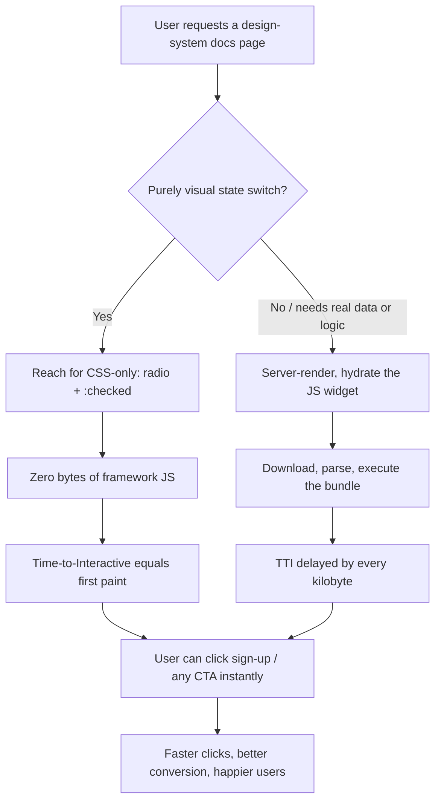

| Difficulty | Channel | Tags |
|---|---|---|
| beginner | frontend | css, flexbox, grid, animations |

Netflix's logged-out homepage is, on paper, a static marketing page: a few headlines, a hero image, and one button the user actually cares about — 'Sign Up.' Yet every visitor once had to download and execute a client-side JavaScript bundle built around React before that button would respond, and on a 3G connection that meant roughly seven seconds of staring at a screen [1]. The fix wasn't cleverer code; it was removing the code. Shedding React and its libraries cut over 200kB of JavaScript and halved time-to-interactivity [1] — which raises a question every frontend developer eventually faces: do you really need JavaScript for a simple tab panel?

---

> ### Real-World Case — Netflix
>
> Netflix's logged-out homepage and sign-up landing page took ~7 seconds to load on 3G, and time-to-interactivity was crippled by a client-side JavaScript bundle that included React plus several libraries. The page was mostly static marketing content, yet users had to download and execute megabytes of framework code before they could click the sign-up button.
>
> | | |
> |---|---|
> | **Challenge** | A simple landing page was paying the full cost of a single-page-application stack. They needed to figure out which interactivity actually required JavaScript at all, and how to cut the client-side weight without breaking the signup flow. |
> | **Solution** | They audited the page by disabling JavaScript in the browser to see what still worked. Most elements were basic HTML, so they rebuilt the client side with vanilla JavaScript—the React-based language switcher was replaced in under 300 lines—and moved React to the server only. They also prefetched the JS/CSS for the next step of the signup flow using the browser's built-in link prefetch API plus XHR prefetching (95% cache success rate), so interactivity for later steps was already warm. |
> | **Outcome** | Removing client-side React and associated libraries cut JavaScript by over 200kB, reducing Time-to-Interactive by more than 50% (desktop TTI < 3.5s in the lab), and the additional prefetching cut TTI for the next signup page by 30%. The performance gain caused users to click the sign-up button at a greater rate, and First Input Delay was already fast for 97% of desktop users. |
> | **Lesson** | The fastest JavaScript is the JavaScript you never ship. Progressive enhancement—using CSS/HTML (and minimal vanilla JS) for static, low-interactivity surfaces—can beat framework optimization, and it directly informs patterns like CSS-only tab panels built from radio inputs and no-JS toggle state. |

---

## Hook — It Was 3 a.m. and the Tab Panel Was the Problem

Picture the scene: a design-system docs page is flagged in the next performance review. The team runs a Lighthouse audit expecting image bloat or a monster font file. Instead, the culprit is a tabbed section that ships an entire JavaScript runtime just to switch between 'Overview,' 'Specs,' and 'Usage' — an interaction that has been possible in pure HTML since the late 1990s [9]. Sound familiar? Most developers have built this exact widget, and it felt harmless at the time. However, the stakes are bigger than one panel on one page: multiply that habit across every component library, dashboard, and marketing site, and the web ships megabytes of framework code just to change a few pixels of opacity. Therefore, before reaching for the familiar dependency, ask the uncomfortable question: is this interaction genuinely interactive — or is it just styled state?

## Problem — Every Kilobyte of JavaScript Is a Debt

The problem isn't that tabs are hard to build; it's that 'interactive' has become a synonym for 'requires a framework.' Every runtime you add has to be downloaded, parsed, and executed before the first meaningful interaction can happen — precisely when a user on a mid-range phone is at their least patient [8]. Consequently, a page that is 90% static pays 100% of the JavaScript tax. You might assume this only matters for giant applications, but bundle size scales linearly with load time, and parse-and-execute costs hit low-end devices hardest. Moreover, there is a quieter cost: every line of runtime code is a line your team must test, secure, and maintain, and every stateful widget is a place where a hydration mismatch can break the whole page. So what separates widgets that deserve a framework from widgets that don't? The answer has been sitting in the CSS specification for decades — and it is about to do something surprising.

## Real-World Case — Netflix: The Page That Didn't Need React

Building on the idea that static content shouldn't pay the JavaScript tax, consider the most instructive case study in modern web performance. Netflix's logged-out homepage and sign-up landing page were mostly static marketing content, yet they shipped a client-side bundle of React plus several libraries — over 200kB of JavaScript that users had to download and execute before the sign-up button would respond. On a 3G connection, the page took roughly seven seconds to load [1]. The team's call was radical: remove client-side React entirely and serve plain server-rendered HTML. The results speak in numbers. JavaScript shrank by over 200kB, Time-to-Interactive dropped by more than 50% (desktop TTI fell below 3.5 seconds in the lab), and prefetching shaved another 30% off the following signup page's TTI [1]. Consequently, users clicked 'Sign Up' at a higher rate — because performance is a conversion feature, not a luxury [8]. Here is the plot twist: the fix wasn't a clever bundling trick or a faster framework. It was the recognition that a mostly static page didn't need a framework at all. Now shrink that lesson down to a single widget, and you get the CSS-only tab panel.

## Deep Dive — The Hidden Power of :checked and Its Friends

With Netflix's numbers in mind, zoom in on the widget itself. A tab panel is a state machine with exactly one variable: which tab is visible. CSS has been able to express that single bit of state for decades, thanks to the `:checked` pseudo-class [2] and the general sibling combinator [7]. The trick: give each tab a hidden radio input plus a ``. Clicking the label checks the radio, and CSS reads that state to reveal the matching panel — no JavaScript, no state management, no hydration. The HTML even stays semantic: radios are natively focusable and announced by screen readers as an option group [2]. The layout layers on top. CSS Grid builds a responsive card grid that collapses from two columns to one with a single media query [6][10], and `aspect-ratio: 16/9` reserves the image area without padding-hack arithmetic [3]. Two accessibility details complete the pattern: `:focus-visible` draws a keyboard outline only when it is genuinely needed [5], and `prefers-reduced-motion` gating ensures the entrance animation steps aside for users who request less movement [4]. ⚠️ Watch Out: the pattern has real limits. Radios can't be unchecked, so the last open tab stays open; arrow-key navigation requires a few lines of JavaScript to be fully WAI-ARIA compliant; and the animation only replays on state changes, so the first render is never animated. Know these trade-offs before committing.

🎯 Key Point — choose the engine by the job:

| Capability | CSS radio tabs | JS tabs (WAI-ARIA) | ``/`` |
|---|---|---|---|
| Zero JavaScript | ✅ | ❌ | ✅ |
| Arrow-key navigation | ❌ | ✅ | ❌ |
| Screen-reader tab semantics | ⚠️ radio group | ✅ | ⚠️ disclosure |
| Lazy-load panel content | ❌ | ✅ | ❌ |
| Entrance animation | ✅ | ✅ | ✅ |
| Trivial to maintain | ✅ | ⚠️ | ✅ |

The takeaway isn't that JavaScript tabs are wrong — they are the right call for complex, data-driven panels. The takeaway is that most tab panels are simple, and simple panels deserve a simple engine.

## Workflow — Six Steps to a Zero-JS Tab Panel

Armed with the theory, here is a repeatable workflow. The decision flow below maps the journey: start by asking whether the interaction is pure state-switching; if it is, let CSS carry the weight and keep Time-to-Interactive equal to first paint.

1. **Audit the widget.** List every behavior the panel needs: switching, animation, lazy content, arrow keys. If switching is the only hard requirement, CSS is enough.
2. **Write the HTML first.** Structure each tab as ``, followed by its ``, then the ``. The sibling selector depends on this exact ordering [7].
3. **Wire the state with CSS.** Reveal the checked panel with `input:checked ~ .panel` and hide the rest [2].
4. **Shape the layout.** Start the card grid at `repeat(2, 1fr)` and collapse to one column under your mobile breakpoint [6][10]; reserve the 16:9 image area with `aspect-ratio` [3].
5. **Polish with motion and focus.** Gate the staggered entrance animation behind `prefers-reduced-motion: no-preference` [4] and add `:focus-visible` outlines so keyboard users always see where they are [5].
6. **Test like a user.** Tab through the radios, run a screen reader, and toggle 'prefers-reduced-motion' in DevTools. Pass all three and you have shipped a production interaction with zero JavaScript bytes.

## Code Example — The Full Pattern in 60 Lines of CSS

Putting it all together, the HTML stays tiny — radios, labels, and panels in a predictable order. The CSS below does the heavy lifting: hiding the radios without removing them from the accessibility tree, toggling panels through the checked state, laying out a 2×2 grid that collapses to one column, and staggering an entrance animation that respects reduced-motion settings. Read it top to bottom, then make it your own.

## Lessons Learned — Ship Less, Measure More

If Netflix's team taught the industry anything, it's that removing code can outperform adding code [1] — and the same principle holds at widget scale. Specifically, the takeaways are:

- 🎯 Before adding a framework, ask whether the interaction is pure state-switching; radios plus `:checked` already handle it in CSS [2].
- Markup order is the contract of this pattern — the sibling combinator only works when input, label, and panel line up [7].
- Responsive layouts belong to Grid and `aspect-ratio`, not to JavaScript [6][3].
- `prefers-reduced-motion` and `:focus-visible` are non-negotiable; accessibility is a feature, not an afterthought [4][5].
- ⚠️ Battle scars: radios can't be 'unchecked,' animations replay only on state change, and fully ARIA-compliant arrow-key navigation still wants a sprinkle of JavaScript. Know when to stop.
- 🔥 Hot take: if a widget's behavior fits in a single CSS rule, shipping a framework for it is the modern equivalent of hiring a contractor to flip a light switch.
- Tomorrow: pick one tabbed widget in your design system, rebuild it CSS-only, and measure the Time-to-Interactive delta. The number will speak for itself [8].

---

## Zero-JavaScript Interaction: Decision Flow

<strong>Original Interview Question</strong>

**Q:** Build a CSS-only tab panel for a design-system docs page. Use radio inputs to switch tabs (no JavaScript). Desktop: a 2x2 grid of cards under each tab; mobile: single column. Each card has a fixed 16:9 image area, a title, and a short meta line. Add a subtle entrance animation with a stagger and keep focus-visible outlines; ensure prefers-reduced-motion is respected?

**A:** Use a set of radio inputs with a shared `name` attribute and corresponding `` elements for each tab section. The `:checked` state of each radio controls visibility of its associated panel via adjacent sibling selectors. Each panel renders a 2×2 card grid on desktop and collapses to a single column on mobile. Cards use `aspect-ratio: 16/9` for fixed image containers, with a title and meta line below.

## Conclusion

The story began with Netflix serving seven-second loads to impatient users on 3G, and it ends with a truth that scales from landing pages down to a single widget: the fastest JavaScript is the JavaScript you never ship. The CSS-only tab panel is that truth at component size — zero runtime bytes, native keyboard focus, a grid that adapts to any screen, and an animation that politely steps aside for users who prefer less motion. So next time a tab panel lands in your backlog, resist the urge to scaffold a component library. Run the audit, keep the markup semantic, and let the browser do what it has done natively for years. Your Lighthouse score — and the user on 3G with a sign-up button in sight — will thank you.

---

## References

1. [Netflix incident report](https://medium.com/dev-channel/a-netflix-web-performance-case-study-c0bcde26a9d9) — article
2. [MDN: :checked pseudo-class](https://developer.mozilla.org/en-US/docs/Web/CSS/:checked) — documentation
3. [MDN: aspect-ratio](https://developer.mozilla.org/en-US/docs/Web/CSS/aspect-ratio) — documentation
4. [MDN: prefers-reduced-motion](https://developer.mozilla.org/en-US/docs/Web/CSS/@media/prefers-reduced-motion) — documentation
5. [MDN: :focus-visible](https://developer.mozilla.org/en-US/docs/Web/CSS/:focus-visible) — documentation
6. [MDN: CSS Grid Layout](https://developer.mozilla.org/en-US/docs/Web/CSS/CSS_grid_layout) — documentation
7. [MDN: General sibling combinator](https://developer.mozilla.org/en-US/docs/Web/CSS/General_sibling_combinator) — documentation
8. [MDN: Time to Interactive (Glossary)](https://developer.mozilla.org/en-US/docs/Glossary/Time_to_interactive) — documentation
9. [Wikipedia: CSS](https://en.wikipedia.org/wiki/CSS) — article
10. [MDN: Using media queries](https://developer.mozilla.org/en-US/docs/Web/CSS/CSS_media_queries/Using_media_queries) — documentation

---

**Author:** Satishkumar Dhule — [GitHub](https://github.com/satishkumar-dhule) · [LinkedIn](https://linkedin.com/in/satishkumar-dhule) · [Website](https://satishkumar-dhule.github.io)
