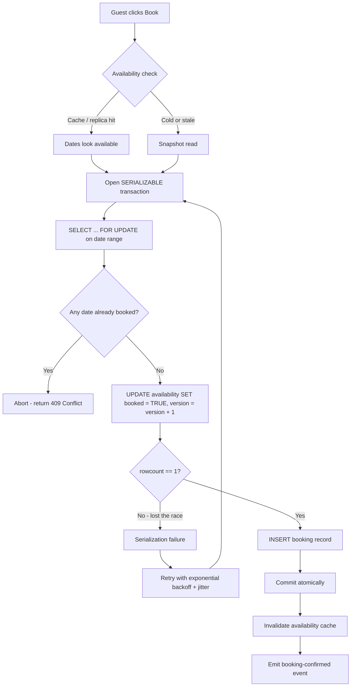

| Difficulty | Channel | Tags |
|---|---|---|
| intermediate | database | acid, isolation-levels, mvcc |

Two guests. One property. One availability row. When both of them hit 'Reserve' in the same millisecond, you get a race condition with real money attached — and Airbnb has lived that nightmare firsthand. As the company moved to a service-oriented architecture, every booking payment became a distributed transaction fanning out across microservices, and auto-retries started charging guests twice and paying hosts twice [1]. That is the payments-world version of the double-booking bug, and fixing it requires understanding how databases really behave under fire. Here is the journey — from the first silent race to the exactly-once system that wins.

---

> ### Real-World Case — Airbnb
>
> As Airbnb moved to a service-oriented architecture, every booking payment became a distributed transaction fanning out across many microservices over unreliable network calls. When a payment request failed or timed out mid-flight, the client had no way to know whether money had moved — so auto-retries could charge a guest twice or pay a host twice. That is the payments-world equivalent of the exact double-booking race the question describes.
>
> | | |
> |---|---|
> | **Challenge** | How to guarantee each money movement executes at most once across retries and network failures, even when the same request arrives multiple times — without relying on lagging replica reads that can make retries re-execute a finished operation. |
> | **Solution** | Airbnb built Orpheus, a generic idempotency framework. Clients generate a unique idempotency key per operation and reuse it on retries; each request runs through three atomic phases (pre-RPC records intent, RPC calls the external system, post-RPC records the result), with write-repair so a retry returns the already-stored response instead of re-executing. Exceptions are classified retryable vs non-retryable, retries use exponential backoff with jitter, and idempotency state is read/written only on the sharded master database so a stale replica can never trigger a duplicate. |
> | **Outcome** | Duplicate payments and duplicate host payouts caused by client retries and replica lag were eliminated across Airbnb's payments microservice architecture, achieving eventual consistency with exactly-once correctness. The framework documented a concrete failure case where just seconds of replica lag produced a duplicate payment. |
> | **Lesson** | The naive recovery mechanism — retrying — is precisely the action that can charge a guest twice, and reading consistency-critical state from replicas makes it worse. Atomicity must be enforced at the state-transition level (idempotency keys plus conditional/atomic writes on the master), not just by hoping a transaction commits. |

---

## Hook — The booking click that broke the bank

Picture the scene: two travelers hover over the same listing on opposite sides of the planet. One clicks. Then the other clicks — 200 milliseconds later. Both get a confirmation screen. Both get charged. One of them is going to arrive to find a stranger already in bed. Now scale that scene: it is not two travelers, it is thousands, hitting the same calendar rows through a web of microservices connected by network calls that drop, lag, and lie. Airbnb discovered that a payment retried after a timeout could move money twice, and a client retry could pay a host twice — all because the caller could not tell if the original request had landed [1]. If that story does not make you sweat, you have never shipped a booking system. The good news: the fix is knowable, and it starts with a database concept most developers meet once and forget — isolation levels.

## Problem — Two guests, one row, and a race you cannot see

The race itself is embarrassingly simple. A transaction reads the availability row and sees booked = FALSE. Another transaction reads the same row at the same moment and also sees booked = FALSE. Both pass validation. Both write. You now have two bookings on one night, and both guests are on a plane. This is a lost update, and it is the default behavior of most databases under their default isolation settings [4]. You might think the fix is obvious: just check availability before you insert. That is check-then-act, and it is exactly the pattern that loses the race — the check and the write are two separate operations with a gap between them that another transaction can slide into. Here is the thing though: the naive fix does not just fail quietly. It fails at the worst possible moment, after the guest has been charged. The stakes stack up fast: overbooked hosts, forced refunds, chargebacks, angry tweets, and a trust deficit that no refund email repairs. Meanwhile, you cannot just lock the whole property table and call it a day, because then availability checks slow to a crawl and your 'high availability' promise evaporates. The real challenge is not preventing double bookings. It is preventing them without turning your database into a single-lane highway.

## Real-World Case — When retries double-charge: the Airbnb payments story

Now take that race and hand it to a distributed system, because that is exactly what Airbnb did. As the company moved to a service-oriented architecture, each booking payment became a distributed transaction that fanned out across many microservices over network calls that were anything but reliable. The failure mode was brutal: when a payment request failed or timed out mid-flight, the client had no way to know whether money had actually moved — so auto-retries could charge a guest twice or pay a host twice [1]. The team documented a concrete failure where just seconds of replica lag produced a duplicate payment [1]. Replica lag. Seconds. That is how narrow the margin between correct and double-charged can be. What Airbnb built to fix it — a framework that gives exactly-once correctness over eventually consistent systems, using idempotency to make retries safe [1] — is the same philosophy that protects a booking transaction. The plot twist: the problem was never the retry. The problem was a retry that was not idempotent.

## Deep Dive — SERIALIZABLE, MVCC, and the art of the row-level lock

Building on the payments story, the lesson transfers directly: correctness under concurrency is a transaction-strategy problem, not a code-review problem. The first tool in the kit is the isolation level. PostgreSQL gives you four, and they differ in which anomalies they permit [2]:

| Isolation Level | Dirty Read | Non-repeatable Read | Phantom Read |
|---|---|---|---|
| Read Uncommitted | possible | possible | possible |
| Read Committed | prevented | possible | possible |
| Repeatable Read | prevented | prevented | possible |
| Serializable | prevented | prevented | prevented |

SERIALIZABLE is the only level that eliminates phantoms — the exact anomaly that creates double bookings, because a new 'available' row (or a changed value) can slip between your check and your write [2]. But serializability is not free. PostgreSQL implements it with a technique you have already met in passing: MVCC, or multiversion concurrency control, where each transaction sees its own consistent snapshot instead of blocking on other readers [5]. MVCC is why you can run thousands of availability checks without them stampeding each other — readers never wait for writers. The catch: MVCC snapshots are also why a transaction can see stale truth. A snapshot that says 'available' is only correct until the next commit lands. So you combine the snapshot with a lock. Specifically, SELECT ... FOR UPDATE grabs row-level locks on the exact date range you are about to book, so a second transaction trying to lock the same rows waits instead of writing over you [3]. That is the pessimistic half of the strategy. The optimistic half is a version column: every update bumps version, and if your UPDATE affects zero rows because someone else bumped it first, you abort and retry [6].

| | Pessimistic locking (SELECT FOR UPDATE) | Optimistic locking (version column) |
|---|---|---|
| Throughput under contention | Drops fast, waiters pile up | Stays high, losers retry |
| Failure mode | Blocked, then correct | Abort and retry, then correct |
| When to use | Short, hot critical sections | Read-heavy workloads with rare writes |
| Risk | Lock escalation, deadlocks | Wasted work under write storms |

Here is the counterintuitive bit, the plot twist: in most booking systems, optimistic locking wins. Contention on any single property is rare — most guests book different dates — so you pay almost nothing for the version column and avoid turning every booking into a lock-waiting contest. You reserve pessimistic locking for the truly hot rows, and you wrap the whole thing in retry logic with exponential backoff so the occasional serialization failure becomes a 50ms hiccup, not a 500 error [9]. And when a guest does lose the race, you tell them the truth: return HTTP 409 Conflict, the status code designed for exactly this 'the state you were looking at is stale' situation [7]. Meanwhile, availability reads — the high-traffic, read-mostly path — can safely hit read replicas or a write-through cache, because a slightly stale 'yes' will be caught by the lock a moment later [8].

## Workflow — From click to confirmation: the booking pipeline

Now that you have the pieces, here is how they snap together into a single pipeline. The diagram below is the whole journey, from the moment a guest clicks Book to the moment the cache knows the truth.

1. Guest clicks Book — the API validates the request and checks availability. For speed, this first check can hit a cache or read replica, because it only needs to be directionally right.
2. Open the transaction — set isolation to SERIALIZABLE. This is the correctness boundary, not the availability path.
3. Lock the rows — SELECT ... FOR UPDATE on the exact date range. Any concurrent booking for those dates now waits at this door.
4. Validate — if any locked row is already booked, abort cleanly and show 'unavailable'.
5. Write — UPDATE with the version guard and booked = TRUE; if rowcount is 0, another transaction won, so abort with a serialization failure.
6. Commit — the atomic unit completes: locked, validated, written, committed.
7. Invalidate the cache — push a fresh availability state so the next read does not serve stale data.
8. Retry path — on serialization failure or deadlock, wait with exponential backoff plus jitter and restart the whole transaction, never a half step [9].

If the diagram looks like a lot, that is the point. Each step exists to close one specific hole, and the pipeline is only as strong as the weakest step — which is almost always the one you skipped to 'save time.'

## Code Example — Locking it down in 40 lines of Python

This is the whole strategy in one function, using psycopg2 against PostgreSQL. Read it like a recipe: strong isolation, row locks, an optimistic guard, honest errors, and a retry wrapper that keeps the failure local.

## Lessons Learned — What booking at scale teaches you

Stepping back from the code, the journey settles into a few rules you can carry to any system with a critical write path.

- Isolation levels are a contract, not a default — audit what your database actually guarantees before you trust it [2].
- Pessimistic locks for the hot rows, optimistic version columns for the long tail — pick per workload, not per religion.
- Retries are only safe when they are idempotent — the Airbnb payments fix exists because a retry without idempotency double-charges people [1].
- Cache invalidation is part of the transaction — a stale 'available' served after a booking is still a double-booking window [8].
- Monitor lock contention and add circuit breakers for hot properties before the pager finds you first [10].

⚠️ Watch Out: the classic battle scar — putting SELECT FOR UPDATE on the whole property row instead of the date range. It works until two guests book different weeks of the same property and your database serializes them for no reason. Lock the data you actually write, no more.

💡 Insight: many developers think high availability and strong correctness are opposites. They are not — MVCC gives you both, as long as you separate the fast read path from the correctness-critical write path [5].

🔥 Hot Take: if your booking endpoint has no retry-with-backoff around serialization failures, you are not handling concurrency, you are just rolling dice and hoping the database does the work for you.

🎯 Key Point: the difference between a booking system and a payments system is mostly vocabulary. The race is identical; only the money trail is longer.

---

## Booking Transaction Flow

<strong>Original Interview Question</strong>

**Q:** You're building a booking system for Airbnb where multiple users can reserve the same property simultaneously. How would you design the transaction handling to prevent double bookings while maintaining high availability?

**A:** Use SERIALIZABLE isolation with optimistic concurrency control. Implement row-level locks on property availability tables, use MVCC snapshot reads for checking availability, and apply application-level validation to ensure atomic booking operations.

## Conclusion

The next time you watch two guests race for the same room, remember the Airbnb payments story: seconds of replica lag were enough to duplicate a payment, and idempotency was the difference between 'retried safely' and 'charged twice' [1]. You now know the full journey — the silent race, the isolation levels that prevent it, the locks that win it, and the retry loops that keep it fast. Tomorrow, do this: audit your critical write path, choose a real isolation level, add a version column, and make every retry idempotent. If you change nothing else, make your retries safe — because the transaction that wins is not the fastest one, it is the one that cannot be duplicated. Share that with your team; it might be the cheapest insurance they ever add.

---

## References

1. [Airbnb incident report](https://medium.com/airbnb-engineering/avoiding-double-payments-in-a-distributed-payments-system-2981f6b070bb) — blog
2. [PostgreSQL Transaction Isolation documentation](https://www.postgresql.org/docs/current/transaction-iso.html) — documentation
3. [PostgreSQL SELECT documentation (FOR UPDATE locking clause)](https://www.postgresql.org/docs/current/sql-select.html) — documentation
4. [Isolation (database systems) - Wikipedia](https://en.wikipedia.org/wiki/Isolation_(database_systems)) — blog
5. [Multiversion concurrency control - Wikipedia](https://en.wikipedia.org/wiki/Multiversion_concurrency_control) — blog
6. [Optimistic concurrency control - Wikipedia](https://en.wikipedia.org/wiki/Optimistic_concurrency_control) — blog
7. [HTTP 409 Conflict - MDN Web Docs](https://developer.mozilla.org/en-US/docs/Web/HTTP/Status/409) — documentation
8. [Working with read replicas - AWS RDS documentation](https://docs.aws.amazon.com/AmazonRDS/latest/UserGuide/USER_ReadRepl.html) — documentation
9. [Exponential backoff - Wikipedia](https://en.wikipedia.org/wiki/Exponential_backoff) — blog
10. [Circuit breaker design pattern - Wikipedia](https://en.wikipedia.org/wiki/Circuit_breaker_design_pattern) — blog

---

**Author:** Satishkumar Dhule — [GitHub](https://github.com/satishkumar-dhule) · [LinkedIn](https://linkedin.com/in/satishkumar-dhule) · [Website](https://satishkumar-dhule.github.io)
