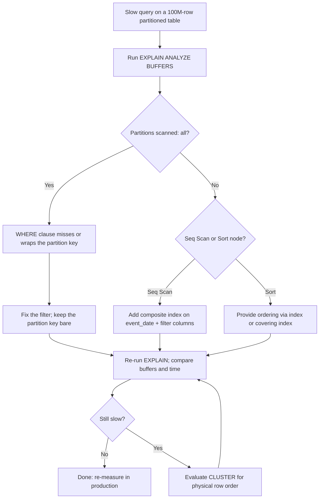

| Difficulty | Channel | Tags |
|---|---|---|
| intermediate | database | explain, query-plan, partitioning |

Every night, Capital One's Consumer Identity platform ingests a mountain of customer data into PostgreSQL — and every lookup of "what has this customer done recently" had to wade through an ever-growing sea of rows. Terabyte-scale daily archiving was locking the database, and the banking experience was paying the price [1]. The fix was elegant: partition by date, and turn slow scans into near-instant lookups. This is the story of how partitioning done right rescued a 100M-row table — and how you can apply the same detective work the next time a query that should be fast isn't.

---

> ### Real-World Case — Capital One
>
> Capital One's Consumer Identity platform ingests massive volumes of customer data into PostgreSQL daily. Lookups for a customer's recent activity were slow because queries had to scan across enormous, ever-growing tables, and archiving terabytes of stale data each day was locking the database and degrading the banking experience.
>
> | | |
> |---|---|
> | **Challenge** | Serve recent customer data in milliseconds for millions of customers from very large, continuously growing date-keyed tables, while archiving multiple terabytes of old data every day without table locks that blocked reads and writes. |
> | **Solution** | They applied temporal (date) partitioning on timestamptz columns and indexed by the customer's unique identifier, so partition pruning skips every partition where a customer had no activity and only scans the days they were active. They hash timestamps into partitions so customer volume stays balanced and no single day's partition skews performance. For retention they detach whole partitions instead of running DELETEs, and deliberately skip VACUUMing the hot tables to avoid costly locks. |
> | **Outcome** | 99.9% of queries for recent (up to 90 days) customer data responded in milliseconds instead of scanning whole tables; daily multi-terabyte archival became a cheap detach operation; and query execution times no longer vary significantly across the year thanks to balanced partitions. |
> | **Lesson** | Partitioning only pays off when the partition key and indexes match the common query pattern so pruning actually works - and the 'optimization' isn't just about queries: partition-key type hygiene (timestamptz, DST) and maintenance strategy (detach instead of DELETE, skipping VACUUM) matter as much as the EXPLAIN plan. |

---

## Hook — It's 3 AM and the Pager Is Screaming

It's 3 AM and your pager just lit up. A customer-facing query is timing out, and the alert points at a table you know well — the one you partitioned by date six months ago when it crossed 100 million rows. You thought you'd fixed this. "Partitioned equals fast," you told yourself. And yet here you are, squinting at a query that filters on a specific date range... and watching it drag. The worst part? Partitioning did make sense. But somewhere between "we partitioned" and "we shipped" — wait, nobody says that — somewhere between "partitioned" and "shipped," the database quietly stopped cooperating. Many developers discover this exact plot twist: partitioning alone is not a performance guarantee; it's the beginning of a performance conversation [1]. What follows is a journey inside the PostgreSQL query planner's head. Buckle up.

## Problem — When "Just Add Partitioning" Isn't Enough

Here's the thing most tutorials don't tell you: a partitioned table is a set of smaller tables wearing a trench coat. Querying it fast depends entirely on whether the planner can prove it only needs to touch a few of those pieces — a process called partition pruning [2]. Miss that, and the planner politely scans every partition, one after another, and returns exactly the slow query you started with. The failure modes are painfully common. Sometimes the WHERE clause doesn't include the partition key at all, or includes it wrapped in a function like date_trunc('month', event_date) that the planner can't reason about. Sometimes the column type disagrees — a timestamp column filtered by a date literal — and pruning silently evaporates. And even when pruning works, the query can still stall on a sequential scan of an unindexed partition, or choke on a sort of millions of rows that an index could have avoided entirely. The stakes are real. On a 100-million-row table, an unfiltered scan can touch gigabytes of heap pages; even on fast SSDs that's seconds of latency per query [3]. At the volume of a large banking platform, multiply that by thousands of lookups per second and you have a distributed customer-anger event in progress. This is why the interview question — "your partitioned table is still slow, what do you check?" — isn't academic. It's a production on-call scenario wearing a lab coat.

## Real-World Case — Capital One Tames Its Consumer Identity Tables

Enter Capital One's Consumer Identity platform. The team ingests massive volumes of customer data into PostgreSQL on a daily cadence — hundreds of millions of rows of account activity piling up day after day. The challenge is one every data-heavy team eventually meets: lookups for a customer's recent activity had to scan across enormous, ever-growing tables. And there was a second, sneakier problem: each night, archiving terabytes of stale data was locking the database and degrading the banking experience [1]. Here's where the story twists. Capital One's answer wasn't more hardware and it wasn't a rewrite. It was date-based partitioning executed with discipline: balance, cheap archival, and indexing aligned to the access pattern. They kept each partition balanced so no single one became a hot spot, which keeps query times stable across the entire year instead of drifting as the table grows [1]. Instead of DELETE-ing terabytes — which locks rows, bloats tables, and begs for autovacuum mercy — they archived by detaching partitions, a near-instant metadata operation compared to deleting rows [1][2]. And since lookups target recent data (up to 90 days), a well-placed index turns a scan into a seek across just a handful of partitions [1]. The results are the kind of numbers you paste on a slide and defend in the next architecture review: 99.9% of queries for recent customer data responded in milliseconds instead of scanning whole tables. Daily multi-terabyte archival became a cheap detach operation. And query execution times no longer vary significantly across the year thanks to balanced partitions [1]. If that doesn't make you want to open psql and inspect a plan, nothing will.

## Deep Dive — Reading EXPLAIN Like a Detective

Building on that case, the interview scenario is precise for a reason: a 100M-row table, partitioned by date, and a query on a specific date range that's still slow. That combination tells you the mechanism is sound — the WHERE clause clearly references the partition key — so the failure lives in the details. First, verify pruning actually happened. The EXPLAIN output for a partitioned query lists the partitions scanned. If it reports "Partitions scanned: all" when you asked for one month, pruning has silently failed [2]. The usual suspects are a data type mismatch between the filter and the partition column, or a function wrapping the partition key. Second, look at the scan strategy inside the surviving partitions. A Seq Scan on a 3-month slice of a 100M-row table is still millions of rows. That's where a composite index on (event_date, status) earns its keep — it lets the planner satisfy the WHERE clause with an index range scan instead of filtering row by row [4]. Third, hunt the expensive nodes. Sorting millions of rows (Sort) or a HashAggregate spilling to disk will dominate your runtime even with perfect pruning; an index that provides the required ordering — or a covering index — can eliminate the sort altogether [4].

| What the plan shows | What it means | What to do |
|---|---|---|
| Partitions scanned: all | Pruning failed | Fix type mismatch; keep the partition key bare in WHERE |
| Seq Scan on a large partition | No useful index | Composite index on (partition_key, filter_cols) |
| Sort or disk-spilling HashAggregate | Ordering is expensive | Provide order via index or covering index |
| High buffers count but fast | Cache-miss storm | Evaluate CLUSTER or a more selective index |

Fourth — and this is the counterintuitive one — consider physical order. Many developers discover that an index doesn't fully solve the problem because heap pages are still scattered. CLUSTER rewrites the table in index order so a date-range scan touches contiguous heap pages: fewer reads, dramatically better locality [5]. But here's the catch: clustering is a one-time operation, and subsequent writes scatter rows again, so it's a maintenance chore, not a set-and-forget fix. For append-heavy, date-partitioned tables, some teams prefer BRIN indexes on the partition key — tiny structures that are brilliantly effective on naturally ordered data [6]. Finally, remember the planner is only as smart as its statistics. If autovacuum hasn't run on a heavily ingested table, row estimates can be off by orders of magnitude and the planner will confidently choose the wrong plan [7]. When in doubt, ANALYZE the newest partition and re-inspect.

## Workflow — A Step-by-Step Tuning Runbook

The journey from "slow" to "99.9% of queries in milliseconds" isn't a single trick; it's a repeatable loop. The diagram below (Figure 1, the Query Tuning Loop) maps the diagnostic path you'll walk every time a query misbehaves. The key discipline: change one thing, measure, repeat. Speed is a hypothesis, not a fact, until EXPLAIN says otherwise [3]. Consequently, here's the runbook in plain steps: 1) Reproduce the slow query against production-shaped data and capture EXPLAIN (ANALYZE, BUFFERS) — the BUFFERS flag counts every heap page touched, and that number is your baseline truth [3]. 2) Check pruning by counting "Partitions scanned" against total partitions; if all of them get scanned, fix the WHERE clause before touching anything else. 3) Inspect the scan nodes — a Seq Scan on a big partition with a large "Rows Removed by Filter" count means the plan dragged enormous dead weight. 4) Find the expensive node; anything with a Sort or a disk-spilling hash aggregate usually owns the runtime budget. 5) Design the index for the query, not the table: a composite index on (partition_key, filter_cols), or a covering index for index-only scans [4]. 6) Consider physical order — for date-range scans, CLUSTER or a BRIN index can be the difference between touching 10 pages and 1,000 [5][6]. 7) Re-run and compare: buffers touched, execution time, partitions scanned — every number should move in the right direction. If nothing moves, your hypothesis was wrong; go back to step 1. That's not failure, that's data.

## Code Example — A Diagnostic Script That Reads Plans for You

Enough theory — let's build the tool that automates steps 1 through 4. The Python script below uses psycopg2 to run EXPLAIN (ANALYZE, BUFFERS) against the slow query, then greps the plan text for the classic red flags: no partition pruning, sequential scans, and expensive sorts. It won't fix the query for you, but it will point your nose in the right direction before you start creating indexes blind. Run it in a staging environment with production-sized partitions; the whole point is to catch the disease before it hits production [3].

## Lessons Learned — What to Do Differently Tomorrow

So what does this change about how you work tomorrow? First, treat partitioning as a starting line, not a finish line: the moment a partitioned query is slow, the first suspect is always pruning, not hardware. Second, read the whole EXPLAIN plan like a story, not just the first node — the Sort hiding five lines down is often the real villain [3]. Third, design composite indexes to match the WHERE clause, not the table's column order, because index column order is a leftmost-prefix contract [4]. Fourth, remember that CLUSTER is powerful but needs a maintenance plan; it won't keep itself tidy [5]. And finally, always measure with BUFFERS so your "it got faster" claim has numbers behind it. Now for the battle scars — the mistakes that cost teams the most sleep:

⚠️ Watch Out: CLUSTER takes an ACCESS EXCLUSIVE lock on the table. Run it in a maintenance window or use a tool that rebuilds the table in place first.
⚠️ Watch Out: A composite index with an unselective leading column (like status when 90% of rows are 'completed') will look beautiful and do almost nothing.
💡 Insight: On append-only partitioned tables, BRIN indexes are often smaller than your coffee order and shockingly effective [6].
🔥 Hot Take: If a query is slow and the answer is "more hardware," you haven't read the plan yet — you've given up reading it.

The practical outcome mirrors Capital One: pruning done right makes 99.9% of recent-data lookups answer in milliseconds, turns multi-terabyte archival into a cheap detach, and keeps query times stable across the year [1]. That's the transformation available to any team willing to spend ten minutes with EXPLAIN.

---

## Query Tuning Loop

<strong>Original Interview Question</strong>

**Q:** You have a PostgreSQL table with 100M rows partitioned by date. A query filtering on a specific date range is still slow. What would you check in the EXPLAIN plan and how would you optimize it?

**A:** Check partition pruning effectiveness, index utilization patterns, and expensive sort operations. Create composite indexes on (date, filtered_columns) and evaluate clustering strategies for optimal data access.

## Conclusion

Rewind to that 3 AM pager call. Capital One faced the same wall — enormous tables, slow lookups, and nightly terabyte-scale archives that locked the database [1] — and the fix was never more hardware. It was curiosity applied in the right order: prove pruning, read the plan, add the right index, and only then consider how rows are physically arranged. The result speaks for itself: 99.9% of recent-activity queries answered in milliseconds, and archival became a cheap detach [1]. So tomorrow, don't wait for the incident. Run EXPLAIN (ANALYZE, BUFFERS) on your most-queried date-range query and ask one brutal question: would this plan survive a 100-million-row table? If the answer makes you uncomfortable, you know exactly what to do — you've just read the playbook. The one insight worth carrying to your team's next design review: partitioning isn't the optimization. Pruning is. The rest is just making the plan honest.

---

## References

1. [Capital One incident report](https://www.capitalone.com/tech/software-engineering/postgresql-partitioning-tips/) — article
2. [PostgreSQL Documentation: Table Partitioning](https://www.postgresql.org/docs/current/ddl-partitioning.html) — documentation
3. [PostgreSQL Documentation: Using EXPLAIN](https://www.postgresql.org/docs/current/using-explain.html) — documentation
4. [PostgreSQL Documentation: Indexes](https://www.postgresql.org/docs/current/indexes.html) — documentation
5. [PostgreSQL Documentation: CLUSTER](https://www.postgresql.org/docs/current/sql-cluster.html) — documentation
6. [PostgreSQL Documentation: BRIN Indexes](https://www.postgresql.org/docs/current/brin.html) — documentation
7. [PostgreSQL Documentation: Planner Statistics](https://www.postgresql.org/docs/current/planner-stats.html) — documentation
8. [Wikipedia: B-tree](https://en.wikipedia.org/wiki/B-tree) — article

---

**Author:** Satishkumar Dhule — [GitHub](https://github.com/satishkumar-dhule) · [LinkedIn](https://linkedin.com/in/satishkumar-dhule) · [Website](https://satishkumar-dhule.github.io)
