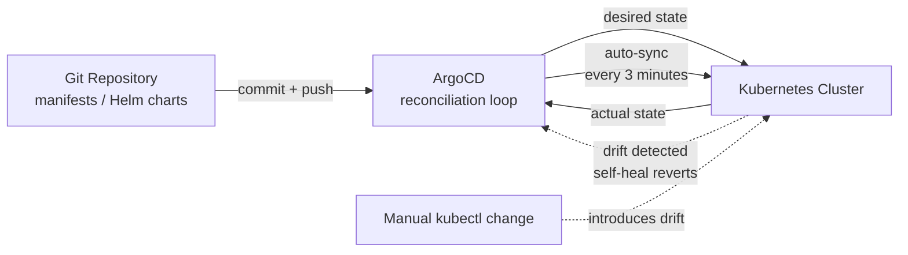

| Difficulty | Channel | Tags |
|---|---|---|
| beginner | devops | argocd, flux, declarative |

Late in 2024, Adobe pulled off what most enterprises only dream about: they tore out a legacy, queue-based deployment platform and rebuilt it around GitOps, migrating 10,400 pipelines across 100+ engineering teams along the way [1]. Their new platform, Flex, now manages 6,000+ services across roughly 50,000 environments, including about 19,000 production environments supporting 3,300+ production services for 3,000+ developers [1]. Adobe's bet is a masterclass in a question every developer should care about: when a cluster drifts from Git, who wins?

---

> ### Real-World Case — Adobe
>
> Adobe's legacy internal deployment platform, Moonbeam (CaaS), ran fragile, queue-based, imperative workflows that were increasingly difficult to scale, secure, and audit across hundreds of teams. In 2H 2024 Adobe launched an enterprise-wide migration to a new GitOps platform called Flex, touching 10,400 pipelines across 100+ engineering teams.
>
> | | |
> |---|---|
> | **Challenge** | They needed to replace an imperative, push-based delivery model that suffered from configuration drift, manual intervention, and poor auditability, and scale it to thousands of developers while meeting enterprise governance, security, and compliance requirements. |
> | **Solution** | Adobe adopted a fully declarative GitOps operating model: Git became the single source of truth, Argo CD continuously reconciled live clusters with the desired state declared in Git (with auto-sync and drift prevention), and Argo Workflows, Argo Events, and Argo Rollouts were operationalized alongside a governed self-service platform with service registration, secrets management, and change workflows. |
> | **Outcome** | 10,400 pipelines were migrated or decommissioned; Flex now manages 6,000+ services across ~50,000 environments, including ~19,000 production environments supporting 3,300+ production services for 3,000+ developers. The migration also cut deployment queue times and let them retire roughly 80% of previously identified stale/duplicate services, contributing meaningful cost savings. |
> | **Lesson** | Mandates don't drive adoption, value does, and investing in end-to-end migration tooling from day one matters more than the technology itself. A surprise bonus: the forcing function of a GitOps migration exposes and lets you decommission dead services, turning a platform upgrade into a cost-saving cleanup. |

---

## Hook — The 3 a.m. fix you'll regret by Friday

Picture this: it's 3 a.m., and a pager rips you out of a dream about perfectly green pipelines. You log in, squint at a terminal, and type `kubectl edit deployment payments` — fixing the issue in under a minute. The deploy looks fine. The on-call shift ends. You never think about it again. Two weeks later, that "quick fix" silently reappears — or worse, gets bulldozed by the next deployment. Sound familiar? This is the moment most teams discover configuration drift, the silent killer of Kubernetes clusters. Every imperative kubectl command you type is a promise to the cluster that Git can't keep. And somewhere down the line, the bill comes due.

## Problem — The cluster doesn't have a memory

Here's the uncomfortable truth: Kubernetes doesn't care how you change it. `kubectl apply`, `kubectl create`, `helm upgrade` — each of these writes directly to cluster state, bypassing any record of intent [6]. Developers love the immediacy. But the cluster has no memory, no audit log, and no way to tell you what it *should* be running. The stakes are real: configuration drift between environments, a production cluster that no longer matches the repo, untrackable "one-off" hotfixes, and rollbacks that turn into archaeology. When hundreds of teams touch shared infrastructure with imperative commands, nobody can answer the simplest question — what is actually running right now? Many developers learn this the hard way, staring at a 500 error at 2 a.m. that works locally but not in prod. The manifest says one thing. The cluster says another. Git says nothing at all.

## Real-World Case — Adobe

Adobe knows this struggle at enterprise scale. Their legacy internal deployment platform, Moonbeam (CaaS), ran fragile, queue-based, imperative workflows that were increasingly difficult to scale, secure, and audit across hundreds of teams [1]. Every deployment queued, every change imperative, every audit an exercise in patience. So in the second half of 2024, Adobe launched an enterprise-wide migration to a new GitOps platform called Flex [1]. The numbers are staggering: 10,400 pipelines were migrated or decommissioned; Flex now manages 6,000+ services across ~50,000 environments, including ~19,000 production environments supporting 3,300+ production services; 3,000+ developers now deploy through it [1]. The migration cut deployment queue times and let Adobe retire roughly 80% of previously identified stale and duplicate services, contributing meaningful cost savings [1]. Why should you care? Because Adobe isn't a team of ten with one cluster — it's three thousand developers. If GitOps scales to that, it can scale to your team.

## Deep Dive — The plot twist no one sees coming

Here's the counterintuitive part: declarative sounds like the harder path. You can't just "make it work" — you have to describe it first. But that's exactly where the trade-off flips in your favor. The declarative approach means defining the complete desired state in version control using YAML manifests, Helm charts, or Kustomize overlays, then letting ArgoCD continuously reconcile the actual cluster state with that declared state [3][5]. Every change flows through a Git commit, giving you auditability, code review, and collaboration as free side effects. Rollbacks become a one-command `git revert` [2]. The imperative approach — running kubectl commands that directly mutate the cluster — feels faster in the moment but bypasses the source of truth entirely [6]. Changes vanish from version control, drift creeps in, and rollbacks require manually reconstructing what you did months ago.

Here's the real tradeoff at a glance:

| Aspect | Declarative (ArgoCD) | Imperative (kubectl) |
|---|---|---|
| Source of truth | Git repository | Human memory + cluster |
| Change mechanism | Git commit + PR review | kubectl run/edit/apply |
| Audit trail | Full history | None |
| Rollback | git revert | Manual reconstruction |
| Self-healing | Automatic | Manual intervention |
| Collaboration | Pull requests | Tribal knowledge |

The insight that reframes everything: GitOps is declarative-plus. It borrows Kubernetes' own reconciliation philosophy — the control loop that constantly nudges the world toward a desired state [10] — and extends it beyond the cluster boundary all the way into Git [7]. The cluster stops improvising. It starts behaving.

## Workflow — Five beats to a self-healing cluster

Building on the deep dive, setting up ArgoCD follows a story with five beats. Each step connects to the next, and skipping one means drift finds its way back in. First, put your Kubernetes manifests or Helm charts in a Git repository — this becomes your single source of truth [9]. Second, install ArgoCD into your cluster. Third, create an Application CRD that points at that repository — a contract between Git and the cluster declaring *what* should run and *where* [3]. Fourth, enable auto-sync with a configurable health check interval, typically 1–5 minutes, with 3 minutes as a solid sweet spot [4]. Fifth, and most importantly, turn on self-healing so ArgoCD automatically reverts any unauthorized manual changes [4].

The diagram below tells the visual story: Git feeds the reconciliation loop, the cluster reports its actual state, and any drift gets pulled back into line.



The magic: everything after step one is a control loop, not a person. You write intent once; ArgoCD enforces it forever.

## Code Example — Your first ArgoCD Application

Now for the hands-on part. The heart of any GitOps setup is the Application CRD — the contract between your repository and the cluster [3]. This bash walkthrough creates one, points it at a Helm chart, and enables the two flags that make self-healing work [4].

```bash
# Create the ArgoCD Application that declares your desired state.
# This contract points ArgoCD at your Git repo as the source of truth.
cat <<'EOF' | kubectl apply -f -
apiVersion: argoproj.io/v1alpha1
kind: Application
metadata:
  name: payments-service
  namespace: argocd
spec:
  project: default
  source:
    repoURL: https://github.com/your-org/payments-service.git
    targetRevision: main
    path: charts/payments-service   # Helm chart path inside the repo [8]
    helm:
      valueFiles:
        - values-prod.yaml          # environment-specific overrides
  destination:
    server: https://kubernetes.default.svc  # the cluster ArgoCD controls
    namespace: payments
  syncPolicy:
    automated:
      prune: true                   # delete resources removed from Git
      selfHeal: true                # revert any manual drift in the cluster
    syncOptions:
      - CreateNamespace=true
EOF

# Verify ArgoCD picked up the app and it synced healthy
argocd app get payments-service

# Watch the reconciliation loop do its thing
argocd app sync payments-service
```

Walking through it: the `source` block is the heart of the declaration — it tells ArgoCD exactly where the truth lives (your Git repo) and which chart to render, including environment-specific values via Helm [8]. The `destination` block scopes the contract to one cluster and one namespace, so a misconfigured Application can't touch unrelated workloads. The `syncPolicy` is where the automation lives: `selfHeal: true` tells ArgoCD to detect and revert any manual kubectl edits, and `prune: true` tells it to delete resources that no longer exist in Git [4]. The final two commands are your new deploy workflow — get to verify, sync to apply. No SSH into boxes, no runbooks, no guesswork.

## Lessons Learned — What Adobe's migration and your own cluster teach you

So what should you do differently tomorrow? Start here. First, begin declaratively even for experiments — old habits die hard, and every imperative command you type today is debt you pay tomorrow. Second, enable self-healing only after you trust auto-sync: watch a few cycles, review the diffs, then flip the switch [4]. Third, prune carefully — `prune: true` deletes resources missing from Git, so always review the generated diff before the first automated run. Fourth, use Helm or Kustomize for templating instead of copy-paste YAML; your future self will thank you when a version bump touches forty services [8]. Fifth, a genuinely counterintuitive warning: automated sync with self-healing can override emergency hotfixes on purpose. That's the feature, not the bug — but your operations team needs to know the escape hatch is a Git commit, not a kubectl command [4]. The deepest lesson of all: slowing down makes you faster. Adobe didn't save money by typing faster; they saved it by making every change reviewable and every stale system deletable [1]. The single source of truth isn't a slogan — it's what turns deployment from a gamble into a routine [2].

---

## GitOps Reconciliation Loop


<details>
<summary><strong>Original Interview Question</strong></summary>

**Q:** You're setting up GitOps for a microservices deployment. How would you configure ArgoCD to automatically sync changes from your Git repository to Kubernetes, and what's the difference between declarative and imperative approaches in this context?

**A:** I'd configure ArgoCD by setting up a Git repository containing Kubernetes manifests or Helm charts, creating an Application CRD that points to the Git repository, enabling auto-sync with a health check interval of 3 minutes, and implementing self-healing to automatically revert any manual changes. The declarative approach involves defining the desired state in Git through YAML manifests, Helm charts, or Kustomize configurations, where ArgoCD continuously reconciles the actual state with the desired state. In contrast, the imperative approach uses kubectl commands to make direct changes to the cluster, bypassing the Git repository as the single source of truth.

</details>

## Conclusion

Tomorrow, do one thing: pick your messiest service, put its manifests in Git, and point an ArgoCD Application at it with auto-sync disabled. Watch how it behaves for a week. Then flip on self-healing and prune. The memorable insight to share with your team: Git isn't just where your code lives — it's where your cluster gets its personality from. Once the cluster stops improvising, deployment stops being a gamble and becomes a reviewable, revertible, auditable commit. That's the journey Adobe just took at 10,400-pipeline scale [1]. Your cluster can take it too.

---

## References

1. [Adobe incident report](https://www.cncf.io/case-studies/adobe/) — article
2. [GitOps](https://en.wikipedia.org/wiki/GitOps) — article
3. [ArgoCD Declarative Setup](https://argo-cd.readthedocs.io/en/stable/operator-manual/declarative-setup/) — documentation
4. [ArgoCD Automated Sync Policy](https://argo-cd.readthedocs.io/en/stable/user-guide/auto_sync/) — documentation
5. [Declarative Management of Kubernetes Objects Using Configuration Files](https://kubernetes.io/docs/tasks/manage-kubernetes-objects/declarative-config/) — documentation
6. [Imperative Management of Kubernetes Objects Using Configuration Files](https://kubernetes.io/docs/tutorials/object-management-kubectl/imperative-object-management-configuration/) — documentation
7. [OpenGitOps Principles](https://opengitops.dev/) — documentation
8. [Helm Documentation](https://helm.sh/docs/) — documentation
9. [ArgoCD Repository](https://github.com/argoproj/argo-cd) — documentation
10. [Kubernetes Concepts: What is Kubernetes](https://kubernetes.io/docs/concepts/overview/what-is-kubernetes/) — documentation

---

**Author:** Satishkumar Dhule — [GitHub](https://github.com/satishkumar-dhule) · [LinkedIn](https://linkedin.com/in/satishkumar-dhule) · [Website](https://satishkumar-dhule.github.io)
