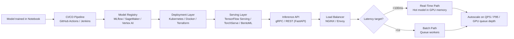

| Difficulty | Channel | Tags |
|---|---|---|
| beginner | devops | mlops, deployment |

Before 2015, every machine learning use case at Uber — ETA prediction, surge pricing, UberEATS delivery estimates — was a one-off build. Data scientists trained models in isolation, and a separate engineering team hand-wrote a custom serving container for every single one [1]. There was no standard path from trained model to production, and the chaos that followed was a textbook case of hidden technical debt. This is the story of how Uber escaped that mess with Michelangelo — and what it reveals about the difference between deploying a model and serving it.

---

> ### Real-World Case — Uber
>
> Before 2015, every ML use case at Uber — ETA prediction, surge pricing, UberEATS delivery estimates — was built as a one-off. Data scientists trained models in isolation, and a separate engineering team hand-wrote a custom serving container for each model. There was no standard path from trained model to production, exactly the hidden-technical-debt anti-patterns documented in the famous 'Hidden Technical Debt in Machine Learning Systems' paper.
>
> | | |
> |---|---|
> | **Challenge** | Uber needed to separate the two very different problems of MLOps: deployment (repeatable pipelines for training, packaging, releasing, and monitoring models) and serving (running models as low-latency inference APIs under real-time load). Teams were conflating the two, so every model was a bespoke project with weeks of infrastructure work and no rollout, versioning, or rollback strategy. |
> | **Solution** | Uber built Michelangelo (launched 2016), an end-to-end ML-as-a-service platform that cleanly separates the two planes. Deployment became standardized and self-service: models train in a common workflow, get versioned in a model registry, and deploy to Kubernetes as containers with load balancing, autoscaling, and health checks. Serving was split into three distinct modes with different latency budgets: offline batch prediction (scheduled Spark jobs), near-real-time prediction (Kafka streaming), and online real-time prediction (RPC endpoints) with P95 latency under 5ms. A shared feature store with batch precompute (HDFS into Cassandra) and near-real-time compute (Kafka/Samza) pipelines guaranteed training-serving feature parity and avoided cold starts. |
> | **Outcome** | Michelangelo became the de-facto platform for ML at Uber. Highest-traffic models were already serving 250,000+ predictions per second in 2017 at P95 latency under 5ms (under 10ms with Cassandra feature lookups). It scaled to ~400 active ML projects, 5,000+ models in production, and 10 million real-time predictions per second at peak — powering ETAs, surge pricing, fraud detection, and Eats ranking. In Michelangelo 2.0 Uber later consolidated all serving runtimes onto NVIDIA Triton and scaled autoscaling on inference-specific metrics (QPS, P95 latency, GPU queue depth) rather than CPU. |
> | **Lesson** | Deployment and serving are genuinely different engineering problems that need separate abstractions: deployment is about CI/CD, versioning, and rollout; serving is about latency, throughput, and autoscaling. The biggest hidden cost was training-serving skew — solved here by computing the same features through the same pipelines (batch and near-real-time) used at both training and inference time. Uber's initial mistake (not embracing the tools data scientists already used) also shows platform adoption is as much about developer experience as infrastructure. |

---

## Hook — The deploy looked fine. Then the pager went off.

The deploy looked fine. Tests passed, the model scored 99% accuracy offline, and the dashboard was green. Then, at 2am, the pager lit up: predictions timing out, GPU memory exhausted, and a queue of requests growing faster than anyone could drain.

Sound familiar? Here is the uncomfortable truth about machine learning in production: most of the pain has nothing to do with the model itself. It comes from the pipeline around it — and specifically from a blurry line that most teams draw in the wrong place. That line is the one between model deployment and model serving.

Many developers use those two words interchangeably. They are not the same job, they do not scale the same way, and they fail in very different, very specific ways. Knowing the difference is not a trivia question — it is the difference between a quiet night and an incident call at 3am.

## Problem — Two jobs wearing the same hoodie

Deployment is about getting a model to a place where it can run: containerizing it, wiring up CI/CD so a new version ships automatically, provisioning infrastructure, and keeping an eye on health. Think Kubernetes, Docker, and Terraform on the infrastructure side, with MLflow or SageMaker managing artifacts and experiment history [7][10].

Serving is what happens after that: the model is loaded into memory and exposed as an API that answers real requests in real time. Frameworks like TensorFlow Serving, TorchServe, and BentoML handle request routing, model versioning, and response optimization that users never see [4][5][6].

The confusion is expensive. Treat serving like a deployment problem and you build infrastructure that can ship models but cannot answer a single request under load. Treat deployment like a serving problem and you end up hand-rolling a custom server for every model — precisely the anti-pattern that the "Hidden Technical Debt in Machine Learning Systems" paper warns about, where glue code and pipelines quietly accumulate until the system collapses [2].

⚠️ Watch Out: A recurring failure is shipping a great model with no answer to the question "how does this handle 10x the traffic tomorrow?" Deployment answers where it runs; serving answers how fast it answers. You need both — and in that order.

## Real-World Case — Uber's Michelangelo

Uber learned this lesson the hard way. Before 2015, every ML use case — ETA prediction, surge pricing, UberEATS delivery estimates — was built as a one-off. Data scientists trained models in isolation, and a separate engineering team hand-wrote a custom serving container for each model [1]. No standard path existed from trained model to production, which is exactly the hidden-technical-debt pattern documented in the research Uber's own team helped make famous [2].

The fix was Michelangelo, a platform that standardized both sides of the divide. The result was dramatic: by 2017, Uber's highest-traffic models were already serving more than 250,000 predictions per second at a P95 latency under 5 milliseconds — under 10 milliseconds with Cassandra feature lookups [1].

And it kept scaling. Michelangelo grew to roughly 400 active ML projects and 5,000+ models in production, eventually hitting 10 million real-time predictions per second at peak, powering ETAs, surge pricing, fraud detection, and Eats ranking [1].

But here is the plot twist: Uber did not stop there. In Michelangelo 2.0, the team consolidated all serving runtimes onto NVIDIA Triton and moved autoscaling to inference-specific metrics — QPS, P95 latency, and GPU queue depth — rather than CPU [1][8]. That detail matters more than it looks: Uber scaled serving on the signals that actually matter to a model server, not the signals that matter to a web server.

## Deep Dive — Deployment vs. serving, trade-offs and all

Building on Uber's story, let's unpack the technical split. Deployment and serving solve different problems, and each has its own toolchain, its own metrics, and its own failure modes.

Here is a comparison you can carry into your next architecture review:

| Aspect | Deployment | Serving |
|---|---|---|
| Core question | Where does it run? | How fast does it answer? |
| Primary tools | Kubernetes, Docker, Terraform [3] | TensorFlow Serving, TorchServe, BentoML [4][5][6] |
| CI/CD | GitHub Actions, Jenkins | Blue-green releases, canary rollouts |
| Registry | MLflow, SageMaker, Vertex AI [7][10] | Version-pinned model artifacts |
| Key risks | Failed rollout, config drift | Cold starts, timeouts, GPU OOM |

Now the scaling math. Horizontal scaling — pod replicas under a load balancer — is the default answer for stateless web services, and model servers are no different, up to a point [3]. Vertical scaling, adding GPU memory or CPU cores, matters when a single model needs a large batch or a heavyweight tensor to fit in one node.

Latency requirements change everything. Real-time inference (an API call behind a user action) usually needs sub-100ms responses; batch inference (overnight scoring jobs) is fine at multiple seconds [4]. That choice drives the whole architecture: real-time paths keep models hot in GPU memory and pay the cold-start tax when a replica spins up, while batch paths queue requests and amortize the cost across thousands of predictions.

🔥 Hot Take: You might think serving is just "a web server around a model." Actually, the opposite is closer to the truth. Model servers are specialized for exactly three things — batching, model version pinning, and preloading weights — and every hour spent rebuilding those features by hand is an hour that could have been spent on the model itself. This is why Uber consolidated onto Triton rather than maintaining 400 custom containers [1][8].

## Workflow — From notebook to production, the honest path

So what does the journey actually look like? The diagram below walks through the full path from a trained model to a serving endpoint — the exact pipeline Uber formalized with Michelangelo.



Breaking this into steps:

1. **Train and register** — the trained model is serialized and pushed to a model registry, where it gets a version tag and immutable metadata [7].
2. **Deploy** — a CI/CD pipeline containerizes the artifact and rolls it out to Kubernetes, which handles scheduling, health checks, and rollback [3].
3. **Serve** — a model server loads the pinned version into memory and exposes it through gRPC or REST, with request routing handled by a load balancer like NGINX or Envoy [4][9].
4. **Scale** — autoscaling decisions rest on inference-specific metrics: QPS, P95 latency, and GPU queue depth, not raw CPU [1][8].
5. **Route traffic** — canary and A/B testing split traffic across versions, so a bad model gets a small audience before it gets everyone [10].

The key insight is the separation of concerns: CI/CD ships artifacts; the serving layer answers requests. When the two responsibilities blur, you get Uber's pre-2015 world of custom containers.

## Code Example — A minimal serving layer with version pinning

To see the deploy-versus-serve split in practice, here is a minimal FastAPI serving layer for a fraud-detection model. Notice how deployment concerns (versioned artifacts) and serving concerns (pinning, no-grad inference) are deliberately kept separate.

```python
from fastapi import FastAPI, Header, HTTPException
from pydantic import BaseModel
import torch

# Deployment concern: the versioned, immutable artifact from the model registry
MODEL_VERSION = "fraud_detector_v1.2.3"
MODEL_PATH = f"/models/{MODEL_VERSION}.pt"

app = FastAPI(title="Fraud Detection Serving Layer")

class PredictRequest(BaseModel):
    features: list[float]

class PredictResponse(BaseModel):
    prediction: float
    version: str

def load_model() -> torch.nn.Module:
    # torch.jit serializes the artifact so training code never leaks into serving
    model = torch.jit.load(MODEL_PATH)
    model.eval()
    return model

model = load_model()

@app.post("/v1/predict")
async def predict(
    payload: PredictRequest,
    x_model_version: str = Header(default=MODEL_VERSION),
) -> PredictResponse:
    # Serving concern: pin the exact version so a bad rollout is a header flip away
    if x_model_version != MODEL_VERSION:
        raise HTTPException(status_code=409, detail="Requested version not loaded")

    # Serving concern: no-grad inference under a model that is already warm
    with torch.no_grad():
        output = model(torch.tensor(payload.features, dtype=torch.float32))

    return PredictResponse(prediction=float(output.item()), version=MODEL_VERSION)
```

Here is how this maps to the two jobs from earlier:

- **Deployment side** — the model path points at a version-tagged artifact from the registry [7]. `torch.jit.load` pulls in a serialized, self-contained model, so no training code or framework dependencies leak into the serving container. The CI/CD pipeline ships this file; the code never cares where it came from.
- **Serving side** — the `x_model_version` header pins the exact version. If a rollout goes sideways, rollback is literally a matter of pointing clients at the previous version. The `torch.no_grad()` block skips gradient tracking, cutting memory and latency for inference-only paths.
- **What is missing (deliberately)** — batching, autoscaling, and multi-model routing. Those are the jobs of dedicated servers like TorchServe or Triton [5][8]. For a single-model endpoint this pattern is clean and production-honest; the moment you run dozens of models, hand-rolled code stops scaling and the platform tools take over — exactly Uber's journey.

## Lessons Learned — What Uber's decade teaches you

Every architecture review you attend from now on will go better if you leave with these four takeaways.

- **Deployment and serving are different jobs with different tools.** Kubernetes and MLflow ship models; TensorFlow Serving, TorchServe, and Triton answer requests [3][4][8]. Mixing the two is how custom serving containers multiply like rabbits.
- **Scale on inference metrics, not infrastructure metrics.** Uber autoscales on QPS, P95 latency, and GPU queue depth — not CPU [1][8]. CPU utilization lies to you about a model server's health; queue depth does not.
- **Plan for rollback before you need it.** Version pinning, canary traffic splitting, and blue-green releases turn a bad model into a 10-minute fix instead of a 3am incident [3][10].
- **Real-time and batch are separate design problems.** Sub-100ms real-time serving wants hot weights and heavy GPU memory; batch inference wants queues and throughput [4]. Choosing one and forcing everything through it is a classic mistake.

💡 Insight: The single best predictor of MLOps pain is the number of hand-written serving containers a team maintains. Zero is a platform. Five is a prototype. Forty is a career.

The battle scar every team eventually earns looks the same: a model that crushed offline benchmarks, deployed on schedule, then melted in production because the serving layer never considered cold starts or GPU contention. Avoid it by designing the deploy-to-serve pipeline before the model is finished — the model is the easy part [2].

---

## Deploy-to-Serve Pipeline


<details>
<summary><strong>Original Interview Question</strong></summary>

**Q:** Explain the key differences between model serving and model deployment in ML systems, including specific technologies, scaling considerations, and real-world implementation patterns?

**A:** Deployment encompasses CI/CD pipelines, infrastructure setup, and monitoring using tools like Kubernetes, MLflow, and SageMaker. Serving focuses on runtime inference APIs with frameworks like TensorFlow Serving, TorchServe, or BentoML, handling request routing, model versioning, and autoscaling. Key trade-offs include latency vs throughput, batch vs real-time inference, and cold start optimization.

</details>

## Conclusion

Uber's pre-2015 chaos — hundreds of hand-written serving containers and no path from notebook to production — looks familiar because it is the default state of most ML teams today [1]. The fix was not a better model; it was a clear separation between deployment (ship the artifact) and serving (answer the request), with dedicated tooling for each. Tomorrow, before you write another line of model code, sketch your deploy-to-serve pipeline and ask one question: does every model share a standard path, or is another custom container quietly being born? The models are the easy part — the pipeline is where the real engineering lives [2].

---

## References

1. [Uber incident report](https://www.uber.com/us/en/blog/michelangelo-machine-learning-platform/) — blog
2. [Hidden Technical Debt in Machine Learning Systems](https://arxiv.org/abs/1705.10748) — paper
3. [Kubernetes Architecture](https://kubernetes.io/docs/concepts/architecture/) — documentation
4. [TensorFlow Serving Architecture](https://www.tensorflow.org/tfx/serving/architecture) — documentation
5. [TorchServe](https://github.com/pytorch/serve) — documentation
6. [BentoML](https://github.com/bentoml/BentoML) — documentation
7. [MLflow](https://github.com/mlflow/mlflow) — documentation
8. [NVIDIA Triton Inference Server](https://github.com/triton-inference-server/server) — documentation
9. [gRPC — Introduction](https://grpc.io/docs/what-is-grpc/introduction/) — documentation
10. [AWS SageMaker — What Is SageMaker](https://docs.aws.amazon.com/sagemaker/latest/dg/whatis.html) — documentation

---

**Author:** Satishkumar Dhule — [GitHub](https://github.com/satishkumar-dhule) · [LinkedIn](https://linkedin.com/in/satishkumar-dhule) · [Website](https://satishkumar-dhule.github.io)
