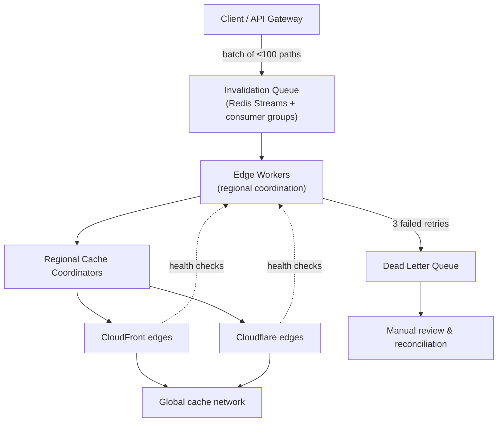

| Difficulty | Channel | Tags |
|---|---|---|
| intermediate | system-design | edge, caching, purging |

It was a Tuesday morning in June 2021, and half the internet had just vanished. Amazon, Reddit, Twitch, GitHub, Spotify, and even the UK government's homepage were suddenly serving error pages — not because of a cyberattack, but because a single customer configuration change crashed roughly 85% of Fastly's global CDN edge network [1]. The outage taught the industry an uncomfortable truth: a cache is only as trustworthy as the mechanism used to invalidate it. That's why you're here — to learn how to design a multi-region CDN cache purging system that propagates changes worldwide in under five seconds, at 10,000 invalidations per second, without blinking.

---

> ### Real-World Case — Fastly
>
> On June 8, 2021, a single valid customer configuration change triggered a dormant software bug, crashing roughly 85% of Fastly's global CDN edge network in minutes. Websites served by Fastly - including Amazon, Reddit, Twitch, GitHub, Spotify, and UK's gov.uk - suddenly returned error pages worldwide, taking down a large chunk of the internet simultaneously.
>
> | | |
> |---|---|
> | **Challenge** | Fastly's CDN propagates cache purges and configuration changes across its global edge network in near-real-time. The failure revealed that this fast-propagation fabric had a single point of failure: a customer-triggerable configuration path and a latent software bug created by a deployment 27 days earlier (May 12) that survived QA and weeks of production traffic until the exact triggering conditions appeared. |
> | **Solution** | Fastly's monitoring detected the disruption within one minute. Engineers identified and isolated the triggering customer configuration, disabled it network-wide to stop the cascading failures, and deployed a permanent fix for the latent bug the same day. The response leaned on Fastly's existing operational tooling: rapid detection, configuration kill-switch, and global rollback capability across its edge POPs. |
> | **Outcome** | 85% of Fastly's network was returning errors at peak, yet 95% of the network was operating normally within 49 minutes of detection, with full mitigation by 12:35 UTC. The outage affected millions of users across some of the world's largest websites for roughly one hour. |
> | **Lesson** | Cache invalidation and config-propagation paths are the highest-risk surface of a CDN: they're designed to act instantly and globally, so a single latent bug reachable by any customer can produce a catastrophic blast radius. Systems that must purge within seconds across regions need the inverse guarantees - staged/validated propagation, per-customer rate limiting, circuit breakers, and a fast, tested global kill switch. |

---

## Hook — It's 3am and the pager is screaming

It's 3am and your pager is screaming. A customer just changed their pricing page, and hours later the old prices are still showing in Tokyo, London, and São Paulo. You check the cache: stale. You check the purge API: pending. You check your heart rate: elevated. This is the moment every developer who has shipped a cache-aware system dreads. A CDN makes your site fast by storing copies of your content at hundreds of edge locations around the world [7] — but that superpower turns into a curse the instant you need to change something. One stale page can mean lost revenue, broken compliance, or a support inbox on fire. The stakes are simple: your cache is a trust engine, and every second of staleness is a vote against it.

## Problem — The five-second prison and 10,000 keys a second

Here's the core challenge: global cache invalidation is a distributed-systems problem wearing a CDN's clothing. To guarantee propagation within five seconds, you need to push a signal to hundreds of edge locations, and the fan-out, ordering, and failure handling all have to work at a scale most teams have never touched. The requirements make the stakes concrete — 10,000 concurrent invalidations per second, a sub-5-second global propagation SLA, and 99.99% availability, which is roughly 52 minutes of allowed downtime per year [7]. Many developers reach for the obvious lever first: "just lower the TTL." But lowering the TTL doesn't solve staleness — it merely shrinks the window, and it does so at a brutal cost, inflating origin traffic and CDN bills by re-fetching content you never needed to re-serve [8]. This leads to the real design question, the one this article answers: how do you combine aggressive TTLs, fast pattern-based purging, and background reconciliation into a single system that never lets a stale byte win?

## Real-World Case — Fastly's one-hour internet blackout

To see why invalidation design matters, look at what happened when the fragile layer underneath it gave way. On June 8, 2021, a Fastly customer made a configuration change that was perfectly valid — and it triggered a dormant software bug that crashed roughly 85% of Fastly's global edge network within minutes [1]. The blast radius was enormous: Amazon, Reddit, Twitch, GitHub, Spotify, and the UK's gov.uk all returned error pages simultaneously, taking down a large chunk of the internet for roughly an hour [1]. Here's the plot twist: the recovery was genuinely fast. Ninety-five percent of the network was operating normally within 49 minutes of detection, with full mitigation by 12:35 UTC [1]. Fastly bounced back — but for millions of users, "fast" still meant an hour of broken pages across some of the world's biggest sites. The lesson cuts deep: valid input is not safe input, and your purge pipeline is only as good as your ability to fail gracefully. If one misbehaving config can knock out 85% of a network, what does an unhandled queue backlog or a silent purge failure do to your five-second SLA? That is the uncomfortable question the rest of this article exists to answer.

## Deep Dive — A queue, a coordinator, and a two-second safety net

Building on that nightmare, the design starts with a crucial reframe: you don't purge one path at a time — you batch, queue, and fan out. The architecture has four layers: an API gateway that ingests invalidation requests, an invalidation queue built on Redis Streams with consumer groups for reliable fan-out [9], edge workers that coordinate regional purges, and the CDN providers themselves — CloudFront and Cloudflare — where eviction actually happens [4]. Now for the plot twist most developers miss: the fastest purge is the one you never send. By setting a 2-second TTL on dynamic content via Cache-Control: max-age=2, must-revalidate [2][3], you bound the worst-case staleness window before a purge ever arrives. That's the hybrid strategy in action — short TTLs as a safety net, pattern-based purging with wildcards for immediate eviction, and reconciliation to catch anything that slipped through [5][6].

The trade-offs deserve a table, because "just purge harder" is a trap:

| Strategy | Worst-case staleness | Origin load | Cost | Best for |
|---|---|---|---|---|
| TTL only | Equal to TTL | High | Low | Long-lived, immutable assets |
| Purge only | Unbounded if purge fails | Low | High per call | Rare, urgent changes |
| Hybrid (TTL + purge) | ~2 seconds | Moderate | Moderate | Dynamic content with a 5s SLA |

The numbers behind the hybrid: batching 100 invalidations per API call cuts your purge API calls by up to 90% [4], exponential backoff with three retries absorbs transient rate limits, and Redis Streams consumer groups give you at-least-once delivery [9] — which means duplicates are inevitable, so every purge handler must be idempotent [6]. And because at-least-once is the ceiling, the system finishes with a reconciliation loop that compares the queue to the edge, healing anything that fell between the cracks [5].

## Workflow — From request to global propagation in five steps

Here is the step-by-step journey a single invalidation takes, shown in the diagram below. First, a client posts a batch of up to 100 paths to the API gateway. Second, the gateway writes the batch to the Redis Streams queue, where consumer groups distribute work across edge workers [9]. Third, each edge worker fans out to its regional cache coordinator — one per cloud region, keeping cross-region traffic low. Fourth, each coordinator calls the provider APIs with pattern-based wildcards like /pricing/* to evict whole trees in one shot [4]. Fifth, successful purges are acknowledged; failures retry with exponential backoff plus jitter, and after three attempts they land in a dead letter queue for manual review [6].

Two safety mechanisms keep this from turning into the Fastly story. A circuit breaker fails fast after five consecutive failures instead of hammering a sick provider, and regional health checks constantly probe edge endpoints [4]. If a network partition splits the world, the system degrades to eventual consistency and lets the reconciliation loop catch up when connectivity returns [5]. The result is a pipeline that doesn't just purge content — it monitors itself while doing it.

## Code Example — A batch purger that survives production

Theory is cheap; production is where purges go to die. Here is the heart of the system: a Node.js batch purger that chunks invalidations into affordable API calls, retries with exponential backoff and jitter, and returns only the failures that need human eyes. The step-by-step walkthrough follows the code below.

## Lessons Learned — What a one-hour outage taught us

So what should you take from Fastly's near-death experience and apply tomorrow? Start with these battle scars. First, treat your purge pipeline like your data path — monitor it, test it, and rehearse its failures, because the month you ignore it is the month it breaks [1]. Second, batch aggressively: 100 paths per API call slashes cost and keeps rate limits at bay [4]. Third, keep TTLs short as a safety net; the best purge is the one that never needs to happen [2][8]. Fourth, make purges idempotent — at-least-once delivery guarantees duplicates, and duplicates must be harmless [6][9]. Fifth, fail fast with circuit breakers, but never lose a purge: the dead letter queue is your last line of defense. And finally, roll out configuration changes like code — canary them, watch the metrics, and keep the rollback button warm [1].

⚠️ Watch Out: purging by exact URL when your CDN serves path-based variants leaves stale ghosts behind — always use pattern-based wildcards.
💡 Insight: a 2-second TTL is not a performance compromise; it's the cheapest insurance policy in your entire architecture.
🔥 Hot Take: if your invalidation system needs humans to notice it's broken, it's already broken.
🎯 Key Point: propagation latency is a design property, not a vendor promise — you engineer it, or you inherit it.

---

## Cache Invalidation Pipeline

<strong>Original Interview Question</strong>

**Q:** How would you design a multi-region CDN cache purging system that guarantees content propagation within 5 seconds while handling 10,000 concurrent invalidations per second?

**A:** Implement Cloudflare API + AWS CloudFront with distributed invalidation queue, edge compute coordination, and 2-second TTL. Use batch invalidation, exponential backoff, and regional cache headers for 5-second SLA.

## Conclusion

The June 8, 2021 outage wasn't caused by cache purging — it was a configuration change that took down a cache [1]. But that distinction is exactly the point: the layer that makes your site fast is one misstep away from making it disappear. The journey went from a 3am pager, to a one-hour internet blackout, to a queue, coordinators, and a 2-second safety net that turns a five-second SLA into something you can actually defend. Tomorrow, audit your own flow: How fast does a purge reach your farthest edge? What happens when a provider rate-limits you mid-fan-out? Where do your failed purges go to be forgotten? Answer those three questions, and you'll have done more for your users than most CDN dashboards ever will. Now go find your stale cache before your customers do.

---

## References

1. [Fastly incident report](https://www.fastly.com/blog/summary-of-june-8-outage) — article
2. [MDN Web Docs: HTTP caching](https://developer.mozilla.org/en-US/docs/Web/HTTP/Caching) — documentation
3. [MDN Web Docs: Cache-Control header](https://developer.mozilla.org/en-US/docs/Web/HTTP/Headers/Cache-Control) — documentation
4. [AWS CloudFront: Invalidating files](https://docs.aws.amazon.com/AmazonCloudFront/latest/DeveloperGuide/Invalidation.html) — documentation
5. [RFC 9111: HTTP Caching](https://datatracker.ietf.org/doc/html/rfc9111) — paper
6. [Wikipedia: Cache invalidation](https://en.wikipedia.org/wiki/Cache_invalidation) — documentation
7. [Wikipedia: Content delivery network](https://en.wikipedia.org/wiki/Content_delivery_network) — documentation
8. [DigitalOcean: An Introduction to Caching and Caching Strategies](https://www.digitalocean.com/community/tutorials/introduction-to-caching-and-caching-strategies) — blog
9. [Wikipedia: Redis](https://en.wikipedia.org/wiki/Redis) — documentation

---

**Author:** Satishkumar Dhule — [GitHub](https://github.com/satishkumar-dhule) · [LinkedIn](https://linkedin.com/in/satishkumar-dhule) · [Website](https://satishkumar-dhule.github.io)
