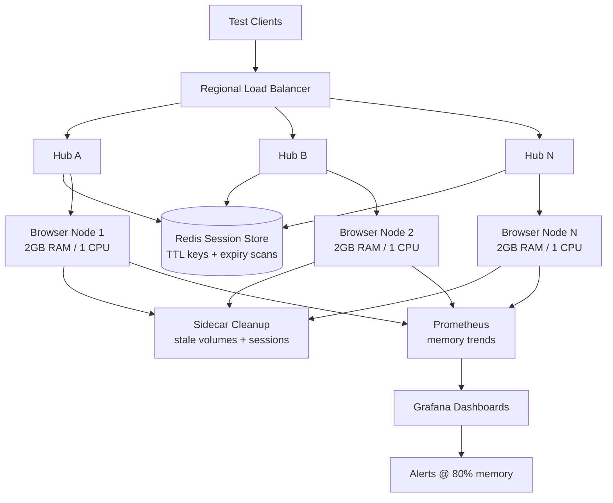

| Difficulty | Channel | Tags |
|---|---|---|
| advanced | system-design | selenium, webdriver, grid |

Expedia Group quietly ran one of the largest Selenium Grid fleets on the planet: 90–100+ hubs on AWS churning through 140,000–150,000 UI automation tests every single day across hundreds of micro-frontend teams [1]. And still, they hit a wall — provisioning a new EC2 node took 2–4 minutes, hubs had to be manually stopped and started just to control cloud spend, and per-branch test runs were a pipe dream. So when someone asks how to design a grid that handles 10,000 concurrent sessions with 99.9% uptime and zero memory leaks, the real answer starts with what Expedia learned the hard way [1]. This is that journey — and the playbook your team can steal from it.

---

> ### Real-World Case — Expedia Group
>
> Expedia ran one of the world's largest internal Selenium Grid fleets: 90-100+ hubs on AWS executing 140,000-150,000 UI automation tests every day across hundreds of micro-frontend teams. Scaling up a pure EC2 grid took 2-4 minutes to provision nodes, hub instances had to be manually stopped/started to save cost, and per-branch test runs were infeasible.
>
> | | |
> |---|---|
> | **Challenge** | Expedia needed a Selenium Grid that could spin up thousands of browser nodes on demand, terminate them the instant a run finished, keep per-branch (pre-merge) grids isolated from each other, work across multiple AWS accounts, and slash cloud cost - all while keeping the feedback loop down to the time of the slowest test. |
> | **Solution** | They built 'Distributed Automation' (DA) on SeleniumGridScaler (open-sourced Selenium Grid + EC2 API) which auto-scaled nodes to the requested thread count and terminated them at billing-cycle boundaries, then migrated to DA-Kube: containerized Selenium Grid on EKS using Helm charts, Docker images, and a Traefik ingress that routed each branch to its own hub via per-hub DNS (hub.test.expedia.com). One c5.xlarge ran 15 parallel browser sessions; nodes were torn down when idle so they only paid for usage, including spot instances. |
> | **Outcome** | The fleet created, used, and destroyed ~4,500+ EC2 nodes on demand daily, letting Expedia run 1,000 UI tests in 5 minutes and 150,000+ tests/day. The cost angle was the stunner: a third-party cross-browser vendor for 1,000 parallel connections would cost ~$2.41 million/year, while the internal DA system ran for about $80,000/year. They also hit an unexpected Kubernetes pitfall - EKS allocated ~30 private IPs per instance when only ~10 browser pods could fit, causing VPC-wide IP address exhaustion - fixed by constraining per-instance ENI/IP allocation. |
> | **Lesson** | For browser-farm infrastructure, 'pay only for what you use' with ephemeral auto-scaling nodes is the single biggest lever: it turns a $2.4M/yr licensing problem into an ~$80K/yr internal platform. But containerizing Selenium Grid at scale surfaces non-obvious coupling - Kubernetes over-provisions IPs per node relative to pod capacity, so capacity planning must account for ENI limits, not just CPU/memory. |

---

## Hook — The Pager Goes Off at 3 a.m. and the Grid Is Leaking Memory

Picture this: it's 3 a.m., a pager wakes you up, and the message reads "GRID NODE OOM: 12 pods restarted in the last hour." The night run — 50,000 tests that finance, marketing, and checkout all depend on — is silently failing. Sound familiar? This is the moment every test-infrastructure engineer dreads, and it happens more often than you'd think. Selenium Grid seems simple on paper: a hub, some browser nodes, a queue. But at scale, it becomes a memory-leak machine — orphaned browser processes, abandoned WebDriver sessions that never call quit(), hubs that become single points of failure. The stakes are brutal: every leaked session eats RAM, every restart eats time, and a slow grid quietly delays releases for hundreds of developers. Here's the plot twist though — the fix has almost nothing to do with Selenium itself, and everything to do with treating your grid like the distributed system it secretly is.

## Problem — Why Selenium Grids Fall Over at Scale

Every Selenium Grid starts small. One hub, five nodes, everyone happy. Then a second team adopts it, then a third, then the CI pipeline starts spinning up per-branch environments. Suddenly you have 1,000 parallel sessions and the grid is gasping. Many developers discover the hard way that the naive architecture — a fat hub talking to a fleet of bare-metal or EC2 nodes — collapses under three compounding pressures. First, memory: each browser session holds a JVM, a Chrome process, and cached state; sessions that crash without cleanup leave tombstones that never free heap. Second, scale: adding nodes takes minutes of manual provisioning, so your grid can't keep up with the CI spike. Third, isolation: one hung node can stall the whole queue because the hub keeps routing sessions into a black hole. The result is a death spiral — the grid slows, tests fail with ambiguous timeouts, teams lose trust, and the "quick fix" is throwing more EC2 instances at it. You might think that works. It does — until the monthly cloud bill arrives and someone asks who approved 400 nodes of Chrome browsers. But wait: it gets worse, because the cost problem has a name, and it's quantified in a war story that should make every QA lead sit up straight.

## Real-World Case — Expedia Group's 150,000-Test-a-Day Fleet

Expedia Group built one of the largest internal Selenium Grid fleets ever documented: 90–100+ hubs on AWS executing 140,000–150,000 UI automation tests every day across hundreds of micro-frontend teams [1]. Their "Distributed Automation" system created, used, and destroyed roughly 4,500+ EC2 nodes on demand every day, letting teams run 1,000 UI tests in 5 minutes [1]. But here's the number that should make you whistle: a third-party cross-browser vendor charging for 1,000 parallel connections would cost about $2.41 million a year — while Expedia's internal Kubernetes-based system ran for roughly $80,000 per year [1]. That's a 30x gap, and it's exactly why teams keep building their own grids despite the pain. The story also contains a plot twist every Kubernetes operator should memorize. Expedia's EKS cluster hit a nasty edge case: EKS allocated ~30 private IPs per instance — but only ~10 browser pods could actually fit on each node [9]. The result was VPC-wide IP address exhaustion, effectively starving the entire network, not just the test fleet. The fix was constraining per-instance ENI/IP allocation so nodes stop burning through the VPC's address space [1]. This is the moment the real lesson crystallizes: a grid that runs at Expedia's scale isn't a Selenium problem anymore — it's a distributed-systems problem wearing a test-framework costume.

## Deep Dive — The Anatomy of a 10,000-Session Grid

Building on Expedia's experience, the architecture that survives 10,000 concurrent sessions has five interlocking layers, and each one exists to kill a specific failure mode. First, the hub-node pattern moves onto Kubernetes, with browser nodes managed as StatefulSets across multiple availability zones [2] — stateful because each browser pod needs a stable identity, and across zones so one data-center outage can't take down the run. Second, the session store becomes Redis, where every session key carries a TTL so abandoned sessions expire themselves instead of leaking forever [8]. Third, resource allocation is enforced with per-pod CPU and memory limits — think 1 CPU and 2GB RAM per browser node — and the grid auto-scales on queue depth, not on guesswork [3]. Do the math and the numbers become vivid: 10,000 sessions at 50 sessions per node means a baseline of 200 nodes; at 2GB each that's 400GB, plus a 30% safety buffer for GC spikes and headroom, landing around 520GB of cluster memory. Fourth, health checks run every 10 seconds against each node's /status endpoint, and three consecutive failures eject the node from rotation immediately — with circuit breakers in the Hystrix pattern isolating a flaky node for 30-second recovery windows so a single bad box can't poison the queue [6]. Fifth, memory is treated as an enemy to be hunted: alerting at 80% memory usage, weekly rolling restarts to reclaim heap, and a sidecar that sweeps stale Docker volumes while Redis key-expiration scans purge dead sessions every 5 minutes. The tradeoff table tells the whole story:

## Workflow — From Test Commit to 10,000 Green Tests in Five Steps

However, an architecture is only a picture until you have a workflow that runs it. Here's the step-by-step path, following the flow in the diagram below: First, deploy the grid: hubs as Deployments behind a regional load balancer, browser nodes as StatefulSets — each node pod carries resource requests/limits so Kubernetes schedules it properly [2]. Second, wire the session store: connect hubs to the Redis cluster with TTL policies and connection pooling, so session keys expire and pool connections get reused instead of recreated [8]. Third, make the grid self-healing: point liveness probes at /status every 10 seconds, and add readiness gates so a node that fails three consecutive probes is dropped from routing while a circuit breaker keeps it isolated during its 30-second recovery window [6]. Fourth, make it elastic: attach a HorizontalPodAutoscaler that watches grid queue depth and scales nodes up and down, while the cluster autoscaler provisions or reclaims EC2 instances underneath [3]. Fifth, ship without fear: roll new browser image versions via canary deployments with traffic splitting, guard capacity with Pod Disruption Budgets that keep at least 85% of nodes available during maintenance [5], and keep Prometheus + Grafana dashboards as the single source of truth for memory trends and session duration [10]. The diagram below ties the whole story together — it's the same shape Expedia's fleet settled into after their IP-exhaustion scare [1].

## Code Example — A Session Lifecycle Manager That Can't Leak

Everything so far — TTLs, sidecars, circuit breakers — is defense at the infrastructure layer. But the cheapest fix lives in the test code itself: guaranteeing every session gets released. The pattern below is the one your team should standardize on, because it makes the browser session impossible to leak:

## Lessons Learned — Battle Scars From the Grid

After all this, the takeaways distill down to five hard-won rules, each paid for by somebody's outage. First, treat the grid like a database: every session needs a TTL, every connection needs pooling, and every failure needs a retry story [8]. Second, alert before the OOM killer: a 80% memory threshold with weekly rolling restarts will save you more 3 a.m. pages than any heroic debugging session ever will. Third, never let one node hold the queue hostage: health checks every 10 seconds, three strikes and you're out, and a 30-second circuit-breaker isolation window keep the blast radius tiny [6]. Fourth, budget your IP space: Expedia's ~30-IPs-per-node surprise shows that Kubernetes magic numbers can exhaust an entire VPC — constrain per-instance ENI/IP allocation before it bites you [1][9]. Fifth, and most importantly, protect capacity during change: Pod Disruption Budgets holding 85% minimum availability and canary deployments with traffic splitting mean upgrades no longer mean downtime [4][5]. The 30x cost gap between Expedia's $80k/year grid and a $2.41M/year vendor license isn't an argument against vendors — it's a reminder that at scale, your test infrastructure is a production system that deserves the same engineering rigor as the service it's testing [1].

---

## Selenium Grid Architecture — Session Lifecycle and Monitoring Flow

<strong>Original Interview Question</strong>

**Q:** Design a scalable Selenium Grid architecture to handle 10,000 concurrent test sessions with 99.9% uptime, ensuring zero memory leaks through automatic session lifecycle management, real-time monitoring, and graceful node failure recovery across multiple data centers?

**A:** Deploy Kubernetes cluster with auto-scaling node pools, Redis session store with TTL policies, Prometheus metrics for memory monitoring, circuit breakers for node isolation, and sidecar containers for session cleanup. Implement health checks, resource quotas, and rolling updates.

## Conclusion

Expedia's grid is proof that the "impossible" scale — 150,000 tests a day, 4,500 nodes churned per day, at a 30x lower cost than vendor alternatives [1] — is reachable when you stop treating test infrastructure as a side quest. The moral is simple: design for leaks, isolation, and elastic capacity from day one, because the grid is a production system wearing a testing costume. Tomorrow, do three things: wrap every Selenium session in a context manager so quit() is guaranteed, put a TTL on every session key, and add an 80%-memory alert before the OOM killer beats you to it. The one insight to carry back to your team: at 10,000 concurrent sessions, memory is not a resource — it's a liability, and the team that manages its lifecycle controls the grid.

---

## References

1. [Expedia Group incident report](https://medium.com/expedia-group-tech/da-kube-selenium-grid-using-kubernetes-docker-helm-and-traefik-856b802d1d08) — article
2. [Kubernetes StatefulSets documentation](https://kubernetes.io/docs/concepts/workloads/controllers/statefulset/) — documentation
3. [Kubernetes HorizontalPodAutoscaler documentation](https://kubernetes.io/docs/tasks/run-application/horizontal-pod-autoscale/) — documentation
4. [Kubernetes Deployment rolling update documentation](https://kubernetes.io/docs/concepts/workloads/controllers/deployment/) — documentation
5. [Kubernetes Pod Disruption Budgets documentation](https://kubernetes.io/docs/tasks/run-application/configure-pdb/) — documentation
6. [Circuit breaker design pattern on Wikipedia](https://en.wikipedia.org/wiki/Circuit_breaker_design_pattern) — documentation
7. [Raft consensus algorithm on Wikipedia](https://en.wikipedia.org/wiki/Raft_(algorithm)) — documentation
8. [Redis source code on GitHub](https://github.com/redis/redis) — documentation
9. [Amazon EKS getting started documentation](https://docs.aws.amazon.com/eks/latest/userguide/getting-started.html) — documentation
10. [SeleniumHQ Selenium Grid on GitHub](https://github.com/SeleniumHQ/selenium) — documentation

---

**Author:** Satishkumar Dhule — [GitHub](https://github.com/satishkumar-dhule) · [LinkedIn](https://linkedin.com/in/satishkumar-dhule) · [Website](https://satishkumar-dhule.github.io)
