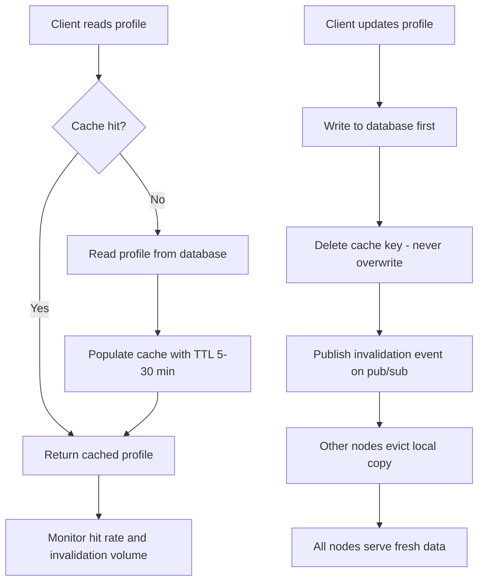

| Difficulty | Channel | Tags |
|---|---|---|
| beginner | backend | redis, memcached, cache-invalidation |

Meta runs TAO, one of the largest distributed caches in the world, storing the social graph and serving over a quadrillion queries per day [1]. Yet even at that scale, a single inconsistent replica once split a user's incoming messages across two regions — and neither one held the complete picture. That silent failure took Meta from 99.9999% to 99.99999999% cache consistency and revealed a lesson every developer building a profile service needs to hear: caching is only as trustworthy as its invalidation [1]. This is the story of that journey, and the blueprint you can steal for your own cache.

---

> ### Real-World Case — Meta (Facebook)
>
> Meta operates TAO, one of the largest distributed caches in the world, storing the social graph (including user profiles and message-routing metadata) and serving over a quadrillion queries per day. Stale cache entries were not just a latency annoyance — a single inconsistent TAO replica after a user-region reshuffle split Alice's incoming messages across two regions, neither of which held a complete copy.
>
> | | |
> |---|---|
> | **Challenge** | Cache invalidation at planetary scale: racing cache-fill and invalidation events, eviction of version metadata needed for conflict resolution, and near-zero ability to log every cache state change (at a 99% hit rate, >10 trillion cache fills per day). One subtle bug — an error handler that dropped cache entries only if their version was older — left stale metadata in cache indefinitely, which was impossible to reproduce or even reason about without full state timelines. |
> | **Solution** | Meta built Polaris, a generic consistency-measurement service that acts as a cache client, replays invalidation events, and verifies client-observable invariants across all cache replicas at multiple timescales (1/5/10 minutes). Combined with a stateful tracing library that logs cache mutations only inside the critical 'purple window' where invalidations race with fills, they could pinpoint the exact code path behind any inconsistency. |
> | **Outcome** | TAO cache consistency improved from 99.9999% (six nines) to 99.99999999% (ten nines) at the five-minute timescale — fewer than 1 in 10 billion cache writes remain inconsistent. The first real bug found with consistency tracing took on-call engineers less than 30 minutes to locate, a root-cause hunt that previously would have taken weeks or been impossible. |
> | **Lesson** | TTL alone isn't cache invalidation — active invalidation (delete/versioned keys on update, or pub/sub) is required, and you must be able to observe and trace consistency, not just hope for it. Even a correct-looking versioned invalidation protocol can hide a rare, 'impossible' bug in error-handling paths, and consistency measurement is what makes those bugs findable. |

---

## Hook — The Quadrillion-Query Wake-Up Call

Meta operates TAO, one of the largest distributed caches in existence — the system that stores the social graph for billions of people, from user profiles to message-routing metadata, answering more than a quadrillion queries every single day [1]. At that scale, a single inconsistent cache replica did something quietly catastrophic: after a user-region reshuffle, one user's incoming messages split across two regions, and neither region held a complete copy. No outage banner. No pager storm. Just messages silently landing in the wrong place while everything looked perfectly healthy. This is the real enemy of every cache — not latency, but stale data served with confidence. Fixing it took Meta from six nines to ten nines of cache consistency, and every lesson from that battle applies directly to your humble profile service [1]. Sound familiar? By the end of this journey, you will never treat a cache.delete() call as an afterthought again.

## Problem — Caching Feels Easy Until It Isn't

Here is the trap: caching is the easiest thing in the world to add and one of the hardest things to keep correct. Many developers discover this the hard way. Day one, you wrap a slow database query in a cache and latency drops from 40ms to 1ms — instant hero status. Day thirty, a user updates their profile, the cache still returns yesterday's bio, and your support queue fills with "why does my profile still show my old job title?" [6]. The root cause is that reads and writes move at different speeds and disagree about who owns the truth. Every caching strategy is really an answer to one question: when a write happens, what do you do with the stale copy? Get that answer wrong and you don't just get slow pages — you get wrong data delivered with total confidence. Consequently, the stakes are higher than most developers assume: wrong data is always worse than slow data, because slow data gets fixed by a timeout, while wrong data gets trusted. The tension builds from here, because the fix is not a single tool — it's a pattern, a timing strategy, and an engine choice all working together.

## Real-World Case — Meta (Facebook)

TAO is the backbone of Meta's social graph — profiles, friendships, message-routing metadata — and it serves more than a quadrillion queries per day [1]. In 2022, Meta engineers shipped a system to trace and audit cache consistency at scale. Their findings were humbling. TAO was already running at 99.9999% consistency, which sounds flawless. Six nines! But at that query volume, the remaining sliver meant millions of stale reads per day. Worse, the failure mode wasn't a latency spike — it was silent divergence. One inconsistent TAO replica, created during a user-region reshuffle, split a user's incoming messages across two regions, each holding only part of the conversation. The fix was measurement-first: every cache write became traceable, every replica auditable, every stale read catchable. Consistency jumped from six nines to 99.99999999% — ten nines — meaning fewer than 1 in 10 billion cache writes remain inconsistent [1]. And here is the plot twist: the first real bug surfaced by this tracing took on-call engineers under 30 minutes to locate. The same root-cause hunt would previously have taken weeks — or been impossible entirely [1]. The lesson scales down beautifully: consistency isn't a feeling, it's a number you can measure, and the measurement itself is what saves you.

## Deep Dive — Write-Through, TTLs, and the Redis vs Memcached Choice

Building on Meta's story, let's zoom into the mechanics you actually control in your own service: the invalidation pattern and the cache engine. The classic interview answer gets the headline right — write-through caching with TTL-based expiration is the sensible default for user profiles — but the interesting part is the why, plus the plot twist hiding in the details.

First, the pattern. Most read paths use cache-aside: check the cache, fall back to the database on a miss [6]. That's fine for reads. The danger zone is the write path. If you update the database and then overwrite the cache value, you open a race window: a concurrent reader can re-populate the cache with the stale value between your database write and your cache write. Deleting the key instead of overwriting it closes that window — the next read is a guaranteed miss that rebuilds from fresh data. That's why invalidation beats updating.

Second, the TTL. A TTL is a safety net, not your primary strategy. Set it too short (30 seconds) and you hammer the database; too long (an hour) and stale data lingers. For profiles, 5 to 30 minutes is the sweet spot — long enough for hit rates to shine, short enough that even a missed invalidation heals on its own.

Third, the engine choice. Redis and Memcached look identical from the client — both are in-memory key-value stores [5][7]. The real difference is what happens when invalidation must travel across machines [4]:

## Workflow — The Six-Step Write-Through Invalidation Flow

So, given everything so far, what does a battle-tested profile update actually look like end to end? The pattern breaks down into six steps, and the diagram below tells the whole story at a glance — think of it as the flowchart your future on-call self will thank you for.

1. **Read path**: check the cache; on a hit, return instantly.
2. **Read miss**: fetch from the database and populate the cache with a TTL.
3. **Write path**: write to the database first — it stays the source of truth.
4. **Delete the cache key** — never overwrite it; deletion closes the stale re-population race.
5. **Publish an invalidation event** on Redis pub/sub so every other node evicts its copy too [3].
6. **Let the TTL be the backstop** for anything you missed, and monitor hit rate plus invalidation volume.

Every step exists for a reason. Step 3 protects against data loss; step 4 closes the stampede window; step 5 is the distributed piece that Memcached would leave to you to build by hand; and step 6 is the humility layer — your cache will be wrong eventually, and a TTL means it heals even if nobody notices [1][6]. This is the same philosophy Meta applied at a quadrillion-query scale: trace the write, invalidate everywhere, and never trust a cache that can't prove it's fresh.

## Code Example — Write-Through Invalidation in Python with Redis

Enough theory — here is the write-through implementation in Python using redis-py. This is the exact pattern you would ship in a profile service, with every decision annotated inline: delete instead of overwrite, TTL as a safety net, and pub/sub to push invalidation to every node in the cluster [3].

## Lessons Learned — Five Takeaways From Six Nines to Ten Nines

So what do you take back to your codebase tomorrow? First, treat invalidation as a first-class feature, not a cleanup chore. Second, delete keys — don't overwrite them; it closes a race that will eventually bite you. Third, always set a TTL; it's your self-healing backstop, and 5 to 30 minutes works for profiles. Fourth, when your cache spans machines, choose an engine whose invalidation story matches your needs: Redis pub/sub gives you distributed eviction for free [3], while Memcached buys you a leaner cache but hands you all the coordination work [4][5]. Fifth — and this is the one that keeps on-call teams sane — measure. Meta didn't fix TAO by praying; they fixed it by tracing every write and holding consistency to ten nines [1]. The 30-minute root-cause story is the proof: visibility is the difference between a week-long mystery and a half-hour fix.

⚠️ **Watch Out**: the sneakiest bug pattern is the overwrite race — a concurrent reader repopulating stale data between your DB write and your cache write. Deleting the key sidesteps it entirely.

💡 **Insight**: a TTL is not a license to be sloppy with invalidation — it's the insurance policy for when your invalidation is wrong anyway.

🔥 **Hot Take**: if your cache returns data that diverges from the database, you don't have a caching problem — you have a correctness problem wearing a performance costume.

The memorable insight to share with your team? A stale cache doesn't just serve old data — it serves confidently wrong data, and in the worst case it splits your users' reality across regions. Six nines sounded perfect until it wasn't [1].

---

## Write-Through Cache Invalidation Flow

<strong>Original Interview Question</strong>

**Q:** You're building a user profile service that caches frequently accessed profiles. How would you implement cache invalidation when a user updates their profile, and what trade-offs would you consider between Redis and Memcached?

**A:** Implement write-through caching with TTL-based expiration. On profile update, invalidate the cache by deleting the key and writing new data to both the database and cache. Redis offers pub/sub for automatic distributed invalidation, while Memcached requires manual coordination across nodes.

## Conclusion

The journey started with a quadrillion queries a day and a user whose messages split across two regions, and it ends with a lesson that fits in one line: a cache is only as trustworthy as its invalidation [1]. You now hold the full blueprint — the write-through pattern, the delete-not-overwrite rule, the 5-to-30-minute TTL safety net, and the Redis versus Memcached trade-off table [4]. So tomorrow, when you add a cache to your next service, don't just ask how fast the hit path is. Ask what happens on a write. Because that answer, as Meta proved, is the difference between six nines and ten nines — and between your users' data being whole, or silently split across the world.

---

## References

1. [Meta (Facebook) incident report](https://engineering.fb.com/2022/06/08/core-infra/cache-made-consistent/) — blog
2. [Redis documentation](https://redis.io/docs/latest/develop/) — documentation
3. [Redis Pub/Sub documentation](https://redis.io/docs/latest/develop/interact/pubsub/) — documentation
4. [AWS ElastiCache — Redis vs Memcached](https://aws.amazon.com/elasticache/redis-vs-memcached/) — documentation
5. [Memcached GitHub repository](https://github.com/memcached/memcached) — documentation
6. [Cache (computing) — Wikipedia](https://en.wikipedia.org/wiki/Cache_(computing)) — documentation
7. [Memcached — Wikipedia](https://en.wikipedia.org/wiki/Memcached) — documentation
8. [Publish–subscribe pattern — Wikipedia](https://en.wikipedia.org/wiki/Pub%E2%80%93sub) — documentation
9. [CAP theorem — Wikipedia](https://en.wikipedia.org/wiki/CAP_theorem) — documentation

---

**Author:** Satishkumar Dhule — [GitHub](https://github.com/satishkumar-dhule) · [LinkedIn](https://linkedin.com/in/satishkumar-dhule) · [Website](https://satishkumar-dhule.github.io)
