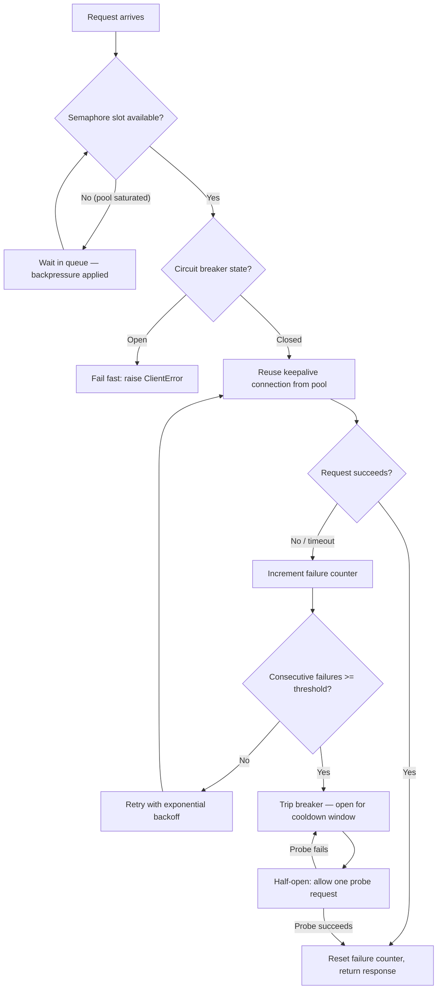

| Difficulty | Channel | Tags |
|---|---|---|
| advanced | backend | asyncio, aiohttp, concurrency |

By 2011, Netflix's API was already an absolute monster — a billion requests a day, spiking to 20,000 per second at peak. Yet a single internal service that merely got slow, not even failed, could saturate the entire API's thread pools in seconds and cascade the slowdown across the whole system, stalling streaming for millions of viewers [1]. The kicker? Netflix's engineers hadn't built any of that fragility on purpose. It emerged from one of the most successful architectural migrations in tech history, and it is exactly the kind of failure waiting for your Python service too. Before you ship another aiohttp endpoint, you need to know how they escaped the trap — because the tools are sitting in your standard library.

---

> ### Real-World Case — Netflix
>
> By 2011-2012, Netflix was migrating to a microservices architecture where a single video-play request fanned out into dozens of internal service calls (recommendations, licensing, billing, encoding). Any one service that got slow — not even failed — could saturate the API's thread pools in seconds and cascade the slowdown across the entire system, taking down streaming for millions of users. Their API alone handled 1 billion requests/day and 20,000 req/s at peak, leaving zero room for a single bad dependency to bring the whole thing down.
>
> | | |
> |---|---|
> | **Challenge** | How to prevent a slow or failing downstream dependency from exhausting shared connection/thread resources and causing cascading failures — while still serving users through the outage with graceful degradation instead of hard errors. |
> | **Solution** | Netflix built Hystrix, which is exactly the connection-pool-manager pattern in the answer: every downstream call was wrapped in a command isolated by a semaphore or a bounded thread pool (bulkhead) limiting concurrency; a circuit breaker opened when the error rate exceeded ~50% over a rolling 10-second window, causing fail-fast short-circuiting; a sleep window (~5s) enabled half-open probe requests for recovery; and fallbacks returned cached or degraded data so users got a functional response. They also added a real-time dashboard and Latency Monkey tests to verify the circuit breakers under controlled chaos. |
> | **Outcome** | Hystrix grew to process tens of billions of thread-isolated and hundreds of billions of semaphore-isolated command executions per day at Netflix, with a 'dramatic improvement in uptime and resilience.' In documented production incidents, a single circuit spiking to high latency tripped breakers on ~1/3 of the cluster while the other dependencies stayed healthy — users received degraded-but-functional responses (no increase in 500s) instead of a full outage. |
> | **Lesson** | The key insight is that a connection pool manager's real job is containment: semaphore/thread-pool bulkheading plus a circuit breaker lets you fail fast and shed load, so one dying dependency burns only its own budget instead of the caller's. A plot twist the team learned: fallbacks themselves are a failure mode — silently returning cached data can mask a high error rate, so fallback firing rate must be monitored as a first-class alert. |

---

## Hook — The 3 a.m. page that proves one slow service can sink a fleet

It's 3 a.m. and your phone is doing the emergency glow. Your team's API is slow — not down, just slow — and the ticket queue is already filling with 'my request times out' reports. You check the logs and find something confusing: your upstream dependency never returned an error. It just took 12 seconds instead of 40 milliseconds, and somewhere along the way your entire service stopped handling the traffic it was handling fine an hour ago. Sound familiar? Here is the thing: this isn't a network problem. It's a design problem. Every time your service calls another service, you're not just making a request — you're lending out one of your precious concurrent slots, and if the borrower doesn't come back on time, you don't get it back at all. The question is what you do with a finite resource while the rest of the world is slow.

## Problem — Why a 'working' aiohttp client quietly becomes a bottleneck

Here is the uncomfortable truth about aiohttp: it makes the naive thing look exactly like the right thing. A fresh ClientSession with default limits, no timeouts, and no retry logic works flawlessly in tutorials and localhost demos, which is precisely why it betrays you in production [4]. Consider what happens at load. Every in-flight request holds a connection from your pool, and every connection holds memory, a socket, and — in a synchronous worker model — a thread. Set no pool limit and you will happily spin up hundreds of connections against a dependency that can only serve ten; set too-aggressive a timeout and you will kill perfectly good slow-but-healthy requests; set none at all and a hung dependency parks your connections indefinitely [6]. The result looks like a network outage, but it's an architectural one: your pool exhausts, new requests queue, queued requests time out, timed-out clients retry, and retries pile more load onto a system already at its knees. Many developers discover this only after the 500s start, because in async Python the failure is always one layer removed from where you were looking. The good news? Every layer of that cascade has a name, and every name has a fix.

## Real-World Case — When Netflix's own services ate their lunch

To see the stakes spelled out in production at staggering scale, look at Netflix during its microservices migration in 2011–2012. A single video-play request fanned out into dozens of internal service calls — recommendations, licensing, billing, encoding — and the API layer sat on top of that fan-out like a funnel [1]. The API alone handled 1 billion requests per day at 20,000 req/s peak, so there was zero slack for a single slow dependency. When one service slowed down — remember, not failed — it saturated the API's thread pools in seconds, and the slowdown cascaded outward until streaming degraded for millions of users. Netflix's response was a library called Hystrix, built around three ideas you will recognize: thread isolation, semaphore isolation, and circuit breakers [7]. The impact was dramatic. Hystrix grew to process tens of billions of thread-isolated and hundreds of billions of semaphore-isolated command executions per day, and Netflix reported a dramatic improvement in uptime and resilience [1]. In documented production incidents, one circuit spiking to high latency would trip breakers on roughly a third of the cluster while the other dependencies stayed healthy — users received degraded-but-functional responses with no increase in 500s instead of a full outage [1]. That's the transformation this whole article is about: not preventing failures, but containing them.

## Deep Dive — The four tools that keep a pool alive when everything else isn't

Building on that, the resilience toolbox for an aiohttp connection pool has exactly four tools, and they map one-to-one onto the cascade you just read about. The first is a semaphore, a simple counter that caps how many requests may be in flight at once — it is the semaphore isolation Netflix used for command executions, and in Python it ships in the standard library [5]. The second is exponential backoff, which turns retries from a weapon against your own system into a strategy that lets a struggling dependency breathe: wait 1s, then 2s, then 4s, capping at a ceiling, instead of hammering [3]. The third is the circuit breaker, and it's the counterintuitive one. You might think retrying harder is the way to recover, but the opposite is true: once a dependency crosses a failure threshold, the fastest way to heal is to stop calling it for a while [2]. That's the whole plot twist — deliberately failing fast is a feature, not a bug. The fourth tool is backpressure, the queue that forms when the semaphore is exhausted; it is your pool saying 'not now' instead of 'maybe forever.' The real tradeoffs come down to which mode the breaker is in, and each mode exists to prevent a specific failure:

| Circuit state | Behavior | What it prevents |
| --- | --- | --- |
| Closed | Requests flow, failure counter at zero | Nothing — normal operation |
| Open | Fail fast in milliseconds, zero dependency traffic | Cascade failures from a dead or slow dependency |
| Half-open | Allow exactly one probe request through | Permanent shutdown after a transient hiccup |

The pitfalls are just as instructive as the tools. Connection leaks are the classic: a session that's never closed, a socket held open past its usefulness. SSL context validation gets disabled 'temporarily' and never re-enabled. Timeouts are configured as an afterthought. There is no cleanup path on shutdown, so a graceful deploy leaves dangling sockets. And errors propagate poorly through the async stack, swallowed into anonymous logs [6]. Every one of these shows up in the code below.

## Workflow — Trace a request through the resilience pipeline

So what does the journey from request to response actually look like once all four tools are wired together? Follow the request through the diagram below: the flow starts at the semaphore gate, moves through the circuit breaker check, and only then touches a real connection [5]. If the pool is saturated, the request waits in the queue rather than piling onto the dependency. If the breaker is open, the request fails immediately — in milliseconds, with zero dependency traffic. If the request reaches the wire and succeeds, the failure counter resets, because success is the strongest health signal you have. If it fails or times out, the counter increments and the request retries with exponential backoff [3]. Cross the threshold and the breaker opens for a cooldown window, then slides into half-open, allowing exactly one probe through to test whether the dependency recovered. That single probe is the heartbeat of the whole system: one success and everything resets; one failure and the cooldown restarts [2]. The connections themselves are kept warm with keepalive, so when traffic returns you're reusing an established socket instead of paying for a full TCP handshake and TLS negotiation on every request [9]. Under the hood this is precisely how the best async clients behave — and here is the key: your custom pool doesn't need to reimplement the wheel for aiohttp, but it does need to own the parts the library deliberately leaves to you, which is every state in that diagram [4].

## Code Example — Building the pool manager in 60 lines of Python

Now for the part you came here for. Below is a complete, runnable connection pool manager that puts every concept from this article into one class: a semaphore cap, exponential backoff, a circuit breaker with a half-open probe, and a graceful shutdown path. The design is deliberately small because the value is in the decisions, not the volume: one shared session for connection reuse, a distinct connect timeout versus total timeout, and a breaker that resets on the first success. Read the code, then walk through the explanation to see why each line exists — especially the parts that look redundant, because those are usually the ones saving you at 3 a.m.

## Lessons Learned — The battle scars and what to do differently tomorrow

Stepping back, here are the battle scars worth remembering. First, the code you write is not the failure point — the dependency is. Design for the dependency's worst day, not its best. Second, timeouts are a contract with your own users: a 30-second total timeout that includes connection, DNS, and read time is very different from a 5-second connect timeout, and mixing them up is how 'timeouts' turn into 'outages' [6]. Third, a circuit breaker is not a retry mechanism — it's a shutdown mechanism, and the two must never share state, or your breaker will melt under the very load it is supposed to stop [2]. Fourth, connection hygiene is non-negotiable: one shared session, explicit limits, and a close on shutdown, or you're the developer leaking sockets in production [4]. Fifth, always add a half-open probe. The single most common production mistake is a breaker that trips and stays tripped because nothing ever tests whether the dependency recovered. If this feels like a lot, you're not alone — Netflix spent years building exactly this, and their Hystrix source is a better teacher than any blog post [7]. But you can start smaller. Pick one dependency, add a semaphore, add a timeout, and instrument it. Then add the breaker. Then watch the failure mode you used to fight at 3 a.m. turn into a five-line log line at 3 p.m.

---

## Request Flow Through the Resilient Connection Pool

<strong>Original Interview Question</strong>

**Q:** How would you implement a connection pool manager for aiohttp that handles graceful degradation under high load and connection timeouts?

**A:** Implement a connection pool manager for aiohttp using a semaphore to limit concurrent connections, exponential backoff for retrying failed requests, and circuit breaker pattern to gracefully degrade under high load and connection timeouts.

## Conclusion

The takeaway from Netflix's near-death-by-thread-pool is deceptively simple: your service is only as healthy as its slowest dependency, and resilience isn't about preventing failures — it's about containing them [1]. The semaphore, the backoff, the breaker, and the queue are the same four tools that kept a billion-requests-a-day API standing, and they are all reachable from your standard library and aiohttp's session object. So do this tomorrow: go find the one upstream call your service can't live without, and decide what happens when it's slow instead of down. Add a timeout and a limit first. Watch what breaks. Then add the circuit breaker and let the half-open probe do the healing. Your future self — the one who used to be woken up by the 3 a.m. pager — will never want to go back.

---

## References

1. [Netflix incident report](https://netflixtechblog.com/introducing-hystrix-for-resilience-engineering-13531c1ab362) — blog
2. [Circuit breaker design pattern](https://en.wikipedia.org/wiki/Circuit_breaker_design_pattern) — documentation
3. [Exponential backoff](https://en.wikipedia.org/wiki/Exponential_backoff) — documentation
4. [aiohttp client documentation](https://docs.aiohttp.org/en/stable/) — documentation
5. [Python asyncio synchronization primitives (Semaphore)](https://docs.python.org/3/library/asyncio-sync.html) — documentation
6. [Python asyncio documentation](https://docs.python.org/3/library/asyncio.html) — documentation
7. [Netflix/Hystrix on GitHub](https://github.com/Netflix/Hystrix) — documentation
8. [RFC 7230 — HTTP/1.1 Message Syntax and Routing](https://datatracker.ietf.org/doc/html/rfc7230) — documentation
9. [MDN — HTTP connection management in HTTP/1.x (keep-alive)](https://developer.mozilla.org/en-US/docs/Web/HTTP/Connection_management_in_HTTP_1.x) — documentation

---

**Author:** Satishkumar Dhule — [GitHub](https://github.com/satishkumar-dhule) · [LinkedIn](https://linkedin.com/in/satishkumar-dhule) · [Website](https://satishkumar-dhule.github.io)
