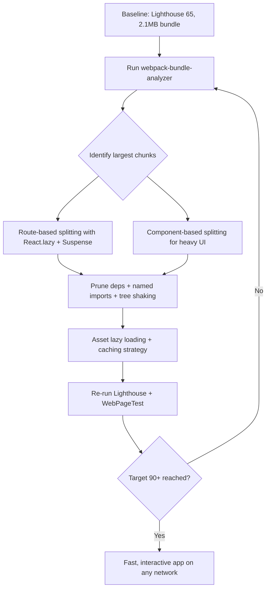

| Difficulty | Channel | Tags |
|---|---|---|
| intermediate | frontend | lighthouse, bundle, lazy-loading |

Tinder once shipped a full-featured web app that refused to become interactive quickly — the initial React/Redux build booted unnecessary code on every visit, punishing users on slow 4G networks [1]. The fix was not a rewrite. It was ruthless code splitting: route-based splitting alone cut the main bundle from 166KB to 101KB, and the full experience became interactive in under 5 seconds on a Galaxy S7 [1]. That is the same playbook teams use to take a React app from a 65 Lighthouse score to 90+ — and it starts with a 2.1MB bundle and a 4.2s Time to Interactive.

---

> ### Real-World Case — Tinder
>
> Tinder launched Tinder Online, a full-featured Progressive Web App for its dating experience, built to run on low-end devices and slow 4G/3G networks worldwide. Their initial React/Redux web build shipped monolithic JavaScript bundles that booted unnecessary code on every visit, keeping the app from becoming interactive quickly.
>
> | | |
> |---|---|
> | **Challenge** | Tinder's web experience loaded in ~11.9s with huge chunky JS bundles, far too slow to be usable on the mid-range Android hardware and constrained networks where they needed new users. They had to get the core experience interactive in under 5 seconds while keeping feature growth from regressing performance. |
> | **Solution** | They implemented route-based code-splitting using React Router and React Loadable with dynamic import() and webpack magic comments, shipping only the code needed for the current route and lazy-loading the rest. They added link rel=preload for critical bundles, enforced hard performance budgets (~155KB for main+vendor chunks, ~55KB for async chunks, ~35KB for others, 20KB CSS) audited on every commit, split out the webpack manifest for long-term caching, adopted Workbox service-worker caching, upgraded React 15→16 to cut vendor size ~7%, and used webpack scope hoisting for an 8% parsing-time win. |
> | **Outcome** | Route-based splitting cut the main bundle from 166KB to 101KB and dropped DOMContentLoaded from 5.46s to 4.69s; the full experience became interactive in under 5 seconds on a Galaxy S7 over 4G (measured with Lighthouse and WebPageTest). Preloading shaved ~1s off load time and cut first paint from 1000ms to ~500ms. The web PWA outperformed the native app on swipes, profile editing, and time spent per session. |
> | **Lesson** | Bundles don't need to grow with the product. Route-level code splitting, aggressive performance budgets enforced in CI, and caching done right let a small team ship a rich React app that is interactive in seconds even on slow devices — the same playbook (analyze with bundle tools, split by route, budget, preload, cache) that takes a 2.1MB bundle to a 90+ Lighthouse score. |

---

## Hook — A 2.1MB bundle walks into a Lighthouse audit

It is 10 a.m. and the performance review just landed in your inbox: Lighthouse 65. Bundle size 2.1MB. Time to Interactive 4.2 seconds. On a good day, on a good network. Someone pasted this into the team chat, and the silence was loud enough to hear across the office.

This is exactly the situation Tinder's web team faced years ago — except their stakes were global. They built Tinder Online as a full Progressive Web App for dating on low-end devices and slow 3G/4G networks, and their React/Redux monolith booted unnecessary code on every single visit [1]. Sound familiar?

Here is the thing though: this story has a happy ending. And the ending does not involve rewriting the app from scratch. It involves a surgical, repeatable process you can run on that 2.1MB bundle this afternoon: analyze, split, prune, measure, repeat.

## Problem — The 4.2-second lie

Here is why a 65 on Lighthouse hurts more than your pride. Every 100KB of JavaScript costs roughly 3.5 seconds of CPU processing on mid-range mobile hardware — that is the reality of parse and compile on phones, not a made-up benchmark [9]. Your 2.1MB bundle is not just heavy; it is actively hostile to the users who need your app the most: the ones on 3G, the ones with budget phones, the ones who give your app exactly one chance to load before they swipe away.

Time to Interactive at 4.2s means the page might be painted, but the buttons are dead. Users tap. Nothing happens. They assume the app is broken, and they leave. Retailers have measured about 1% of revenue lost for every 100ms of load time — and the physics have only gotten worse as expectations have risen.

Moreover, the problem compounds. A monolithic bundle ships dashboard code to users who will never open a dashboard, analytics libraries to users who will never click a chart, and admin utilities that belong in a different product. Many developers discover their bundle is 60% code the majority of users never execute. The bundle is not the enemy, though — the lack of discipline around it is.

## Real-World Case — Tinder's 5-second bet

When Tinder launched Tinder Online, the product promise was ambitious: the full dating experience on the web, running on low-end devices and slow 4G/3G networks worldwide [1]. The initial React/Redux build betrayed that promise — monolithic JavaScript bundles booted unnecessary code on every visit, and interactivity lagged painfully behind the paint.

The fix read like a masterclass in restraint. Tinder's team ran bundle analysis and then applied route-based splitting. Concretely, that cut the main bundle from 166KB to 101KB and dropped DOMContentLoaded from 5.46 seconds to 4.69 seconds. The full experience became interactive in under 5 seconds on a Galaxy S7 over 4G, measured with Lighthouse and WebPageTest [1].

But wait, it gets better. Preloading shaved roughly 1 second off load time and cut first paint from 1000ms to about 500ms — a 50% reduction in the moment users actually saw anything. The punchline? The web PWA outperformed the native app on swipes, profile editing, and time spent per session [1].

The takeaway is uncomfortable and liberating at the same time: performance is not a constraint on a great product — it is a feature. The steps Tinder took are the steps in front of you: identify what ships, ship less of it, and ship the rest only when it is needed.

## Deep Dive — The anatomy of a split

Code splitting is a deceptively simple idea: instead of shipping one giant bundle, split the application into chunks that load on demand. React.lazy() pairs with Suspense to make this almost trivial in modern React [2][3] — the framework handles the deferred module loading and the fallback UI while the chunk downloads [4].

There are two flavors of splitting, and they serve different jobs:

- Route-based splitting: one chunk per route. Users on /dashboard never download the analytics charting library. This is the highest-leverage move — Tinder's team did exactly this [1].
- Component-based splitting: heavy, rarely-visited components (charts, editors, maps) load on demand, often behind a modal or a tab [2].

Here is the real tradeoff, side by side:

| Approach | What ships | When it loads | Best for |
|---|---|---|---|
| Route-based | One chunk per route | On navigation | Apps with distinct pages (Tinder) |
| Component-based | A chunk per heavy component | On mount or click | Dense dashboards, embedded tools |
| Vendor splitting | Framework + shared libs | Immediately, cached long-term | Every app over ~1MB |

Before you split anything though, you need to know what is in the bundle. This is where webpack-bundle-analyzer earns its keep — it visualizes every chunk and shows the fat in color [6]. Consequently, teams discover that a single library, like a date picker or a chart suite, accounts for 30% of the payload. Trimming unused dependencies and tightening imports is the cheap win hiding before the clever one.

⚠️ Watch Out: code splitting without analysis is cargo-culting. You will split a small chunk into tinier pieces and completely miss the 600KB graphing library squatting in your vendor bundle.

Finally, tree shaking: with ES modules and a modern bundler, dead code elimination works automatically for exports your app never imports — but only if you import named exports, not the whole library. One bad `import _ from 'lodash'` defeats the entire mechanism [5][7]. Many developers discover that switching to named imports alone shrinks their bundle by 20%.

## Workflow — The loop that lands 90+

This leads to a repeatable loop — the same one Tinder followed, formalized. The diagram below maps it visually, but the steps are worth reading twice:

1. Baseline: run Lighthouse and capture current TTI, LCP, and bundle size [8].
2. Analyze: open webpack-bundle-analyzer and rank your top 5 chunks by size [6].
3. Split routes: wrap every route in React.lazy() + Suspense [2][3].
4. Split components: defer charts, editors, and maps until interaction [2].
5. Prune: remove dead dependencies, switch to named imports, enable tree shaking [5][7].
6. Optimize assets: lazy-load images below the fold and adopt modern image formats.
7. Measure and repeat: re-run Lighthouse and iterate — the loop is the strategy.

Notice the feedback arrow in the diagram. The process is deliberately cyclic because performance regresses as fast as you add features. Service workers can then lock in the gains by caching chunks for repeat visits [10] — a long-term caching strategy that turns a one-time win into a durable one.

🎯 Key Point: the goal is not one perfect audit. The goal is a workflow your team can run on every PR, so a 65 becomes a regression, not a lifestyle.

## Code Example — Splitting routes and components for real

Here is the practical implementation of steps 3 and 4 — route and component splitting in a real app. This is the core of what took Tinder's bundle from 166KB to 101KB [1]:

```javascript
import { lazy, Suspense } from 'react';
import { BrowserRouter, Routes, Route } from 'react-router-dom';

// Route-based splitting: each route's JS loads only when visited
const Dashboard = lazy(() => import('./pages/Dashboard'));
const Analytics = lazy(() => import('./pages/Analytics'));
const Settings = lazy(() => import('./pages/Settings'));

// Component-based splitting: heavy UI stays out of the critical path
const HeavyChart = lazy(() => import('./components/HeavyChart'));

function App() {
  return (
    <BrowserRouter>
      {/* Suspense renders a fallback while any lazy chunk downloads */}
      <Suspense fallback={<LoadingSpinner />}>
        <Routes>
          <Route path="/" element={<Dashboard />} />
          <Route path="/analytics" element={<Analytics />} />
          <Route path="/settings" element={<Settings />} />
        </Routes>
      </Suspense>

      {/* The chart chunk downloads only when the user opens the report */}
      <ReportModal onOpen={() => setShowChart(true)}>
        {showChart && <HeavyChart />}
      </ReportModal>
    </BrowserRouter>
  );
}

function LoadingSpinner() {
  return <div className="spinner">Loading…</div>;
}
```

This snippet implements both layers of splitting from the workflow. The route-based layer wraps Dashboard, Analytics, and Settings with React.lazy(), so webpack emits a separate chunk per page — the browser only downloads a chunk when the user actually navigates there [2][4]. Suspense wraps the routes and renders the fallback spinner while any chunk is in flight [3].

The component-based layer goes further: HeavyChart is also lazy, and it is only mounted inside the modal when the user opens the report — clicking the button is what triggers the dynamic import. The key design decision is granularity: keep the shell (App, navigation, spinner) in the main chunk so first paint stays fast, and push everything else behind React.lazy().

⚠️ One caveat: pair every lazy boundary with an error boundary. On slow networks, a failed dynamic import will otherwise crash the whole tree and turn a slow app into a blank page.

## Lessons Learned — The sticky-note version

If this feels overwhelming, you are not alone — every team that inherits a 2.1MB bundle feels the same way. But the lessons from this journey are compact enough to fit on a sticky note:

- Measure before you optimize. Bundle analysis is non-negotiable; you cannot fix what you cannot see [6].
- Route-level splitting first, component-level second. Most of your users will never visit most of your app.
- Tree shaking only works if your imports cooperate. Named imports or nothing [5][7].
- Fallbacks and error boundaries are part of the feature, not an afterthought — a lazy chunk failing to load must not blank the app.
- Performance is a habit. Re-run Lighthouse in CI and block regressions before they ship [8].

The transformation is not mystical. Tinder dropped 65KB off its main bundle and shaved a second off first paint with discipline, not heroics [1]. Your 2.1MB bundle is a bundle of opportunities — every chunk you defer is a user you are not forcing to wait.

🔥 Hot Take: if your Lighthouse score is stuck, stop tuning CSS and go delete a dependency. The wins live in the bundle.

---

## Bundle Optimization Loop



<details>
<summary><strong>Original Interview Question</strong></summary>

**Q:** You're tasked with improving a React app's Lighthouse performance score from 65 to 90+. The bundle size is 2.1MB and Time to Interactive is 4.2s. What specific steps would you take to optimize the bundle and implement lazy loading?

**A:** Implement code splitting with React.lazy() and Suspense, analyze bundle composition with webpack-bundle-analyzer to identify largest chunks, remove unused dependencies and optimize imports, add dynamic imports for heavy components and third-party libraries, implement route-based splitting for better initial load times, and utilize tree shaking with proper ES module configuration.

</details>

## Conclusion

Tinder's story proves that performance is a product decision, not a polish task — the web app that booted unnecessary code on every visit became the version users spent more time in than the native app [1]. The journey you just walked through — measure, split, prune, repeat — is the same one that takes a sluggish 2.1MB monolith to a 90+ Lighthouse score. Tomorrow, open your bundle analyzer, find your heaviest chunk, and cut it. That first win is the one that makes believers out of teams.

---

## References

1. [Tinder incident report](https://medium.com/@addyosmani/a-tinder-progressive-web-app-performance-case-study-78919d98ece0) — article
2. [React.lazy reference](https://react.dev/reference/react/lazy) — documentation
3. [Suspense reference](https://react.dev/reference/react/Suspense) — documentation
4. [MDN — import operator (dynamic imports)](https://developer.mozilla.org/en-US/docs/Web/JavaScript/Reference/Operators/import) — documentation
5. [MDN — JavaScript modules (tree shaking and ES module configuration)](https://developer.mozilla.org/en-US/docs/Web/JavaScript/Guide/Modules) — documentation
6. [webpack-bundle-analyzer](https://github.com/webpack-contrib/webpack-bundle-analyzer) — documentation
7. [Webpack — Code Splitting guide](https://webpack.js.org/guides/code-splitting/) — documentation
8. [Chrome DevTools — Lighthouse overview](https://developer.chrome.com/docs/lighthouse/overview/) — documentation
9. [web.dev — Reduce JavaScript payloads with code splitting](https://web.dev/articles/reduce-javascript-payloads-with-code-splitting) — blog
10. [MDN — Service Worker API](https://developer.mozilla.org/en-US/docs/Web/API/Service_Worker_API) — documentation

---

**Author:** Satishkumar Dhule — [GitHub](https://github.com/satishkumar-dhule) · [LinkedIn](https://linkedin.com/in/satishkumar-dhule) · [Website](https://satishkumar-dhule.github.io)
