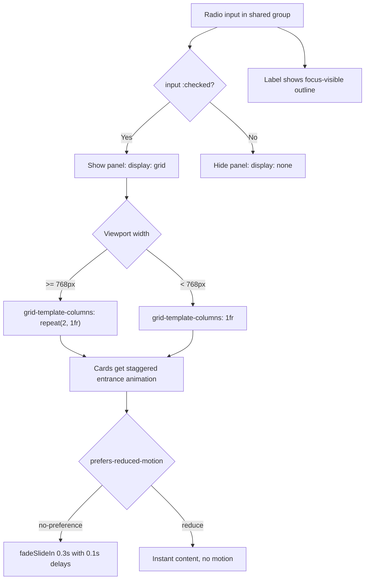

| Difficulty | Channel | Tags |
|---|---|---|
| beginner | frontend | css, flexbox, grid, animations |

GitHub's Sort dropdown in code search is a small thing you probably use every day, but the engineering behind it tells a bigger story. It opens and closes with zero JavaScript, built on the native HTML / disclosure pattern in the same no-JS spirit as CSS-only radio-button tabs [1]. It shipped at GitHub's scale for years, and then screen reader and keyboard users kept hitting real failures that GitHub had to fix across code search and code view for its 100M+ developer audience [1]. What GitHub learned is exactly the lesson waiting at the end of this article: native HTML is powerful, but accessibility is never automatic.

---

> ### Real-World Case — GitHub
>
> GitHub built interactive dropdowns and menus (like the Sort dropdown in code search and the global nav) on top of the native HTML / disclosure pattern - a pure-HTML interactive component that needs no JavaScript to open or close, in the same 'no-JS' spirit as CSS-only radio-button tabs. It shipped at GitHub's scale for years, but screen reader and keyboard users kept hitting real failures.
>
> | | |
> |---|---|
> | **Challenge** | Native disclosure elements give no tab/menu semantics, roving tabindex, or reliable focus management. Screen reader testing found  was not exposed as a discoverable button in Safari/VoiceOver; and when a keyboard user changed the Sort dropdown's selection, the full page reload dumped focus back at the page header instead of returning it to the dropdown that opened the menu - confusing and nearly unusable for blind and keyboard-only users on one of the web's busiest developer tools. |
> | **Solution** | GitHub Engineering re-layered a thin custom-element layer (details-menu-element, details-dialog-element) that pairs the native HTML/JS-free toggle with ARIA roles, aria-haspopup handling, Escape-key closing, and explicit focus return. For the Sort dropdown specifically they added logic to restore keyboard focus to the menu button after the post-selection page navigation, and they now run external accessibility audits, screen-reader reviews, and weekly a11y office hours on every new UI (documented in their code search/code view rebuild). |
> | **Outcome** | GitHub fixed the role/focus problems (e.g. details-dialog-element v3.0.3 and details-menu-element PR #36 'Fix focus and role problems') and shipped an accessible code search and code view for its 100M+ developer audience; the lesson was adopted into their Primer design system, where interactions now pair native HTML with the minimal ARIA/focus-management JS the semantics require. |
> | **Lesson** | The 'CSS-only / no-JavaScript' interactive pattern is fast and elegant, but radio groups and  expose no tab/menu semantics or roving tabindex and cannot move focus. Accessibility at scale means keeping the native/CSS foundation and adding a thin ARIA + focus-management layer back in - focus-visible outlines and proper focus restoration matter as much as the visual pattern. |

---

## Hook — Ever wanted interactive tabs with zero JavaScript?

Ever wanted to ship an interactive UI under a hard rule: no JavaScript allowed? It sounds like a trick question. Tabs are interactive by definition, and every tutorial you have ever seen reaches for a click handler or a component library. But here is the twist: you do not need any of it. A radio button, a label, and three CSS selectors build a fully functional tab panel. No event listeners. No bundle size. No JavaScript at all.

This is the kind of challenge that shows up in frontend interviews and, far more often, in real design-system work: docs sites, pattern libraries, and static pages where teams deliberately cut JavaScript for speed, simplicity, and resilience. The catch is that removing JavaScript also removes the accessibility scaffolding it usually brings along. And that is where the real test begins.

## Problem — The tab panel no one can reach with a keyboard

Here is the core problem: tabs need state. Something has to remember which panel is visible, and without JavaScript, browsers only hand you a handful of native state machines to work with — checkboxes, radios, and the / disclosure element. The radio-button pattern hijacks one of those machines: a group of radios sharing the same name attribute. Selecting one unchecks the rest, so mutually exclusive state comes for free [7].

But there is a reason this pattern makes accessibility engineers nervous. Think about who actually uses tabs. Keyboard users tab into the control and expect to arrow between tabs. Screen reader users expect to hear 'tablist' and 'tab' roles with aria-selected states. Users with vestibular disorders expect animations to respect their motion preferences. A CSS-only solution has to serve all of them with zero JavaScript. Sound intimidating? It should. This is exactly the terrain where GitHub got burned.

## Real-World Case — GitHub ships no-JS dropdowns, then pays the accessibility bill

GitHub's Sort dropdown in code search and the menus in the global navigation were built on the native HTML / disclosure pattern — a pure-HTML interactive component that needs no JavaScript to open or close, in the same no-JS spirit as CSS-only radio tabs [1]. It shipped at GitHub's scale for years and looked flawless. Then the accessibility reports started rolling in: screen readers announced the wrong roles, and keyboard focus could land somewhere users could not see [1].

The fixes were as small as they were subtle. GitHub shipped details-dialog-element v3.0.3 and opened details-menu-element PR #36, 'Fix focus and role problems' — tiny version numbers hiding genuinely tricky semantic bugs [1]. The payoff was accessible code search and code view for an audience of 100M+ developers, and the lesson was absorbed into GitHub's Primer design system: interactions now pair native HTML with the minimal ARIA and focus-management JavaScript the semantics require [1].

Here is the uncomfortable part: GitHub's pattern was pure HTML with zero JavaScript, and it still failed accessibility. So what chance does a pile of invisible radio inputs have?

## Deep Dive — The machinery hiding inside three CSS selectors

Building on that story, here is what is actually happening under the hood of the radio-tab pattern — and where the hidden risks live.

**How the toggle works.** The markup obeys a strict sibling order: radios and labels come first, and every panel sits after all of them in the DOM. The visibility rule then reads like a sentence: `input:checked ~ .panel { display: grid }` shows the active panel, while `input:not(:checked) ~ .panel { display: none }` hides the rest [8]. The general sibling combinator `~` is the load-bearing piece: because every panel is a sibling of every radio, any radio's state can drive any panel's visibility.

**Why radios beat checkboxes and divs.** Radios in a shared group are already a native keyboard component — arrow keys move between them and Space selects [7]. That is a head start most hand-rolled JavaScript tab widgets never get. The plot twist is that they are still announced as a 'radio group,' not a 'tablist,' and there is no aria-selected to expose [9]. Native semantics buy you keyboard behavior; they do not automatically buy the right roles.

**The grid, the ratio, the motion.** Panels on desktop use `grid-template-columns: repeat(2, 1fr)` for the 2x2 card layout and collapse to a single column under 768px [6]. Each image area gets a fixed 16:9 shape with `aspect-ratio: 16 / 9`, supported across all modern browsers and free of the layout shift the old padding-hack ratios caused [5]. Entrance animation is a short fadeSlideIn with staggered delays, wrapped in `prefers-reduced-motion: no-preference` so users who ask for reduced motion get instant content [4]. And focus rings use `:focus-visible`, invisible to mouse users but always there for the keyboard [3].

Compare the three main approaches honestly — there is no free lunch:

| Approach | Keyboard behavior | Screen reader roles | JS required | Best for |
| --- | --- | --- | --- | --- |
| Radio + CSS tabs | Arrow keys and Space, native | Radio group, not tabs | None | Static docs, strict no-JS pages |
| / | Enter/Space toggles | Disclosure, not tabs | None | Single-section expand/collapse [2] |
| ARIA tablist component | Must be scripted by hand | Correct tab/tablist/aria-selected | Required | Complex apps that need full semantics |

💡 **Insight:** The DOM-order constraint is a feature in disguise. Because radios sit before panels, the checked state drives everything downstream, and the whole interaction stays declarative.

⚠️ **Watch Out:** Do not hide the radios with `display: none`. A hidden input cannot receive focus, so keyboard users can never reach your tabs. Use a visually-hidden technique (absolute positioning, 1px, opacity 0) instead.

## Workflow — From blank page to accessible CSS-only tabs in six steps

With the machinery in mind, here is the build order that works. Each step depends on the last, and skipping one tends to resurface as a screen-reader bug months after launch.

1. **Define the markup contract.** Give every radio the same name, pair each with a label via for/id, and place all panels after the radios. Mark one radio checked as the default tab.
2. **Wire the toggle in pure CSS.** Show with `input:checked ~ .panel`, hide with `input:not(:checked) ~ .panel` [8].
3. **Build the responsive grid.** `repeat(2, 1fr)` on desktop, one column under 768px [6].
4. **Shape the cards.** 16:9 image area via aspect-ratio, clipped overflow, title and meta line below [5].
5. **Add motion that respects users.** Stagger the entrance animation inside `prefers-reduced-motion: no-preference` [4].
6. **Prove it.** Visually hide the radios, style `:focus-visible` outlines on the labels, then test with arrow keys, Tab, and a real screen reader [3][9].

The diagram below shows the decision flow your CSS executes on every render — one state machine, three outcomes.

## Code Example — The full CSS-only solution, plus the minimal JS GitHub would approve of

The markup order matters more than it looks. Radios and labels first, panels after — that sibling order is exactly what makes the CSS selectors possible.

```html
<div class="tabs">
  <input type="radio" id="tab-overview" name="tabs" checked>
  <label for="tab-overview">Overview</label>
  <input type="radio" id="tab-specs" name="tabs">
  <label for="tab-specs">Specs</label>

  <section class="panel">
    <article class="card">
      <div class="card__image"></div>
      <h3 class="card__title">Card title</h3>
      <p class="card__meta">Meta information</p>
    </article>
    <!-- add three more cards for the 2x2 grid -->
  </section>

  <section class="panel">
    <!-- second tab's card grid goes here -->
  </section>
</div>
```

The CSS does the heavy lifting. The radios become invisible but stay focusable; the checked state drives the panels; the grid and motion obey the viewport and the user's preferences:

```css
.tabs input {
  position: absolute; /* visually hidden, still keyboard-focusable */
  opacity: 0;
}

.tabs input:not(:checked) ~ .panel { display: none; }
.tabs input:checked ~ .panel { display: grid; }

.panel {
  grid-template-columns: repeat(2, 1fr);
  gap: 1.5rem;
}

@media (max-width: 768px) {
  .panel { grid-template-columns: 1fr; }
}

.card__image {
  aspect-ratio: 16 / 9;
  background: #eee;
}

/* Keyboard users see the ring; mouse users do not */
.tabs input:focus-visible + label { outline: 2px solid currentColor; }

@media (prefers-reduced-motion: no-preference) {
  .card {
    animation: fadeSlideIn 0.3s ease-out backwards;
  }
  .card:nth-child(2) { animation-delay: 0.1s; }
  .card:nth-child(3) { animation-delay: 0.2s; }
  .card:nth-child(4) { animation-delay: 0.3s; }
}

@keyframes fadeSlideIn {
  from { opacity: 0; transform: translateY(10px); }
  to   { opacity: 1; transform: translateY(0); }
}
```

Walk through what each block does: the `:checked`/`:not(:checked)` pair is the entire state machine, `animation-fill-mode: backwards` prevents a flash of invisible cards before the stagger delay elapses, and the grid breakpoint handles the desktop-to-mobile journey.

Now for the accessibility gap from the Deep Dive: the pattern is fully functional, but screen readers still announce a radio group. The script below — the only piece of JavaScript in this whole article — upgrades the semantics to the ARIA tab pattern, exactly the kind of 'minimal JS the semantics require' that GitHub adopted after its dropdown failures [1][10]. Without the script, the component still works; with it, assistive tech hears the right story.

## Lessons Learned — What GitHub's story and the radio pattern teach you

Here is what the journey adds up to.

- **Native state machines are real, but partial.** Radios hand you keyboard navigation for free; they do not hand you the right roles. Plan for the gap [7][9].
- **Motion is a preference, not a decoration.** Gate every animation behind prefers-reduced-motion, and use animation-fill-mode: backwards so nothing flashes before its delay [4].
- **:focus-visible is the difference between helpful and hostile.** An outline on every click annoys mouse users; no outline for keyboard users strands them. The pseudo-class resolves both [3].
- **Semantics are the product.** GitHub's dropdowns looked perfect and failed anyway, because the roles were wrong [1]. A design system is a promise about how components behave, not just how they look.
- **Pair native HTML with minimal JS when you need it.** The no-JS version is the resilient baseline; a small enhancement script upgrades the experience for users with assistive tech [1][10].

**Battle scars from real codebases:**
- `display: none` on the radios — the whole pattern silently dies for keyboard users.
- Labels styled with hover but not focus — keyboard state becomes invisible.
- Animations shipped without the reduced-motion guard — a real source of vestibular distress.
- Panels placed before the radios in the DOM — every sibling selector breaks with zero error message.

**The immediate action plan:** open your design system and run it with JavaScript disabled. Count how many interactive components still work. For the ones that survive — tabs, accordions, dropdowns — check that focus is visible and motion is gated. That single audit is the pattern GitHub arrived at after shipping to 100M+ developers [1], and it takes an afternoon.

---

## CSS-Only Tab Decision Flow



<details>
<summary><strong>Original Interview Question</strong></summary>

**Q:** Build a CSS-only tab panel for a design-system docs page. Use radio inputs to switch tabs (no JavaScript). Desktop: a 2x2 grid of cards under each tab; mobile: single column. Each card has a fixed 16:9 image area, a title, and a short meta line. Add a subtle entrance animation with a stagger and keep focus-visible outlines; ensure prefers-reduced-motion is respected?

**A:** Use a set of radio inputs with a shared `name` attribute and corresponding `` elements for each tab section. The `:checked` state of each radio controls visibility of its associated panel via adjacent sibling selectors. Each panel renders a 2×2 card grid on desktop and collapses to a single column on mobile. Cards use `aspect-ratio: 16/9` for fixed image containers, with a title and meta line below.

</details>

## Conclusion

GitHub's no-JS dropdowns looked flawless and failed anyway — not because the CSS was wrong, but because the semantics were. The same is true of your CSS-only tabs: the 16:9 ratios, the staggered animations, and the 2x2 grid are the easy part. The radio group, the focus ring, and the reduced-motion guard are the actual product. Build the tabs, test them with a keyboard and a screen reader, gate the motion — then ship them knowing they work with JavaScript turned off, and with the grace to add the one small script the semantics require when you need it. Tomorrow, run that no-JS audit. You will be surprised by what your components do when the JavaScript disappears — and by what they silently break.

---

## References

1. [GitHub incident report](https://github.blog/engineering/user-experience/accessibility-considerations-behind-code-search-and-code-view/) — article
2. [MDN: The Details disclosure element](https://developer.mozilla.org/en-US/docs/Web/HTML/Element/details) — documentation
3. [MDN: :focus-visible](https://developer.mozilla.org/en-US/docs/Web/CSS/:focus-visible) — documentation
4. [MDN: prefers-reduced-motion](https://developer.mozilla.org/en-US/docs/Web/CSS/@media/prefers-reduced-motion) — documentation
5. [MDN: aspect-ratio](https://developer.mozilla.org/en-US/docs/Web/CSS/aspect-ratio) — documentation
6. [MDN: CSS grid layout](https://developer.mozilla.org/en-US/docs/Web/CSS/CSS_grid_layout) — documentation
7. [MDN: input type radio](https://developer.mozilla.org/en-US/docs/Web/HTML/Element/input/radio) — documentation
8. [MDN: General sibling combinator](https://developer.mozilla.org/en-US/docs/Web/CSS/General_sibling_combinator) — documentation
9. [WebAIM: Keyboard Accessibility](https://webaim.org/techniques/keyboard/) — documentation
10. [GitHub: details-menu-element](https://github.com/github/details-menu-element) — documentation

---

**Author:** Satishkumar Dhule — [GitHub](https://github.com/satishkumar-dhule) · [LinkedIn](https://linkedin.com/in/satishkumar-dhule) · [Website](https://satishkumar-dhule.github.io)
