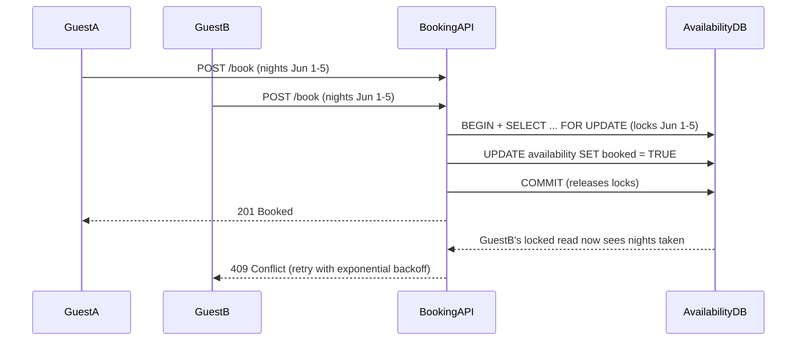

| Difficulty | Channel | Tags |
|---|---|---|
| intermediate | database | acid, isolation-levels, mvcc |

A single double-click on 'Book' turned into a double charge for Airbnb guests — not because the payment failed, but because a retry raced a lagging replica and charged twice [1]. The same race that silently overcharges guests is the race that overbooks a property: two users, one room, zero serialization. This is the story of how to design transactions that refuse to let that happen — even under replica lag, retries, and peak checkout traffic.

---

> ### Real-World Case — Airbnb
>
> When Airbnb migrated its payments platform to a service-oriented (microservices) architecture, every payment became a distributed transaction: one API call fans out into downstream calls that can fail or time out mid-flight. A guest who times out (or double-clicks 'Book') retries, and if the first payment actually succeeded, the retry charges them twice — the financial equivalent of a double booking. Replica lag made it worse: a retry reading an idempotency record from a lagging replica could conclude the payment never happened and charge again.
>
> | | |
> |---|---|
> | **Challenge** | Guarantee that every payment request is executed at most once across a distributed system plagued by network failures, lost responses, client timeouts, and concurrent duplicate requests — while keeping latency ultra-low and letting ordinary product developers ignore concurrency entirely. |
> | **Solution** | Airbnb built 'Orpheus,' a general-purpose idempotency library embedded in every payments service. Each request carries an idempotency key; each API call is split into Pre-RPC/RPC/Post-RPC phases with two hard rules (no network calls inside a DB transaction, no DB work during the network call) and every phase is wrapped in a single atomic database transaction. A time-limited row lease locks the key so two duplicate attempts can't run concurrently. Critically, idempotency state is read and written ONLY on the sharded master database — never replicas — and failures are classified retryable vs non-retryable so retries are safe. |
> | **Outcome** | 99.999% (five nines) payment consistency maintained since the framework launched while annual payment volume doubled. The team documented that just a few seconds of replica lag was enough to turn a correct idempotent retry into a double charge. |
> | **Lesson** | Concurrency bugs in booking/payment flows are rarely about SQL isolation levels alone — they come from ambiguous failures where the client can't tell if the write happened. Idempotency keys plus atomic transaction phases plus row-level lease locks make retries safe, and reading consistency-critical state from replicas silently reintroduces the exact double-execution bug you're trying to fix. |

---

## Hook — One Double-Click, One Room, Two Guests

Ever wondered why your 'Book' button doesn't just trust the database? Here is the nightmare scenario: a guest double-clicks 'Book' on the perfect listing. The first request succeeds; the second — fired half a second later — is now racing against the clock. Meanwhile, across the country, another guest is reserving the same property for the same dates. Somewhere in between, a transaction is about to decide who gets the room. The stakes are simple: one property, one set of nights, and zero rooms for the loser. But if your transactions aren't designed for this exact moment, the loser might be your business — in the form of an overbooking you can't unwind, a double charge you can't explain, and a support inbox you can't keep up with. This is the story of the race you never see, and the transaction design that tames it.

## Problem — The Race Condition Hiding in Your Availability Check

At its core, a double booking is a lost update. Two transactions both read the same availability: 'the room is free.' Both pass the check. Both write 'booked.' The second write silently overwrites the first, and nobody notices until two guests show up at the same door. The naive fix — check availability, then book — is exactly what fails, because reads and writes are separate steps with a gap between them. Under default isolation levels, each transaction sees a snapshot of the database taken when it started, so both guests can look at the same empty calendar and both 'know' the nights are free [5]. This is the MVCC snapshot anomaly, and it is why many developers discover that their elegant 'check then book' code is really 'check then pray.' The problem compounds as you scale: read replicas shave latency off availability checks but serve slightly stale data, and hot properties concentrate traffic onto a handful of rows. Suddenly the real question isn't 'can I book this room?' — it's 'how do I make the database arbitrate honestly when two people want the same thing at the same instant?'

## Real-World Case — Airbnb's Double-Payment Nightmare

Here is the plot twist: you don't need a booking system to feel this pain. When Airbnb migrated its payments platform to a service-oriented (microservices) architecture, every payment became a distributed transaction — one API call fans out into downstream calls that can fail or time out mid-flight [1]. A guest who times out or double-clicks 'Book' retries, and if the first payment actually succeeded, the retry charges them twice — the financial equivalent of a double booking [1]. And this is where it gets brutal: replica lag made it worse. A retry reading an idempotency record from a lagging replica could conclude the payment never happened and charge again. The team documented that just a few seconds of replica lag was enough to turn a correct idempotent retry into a double charge [1]. Yet despite all of this, the framework maintained 99.999% payment consistency since launch while annual payment volume doubled [1]. The lesson? The same patterns that stop double charges — idempotency keys, strong consistency at write time, careful lock handling — are the exact patterns that stop double bookings.

## Deep Dive — SERIALIZABLE, MVCC, and the Art of the Row Lock

So what actually protects you? Isolation levels define how concurrent transactions see each other's uncommitted work [4]. The PostgreSQL spectrum runs from READ COMMITTED — a new snapshot per statement, where your two-step check-then-book drifts into chaos — up to SERIALIZABLE, which guarantees the outcome is identical to transactions running one after another [3]. Here are the real tradeoffs:

| Isolation Level | Sees new commits mid-transaction? | Handles 'check then book' | Cost |
|---|---|---|---|
| READ COMMITTED | Yes | Broken — races win | Cheap |
| REPEATABLE READ | No | Snapshot still stale | Medium |
| SERIALIZABLE | No | Aborts conflicts, reruns | Highest, but correct |

Here is the counterintuitive part: SERIALIZABLE doesn't mean 'global lock everything.' PostgreSQL implements it with serializable snapshot isolation — optimistic, snapshot-based, with cycle detection that aborts conflicting transactions instead of blocking them [3]. That means it scales far better than your gut feeling suggests. For the nights themselves, however, you want explicit row locks: SELECT ... FOR UPDATE takes locks on exactly the rows you plan to mutate, forcing any overlapping booking to wait its turn instead of quietly overwriting you [2]. The alternative — optimistic concurrency with version columns — avoids locks entirely by comparing a version number before commit [6]. It works beautifully for low-contention writes, but on a hot property with three guests fighting over one weekend, the losers waste a full round trip and then abort. That is why production systems mix both: row locks for the critical path, version checks for everything else.

## Workflow — Five Steps to a Booked-Exactly-Once System

Building on the deep dive, here is the battle-tested flow that keeps one room equal to one guest (see the sequence diagram below). Step 1: Begin a transaction and set isolation to SERIALIZABLE [3]. Step 2: Run SELECT ... FOR UPDATE over the availability rows for the requested date range — any concurrent booking of the same nights now blocks until you commit [2]. Step 3: Count the locked rows. Fewer than the number of nights means a competitor already claimed part of the range — fail fast with a 409 Conflict. Step 4: Write the booking and commit; the locks release and the next waiting transaction sees the truth. Step 5: Catch serialization failures and retry with exponential backoff — 50ms, then 100ms, then 200ms — because a short random wait often resolves the contention [8]. For hot properties, add a circuit breaker: after N aborts, serve a cached 'likely booked' response instead of hammering the same row [10]. And keep availability reads off the write path — read replicas are fine for the browse view, but the booking decision must hit the primary, or you are replaying Airbnb's replica-lag double charge [1][10].

## Code Example — Booking in Python Without the Race

Theory is nice, but here is what 'booked exactly once' looks like in PostgreSQL via psycopg2 — the exact pattern that turns this conversation into running code:

## Lessons Learned — What the Booking Wars Taught Us

By now the pattern should feel familiar — and that is the point. Here is what to carry into your next design:

- Isolation level is a correctness decision, not a performance knob. READ COMMITTED is fine for read-only views; SERIALIZABLE is for money and calendars [4].
- Never check availability on a replica and write on the primary. A few seconds of lag is all it takes [1][10].
- Row locks (SELECT ... FOR UPDATE) are the arbiter for the critical path; version-column optimistic locking works elsewhere [2][6].
- Idempotency is the unglamorous hero. A unique booking key turns a double-click into a no-op, not a disaster [1].
- Retry with exponential backoff — but make your retries idempotent, or you are the double charge [8].
- If this feels overwhelming, you are not alone — even Airbnb hit it. The difference is they measured it and built against it [1].

---

## Concurrent Booking Flow

<strong>Original Interview Question</strong>

**Q:** You're building a booking system for Airbnb where multiple users can reserve the same property simultaneously. How would you design the transaction handling to prevent double bookings while maintaining high availability?

**A:** Use SERIALIZABLE isolation with optimistic concurrency control. Implement row-level locks on property availability tables, use MVCC snapshot reads for checking availability, and apply application-level validation to ensure atomic booking operations.

## Conclusion

The room that sold twice and the guest that was charged twice are the same story told with different nouns. Airbnb's team turned a double-charge incident into a 99.999%-consistent platform by treating every retry, every lagging replica, and every overlapping write as a transaction to be won [1]. Tomorrow, you can do the same: raise the isolation level on your booking path, lock the rows you will write, and make every retry idempotent. Do that, and the next time a guest double-clicks 'Book,' the worst thing that happens is a confirmation email they can ignore — not a room that sold twice. That is the one insight worth sharing with your team: the database will gladly arbitrate your races, but only if you let it.

---

## References

1. [Avoiding Double Payments in a Distributed Payments System (Airbnb)](https://medium.com/airbnb-engineering/avoiding-double-payments-in-a-distributed-payments-system-2981f6b070bb) — blog
2. [PostgreSQL Documentation: Explicit Locking](https://www.postgresql.org/docs/current/explicit-locking.html) — documentation
3. [PostgreSQL Documentation: Transaction Isolation](https://www.postgresql.org/docs/current/transaction-iso.html) — documentation
4. [Wikipedia: Isolation (database systems)](https://en.wikipedia.org/wiki/Isolation_(database_systems)) — documentation
5. [Wikipedia: Multiversion concurrency control](https://en.wikipedia.org/wiki/Multiversion_concurrency_control) — documentation
6. [Wikipedia: Optimistic concurrency control](https://en.wikipedia.org/wiki/Optimistic_concurrency_control) — documentation
7. [Wikipedia: ACID](https://en.wikipedia.org/wiki/ACID) — documentation
8. [DigitalOcean: Understanding Isolation Levels in Database Transactions](https://www.digitalocean.com/community/tutorials/understanding-isolation-levels-in-database-transactions) — documentation
9. [Calvin: Fast Distributed Transactions for Partitioned Database Systems](https://arxiv.org/abs/1201.3563) — paper
10. [Wikipedia: Replication (computing)](https://en.wikipedia.org/wiki/Replication_(computing)) — documentation

---

**Author:** Satishkumar Dhule — [GitHub](https://github.com/satishkumar-dhule) · [LinkedIn](https://linkedin.com/in/satishkumar-dhule) · [Website](https://satishkumar-dhule.github.io)
