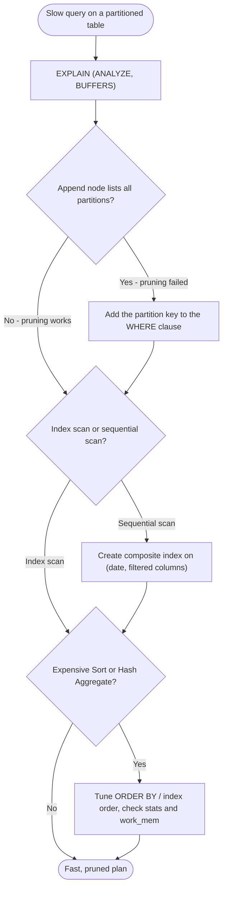

| Difficulty | Channel | Tags |
|---|---|---|
| intermediate | database | explain, query-plan, partitioning |

There is a moment every database engineer dreads: the monitoring page is red, and your largest table is measured in terabytes. That moment arrived for GitLab when ci_builds — a single CI/CD pipeline table — had grown to roughly 2.5TB, blowing past the company's 100GB per-table limit [1]. Partitioning looked like the obvious escape hatch. But after the rollout, two Severity 2 incidents (INC-8367 and INC-8474) hammered GitLab.com, and the culprit wasn't slow disk I/O — it was the queries themselves [1]. This is the story of how one missing filter turned a finished migration into a production incident, and how reading EXPLAIN like a detective turned 50ms cross-partition scans into 0.02ms pruned lookups.

---

> ### Real-World Case — GitLab
>
> GitLab's CI/CD database tables (p_ci_pipelines, p_ci_builds) grew to terabytes — ci_builds alone was ~2.5TB — violating their 100GB per-table limit. They partitioned the tables on a logical partition_id (created incrementally like date partitions), but after rollout, two Severity 2 production incidents (INC-8367, INC-8474) hit GitLab.com: high-frequency lookups that filtered only on id, without the partition key, did full cross-partition scans that saturated the Postgres LockManager LWLock on CI replicas, causing database lock contention and Sidekiq job queueing SLO violations.
>
> | | |
> |---|---|
> | **Challenge** | A partitioned table only helps when the WHERE clause lets the planner prune partitions. Dozens of high-call-rate queries (pipeline/job lookups by primary key alone) bypassed the partition key, so every invocation scanned every partition — and as more partitions were added over time, each unpruned query became progressively more expensive until it took down replicas. |
> | **Solution** | Inspect EXPLAIN plans to confirm 'Subplans Removed > 0' and built automated query analyzers to detect unpruned scans. Then fixed the ORM layer: added partition_id to lookup queries and implemented the 'prune-first, fall-back' pattern (Ci::PartitionableFinder) that first queries only the current partition and falls back to a full scan only if the row isn't found. Composite primary keys (id, partition_id) let ActiveRecord keep looking up by id while routing to one partition. Earlier benchmark work also showed 8-10x execution time wins (2s to 0.2s) from partition pruning on group-scoped queries. |
> | **Outcome** | Single-partition lookups dropped from ~50ms (full cross-partition scan) to ~0.02ms after pruning. Group-based issue search on a 64-partition table improved ~8-10x in execution time. Adding the partition key to high-call-rate queries eliminated the LockManager LWLock saturation, unblocked partition creation, and restored confidence that new partitions wouldn't cause incidents. |
> | **Lesson** | Partitioning is a double-edged sword: it only pays off if queries actually include the partition key. A partitioned table can be slower than the unpartitioned one when pruning fails — verify with EXPLAIN that partitions are actually removed, and treat 'queries missing the partition key' as a bug you detect on CI, because they silently scale worse as partitions multiply. |

---

## Hook — The pager that went off at the worst possible moment

It was not a Friday-afternoon-deploy moment, but it might as well have been. GitLab engineers watched the CI replicas' LockManager LWLock saturate as thousands of queries fanned out across every partition of a freshly partitioned table [1]. Database lock contention cascaded into Sidekiq job queueing, tripping SLO alerts. The strange part? The migration had been carefully planned, rolled out in stages, and deemed complete. The even stranger part? The table was partitioned — and partitioning is supposed to make big tables fast, not break them.

Here is the thing though: partitioning is a promise, not a guarantee. The promise is that the query planner will skip the partitions it does not need. The reality is that the planner can only prune what you let it. Every one of those painful queries was filtering on a plain id column — and none of them mentioned the partition key. So PostgreSQL dutifully searched every single partition, one after another, hammering the same lock structures as it went [1].

Sound familiar? If you have ever stared at a partitioned table and muttered "but I partitioned it, why is it slow?" — this story is for you. Before you blame the hardware, the tuning guide, or the DBA, there is one tool that will tell you the truth, and it has been in PostgreSQL since the beginning.

## Problem — Your 100M-row table is partitioned. It's still slow. Now what?

So, the interview scenario: a 100-million-row table partitioned by date, a query that filters on a specific date range, and a response time that makes coffee brewing look snappy. Most developers' first instinct is to reach for an index, any index, and hope [7]. But here is the plot twist: if the planner cannot prove that a partition can be skipped, your beautiful B-tree indexes barely matter — the Append node at the top of your plan will list every partition, and PostgreSQL will chew through each one [2][3].

What is actually happening under the hood? When you query a partitioned table without referencing the partition key, the planner builds an Append over all partitions and then runs a sequential scan (or index scan) inside each one. That is not "a big table scan" — it is dozens of scans glued together, each with its own per-partition startup cost, lock acquisition, and buffer churn. At 100M rows that means millions of rows read for what should have been a handful of pages [3][8].

This is exactly why this question shows up in interviews. It is not an academic trick — it is the difference between a query that takes 50 milliseconds and one that takes 50 seconds, and teams feel that difference in their SLOs. When would you actually use this? Any time a ticket lands on your board that reads "slow query on the partitioned table" — that is the trigger. The stakes: one missed column in a WHERE clause, one planner that cannot prune, and your "optimization" becomes the thing that pages you at 3am. In other words, partitioning is a door you have to know how to open — and the key is the partition key itself.

## Real-World Case — GitLab: two Sev 2 incidents after a 'successful' migration

Building on the problem above, here is what it looks like when the stakes are a production SaaS with millions of users. GitLab's CI/CD pipeline tables — p_ci_pipelines and p_ci_builds — had grown into the terabytes, with ci_builds alone sitting around 2.5TB, well past GitLab's 100GB per-table hard limit [1]. The team did the right thing: they introduced logical partitioning on a partition_id field that was created incrementally over time, exactly like date-based partitions [1].

The rollout went through. And then the incidents started. Two Severity 2 events — INC-8367 and INC-8474 — hit GitLab.com in quick succession. High-frequency lookups that filtered only on id, with no partition key in sight, forced the planner into full cross-partition scans. On the CI replicas, those scans saturated the Postgres LockManager LWLock, because every scan has to grab and release the same internal lock structures. The result: database lock contention, Sidekiq jobs backing up, and SLOs on job queueing blowing up [1].

But here is where the story turns. The fix was not a bigger machine, a faster SSD, or an exotic index type. Once the partition key was added to the high-call-rate queries, the LockManager LWLock saturation evaporated, partition creation was unblocked, and the team could trust new partitions again [1]. The numbers tell the whole story: single-partition lookups dropped from roughly 50ms of cross-partition scanning to about 0.02ms after pruning, and group-based issue search on a 64-partition table improved 8–10x [1].

So the takeaway is hiding in plain sight: partitioning fixed the storage problem, but the queries needed to change too. Storage optimization and query optimization are two separate jobs — and confusing them is how you get a Sev 2 on a Tuesday.

## Deep Dive — Reading EXPLAIN like a detective, not a tourist

Now that you have seen what happens in the wild, let's get into the tool that would have caught it in ten minutes: EXPLAIN. The default output is a tree of plan nodes, and every node is a confession of how the planner expects to execute your query [3]. Run it with ANALYZE and BUFFERS and you get the receipts: actual rows, actual time, and exactly how many buffers each step touched [3].

Four things to check, in order. First, partition pruning: does the Append node show all N partitions, or only the ones your date range covers? The EXPLAIN output marks pruned-away partitions as "never executed" — if you do not see that string, your query is touching partitions it never needed [3][2]. Second, scan strategy: is the planner doing an index scan, or a sequential scan over each partition? Sequential scans on a 100M-row table are the classic "we need an index" smoking gun, but they can also mean the planner thinks the query matches so many rows that an index would be slower [4][7]. Third, sorting and aggregation: a Sort node on a query that could use an index's natural order, or a Hash Aggregate that is chewing memory, is a separate bottleneck entirely [8]. Fourth, the Append count itself: on GitLab's 64-partition tables, an unpruned query multiplied every lock and buffer cost by 64 [1].

Here is the counterintuitive part — the plot twist many developers miss. The answer to slow queries on partitioned tables is rarely "just add an index." An index on (event_date) helps only if the planner can use it inside each partition, and a single-column index does nothing for the append-wide scan pattern. What you usually need is a composite index that matches your WHERE clause, like (event_date, status), so both pruning and filtering are index-backed [4]. And if your queries are read-heavy and your data is mostly immutable, CLUSTER can physically reorder rows to match that index, shrinking the working set — at the cost of locking the table while it runs, which is why GitLab-style always-on systems use it carefully, if at all [5].

| Strategy | What it fixes | The real tradeoff |
|---|---|---|
| Partition key in WHERE | Cross-partition scans, LWLock contention | Breaks query contracts; every caller must pass the key |
| Single-column index | Point lookups in one column | Useless for pruning; partial help on compound filters |
| Composite index (date, filter_cols) | Filter + order within partitions | More write overhead on every INSERT |
| CLUSTER on the index | Physical row locality, fewer buffers | Locks the table; must be re-run as data changes |
| pg_partman-style automation | Partition lifecycle and drift | Adds moving parts that need monitoring [6] |

The rule of thumb: decide first whether your bottleneck is pruning, scanning, or sorting — the EXPLAIN output tells you which — and then pick the lever that matches [3][8]. 💡 Insight: pruning is about the WHERE clause, indexing is about the scan inside a partition; treating them as one problem is the classic mistake. ⚠️ Watch Out: CLUSTER takes a table lock and rewrites the whole table — schedule it, never run it in a hot path. Applying every lever at once is how you end up with a schema nobody can change and a maintenance job that pages you nightly.

## Workflow — Five steps from 'slow' to 'pruned'

This leads to a repeatable process you can run every time someone files a "slow query on the partitioned table" ticket. Think of it as the decision flow in the diagram below — start at the query, and let the EXPLAIN output be your tour guide.

1. Reproduce with EXPLAIN (ANALYZE, BUFFERS). Never tune blind. Production-grade EXPLAIN tells you rows, timing, and buffer reads per node [3].
2. Check pruning first. Count the partitions under the Append. If every partition shows up, your query is missing the partition key — or the constraint the planner relies on is not visible to it [2][3].
3. Fix the query before the schema. Adding the partition key to the WHERE clause is a one-line change that, in GitLab's case, eliminated LWLock saturation entirely [1].
4. If scans are still slow, add a composite index that mirrors the filter columns — (date, status) rather than date alone — and use CREATE INDEX CONCURRENTLY so index builds do not block writes [4].
5. Only after steps 1–4, consider CLUSTER for read-heavy, mostly-immutable partitions, and schedule it off-peak because it takes a lock [5].

The mermaid diagram below is that workflow compressed into a single decision tree — bookmark it, print it, hang it above your desk, because the next time a partitioned query is slow, you will want this path in front of you.

The beauty of this workflow is that it is boring on purpose. Every step is verifiable, every decision comes from output the planner printed for you, and none of it requires guessing [9]. Boring is good — GitLab would have traded both Sev 2 incidents for a few boring minutes with EXPLAIN.

## Code Example — The EXPLAIN-first loop, runnable in five minutes

Enough theory — here is the exact loop, as a bash script, that would have diagnosed GitLab's incidents in a single terminal session. It runs the query, reads the plan, creates the index only after the plan says scans are the problem, and re-verifies at the end that nothing got worse.

## Lessons Learned — What the pager teaches you that tutorials never will

If this story feels heavy, you are not alone — GitLab shipped a well-designed migration and still got burned, and their post-mortem is public so the rest of you do not have to repeat it [1]. Here is what the whole journey boils down to:

• Partitioning changes storage, not queries. A partitioned table is still slow if your queries make the planner read every partition. The partition key is not optional metadata — it is the contract your queries must honor [1][2].
• EXPLAIN before you index. Many developers add an index first and ask questions later. The plan tells you whether the problem is pruning, scanning, or sorting, and each one has a different cure [3][4].
• Composite beats single-column for compound filters. An index on (date) does not cover WHERE status = 'completed'; (date, status) does, and it also feeds index-only scans [4][10].
• Concurrency is a first-class concern. CREATE INDEX CONCURRENTLY for index builds, maintenance windows for CLUSTER, and high-call-rate lookups that hammer the same locks — GitLab's LWLock saturation was a concurrency problem wearing a query-plan costume [1][5].
• Measure before and after. GitLab's numbers — 50ms → 0.02ms, 8–10x on search — are the kind of evidence that turns a fix into a playbook [1].

🎯 Key Point: A query that cannot prune is not a slow query — it is an unfinished one.

🔥 Hot Take: If your "optimization" involves throwing hardware at a partitioned table, you have not read the EXPLAIN plan yet.

The actionable next step is deliberately small: tomorrow, pick the slowest query in your system, run it with EXPLAIN (ANALYZE, BUFFERS), and ask one question — "is the planner doing work it could skip?" Nine times out of ten, that question, asked honestly, points straight at the fix.

---

## Query Optimization Decision Flow

<strong>Original Interview Question</strong>

**Q:** You have a PostgreSQL table with 100M rows partitioned by date. A query filtering on a specific date range is still slow. What would you check in the EXPLAIN plan and how would you optimize it?

**A:** Check partition pruning effectiveness, index utilization patterns, and expensive sort operations. Create composite indexes on (date, filtered_columns) and evaluate clustering strategies for optimal data access.

## Conclusion

The journey started at GitLab's pager going off while a 2.5TB table and two Sev 2 incidents loomed, and it ends with a genuinely small, genuinely boring fix: one filter, one composite index, and a team that learned to read the plan before touching the schema [1]. Partitioning did not fail them — the queries did. When you add the partition key to your WHERE clause, check pruning in the plan, and reach for a composite index only after the evidence says so, you stop fighting your database and start working with it [2][4]. The single idea worth repeating to your team: a partitioned table only performs as well as the queries that visit it, and the query planner will tell you exactly which ones are cheating. Your move: run the EXPLAIN, read the Append, and see for yourself.

---

## References

1. [GitLab incident report](https://handbook.gitlab.com/handbook/engineering/architecture/design-documents/ci_data_decay/pipeline_partitioning/) — article
2. [PostgreSQL: Table partitioning (declarative partitioning)](https://www.postgresql.org/docs/current/ddl-partitioning.html) — documentation
3. [PostgreSQL: Using EXPLAIN](https://www.postgresql.org/docs/current/using-explain.html) — documentation
4. [PostgreSQL: CREATE INDEX](https://www.postgresql.org/docs/current/sql-createindex.html) — documentation
5. [PostgreSQL: CLUSTER](https://www.postgresql.org/docs/current/sql-cluster.html) — documentation
6. [pg_partman — PostgreSQL partition manager](https://github.com/pgpartman/pg_partman) — documentation
7. [Wikipedia: Database index](https://en.wikipedia.org/wiki/Database_index) — documentation
8. [PostgreSQL: Planner/optimizer statistics](https://www.postgresql.org/docs/current/planner-stats.html) — documentation
9. [Wikipedia: Query optimization](https://en.wikipedia.org/wiki/Query_optimization) — documentation
10. [PostgreSQL: B-tree index implementation](https://www.postgresql.org/docs/current/btree-implementation.html) — documentation

---

**Author:** Satishkumar Dhule — [GitHub](https://github.com/satishkumar-dhule) · [LinkedIn](https://linkedin.com/in/satishkumar-dhule) · [Website](https://satishkumar-dhule.github.io)
