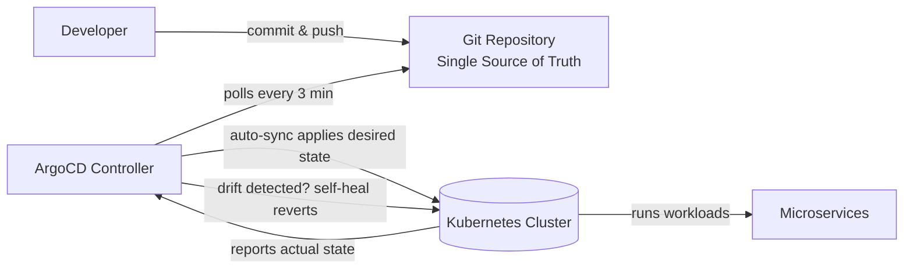

| Difficulty | Channel | Tags |
|---|---|---|
| beginner | devops | argocd, flux, declarative |

In 2018, Intuit was building a Kubernetes platform to run hundreds of microservices — and hitting a wall. Their existing delivery tooling couldn't give them the declarative, Git-driven workflow they needed, so they built their own tool: Argo CD [1]. What started as an internal fix now manages 3,000+ applications across 130+ clusters, and it slashed build-to-deploy time from over 60 minutes to under 10 [1]. Here is the story of how declarative GitOps conquered the Kubernetes world — and what it means for your next deploy.

---

> ### Real-World Case — Intuit
>
> In 2018, Intuit — the maker of TurboTax and QuickBooks with ~50 million customers and 4,000 developers — was building a new Kubernetes platform to deploy hundreds of microservices. Existing CD tools like Spinnaker didn't fit their need for declarative, Git-driven delivery, so they built their own: Argo CD (open-sourced in 2018, later a CNCF incubator project adopted by Tesla, EA, Ticketmaster, and MLB).
>
> | | |
> |---|---|
> | **Challenge** | How to deploy thousands of microservices across a fleet of 130+ Kubernetes clusters (~3,500 managed namespaces on ~4,000 nodes) with a small platform team, while keeping changes auditable, consistent, and rollback-safe — something imperative kubectl-style workflows and traditional pipeline-driven CD couldn't deliver at that scale. |
> | **Solution** | Intuit adopted a pure declarative GitOps model: developers get two repos (source code + Kubernetes manifests), Jenkins handles CI and only promotes image tags into Git, and Argo CD — the only component with cluster credentials — continuously reconciles each cluster against the Git-defined desired state. Jenkins literally has no access to Kubernetes; a Git commit is the deploy trigger. Auto-sync, self-healing, multi-cluster orchestration, SSO/RBAC, and a full audit trail made the entire platform declarative and Git-controlled. |
> | **Outcome** | Build, test, and deployment time dropped from over 60 minutes to under 10 minutes (an ~83% reduction). One GitOps controller now manages 3,000+ applications across 130+ Kubernetes clusters, serving 4,000 developers — who only ever access namespaces, never clusters — maintained by roughly 40 platform engineers. Intuit later grew this to 325+ clusters supporting 7,000+ apps/services. |
> | **Lesson** | The counterintuitive win is enforcing that the CI system has zero cluster access — 'imperative' deploys (kubectl) are structurally impossible, so every change is a reviewable, reversible Git commit. Making Git the only source of truth is what lets a handful of platform engineers run thousands of microservices; the declarative approach scales because you're managing desired state, not executing commands. |

---

## Hook — When Git Becomes the Only Tool You Trust

Picture this: it's 2018 at Intuit — the company behind TurboTax and QuickBooks, serving roughly 50 million customers. A team of 4,000 developers is about to move hundreds of microservices onto a brand-new Kubernetes platform, and the delivery pipeline that worked for years is suddenly the bottleneck. Spinnaker and the other tools of the day demanded pipelines and imperative steps, but Intuit wanted something radically different: a system where Git is the single source of truth and the cluster just follows along [1]. Sound familiar? If you have ever been woken at 3am by a "why is prod different from main?" message, you already know the struggle this story is about.

## Problem — The kubectl Habit That Quietly Breaks Clusters

But here is the uncomfortable truth: most teams still deploy Kubernetes clusters the imperative way. They open a terminal, type kubectl scale, kubectl apply, or worse, kubectl delete --grace-period=0, and hope for the best. That approach works — until it doesn't. The moment a manual change sneaks in, your Git repository stops matching your cluster, and suddenly "works in my cluster, nobody knows why" becomes your new slogan [5]. Configuration drift is the silent killer of reliability: environments drift apart, rollbacks become archaeology expeditions, and your audit trail reads like a choose-your-own-adventure book. This is precisely the pain declarative GitOps was invented to eliminate [6]. The stakes? Availability, auditability, and the sanity of every on-call engineer who has ever diffed a live cluster against a stale YAML file. ⚠️ Watch Out: the scariest part of drift is that it compounds — one manual tweak today becomes three undocumented changes next month, and a full-blown incident the month after.

## Real-World Case — Intuit

So when Intuit hit this exact wall in 2018, they didn't just complain about it — they built their way out. Rejecting Spinnaker because it couldn't do declarative, Git-driven delivery, the platform team wrote their own controller and open-sourced it as Argo CD [1]. The results were staggering. Build, test, and deployment time dropped from over 60 minutes to under 10 — an 83% reduction [1]. But the real plot twist is the team structure: 4,000 developers now only ever touch namespaces, never clusters, and the entire platform is maintained by roughly 40 platform engineers [1]. Intuit later scaled to 325+ clusters supporting 7,000+ apps and services [1]. Argo CD was accepted as a CNCF incubator project and adopted by Tesla, EA, Ticketmaster, and MLB along the way [10]. 🎯 Key Point: this was not a tooling whim — it was a structural bet that Git-driven delivery was the future of software operations.

## Deep Dive — Declarative vs Imperative: The Loop Behind the Magic

Building on that bet, let's unpack what "declarative" actually means under the hood. A declarative approach defines the desired state in version control — YAML manifests, Helm charts, or Kustomize overlays — and lets a controller figure out how to get there [4]. Argo CD continuously reconciles the actual cluster state with that declared state, on an interval you choose, typically every 1 to 5 minutes [3]. The imperative approach, by contrast, fires kubectl commands at a live cluster and treats "current" as correct [5]. You might think both get you the same result — and that is exactly where the plot twist lives. Declarative configs are what Kubernetes itself expects: the API server reconciles your desired state against reality [4]. Imperative commands feel faster in the moment but quietly buy you drift, blind spots, and manual rollbacks. Here is the thing though: the real differentiator is the loop. Git commits are atomic, reviewable, and revertible; kubectl commands are whatever someone typed into a terminal at 2am. 🔥 Hot Take: if you are running kubectl in production to "fix" things, you are not debugging — you are accumulating technical debt with a real-time compounding rate. The honest answer to "declarative or imperative?" is: one is a system, the other is a habit [6].

| | Declarative (GitOps) | Imperative (kubectl) |
|---|---|---|
| **Source of truth** | Git repository [6] | Whatever is live in the cluster |
| **Change path** | Pull request + review [4] | Typed into a terminal [5] |
| **Auditability** | Full commit history | Fragmented or nonexistent |
| **Rollback** | One git revert [3] | Manual reconstruction |
| **Drift** | Reverted automatically [3] | Inherited silently |
| **Team scale** | 4,000 devs, 40 platform engineers [1] | Grows with every cluster |

## Workflow — Five Steps From Commit to Running Cluster

This leads to the practical question: how does a team actually wire this up? The GitOps workflow with Argo CD follows five steps, and the diagram below tells the visual story. First, developers commit changes to Git — that is the only way anything ships. Next, the Argo CD controller polls the repository (or reacts to webhooks) on its sync interval. Third, it diffs the desired state in Git against the live cluster state. If they diverge, auto-sync applies the manifests — and self-healing reverses any manual drift that shows up later [3]. Finally, the cluster's own controllers take over and drive the workloads toward the declared state. The beauty is that every step is observable, from sync status to the health of each application. For teams standardizing on templating, Helm charts give you parameterized releases [7], while Kustomize overlays let you layer environment-specific tweaks without a template language [8]. Flux is the sibling tool in this space — same philosophy, different ergonomics [9]. 💡 Insight: the workflow's real superpower is that it makes "who changed what" a git blame away — the platform team becomes an enabling layer, not a bottleneck [1].

## Code Example — Your First ArgoCD Application, the Declarative Way

Enough theory — let's see it in action. The centerpiece of an Argo CD setup is the Application Custom Resource: a declarative bridge between a Git repo and a cluster [2]. Instead of babysitting kubectl, you define the relationship once and let the controller do the watching.

## Lessons Learned — Battle Scars From the GitOps Trenches

Every hard-won battle leaves scars, and GitOps is no different. Here is what teams discover the hard way, usually around 3am:

- **Turn self-healing off during migration.** If you flip selfHeal: true on a cluster that still carries months of imperative drift, Argo CD will aggressively "fix" things and fight your rollout. Sync the state to Git first, then enable healing [3].
- **prune: true is a loaded gun.** It is exactly what you want for deterministic clusters — and exactly what you don't want pointed at a namespace with unmanaged resources. Test prune in a staging cluster before letting it loose in prod.
- **Sync ≠ success.** Green sync status means the manifests were applied; it says nothing about whether the app is healthy. Configure health checks and pay attention to the resource state column [2].
- **Give developers namespace-scoped access, not clusters.** Intuit's structure — 4,000 devs, namespace-only, ~40 platform engineers — is the endgame this pattern enables [1].
- **Kill the 'manual fix in a crisis' reflex.** The fastest fix is often a kubectl edit — but every emergency bypass writes a line of technical debt that GitOps will dutifully revert the moment you're not looking. Fix the pipeline, not the cluster.

⚠️ Watch Out: many developers think GitOps is a deployment tool. It's not — it's an operating model. The tool is just the enforcement mechanism.

---

## GitOps Sync Loop

<strong>Original Interview Question</strong>

**Q:** You're setting up GitOps for a microservices deployment. How would you configure ArgoCD to automatically sync changes from your Git repository to Kubernetes, and what's the difference between declarative and imperative approaches in this context?

**A:** I'd configure ArgoCD by setting up a Git repository containing Kubernetes manifests or Helm charts, creating an Application CRD that points to the Git repository, enabling auto-sync with a health check interval of 3 minutes, and implementing self-healing to automatically revert any manual changes. The declarative approach involves defining the desired state in Git through YAML manifests, Helm charts, or Kustomize configurations, where ArgoCD continuously reconciles the actual state with the desired state. In contrast, the imperative approach uses kubectl commands to make direct changes to the cluster, bypassing the Git repository as the single source of truth.

## Conclusion

Back to 2018 and Intuit: a platform team that was told "Spinnaker doesn't fit" and decided that was a feature request, not a dead end [1]. The story comes full circle because the problem you face today — drift, manual firefighting, untraceable changes — is the exact problem they engineered away. Tomorrow, you can start smaller: point Argo CD at one repo, turn on auto-sync, and watch the cluster align itself to Git [3]. The single most shareable insight from this story? The best deployment tool is the one you already trust — version control. If your cluster's state lives in Git, your team lives in a world where rollbacks are one command, audits write themselves, and the 3am pager knows exactly who to blame.

---

## References

1. [Intuit incident report](https://www.youtube.com/watch?v=4owbdHzfyMY) — article
2. [Argo CD documentation and source](https://github.com/argoproj/argo-cd) — documentation
3. [Argo CD Auto-Sync and Self-Heal user guide](https://argo-cd.readthedocs.io/en/stable/user-guide/auto_sync/) — documentation
4. [Kubernetes Declarative Management of Objects](https://kubernetes.io/docs/tasks/manage-kubernetes-objects/declarative-config/) — documentation
5. [Kubernetes Imperative Management with kubectl](https://kubernetes.io/docs/tasks/manage-kubernetes-objects/imperative-command/) — documentation
6. [GitOps on Wikipedia](https://en.wikipedia.org/wiki/GitOps) — article
7. [Helm documentation](https://helm.sh/docs/) — documentation
8. [Kustomize project](https://kustomize.io/) — documentation
9. [Flux CD (Flux2) repository](https://github.com/fluxcd/flux2) — documentation
10. [Argo CD — CNCF Cloud Native Computing Foundation project](https://www.cncf.io/projects/argocd/) — documentation

---

**Author:** Satishkumar Dhule — [GitHub](https://github.com/satishkumar-dhule) · [LinkedIn](https://linkedin.com/in/satishkumar-dhule) · [Website](https://satishkumar-dhule.github.io)
