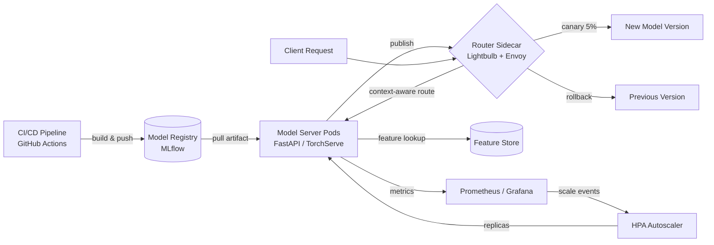

| Difficulty | Channel | Tags |
|---|---|---|
| beginner | devops | mlops, deployment |

Netflix runs ML behind nearly every member experience—recommendations, search ranking, thumbnails, even fraud detection—across 250M+ users [1]. As of 2025, its centralized serving platform routes over 1 million requests per second across hundreds of model types and versions, and here is the plot twist: training the models was never the hard part [1]. The real battle happens in the milliseconds between a request arriving and the right model answering—a battle that has nothing to do with training data and everything to do with how you deploy and serve your models. This is the story of that battle.

---

> ### Real-World Case — Netflix
>
> Netflix runs ML behind nearly every member experience—recommendations, search ranking, thumbnails, fraud detection—across 250M+ users. As of 2025 its centralized ML serving platform handles hundreds of model types and versions at over 1 million requests per second, and the hard problem turned out not to be training models but routing each request to the right model instance on the right cluster shard for the right user and use case.
>
> | | |
> |---|---|
> | **Challenge** | Client microservices needed a simple, uniform way to get model inference without exposing the complexity underneath, while researchers needed to safely iterate: A/B tests, traffic splits, shadow mode, canary releases, and rollbacks. Off-the-shelf AWS API Gateway and service mesh proxies failed requirements—they lacked first-class integration with Netflix's experimentation platform, gRPC endpoints, rich domain-specific routing, and model lifecycle stages. |
> | **Solution** | Netflix built Switchboard, a custom routing proxy acting as the mandatory single entry point (control plane) in front of model serving clusters (data plane), decoupling model serving from model inference. But Switchboard's own success created the plot twist: it sat in the hot path, deserializing/re-serializing large request payloads for every request (adding latency and cost), became a single point of failure, and let one tenant's request surge cascade errors to all users. Netflix redesigned it into Lightbulb: routing metadata resolution was split from the data plane, hot-path routing moved to Envoy via routingKey headers, and imperative JavaScript config was replaced with declarative, auditable JSON routing rules. |
> | **Outcome** | The platform sustains 1M+ requests/second across hundreds of model types and versions. The Lightbulb + Envoy architecture removed the router from the request hot path, eliminated the single-point-of-failure and cross-tenant error propagation, and cut routing latency/cost while preserving context-aware routing, A/B traffic splitting, and safe canary/rollback releases. |
> | **Lesson** | In production ML, the control plane (routing, model versioning, canary/rollback, A/B) must be separated from the data plane (inference) — the abstraction layer that accelerates iteration at small scale becomes the bottleneck and availability risk at ~1M RPS. Generic gateways fail at domain-specific serving needs, and declarative config beats code for operational auditability at scale. |

---

## Hook — The hidden traffic controller behind every recommendation

Ever wondered what happens in the 50 milliseconds between you pressing play and the platform knowing exactly what to suggest next?

No—seriously. Behind that one thumbnail is not a single model. It is hundreds of models, each tuned for a different job: what to watch next, how to rank search results, which thumbnail actually makes you click. Somewhere in a data center, a router has to pick the right version of the right model for the right user, and it has to do that at over 1 million requests per second [1].

Here is the part that surprises everyone: the models are not the bottleneck. The routing is.

Many developers assume that once a model scores well in training, the hard work is done. If only. The moment a model ships to production, a completely different kind of engineering takes over—one that decides whether your team ships features in days or spends nights staring at a 3am pager alert. The industry wraps all of this in a single word: "deployment." That one word hides a quiet war between two very different disciplines [10].

## Problem — One word, two completely different jobs

Here is where the confusion starts: "model deployment" and "model serving" get used interchangeably, and it costs teams real pain.

Think about what happens when you conflate them. You package your model into a Docker container, push it to Kubernetes, and call it a day. Then traffic spikes. Your serving layer was never built to scale that way, and latency crawls past your SLO. Because your deployment and your serving are tangled together, you cannot roll back one without redeploying everything. Now a single bad model version takes down every endpoint sharing its pod.

The pain compounds as your model count grows. This is not a two-model problem—mature platforms juggle hundreds of model types with multiple versions each, and every combination needs its own route [1]. A deployment pipeline that worked beautifully for one model becomes a minefield at fifty. Sound familiar? Most teams discover this the hard way: the deploy looked fine. Then the pager went off.

This leads to the real question hiding underneath: if deployment is about getting artifacts safely into production, what exactly is serving responsible for? The answer transforms a vague concept into a concrete set of systems you can design, measure, and actually debug.

## Real-World Case — Netflix

Netflix's routing team lived this problem at a scale most developers will never see, and they documented the entire journey publicly [1].

As of 2025, Netflix's ML serving platform handles over 1 million requests per second across hundreds of model types and versions, powering recommendations, search ranking, thumbnails, and fraud detection for 250M+ members [1]. The hard problem, their engineers report, was never training the models—it was routing each request to the right model instance on the right cluster shard for the right user and use case [1].

Their original architecture placed a router directly in the request hot path. It worked... until it did not. A single router became a single point of failure: when one tenant's traffic misbehaved, errors propagated across every other tenant sharing the infrastructure. Scaling meant scaling the router—and the router did nothing except redirect.

So they rebuilt it. The Lightbulb + Envoy architecture moved the router out of the request hot path entirely: each model server gets a lightweight sidecar that makes routing decisions locally, while Envoy handles the data-plane traffic [7]. The result was dramatic—no single point of failure, no cross-tenant error propagation, and lower routing latency and cost—while preserving context-aware routing, A/B traffic splitting, and safe canary and rollback releases [1].

Here is the plot twist: the fix was not a better model. It was a better architecture around the models.

## Deep Dive — Deployment and serving, properly separated

Building on the Netflix story, let's separate the two disciplines cleanly, because each has its own tools, its own failure modes, and its own trade-offs.

**Model deployment** is everything that happens before the first request arrives: CI/CD pipelines that build and test your artifact, infrastructure provisioning with Kubernetes and Terraform, model registries like MLflow that track versions, and the monitoring and rollback strategies that save you when things go wrong [5][8]. It answers the question: "how does this model safely get to production?"

**Model serving** is everything that happens after: running the inference API, loading model weights into memory, routing requests to the correct version, batching, and optimizing response latency [2][3]. It answers: "how does this model answer requests quickly and correctly, at scale?"

| | Deployment | Serving |
|---|---|---|
| Core job | Get models to production safely | Answer requests at runtime |
| Primary tools | Kubernetes, Docker, Terraform, GitHub Actions [8] | FastAPI, gRPC, TensorFlow Serving [2], TorchServe [3], BentoML [4] |
| Lifecycle events | Build, test, release, rollback | Load, route, predict, scale |
| Scaling focus | Pipeline capacity, infra provisioning | Autoscaling pods based on QPS [6] |
| Failure mode | Bad release, broken pipeline | Cold start, latency spike, model crash |

Consequently, three trade-offs dominate every serving design conversation:

**Latency vs. throughput.** Real-time APIs demand sub-100ms responses; batch pipelines can tolerate seconds [2]. You cannot optimize both at once—batching raises throughput but adds the latency of waiting for a full batch to fill.

**Real-time vs. batch inference.** Interactive features like search and recommendations need real-time serving; offline workloads like fraud model retraining can use batch scoring. Choosing wrong means either wasted compute or furious users.

**The cold start problem.** Model weights are heavy—hundreds of megabytes to gigabytes. A scaled-to-zero pod can take seconds to load weights before it answers its first request. Netflix's sharded sidecar approach sidesteps this by keeping models warm across cluster shards [1].

⚠️ **Watch Out:** autoscaling only saves you if your model loads fast. Cold start is a deployment-shaped problem wearing a serving-shaped mask.

💡 **Insight:** if your model takes five seconds to load weights, no autoscaler can rescue you. Preload, shard, and keep it warm.

## Workflow — From git commit to a served prediction

Now that the trade-offs are clear, here is the full path from a git commit to a served prediction—the workflow Netflix's architecture, and most mature ML platforms, follow [1].

The diagram below tells the visual story: code flows through a pipeline into a registry, gets deployed as pods, and only then enters the serving plane where a router decides who answers each request.

1. **Build.** Your CI/CD pipeline (GitHub Actions, Jenkins) builds the model image and runs tests [8]. If tests fail, the pipeline stops here—cheap failure is a feature.
2. **Register.** Push the artifact to a model registry like MLflow with a version tag [5]. Now every deployment is traceable and rollback-able.
3. **Deploy.** Kubernetes rolls out the new version as pods with health checks [6]. A bad health check blocks the rollout automatically.
4. **Route.** Requests hit the router, which selects the right model instance for this user and use case—Netflix's sidecar keeps this decision local [1][7].
5. **Serve.** The model server loads weights, runs inference, and returns a response in milliseconds [2].
6. **Monitor.** Track latency, error rate, and drift. The autoscaler adds replicas as QPS rises [6].
7. **Rollback.** Canary releases send 5% of traffic to the new version first; if metrics degrade, you flip back to the previous version in seconds [1].

🎯 **Key Point:** deployment gets you to the gate; serving gets you through it. Confusing the two means you will build a pipeline that can ship models but not answer traffic—or a server that answers traffic but cannot ship safely.

## Code Example — A minimal context-aware model router

Make this concrete with a minimal but realistic router—the same pattern Netflix uses, minus the million requests per second [1]. This snippet is the serving-plane decision Netflix's team automated: pick a version, route the request, keep the metadata for comparison.

```python
from fastapi import FastAPI, HTTPException
from pydantic import BaseModel
import random

app = FastAPI(title="Model Router")

class PredictRequest(BaseModel):
    user_id: str
    payload: dict

# In-memory version registry: (model_name, version) -> inference callable
REGISTRY = {
    "rec/v1": lambda p: {"score": 0.4, "version": "v1"},
    "rec/v2": lambda p: {"score": 0.6, "version": "v2"},
}

# Canary config: new version gets 5% of traffic until it proves itself
CANARY = {"new": "v2", "stable": "v1", "weight": 0.05}

@app.post("/predict/{model_name}")
def predict(model_name: str, req: PredictRequest):
    # Reject unknown model names before doing any work
    if not any(k.startswith(model_name + "/") for k in REGISTRY):
        raise HTTPException(404, detail="Unknown model")

    # 1. Routing decision: which version answers this request?
    version = CANARY["stable"]
    if random.random() < CANARY["weight"]:
        version = CANARY["new"]  # canary slice sees the new model

    # 2. Dispatch to the right inference function for this user
    fn = REGISTRY[f"{model_name}/{version}"]

    # 3. Return prediction + route metadata for A/B comparison
    return {"user_id": req.user_id, **fn(req.payload.dict()),
            "route": f"{model_name}/{version}"}
```

Walk through what happens on each request. First, the router validates the model name—cheap fail-fast that keeps garbage out of the hot path. Second, it makes the canary decision: 95% of traffic goes to the stable version, 5% to the new one. That single `random.random()` call is the entire A/B traffic splitter. Third, it dispatches to the versioned inference function and returns the route alongside the prediction.

The subtle detail: the response carries the `route` field. That metadata is what lets you compare canary vs. stable outcomes in your metrics dashboard, decide whether the new version is safe, and flip the `weight` to 1.0—or drop it to 0 for an instant rollback [1]. In production, the registry becomes a distributed lookup and the router becomes a sidecar process, but the decision logic is exactly this.

## Lessons Learned — What to change tomorrow

Netflix's journey is not a story about scale—it is a story about separation of concerns, and every lesson translates directly to your stack [1].

- **Deployment and serving are two disciplines.** Give them separate tools, separate pipelines, and separate owners. Deployment ships artifacts; serving answers requests [5][2].
- **Route outside the hot path.** A central router is a single point of failure, as Netflix's cross-tenant errors proved [1]. The sidecar pattern keeps routing local, fast, and isolated [7].
- **Design for rollback from day one.** Canary releases and instant rollback are not luxuries; they are the difference between a five-second fix and a 2am incident. Netflix kept both while removing the router [1].
- **Autoscale on the right signal.** Scale on QPS and latency, not on raw CPU, and never let autoscaling hide a cold start problem [6].
- **Track the metrics that matter.** Latency percentiles, error rate, and prediction drift tell you more about serving health than any training dashboard ever will.

**The immediate action:** draw your current serving architecture on a whiteboard. Where is the router? Where is the single point of failure? If your answer is "the same place as my deployment," you now know exactly what to fix first.

---

## Model Deployment to Serving Lifecycle



<details>
<summary><strong>Original Interview Question</strong></summary>

**Q:** Explain the key differences between model serving and model deployment in ML systems, including specific technologies, scaling considerations, and real-world implementation patterns?

**A:** Deployment encompasses CI/CD pipelines, infrastructure setup, and monitoring using tools like Kubernetes, MLflow, and SageMaker. Serving focuses on runtime inference APIs with frameworks like TensorFlow Serving, TorchServe, or BentoML, handling request routing, model versioning, and autoscaling. Key trade-offs include latency vs throughput, batch vs real-time inference, and cold start optimization.

</details>

## Conclusion

Netflix's million-requests-per-second platform is proof that the models were never the bottleneck—the systems around them were [1]. The moral of the story is deceptively simple: you do not deploy models, you deploy the systems that serve them, and the sooner you separate the two, the sooner the 3am pager goes quiet. Tomorrow, sketch your serving architecture. Find the single point of failure. Move the router out of the hot path, wire up a canary, and design rollback before you need it. One memorable insight to take back to your team: a model that is deployed but cannot be served is just a very expensive training artifact.

---

## References

1. [Netflix incident report](https://netflixtechblog.com/state-of-routing-in-model-serving-16e22fe18741) — article
2. [TensorFlow Serving documentation](https://www.tensorflow.org/tfx/serving/overview) — documentation
3. [TorchServe — GitHub repository](https://github.com/pytorch/serve) — documentation
4. [BentoML — GitHub repository](https://github.com/bentoml/BentoML) — documentation
5. [MLflow documentation](https://mlflow.org/docs/latest/index.html) — documentation
6. [Kubernetes Horizontal Pod Autoscaling](https://kubernetes.io/docs/tasks/run-application/horizontal-pod-autoscale/) — documentation
7. [Envoy Proxy documentation](https://www.envoyproxy.io/docs/envoy/latest/) — documentation
8. [GitHub Actions documentation](https://docs.github.com/en/actions) — documentation
9. [Amazon SageMaker documentation](https://docs.aws.amazon.com/sagemaker/latest/dg/whatis.html) — documentation
10. [MLOps — Wikipedia](https://en.wikipedia.org/wiki/MLOps) — documentation

---

**Author:** Satishkumar Dhule — [GitHub](https://github.com/satishkumar-dhule) · [LinkedIn](https://linkedin.com/in/satishkumar-dhule) · [Website](https://satishkumar-dhule.github.io)
