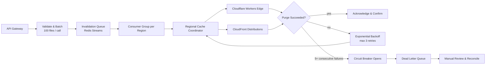

| Difficulty | Channel | Tags |
|---|---|---|
| intermediate | system-design | edge, caching, purging |

By May 2022, Cloudflare's cache purge system had quietly become the biggest weakness nobody was allowed to talk about: every invalidation request flew to a single 'core' data center, queued behind Kafka buffers, and consumed disk space that caching needed — leaving global purge latency at 1.57 seconds P50 [1]. For every developer publishing behind a CDN, that meant bug fixes, security patches, and pricing updates were landing seconds after they should. Then Cloudflare rebuilt the pipeline and cut that latency by 90.5% [1]. Here is how they did it — and how you can bring the same five-second promise to your own architecture.

---

> ### Real-World Case — Cloudflare
>
> After a decade of growth, Cloudflare's cache purge system had outgrown its original architecture. Every purge request was routed to a centralized 'core' data center (via Quicksilver replication, buffered by Kafka queues), so purge latency grew with distance from the ingest point and write bottlenecks, and storing millions of daily purge keys consumed disk space needed for caching. By May 2022 global purge latency sat at 1.57 seconds P50.
>
> | | |
> |---|---|
> | **Challenge** | Build a global cache invalidation system that propagates a purge to every one of 330+ data centers across 120+ countries near-instantly and scales to massive throughput, without storage and latency costs growing with usage — all while racing the physical speed-of-light limit of ~65ms to ~200ms for a global fan-out. |
> | **Solution** | They abandoned the centralized spoke-hub model entirely and built 'coreless purge': a decentralized, peer-to-peer distribution system where any data center can ingest a purge and fan it out directly, plus CacheDB, a Rust/RocksDB service on every cache machine that actively indexes and deletes purged content (replacing the lazy-purge approach). The cache proxy also checks the local purge queue on every cache HIT so a file is never served stale even while a huge purge is still being processed from disk. |
> | **Outcome** | Global purge latency dropped from 1,570ms to 149ms P50 (a 90.5% improvement) across all 330 cities and 120+ countries; storage requirements for purge data were reduced 10x, freeing disk space that improved cache HIT ratios and reduced origin egress; single-file purges hit 234ms P50. |
> | **Lesson** | The counterintuitive insight: for global cache invalidation, the centralized coordinator is the bottleneck — a decentralized peer-to-peer fan-out from the edge beats it in both latency and scale. There is also a hard physics limit (~150ms global), so once you are network-bound the only remaining wins come from eliminating processing, buffering, and storage overhead. |

---

## Hook — the five-second promise nobody thinks about

Picture this: a security patch just merged, the deploy pipeline is green, and you are one keyboard shortcut away from victory. Then the scanner shows your old, vulnerable version still live in 14 regions. This is the hidden tax of every CDN: cache purge — the delete button for the internet's memory. It never makes the architecture slide, yet the moment it stalls, stale content bleeds everywhere. And here is the uncomfortable truth many developers discover too late: purging is not a fire-and-forget DELETE request. It is a distributed-consensus problem wearing a caching costume — and the internet is full of companies that learned that the hard way [1].

## Problem — the invisible tax on stale content

You might think a single purge service is the obvious answer. One queue, one worker, one happy DELETE — but for a decade, even Cloudflare ran that way [1]. The consequences only arrive slowly: every invalidation request travels to a centralized 'core' data center, so latency grows with the distance between the edge and that core. Concurrently, the core becomes a write bottleneck, and every purge key you store eats disk space that could have served cache hits instead. Ever wondered why a purge takes two seconds in Virginia but eight in Sydney? Because the request is flying across the planet to ask permission. Now add the stakes on top: a leaked credit-card number cached at the edge, a pricing typo served for an extra day, a compliance violation your lawyers will bill you for. The requirements are brutal — under five seconds of propagation globally, 10,000 concurrent invalidations per second, 99.99% availability — and 'eventually' is not in the vocabulary [2].

## Real-World Case — Cloudflare

Cloudflare lived this struggle for a decade. After years of growth, their purge architecture had a single point of shame: every purge request was routed to one centralized 'core' data center, replicated via Quicksilver and buffered through Kafka queues. The result was mechanical and painful — purge latency grew with distance from the ingest point, writes bottlenecked, and storing millions of daily purge keys consumed the very disk space caching needed. By May 2022, global purge latency sat at 1.57 seconds P50 [1]. So they rebuilt it from the ground up, pushing coordination to the edge. The numbers tell the story: global purge latency dropped from 1,570ms to 149ms P50 — a 90.5% improvement across all 330 cities and 120+ countries — and storage requirements for purge data shrank 10x [1]. That freed disk improved cache hit ratios and cut origin egress, and single-file purges hit 234ms P50 [1]. Same internet. Same traffic. A different philosophy: don't route to the core — coordinate at the edge. The question now is what that philosophy looks like in practice.

## Workflow — the seven-step purge pipeline

Here is how the whole pipeline flows, step by step:

1. **Ingest** — An API gateway receives invalidation requests, validates them, and batches up to 100 paths into a single message.
2. **Queue** — The batch lands in a Redis Stream; consumer groups guarantee each region reads its own slice of work without double-processing [8].
3. **Coordinate** — Regional cache coordinators fan out to the edge, deciding which providers and zones are actually affected.
4. **Execute** — Edge workers fire provider purges — Cloudflare zones or CloudFront distributions — using pattern-based wildcards where possible [3][4].
5. **Retry** — Failures retry with exponential backoff plus jitter, capped at three attempts.
6. **Protect** — Five consecutive failures trip the circuit breaker; anything left goes to the dead-letter queue for manual review.
7. **Reconcile** — Health checks monitor regional endpoints, and periodic reconciliation closes the gaps left by network partitions.

The diagram below maps the full journey — from API gateway to dead-letter queue — so you can see where each pattern slots in.

## Code Example — a regional purge coordinator in Node.js

The heart of this system is a regional coordinator. Here is a production-shaped worker in Node.js that demonstrates all the patterns discussed: Redis Streams consumer groups, batch reads, ack-after-success semantics, exponential backoff with jitter, a circuit breaker, and a dead-letter queue.

## Lessons Learned — battle scars from a 90.5% victory

After tracing this journey from 1.57 seconds to 149 milliseconds [1], several lessons survive contact with reality:

- **The core is the bottleneck — move it.** If your purge latency grows with distance to one data center, you have already lost the geometry war.
- **Batch or pay.** Per-file purge calls are a tax; 100 paths per API call cuts costs by ~90% while dramatically raising throughput.
- **Jitter is non-negotiable.** Exponential backoff without jitter is just a coordinated denial-of-service on your own provider.
- **A short TTL is a free safety net.** `max-age=2, must-revalidate` means even a dropped purge self-heals [2][5].
- **Break circuits, keep dead letters.** At 10K invalidations per second, failures are guaranteed; only the unobserved ones are dangerous.
- **Measure P50, then obsess over it.** Cloudflare's entire rebuild was catalyzed by a number: 1,570ms. You cannot fix what you are not measuring [1].

If this feels like a lot, you are not alone — but the path is smaller than it looks. Tomorrow: instrument your purge latency, add a 2-second TTL, and batch your next invalidation call. The rest can grow from there.

---

## Multi-Region Cache Purge Pipeline

<strong>Original Interview Question</strong>

**Q:** How would you design a multi-region CDN cache purging system that guarantees content propagation within 5 seconds while handling 10,000 concurrent invalidations per second?

**A:** Implement Cloudflare API + AWS CloudFront with distributed invalidation queue, edge compute coordination, and 2-second TTL. Use batch invalidation, exponential backoff, and regional cache headers for 5-second SLA.

## Conclusion

The journey started with a number most of us would have shrugged at — 1.57 seconds — and ended with a lesson: purging is not a delete button, it is a distributed system with a deadline. Cloudflare proved the ceiling could move 90.5% lower [1], and the playbook is fully public: localize state, coordinate at the edge, batch aggressively, retry with discipline, and let a short TTL catch what slips through. The memorable insight to take back to your team? Your cache is only as fresh as your slowest purge — so design for the slowest one, and everything else becomes fast.

---

## References

1. [Cloudflare incident report](https://blog.cloudflare.com/instant-purge/) — article
2. [MDN — HTTP Caching](https://developer.mozilla.org/en-US/docs/Web/HTTP/Caching) — documentation
3. [Cloudflare — Purge cache documentation](https://developers.cloudflare.com/cache/how-to/purge-cache/) — documentation
4. [AWS — Invalidating CloudFront files](https://docs.aws.amazon.com/AmazonCloudFront/latest/DeveloperGuide/Invalidation.html) — documentation
5. [RFC 5861 — HTTP Cache-Control stale-while-revalidate](https://datatracker.ietf.org/doc/html/rfc5861) — documentation
6. [Wikipedia — Exponential backoff](https://en.wikipedia.org/wiki/Exponential_backoff) — documentation
7. [Wikipedia — Circuit breaker design pattern](https://en.wikipedia.org/wiki/Circuit_breaker_design_pattern) — documentation
8. [Redis — Streams data type documentation](https://redis.io/docs/latest/develop/data-types/streams/) — documentation
9. [DigitalOcean — An Introduction to HTTP Caching in Node.js](https://www.digitalocean.com/community/tutorials/an-introduction-to-http-caching-in-node-js) — documentation
10. [Wikipedia — Eventual consistency](https://en.wikipedia.org/wiki/Eventual_consistency) — documentation

---

**Author:** Satishkumar Dhule — [GitHub](https://github.com/satishkumar-dhule) · [LinkedIn](https://linkedin.com/in/satishkumar-dhule) · [Website](https://satishkumar-dhule.github.io)
