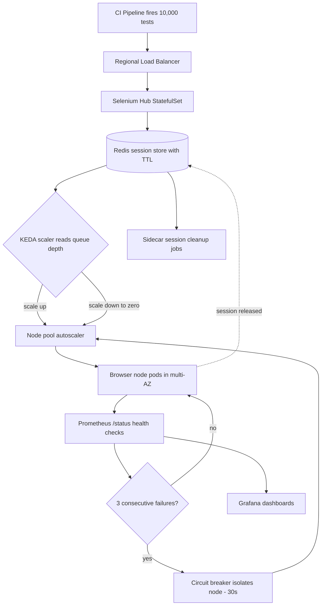

| Difficulty | Channel | Tags |
|---|---|---|
| advanced | system-design | selenium, webdriver, grid |

Volvo Cars ran one of the largest Selenium Grids in the industry — and watched it quietly fail to scale when it mattered most. Their always-on browser nodes burned cloud budget around the clock, while Kubernetes' built-in autoscaler sat frozen while tests piled up in the session queue [1]. The counterintuitive root cause? Browser pods can be completely occupied with active test sessions while consuming almost no CPU. What the team discovered next spawned an industry-standard scaling mechanism — and it all starts with the question of what your grid is actually measuring [1].

---

> ### Real-World Case — Volvo Cars
>
> Volvo Cars ran a large Selenium Grid for UI testing but the browser nodes were always-on, wasting cloud resources, and the built-in Kubernetes Horizontal Pod Autoscaler could not scale them correctly. They discovered that Kubernetes' CPU/memory-based autoscaling fundamentally breaks for Selenium workloads: browser pods can be fully occupied with active test sessions while using very little CPU, so tests pile up in the grid's session queue and HPA never triggers a scale-up.
>
> | | |
> |---|---|
> | **Challenge** | Designing an autoscaling Selenium Grid on Kubernetes where scaling must be driven by the number of session requests queued in the grid (not CPU/memory), AND ensuring that scale-down events never kill a browser pod mid-test. This required event-driven autoscaling plus a graceful session lifecycle: stop accepting new sessions, drain the active one, then terminate. |
> | **Solution** | Volvo Cars engineered and open-sourced the official KEDA (Kubernetes Event-Driven Autoscaler) Selenium Grid scaler, which queries the Selenium Grid's GraphQL API and creates one browser node per pending request in the session queue. They combined it with Kubernetes PreStop hooks and the grid's /se/grid/node/drain endpoint: on scale-down, the pod is told to drain, finishes its current test (terminationGracePeriodSeconds of up to an hour), and only then shuts down - eliminating randomly-killed sessions that vanilla HPA scale-down caused. The scaler became the standard solution, co-maintained by SeleniumHQ and integrated directly into Selenium's official Helm chart (scaling browser node deployments from 0 up to 80+ replicas on demand and back to zero when idle). |
> | **Outcome** | The KEDA Selenium Grid scaler they built became the industry-standard mechanism for autoscaling Selenium Grid on Kubernetes, maintained by both Volvo Cars and SeleniumHQ. It enables grids to scale from zero to dozens of browser pods based purely on session-queue depth and collapse back to zero when idle (something standard HPA cannot do), eliminating always-on idle node cost while guaranteeing zero test sessions are interrupted during scale-down. The pattern is now built into Selenium's own Helm chart, adopted by teams worldwide running thousands of parallel browser sessions. |
> | **Lesson** | For browser-testing workloads, CPU and memory utilization is the wrong scaling signal - a node can be 100% busy with sessions at 10% CPU. Scale on the work queue depth instead (event-driven autoscaling), and treat node termination as part of session lifecycle management: drain before delete, so graceful shutdown means 'finish the test, then die' rather than 'kill the session.' |

---

## Hook — The test suite that scales to zero

It is 2:47 a.m. and the pager will not stop vibrating. The nightly regression suite — 10,000 browser sessions across four teams — has ground to a halt. Tests are queueing, not running, and the cluster dashboard shows nearly 0% CPU. The frustrating part? The cluster is actually full: every node is hosting a session, yet Kubernetes sees an idle cluster and refuses to grow it. The stakes are brutal. A 99.9% uptime SLA allows roughly nine hours of downtime a year, and a single session that never terminates can quietly consume a node for days. Memory leaks turn browser nodes into zombies, node failures cascade into flaky results that drown real bugs, and suddenly 'the tests are slow' becomes a company-wide fire drill. This is Selenium Grid at massive scale: simple in tutorials, stubborn in production. And the fix is not what you think.

## Problem — Why CPU-based autoscaling betrays Selenium workloads

Many developers assume autoscaling is a solved problem: Kubernetes watches CPU, and when usage climbs, the Horizontal Pod Autoscaler spins up replicas [3]. That works beautifully for stateless web APIs. For Selenium, it fails spectacularly. Here is the plot twist: a browser process spends most of its session waiting — for the page, the network, the user-triggered JavaScript, that slow third-party iframe. A fully occupied browser pod can hover near zero CPU. Meanwhile, the session queue keeps growing, because every node is technically 'in use' while doing almost nothing. This is the measurement trap Volvo Cars walked straight into, and it is not subtle. HPA never triggers because it reads the wrong signal, so the grid never scales up. The nodes that do exist stay pinned on around the clock, burning cloud budget even when no tests run. And long-lived sessions pile onto the same nodes, leaking memory until a pod crawls or crashes. You are not facing one problem — you are facing three, all sharing a single root cause: nobody is measuring the thing that actually matters, which is the length of the session queue.

## Real-World Case — Volvo Cars

In 2022, Volvo Cars shared the story behind their large Selenium Grid for UI testing, and it reads like a masterclass in measuring the wrong thing [1]. Their browser nodes were always-on, wasting cloud resources, and the built-in Kubernetes Horizontal Pod Autoscaler could not scale them correctly no matter how the team tuned it. The root cause was exactly the paradox from the previous section: browser pods can be fully occupied with active test sessions while consuming very little CPU, so tests stacked up in the grid's session queue while HPA sat dormant [1]. So the team did something unconventional — they stopped trying to make CPU-based autoscaling work and built a scaler that watches session-queue depth instead. That component became the KEDA Selenium Grid scaler, now maintained by both Volvo Cars and SeleniumHQ and baked directly into Selenium's own Helm chart [1][2]. Teams using it scale from zero to dozens of browser pods based purely on queue depth, then collapse back to zero when idle. That single behavioral change eliminated always-on idle node cost while guaranteeing zero test sessions are interrupted during scale-down [1]. The counterintuitive takeaway: the metric everyone watches — CPU — is the wrong one. The grid's real signal is waiting work, not active work.

## Deep Dive — Anatomy of a grid that survives 10,000 sessions

Building on the Volvo story, suppose the target is the spec from the original question: 10,000 concurrent sessions, 99.9% uptime, zero memory leaks. Start with topology. The classic hub-node pattern maps cleanly onto Kubernetes: a hub StatefulSet routes requests to browser nodes spread across multiple availability zones. Every session registers in a Redis cluster with TTL-based expiration [6], which doubles as both the session store and the scaling signal — the same signal the KEDA scaler reads. Now do the math, because this is where most designs fall apart. At roughly 50 sessions per node, 10,000 sessions means 200 nodes minimum. At 2GB per node that is 400GB of baseline memory; add a 30% headroom buffer and the cluster needs about 520GB. Nobody wants that bill running flat, which is exactly why queue-based scaling is not a luxury — it is the mechanism that keeps 520GB of nodes from existing at 5 p.m. when the suite has finished. Memory management needs three layers. Prevention: weekly rolling restarts, alerting at 80% memory usage, and garbage-collection tuning. Cleanup: Kubernetes init containers that remove stale Docker volumes, plus Redis key-expiration scans every five minutes [6]. Monitoring: Prometheus scraping every node with Grafana dashboards for memory trends and session durations [7]. Resilience comes last. A weighted round-robin load balancer routes new sessions toward the healthiest nodes, every node exposes a /status endpoint polled every ten seconds, and three consecutive failures trigger immediate removal with a circuit breaker isolating the node for a 30-second recovery window [8]. Pod Disruption Budgets keep at least 85% of capacity available during node drains [5], and canary deployments roll out new node images gradually so a bad release cannot kill the grid [10].

## Workflow — From queue depth to browser pods in five steps

Here is how the entire system behaves in practice, in five steps. First, tests fire — say the 3 a.m. regression suite — and each new session request lands in Redis as a pending key with a TTL. Second, the KEDA scaler polls queue depth on a fixed interval and translates it into a desired replica count [4]. Third, the cluster autoscaler expands the node pool and fresh browser pods appear within minutes. Fourth, every node registers with the hub and reports /status health every ten seconds; unhealthy nodes are removed before they ever receive traffic. Fifth, when the queue drains, the same scaler shrinks the pool back to zero — no humans, no cron jobs, no idle cost. The diagram below traces the full journey from test trigger to teardown.

## Code Example — A session pool that cannot leak

The whole philosophy collapses into one discipline: sessions are finite resources with explicit lifecycles, and the code must refuse to leak them. The following pool enforces that on the client side, in the language most test suites speak.

## Lessons Learned — Measure the queue, not the CPU

The journey reduces to a handful of lessons you can apply tomorrow. First, measure what matters: for queued workloads like Selenium, that is queue depth, not CPU — the metric that misled the original Volvo grid [1]. Second, treat every session as a lease with a lifecycle: TTLs on the platform side, guaranteed release on the client side, and cleanup jobs for whatever slips through [6]. Third, make failure cheap and automatic: ten-second health checks, circuit breakers that quarantine a node for 30 seconds, and Pod Disruption Budgets that preserve 85% capacity [5][8]. Fourth, never change a running grid blindly — canary deployments and rolling updates turn the worst case from 'dead cluster' into 'degraded release' [10]. And fifth, do the cost math early: 200 nodes and 520GB of memory is a bill you do not want always-on [9]. There are battle scars to respect too. CPU-based autoscaling on Selenium workloads is the trap. Sessions never released in tear-down code are the leak. Health checks that only run on a schedule instead of continuously are the slow-burn outage. And scaling down so aggressively that in-flight sessions die mid-test is the nightmare — precisely why Volvo's scaler guarantees zero interrupted sessions during scale-down [1]. So here is the homework: audit your autoscaler's signal today. If it watches CPU while your tests wait in a queue, you have found the bug. Instrument, then scale.

---

## Autoscaling Selenium Grid Flow

<strong>Original Interview Question</strong>

**Q:** Design a scalable Selenium Grid architecture to handle 10,000 concurrent test sessions with 99.9% uptime, ensuring zero memory leaks through automatic session lifecycle management, real-time monitoring, and graceful node failure recovery across multiple data centers?

**A:** Deploy Kubernetes cluster with auto-scaling node pools, Redis session store with TTL policies, Prometheus metrics for memory monitoring, circuit breakers for node isolation, and sidecar containers for session cleanup. Implement health checks, resource quotas, and rolling updates.

## Conclusion

The journey from Volvo Cars' always-on cluster to an industry-standard scaler ends with one insight worth sharing with your team: a distributed system only scales correctly when it listens to the right signal. For Selenium, that signal is waiting work — the session queue — not CPU, not memory, and not intuition. Start by measuring queue depth. Make session release a guaranteed contract. Let the grid collapse to zero when everyone goes home. Your cloud bill — and your 2 a.m. pager — will thank you.

---

## References

1. [Volvo Cars incident report](https://www.selenium.dev/blog/2022/scaling-grid-with-keda/) — blog
2. [Selenium Grid documentation](https://www.selenium.dev/documentation/grid/) — documentation
3. [Kubernetes Horizontal Pod Autoscaler](https://kubernetes.io/docs/tasks/run-application/horizontal-pod-autoscale/) — documentation
4. [KEDA scalers documentation](https://keda.sh/docs/2.10/concepts/scalers/) — documentation
5. [Kubernetes Pod Disruption Budgets](https://kubernetes.io/docs/tasks/run-application/configure-pdb/) — documentation
6. [Redis EXPIRE command documentation](https://redis.io/docs/latest/commands/expire/) — documentation
7. [Prometheus overview documentation](https://prometheus.io/docs/introduction/overview/) — documentation
8. [Netflix Hystrix circuit breaker](https://github.com/Netflix/Hystrix) — documentation
9. [Kubernetes horizontal and vertical autoscaling concepts](https://kubernetes.io/docs/concepts/workloads/autoscaling/) — documentation
10. [Kubernetes rolling updates tutorial](https://kubernetes.io/docs/tutorials/kubernetes-basics/update/update-intro/) — documentation

---

**Author:** Satishkumar Dhule — [GitHub](https://github.com/satishkumar-dhule) · [LinkedIn](https://linkedin.com/in/satishkumar-dhule) · [Website](https://satishkumar-dhule.github.io)
