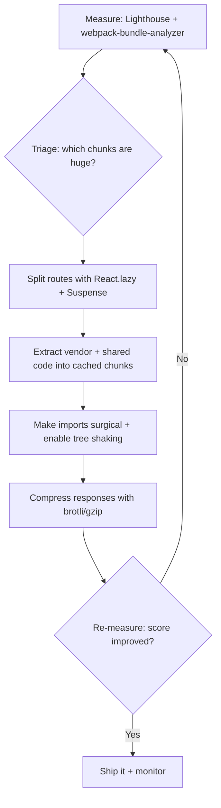

| Difficulty | Channel | Tags |
|---|---|---|
| intermediate | frontend | lighthouse, bundle, lazy-loading |

Imagine shipping a feature your users never fully load. That was the reality at Tatari, a TV advertising analytics company, whose React + TypeScript frontend had quietly ballooned past the point of no return — their Campaign Manager app scored just 49 on Lighthouse performance [1]. When an analytics product can't render its own dashboards fast, the entire value proposition is on the line. This is the story of a 45-point turnaround, and the exact playbook you can run on your own sluggish bundle tonight.

---

> ### Real-World Case — Tatari
>
> Tatari, a TV advertising analytics company, watched its React + TypeScript frontend bloat as the codebase grew — bundles kept getting bigger and build times crept up. Their Campaign Manager ('booking') app scored only 49 on Lighthouse performance, and Dashboard/Booking entry bundles were loading entire apps up front.
>
> | | |
> |---|---|
> | **Challenge** | Shrink large entry-point bundles for a growing SPA, deduplicate shared third-party and internal code that was being duplicated across chunks, and cut payload sizes to lift Lighthouse scores and page-load speed without a rewrite. |
> | **Solution** | The team profiled everything with webpack-bundle-analyzer, then applied route-based code splitting using React.lazy() and dynamic imports (with webpackChunkName for readable chunks). They hit a key gotcha: TypeScript's module setting had to be changed to 'esnext' so dynamic imports were left intact for Webpack to split. They then used the SplitChunksWebpack plugin to extract node_modules into a 'libs.js' chunk and shared components into a 'common.js' chunk, loaded deferred/asynchronously so they weren't render-blocking, and enabled gzip compression middleware on the Node server. |
> | **Outcome** | Lighthouse performance score on the Campaign Manager app jumped from 49 to 94 on average. Compression cut response payloads by ~60% on average (e.g., a standard 3.5MB route finished nearly 60% faster), and entry-point bundles shrank significantly once vendor and shared code were extracted. |
> | **Lesson** | Bundle analysis first, then attack the right layers: code splitting with React.lazy alone isn't enough — you must also deduplicate vendor/common chunks with splitChunks and compress responses. And watch for build-tooling surprises, like TypeScript silently transpiling dynamic imports into CommonJS and quietly killing your code splitting. |

---

## Hook — A Lighthouse score of 49 is not a typo

49 out of 100. That is not a grade most teams would brag about, yet it is precisely the number staring back at Tatari's engineers during a routine audit [1]. Here is what makes this sting: Tatari is a TV advertising analytics company — its entire product is dashboards. If those dashboards take seconds to render, advertisers cannot see campaign performance, decisions stall, and the product loses its reason to exist. The 49 was only a symptom. The real diagnosis was an entry bundle so fat it was shipping an entire application's worth of code to every visitor, whether they needed it or not. Sound familiar? If your last Lighthouse audit felt like a midterm you keep failing, keep reading. This story ends with a 45-point turnaround and a frontend that finally feels fast.

## Problem — The invisible tax of a 2.1MB bundle

Now put yourself in the interview seat. You are handed a React app scoring 65 on Lighthouse, a 2.1MB bundle, and a Time to Interactive (TTI) of 4.2 seconds. The goal: hit 90+. Many developers assume a big bundle is just a slow download — an annoyance, not a catastrophe. Actually, the download is the smallest part of the bill. The browser must download, parse, compile, and execute every byte of JavaScript before the page becomes interactive, and that CPU work is what pushes TTI past four seconds. Consequently, every metric that matters — Largest Contentful Paint, TTI, First Input Delay — degrades together because they are all waiting on the same bloated payload [2]. The stakes are business-shaped, too: slower pages correlate with lower conversion and higher bounce rates, which means the megabytes you ship are a direct tax on revenue. Tatari's Dashboard and Booking entry bundles were loading entire applications up front — every user was paying for code they would never run [1]. The good news? This tax is fully collectible, and the refund is enormous.

## Real-World Case — How Tatari climbed from 49 to 94 on Lighthouse

Here is where the story turns. Tatari watched its React + TypeScript frontend bloat as the codebase grew — bundles kept getting bigger and build times crept up. Their Campaign Manager ('booking') app scored only 49 on Lighthouse performance, with Dashboard and Booking entry bundles loading entire apps up front [1]. Instead of guessing, the team measured. They extracted vendor and shared code into separate chunks, and they added compression at the delivery layer. The results were nothing short of dramatic: the Campaign Manager's Lighthouse performance score jumped from 49 to 94 on average. Compression alone cut response payloads by roughly 60% on average — a standard 3.5MB route finished nearly 60% faster — and entry-point bundles shrank significantly once vendor and shared code were extracted [1]. Translation: the dashboards that once felt like booting a video game now rendered in a blink. The plot twist is that none of this required a heroic rewrite or a framework migration. It was methodical, unglamorous, highly repeatable engineering — the kind any team can copy.

## Deep Dive — Code splitting, tree shaking, and the tools that make them work

Building on Tatari's turnaround, the underlying toolkit is something any React team can adopt within a sprint. It starts with measurement: webpack-bundle-analyzer turns your production bundle into an interactive treemap, so you can finally spot the 300KB chart library lurking behind a component that renders a single number [3]. With visibility in hand, code splitting becomes the headline act. The core idea is deceptively simple — instead of shipping one massive bundle, cut your code into chunks loaded on demand. Route-based splitting delivers only the code for the current page, while component-based splitting defers heavy components until they are about to render. Dynamic import() statements create these chunks automatically, and React.lazy() paired with Suspense gives you a declarative fallback while a chunk loads [4][5]. Here is the trade-off table worth remembering:

| Strategy | Best for | Watch out for |
| --- | --- | --- |
| Route-based splitting | Initial load time | Too many tiny routes = request waterfalls |
| Component-based splitting | Heavy charts, editors, embeds | Inline fallbacks and loading UX |
| Shared vendor chunks | Libraries used across routes | Over-splitting creates cache fragmentation |

However — and this is the counterintuitive part — lazy loading without a shared vendor strategy creates a waterfall of small requests that can feel worse than one big bundle. The fix that surprises everyone: extract node_modules into stable vendor chunks that browsers cache aggressively [6]. Which brings us to tree shaking. Bundlers drop unused exports automatically, but only if your dependencies ship real ES modules. A CommonJS library silently defeats the entire optimization — and many teams discover their favorite utility package is the saboteur [7]. ⚠️ Watch Out: tree shaking and code splitting can't rescue you from importing an entire library with `import _ from 'lodash'`. Make imports surgical, and verify the package's 'module' or 'exports' field points to ESM.

## Workflow — A repeatable rescue plan for any bloated bundle

Now that the anatomy is clear, here is the step-by-step workflow Tatari's team effectively followed — and it scales whether your app weighs 500KB or 5MB. Step one: measure. Run Lighthouse under throttled network and CPU, then open the production build in webpack-bundle-analyzer to rank every chunk by size [3]. Step two: triage. Identify the top offenders — usually charting libraries, date utilities, or UI kits imported wholesale. Step three: split routes. Convert every route to React.lazy() so the entry bundle contains only shell code [5]. Step four: extract vendor code. Configure splitChunks to hoist node_modules into stable, cacheable chunks [6]. Step five: make imports surgical and verify ESM, so tree shaking can do its job [7]. Step six: compress at the edge — brotli or gzip so the bytes that must travel arrive lighter [8]. The diagram below captures this pipeline. Notice the loop: measurement feeds back into the start, because optimization is a cycle, not a one-shot event. 🎯 Key Point: never optimize blind. The analyzer is your compass, and the Lighthouse audit is your scoreboard.

## Code Example — Lazy loading in practice, from routes to heavy charts

Theory is nice, but you came for code. The example below shows the two splitting strategies that matter most in a real React app: route-based splitting for initial load, and component-based dynamic imports for expensive third-party libraries. The first half turns every route into its own chunk — the browser only downloads the Dashboard code when someone actually visits it. The second half answers the 'when would I actually use this?' question: a chart library that should never be part of the initial bundle, fetched only when the component mounts. The Suspense wrapper gives users a loading fallback instead of a blank screen, and each commented line explains the decision behind the code [5].

## Lessons Learned — The 45-point climb and what it teaches every team

If you take one thing from Tatari's story, let it be this: performance work is detective work, not guesswork [1]. Measure before you optimize — a bundle analyzer will humiliate whatever assumptions you held about where the megabytes live. Here are the battle scars worth carrying forward. First, lazy loading without a vendor split creates request waterfalls; keep shared libraries in stable chunks that the browser can cache [6]. Second, tree shaking silently dies on CommonJS dependencies; check the 'module' and 'exports' fields before trusting your bundle size [7]. Third, compression is the cheapest win in the entire playbook — Tatari cut payloads by ~60% with it, and you can too [1]. Finally, avoid the classic trap of splitting too aggressively, which trades a slow first load for janky navigation. The sweet spot is splitting what users need per route and caching the rest [5]. 💡 Insight: a Lighthouse score is just the scoreboard. The real victory is the milliseconds your users get back. Run the audit, open the analyzer, find your 2.1MB culprit — then make tomorrow's deploy a little lighter.

---

## Bundle Optimization Pipeline

<strong>Original Interview Question</strong>

**Q:** You're tasked with improving a React app's Lighthouse performance score from 65 to 90+. The bundle size is 2.1MB and Time to Interactive is 4.2s. What specific steps would you take to optimize the bundle and implement lazy loading?

**A:** Implement code splitting with React.lazy() and Suspense, analyze bundle composition with webpack-bundle-analyzer to identify largest chunks, remove unused dependencies and optimize imports, add dynamic imports for heavy components and third-party libraries, implement route-based splitting for better initial load times, and utilize tree shaking with proper ES module configuration.

## Conclusion

Tatari's Campaign Manager went from a 49 that embarrassed the team to a 94 that delighted advertisers — not through a rewrite, but through disciplined measurement, code splitting, and compression [1]. Your app is sitting on the same 45-point opportunity right now. Run the audit, find the bloated chunk, split the routes, and compress the payload. The Lighthouse score is the scoreboard; what your users feel is the real game. Share this playbook with your team, and make tomorrow's deploy a little lighter.

---

## References

1. [Tatari incident report](https://eng.tatari.tv/engineering/2022/08/15/fe-optimizations-at-tatari.html) — article
2. [Web performance (MDN)](https://developer.mozilla.org/en-US/docs/Web/Performance) — documentation
3. [webpack-bundle-analyzer (GitHub)](https://github.com/webpack-contrib/webpack-bundle-analyzer) — documentation
4. [React lazy API reference](https://react.dev/reference/react/lazy) — documentation
5. [Webpack Code Splitting guide](https://webpack.js.org/guides/code-splitting/) — documentation
6. [SplitChunksPlugin (webpack)](https://webpack.js.org/plugins/split-chunks-plugin/) — documentation
7. [JavaScript modules (MDN)](https://developer.mozilla.org/en-US/docs/Web/JavaScript/Guide/Modules) — documentation
8. [Service Worker API (MDN)](https://developer.mozilla.org/en-US/docs/Web/API/Service_Worker_API) — documentation
9. [Tree shaking (Wikipedia)](https://en.wikipedia.org/wiki/Tree_shaking) — documentation

---

**Author:** Satishkumar Dhule — [GitHub](https://github.com/satishkumar-dhule) · [LinkedIn](https://linkedin.com/in/satishkumar-dhule) · [Website](https://satishkumar-dhule.github.io)
