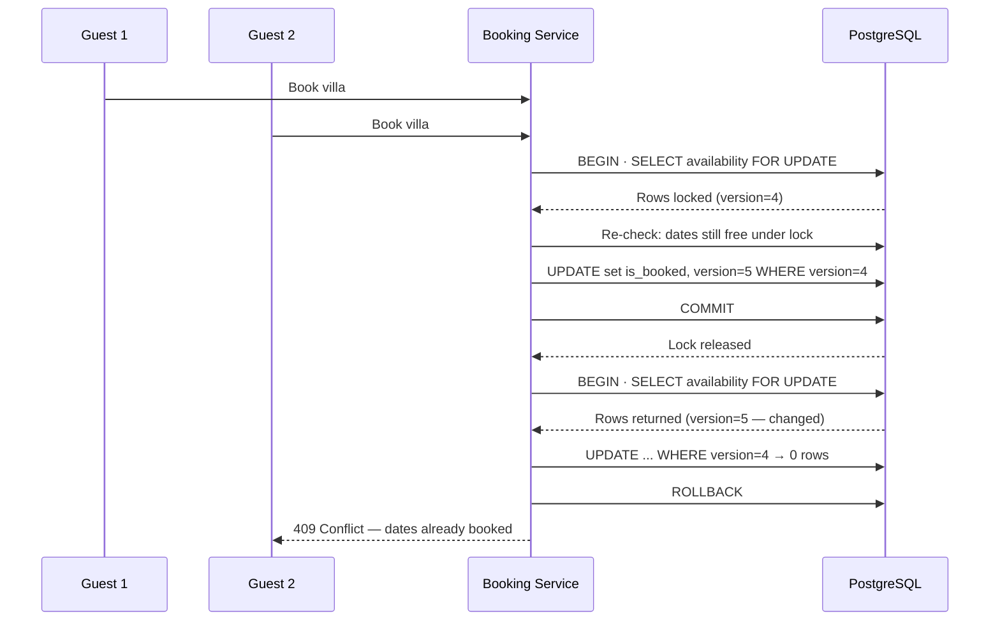

| Difficulty | Channel | Tags |
|---|---|---|
| intermediate | database | acid, isolation-levels, mvcc |

A guest clicks "Book" once and gets charged twice — and the host's payout ledger quietly shows double. That's exactly the kind of bug Airbnb's distributed payments platform faced, and teams had to engineer correctness into the core of a system where retries, timeouts, and lost responses made one click ripple into duplicate charges and payouts [1]. The same race-condition family that double-charges guests is the one that double-books properties. This is the story of the lock-and-idempotency pattern that beat it — and how you can use the same weapon against double bookings.

---

> ### Real-World Case — Airbnb
>
> Airbnb's payments platform runs as many distributed microservices, where a single guest booking triggers charge and payout flows. Retries, timeouts, and lost responses meant a guest could click 'Book' once yet get charged twice (or a host paid out twice) - the same race-condition family as double booking a property.
>
> | | |
> |---|---|
> | **Challenge** | Guarantee exactly-once processing (money moves at most once) in an eventually-consistent service-oriented architecture, where network calls are inherently unreliable, clients auto-retry, and two identical requests can arrive concurrently. |
> | **Solution** | Built 'Orpheus', a generic idempotency framework. Every request carries a unique idempotency key; on arrival the server validates the key in the database and row-locks that row (the often-forgotten 'mutual exclusion' aspect) so two concurrent same-key requests can never be processed in parallel, wraps the pre/post-RPC phases in enclosing database transactions, and classifies errors as retryable vs non-retryable so retries are safe. |
> | **Outcome** | A reusable library now powers correctness across Airbnb's payments microservices - the exact same lock-and-idempotency-key pattern recommended for property availability - eliminating duplicate guest charges and duplicate host payouts that reconciliation had been catching after the fact. |
> | **Lesson** | Idempotency is not just 'cache the request key' - it has two halves: a caching aspect and a mutual-exclusion aspect. Without row-locking the idempotency key while the request is in flight, two concurrent retries both see 'no cached response' and both execute the payment/booking. The locking half is where double-charge and double-book bugs actually hide. |

---

## Hook — one click, two charges, and a race you didn't even see

Imagine a guest named Priya. She finds a villa in Santorini, taps Book, and the confirmation lands a second later. So does the charge. And then... another charge. Same booking, two hits on her credit card, and the host's ledger now shows a payout that shouldn't exist. Sound far-fetched? It's the exact race that Airbnb's payments team hunted down across a mesh of distributed microservices — where retries, timeouts, and lost responses turned a single click into duplicate guest charges and duplicate host payouts [1]. Here's the uncomfortable part: the code that caused it isn't exotic. It's the same everyday race condition that lets two guests book the same property for the same night — and the fix is a transaction-handling pattern every backend developer should already own. By the end of this story, you'll understand why the database transaction is your first line of defense, why locks alone aren't enough, and how one well-designed table can outsmart a thousand simultaneous clickers.

## Problem — two guests, one villa, and a check-then-act lie

Here's the scenario: two guests, one villa, the same three nights in June. Both click Book at 9:00:00.003 and 9:00:00.004. If your system reads availability, sees it's free for both, and writes two bookings — congratulations, you just sold the same nights twice. This is a classic race condition, and in database terms it's a lost update wrapped in a write-skew anomaly [4]. The stakes go beyond one angry guest: an overbooked property triggers refunds, rebooking, customer-support fires, and a trust hit that review scores feel for months. Every booking platform — hotels, airlines, event ticketing — fights this battle, and it's hard for one reason: the naive solution ('just check availability before inserting') is a lie. Check-then-act without a lock is not atomic. ACID guarantees look great in a textbook [6], but the default isolation level in most databases lets concurrent transactions read and write as if the other guy doesn't exist. What you need is a way to make the check and the write one indivisible unit — while keeping the system fast enough that a million people browsing don't feel the cost.

## Real-World Case — Airbnb's double-payment incident

To see what happens when you don't nail this, look at Airbnb's payments platform. Booking a stay isn't one action — it fans out across dozens of distributed microservices: charges, payouts, fees, refunds, taxes. In a system like that, a timeout doesn't mean the payment failed; it means you don't know if it succeeded. And the standard response — retry — walks straight into the double-charge trap. A guest clicks Book once, the charge request times out, the retry goes through, and the guest gets billed twice; hosts got paid out twice for the same stay [1]. The worst part? Nothing caught it in the moment. Duplicate charges and payouts were only discovered later, during reconciliation — after the damage, the angry emails, and the support tickets. Airbnb's fix wasn't a bigger hammer. Teams built a reusable correctness library that every payments microservice plugs into — built on exactly the lock-and-idempotency-key pattern recommended for property availability — so a request that's already processed is recognized and skipped instead of executed again [1]. One click, one charge, one payout. Every time. That's the transformation the right pattern buys you — and it's the same transformation your booking table needs. The locking and retry discipline that protects money protects dates equally well.

## Deep Dive — MVCC, isolation levels, and the lock-versus-optimism plot twist

Now for the core question: how do you let thousands of users check availability simultaneously, yet make sure that the instant two people book the same slot, only one wins? The secret sauce is how modern databases give you both — MVCC. Instead of locking the whole table for every read, PostgreSQL keeps multiple versions of each row so readers never block writers and writers never block readers [3][5]. Every transaction sees a consistent snapshot — fantastic for browsing, terrible for racing, because an 'available' read can be stale the moment after you read it. That's why your defense has to be layered. Layer one is the isolation level. SERIALIZABLE is the strictest: the database guarantees the outcome is as if your transactions ran one after another, and it will abort one of them (with a serialization_failure, SQLSTATE 40001) when their behavior can't be reconciled [2]. But 'abort and let the app deal with it' is not a strategy on its own — which is where most teams stumble. Layer two is row-level locking. PostgreSQL's SELECT ... FOR UPDATE lets a booking transaction lock precisely the availability rows for the requested date range, so a competing booking on the same nights blocks instead of blind-overwriting [2]. That's pessimistic locking: slow-ish, but unbreakable. Layer three is the optimistic twist: version columns. Instead of locking everything, you bump a version counter on every write and only commit if the version you read still matches — the foundation of optimistic concurrency control, where a conflict is a cheap, detectable abort instead of a lock wait [5]. Here's the plot twist most developers miss: you usually want BOTH. Pure optimistic locking falls apart under write-heavy contention (everyone retries everyone); pure pessimistic locking drags availability checks through locks that don't need them. The Airbnb-grade pattern is: read-heavy availability checks on read replicas with cached snapshots, a short, precise FOR UPDATE on the exact date range for the actual booking, and a version check as a safety net — then retry the losers with exponential backoff instead of hammering the database [7]. For truly hot properties, add a circuit breaker so a million people clicking one villa can't take down the whole booking service [8].

## Workflow — the seven-step flow that makes double bookings impossible

Building on the deep dive, here's the end-to-end flow that production booking systems follow — every step exists to close a specific hole. First, read without locking: guests see availability from an MVCC snapshot on a read replica — fast, consistent-ish, and zero lock contention. Second, begin the transaction the moment a booking is submitted — no more check-then-act. Third, lock the exact range with SELECT ... FOR UPDATE on the availability rows for the requested dates, so any overlapping booking now waits its turn [2]. Fourth, re-check availability while holding the lock, because the snapshot from step one may already be stale. Fifth, apply the optimistic version bump — if zero rows changed, a concurrent write snuck in, so roll back. Sixth, commit atomically, then invalidate the cache so read replicas catch up and future guests see the truth. Seventh, retry smart, then give up: catch serialization_failure (40001) and retry with exponential backoff, and if a property is a constant battlefield, trip the circuit breaker and shed load instead of spinning [7][8]. The diagram below shows two guests racing for the same nights — watch what happens to the second transaction.

## Code Example — the lock-and-idempotency pattern in TypeScript

Here's the same pattern in TypeScript with node-postgres: pessimistic lock for serialization, an optimistic version guard as the safety net, and exponential-backoff retries for the losers. It's simplified but production-shaped.

## Lessons Learned — battle scars from production booking systems

The journey from 'it works on my localhost' to 'it survives Black Friday' comes down to a few hard-won rules. Check-then-act is a trap — if the availability check and the booking write live outside one transaction, you've already lost, because two concurrent readers will both see 'free' [4]. Locks are a scalpel, not a hammer — lock the date range that's actually in play, not the whole property and definitely not the whole table. SERIALIZABLE doesn't save you by itself — it converts races into aborts, and if your app doesn't handle serialization_failure with a retry, it converts races into user-facing 500s [2]. Version columns are cheap insurance — one WHERE version = ? clause turns silent overwrites into detectable conflicts [5]. Retries need backoff and a deadline — retry with exponential backoff and jitter, cap the attempts, and trip a circuit breaker for hot properties, because infinite immediate retries are how outage posts get written [7][8]. Caching makes this better and worse — write-through caching with invalidation on commit keeps reads fast; without invalidation, your 'fast' cache just lies about availability. And idempotency keys are the distributed answer — when a booking is really a saga across services, a lock inside one database won't cut it; attach an idempotency key and dedupe like Airbnb's payments library does [1].

---

## Booking Race Condition Sequence

<strong>Original Interview Question</strong>

**Q:** You're building a booking system for Airbnb where multiple users can reserve the same property simultaneously. How would you design the transaction handling to prevent double bookings while maintaining high availability?

**A:** Use SERIALIZABLE isolation with optimistic concurrency control. Implement row-level locks on property availability tables, use MVCC snapshot reads for checking availability, and apply application-level validation to ensure atomic booking operations.

## Conclusion

So let's return to where the story began: a guest clicks Book, and somewhere between the click and the charge, the system must neither lose nor duplicate a thing. Airbnb's payments teams learned this the expensive way, catching duplicate charges and payouts only after reconciliation [1]. Your booking table gets to learn it cheaply: separate the availability data so you can lock it precisely, guard every write with a version column, read from replicas, retry losers with exponential backoff, and make check-and-write a single atomic unit. Do that, and two guests can click the same villa in the same millisecond — and only one of them will be packing bags. The one insight to carry into tomorrow's code review: correctness is a property of the whole request path, not the database. The transaction is the frame; the lock, the version column, the retry, and the idempotency key are the guardrails. Build all of them, and double bookings — like double charges — become a story you read about, not one you write.

---

## References

1. [Airbnb incident report](https://medium.com/airbnb-engineering/avoiding-double-payments-in-a-distributed-payments-system-2981f6b070bb) — article
2. [PostgreSQL Documentation: Transaction Isolation](https://www.postgresql.org/docs/current/transaction-iso.html) — documentation
3. [PostgreSQL Documentation: Concurrency Control (MVCC)](https://www.postgresql.org/docs/current/mvcc.html) — documentation
4. [Wikipedia: Isolation (database systems)](https://en.wikipedia.org/wiki/Isolation_(database_systems)) — documentation
5. [Wikipedia: Multiversion concurrency control](https://en.wikipedia.org/wiki/Multiversion_concurrency_control) — documentation
6. [Wikipedia: ACID](https://en.wikipedia.org/wiki/ACID) — documentation
7. [Wikipedia: Exponential backoff](https://en.wikipedia.org/wiki/Exponential_backoff) — documentation
8. [Wikipedia: Circuit breaker design pattern](https://en.wikipedia.org/wiki/Circuit_breaker_design_pattern) — documentation
9. [PostgreSQL Documentation: CREATE TABLE](https://www.postgresql.org/docs/current/sql-createtable.html) — documentation

---

**Author:** Satishkumar Dhule — [GitHub](https://github.com/satishkumar-dhule) · [LinkedIn](https://linkedin.com/in/satishkumar-dhule) · [Website](https://satishkumar-dhule.github.io)
