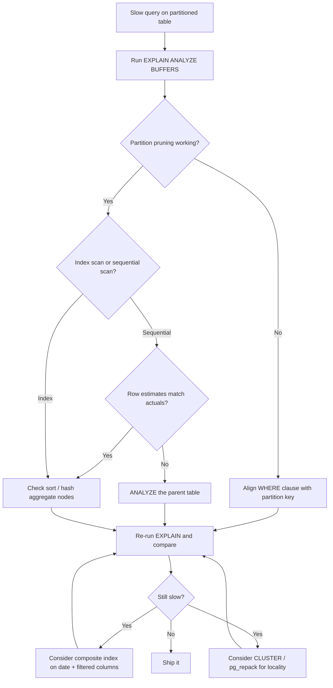

| Difficulty | Channel | Tags |
|---|---|---|
| intermediate | database | explain, query-plan, partitioning |

The day after Hatchet — the YC-backed open-source durable execution engine built on PostgreSQL — deployed daily time-based partitioning on a task table that had swollen past 200 million rows, their queries got dramatically slower [1]. Reads that once answered in a few milliseconds stretched past 20ms, a roughly 10x regression, and active sessions and CPU spiked even under moderate load. The optimization that was supposed to save them had backfired, and the culprit turned out to be a single footnote missing from the Postgres documentation. Before your own partitioned table betrays you, it pays to learn how to interrogate an EXPLAIN plan.

---

> ### Real-World Case — Hatchet
>
> Hatchet, a YC-backed open-source durable execution engine built on PostgreSQL, stores up to hundreds of millions of tasks per day. After their single task table hit ~200 million rows and began to bloat, they rolled their own daily time-based partitioning. Days after deploying it, some queries on the partitioned tables slowed down up to 10x (from a few milliseconds to >20ms), causing massive spikes of active sessions and CPU even under moderate load.
>
> | | |
> |---|---|
> | **Challenge** | Queries that JOINed partitioned tables and selected many rows via compound primary keys were mysteriously slow. The team initially suspected too many partitions being scanned or lock contention on index scans, and even tried forcing planner-time partition pruning — which didn't help at all. |
> | **Solution** | They reproduced the issue locally (14 daily partitions x 1M rows each) and ran EXPLAIN ANALYZE, which revealed the row estimate was off by a factor of 6,100,000x. Postgres expert Laurenz Albe of Cybertec suggested manually running ANALYZE on the parent partitioned table — which immediately fixed it. Root cause: autovacuum does not run ANALYZE on partitioned parent tables because they store no tuples, so the planner had garbage statistics and chose catastrophic plans (e.g., seq scans over index scans). They also adopted DETACH PARTITION ... CONCURRENTLY (plus FINALIZE to clean up orphaned detaches) to reduce lock contention. |
> | **Outcome** | The manual ANALYZE fix was merged in a PR and all rollout issues were resolved. Queries returned to single-digit milliseconds, and the underlying cause was documented: a single missing footnote in the Postgres docs that autovacuum never analyzes partitioned parent tables. |
> | **Lesson** | A partitioned table can still be slow even when pruning works and indexes exist — check EXPLAIN row estimates vs actual rows. Parent partitioned tables are never ANALYZEd by autovacuum, so you must schedule manual ANALYZE on them; stale statistics can make the planner misestimate row counts by millions of times and silently tank query performance. |

---

## Hook — The deploy looked great. Then the metrics turned red.

The deploy looked perfect. Fresh daily partitions, a cleaner table layout, and the quiet satisfaction of finally taming a 200-million-row monster. Then, days later, the dashboards started flashing. Query latency climbed from a few milliseconds past the 20ms mark, active sessions piled up, and CPU lurched upward — all under load that used to be a non-event. If you have ever partitioned a large PostgreSQL table, you know the exact feeling: equal parts confusion and dread. How can a table split into tidy time buckets be slower than the monolithic table it replaced? That question sits at the heart of every slow-partition mystery. You did the right thing. You created the partitions. Maybe you even added an index. So why is your query still dragging? Before you touch a single line of SQL, you need the one artifact that tells the truth: the EXPLAIN plan. It will either confirm your suspicions or — more likely — reveal that the problem was never where you were looking.

## Problem — When 100M rows pretend to be a small table

Here is the setup that trips up developers everywhere: a 100-million-row PostgreSQL table partitioned by date. A query filters on a specific date range and a status column. It should be instant. It is not. Partitioning promises that the planner can skip irrelevant partitions and scan only the data you asked for [7]. In practice, that promise depends on three fragile things: partition pruning actually happening, an index that matches your WHERE clause, and planner statistics accurate enough to drive smart decisions [2]. If any of those break, your “optimized” table silently degrades into the worst of both worlds — the overhead of many partitions with none of the benefits. The stakes scale fast. A single slow query might be a blip, but under production traffic it compounds into queued sessions, saturated CPUs, and angry on-call rotations. Nobody notices the partition count in your schema diagram; everyone notices when the pager goes off.

## Real-World Case — Hatchet's 10x Postgres slowdown

Hatchet knows this story firsthand. As a durable execution engine, they persist hundreds of millions of tasks per day, and their single task table grew to roughly 200 million rows before bloat forced a change [1]. The team rolled their own daily time-based partitioning — a completely reasonable, battle-tested strategy. Days after rollout, some partitioned queries regressed by up to 10x, blowing past 20ms and driving spikes in active sessions and CPU even under moderate load [1]. Here is the plot twist: the fix had nothing to do with indexes, query shape, or partition layout. The root cause was a single missing footnote in the Postgres docs — autovacuum does not analyze partitioned parent tables. Without fresh statistics on the parent, the planner guessed wildly wrong row counts and produced terrible plans. A manual ANALYZE was merged as the fix, all rollout issues were resolved, and queries returned to single-digit milliseconds [1]. The lesson is humbling: your partitioning can be flawless, and your statistics can still sabotage you. Consequently, checking row estimates against actuals in the EXPLAIN output matters more than almost anything else.

## Deep Dive — Reading the EXPLAIN plan like a detective

Now that you have seen the failure mode, the diagnostic skill becomes clear. EXPLAIN (ANALYZE, BUFFERS) is your interrogation tool [3]. Four signals matter most. First, partition pruning: the output should show “Partitions Removed by Filter” — if it reports zero, the planner is touching partitions it should have skipped entirely [2]. Second, the scan strategy: an index scan is usually what you want, but a sequential scan is a red flag that the planner believes the table is tiny or that your index cannot help. Third, expensive operations: sort nodes and hash aggregates that spill to disk turn millisecond queries into multi-second ones. Fourth — and this is the one most developers miss — compare the planner's row estimate to the actual rows returned. When those numbers disagree by orders of magnitude, your statistics are stale and the plan is built on lies. For the query shape in question, a composite index on (event_date, status) matches the WHERE clause almost perfectly [5], because the planner can use the leading column for range filtering and the second for the equality check. Physically reordering rows with CLUSTER can further cut read amplification by making matching rows live on the same pages [6]. But — and this is the key insight — none of that matters if the planner's model of the data is wrong. Many developers discover that the best index in the world cannot save a query when the statistics claim the table holds 10 rows. Here is a cheat sheet for the signals you will actually see:

| EXPLAIN signal | What it means | Likely fix |
|---|---|---|
| Partitions Removed by Filter: 0 | Partition pruning is failing | Align the WHERE clause with the partition key |
| Seq Scan on a large partition | Index unusable or statistics stale | Composite index + ANALYZE |
| Estimated rows vs actual rows mismatch | Stale planner statistics | ANALYZE the parent table |
| Sort or HashAgg spill to disk | Memory pressure on aggregates | Tune work_mem or add a covering index |

## Workflow — The five-step diagnosis that catches 90% of slow partitioned queries

Armed with the right mental model, diagnosis becomes a repeatable ritual. The flowchart below shows the decision path you will walk every time a partitioned query misbehaves — it mirrors exactly the path Hatchet's engineers had to discover the hard way. Step one: run EXPLAIN (ANALYZE, BUFFERS) on the exact slow query. Step two: verify partition pruning by checking how many partitions were removed by filter. Step three: inspect the scan type and, critically, compare estimated rows to actual rows. Step four: hunt for sort and aggregate nodes that spill to disk. Step five: apply the fix in the right order — refresh statistics first, add a composite index if the query shape calls for it, and only then consider CLUSTER for physical locality. Re-run EXPLAIN after every single change; the plan is your source of truth. Moreover, if you skip the statistics check, you may find yourself adding indexes that never get used — and wondering why nothing improved. The loop is tight, the feedback is instant, and it costs nothing but one well-placed command.

## Code Example — Interrogating the plan, then fixing it

This is the exact sequence you should run on a hot partition table. It mirrors Hatchet's fix: diagnose with EXPLAIN, refresh statistics on the parent, add the composite index, and only then consider physical reordering. Each command is annotated so you know exactly what signal you are hunting for.

## Lessons Learned — What to do differently tomorrow

If this story feels familiar, you are not alone — and you now have the roadmap. Here is what Hatchet's incident teaches, distilled into rules you can apply on Monday: First, always start diagnosis with EXPLAIN (ANALYZE, BUFFERS) and read the row estimates against actuals [3]. Second, never assume pruning is happening — verify the “Partitions Removed by Filter” line explicitly [2]. Third, fix statistics before indexes; autovacuum will not analyze partitioned parent tables for you [4]. Fourth, design composite indexes to match the leading column of your WHERE clause [5]. Fifth, treat CLUSTER and pg_repack as maintenance-window operations, not as an everyday fix [6]. The battle scars are real: teams have added indexes nobody used, promoted partition layouts that made things worse, and burned entire on-call rotations chasing the wrong node in the plan. None of that is inevitable. The memorable insight to share with your team: the EXPLAIN plan is not a report card — it is a conversation with the optimizer, and you can only win that conversation when the statistics tell the truth. Run ANALYZE, read the plan, and let the data lead you home.

---

## Query Diagnosis Flow

<strong>Original Interview Question</strong>

**Q:** You have a PostgreSQL table with 100M rows partitioned by date. A query filtering on a specific date range is still slow. What would you check in the EXPLAIN plan and how would you optimize it?

**A:** Check partition pruning effectiveness, index utilization patterns, and expensive sort operations. Create composite indexes on (date, filtered_columns) and evaluate clustering strategies for optimal data access.

## Conclusion

Hatchet's partitioning rollout turned a few-millisecond query into a 20ms pain point — not because of indexes or schema, but because a single missing footnote about autovacuum and partitioned parents left the planner flying blind [1]. The fix was one ANALYZE command, but the real lesson is the ritual: interrogate the EXPLAIN plan, verify partition pruning, compare estimates to actuals, and fix statistics before you touch indexes. Tomorrow, run that same five-step loop on your slowest partitioned query. You might discover your problem was never the partitions at all — and that a single command you already know is the answer you were missing.

---

## References

1. [Hatchet incident report](https://hatchet.run/blog/postgres-partitioning) — article
2. [PostgreSQL Table Partitioning](https://www.postgresql.org/docs/current/ddl-partitioning.html) — documentation
3. [PostgreSQL EXPLAIN documentation](https://www.postgresql.org/docs/current/using-explain.html) — documentation
4. [PostgreSQL Autovacuum](https://www.postgresql.org/docs/current/runtime-config-autovacuum.html) — documentation
5. [PostgreSQL Multicolumn Indexes](https://www.postgresql.org/docs/current/indexes-multicolumn.html) — documentation
6. [PostgreSQL CLUSTER](https://www.postgresql.org/docs/current/sql-cluster.html) — documentation
7. [Database partitioning (Wikipedia)](https://en.wikipedia.org/wiki/Database_partitioning) — article
8. [B-tree (Wikipedia)](https://en.wikipedia.org/wiki/B-tree) — article
9. [PostgreSQL CREATE INDEX](https://www.postgresql.org/docs/current/sql-createindex.html) — documentation

---

**Author:** Satishkumar Dhule — [GitHub](https://github.com/satishkumar-dhule) · [LinkedIn](https://linkedin.com/in/satishkumar-dhule) · [Website](https://satishkumar-dhule.github.io)
