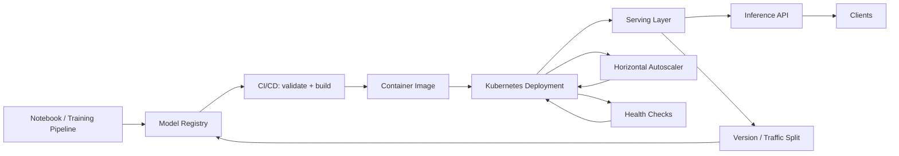

| Difficulty | Channel | Tags |
|---|---|---|
| beginner | devops | mlops, deployment |

By 2015, Uber's data scientists were churning out impressive models in Jupyter notebooks — only to watch them stall at the doorstep of production. Every project meant hand-rolling custom serving containers and bespoke deployment scripts, because no standardized path from experiment to production existed [1]. Teams reinvented the same deployment and inference wheels in isolation, and that chaos taught Uber a painful but valuable lesson. This article walks through that lesson: the quiet but crucial difference between deploying a model and serving it.

---

> ### Real-World Case — Uber
>
> By 2015, Uber data scientists prototyped models in Jupyter notebooks, but productionizing them meant hand-rolling custom serving containers per project. There was no standardized path from experiment to production, no reproducible pipelines, and no shared model registry or serving infrastructure — so each team reinvented deployment and inference separately.
>
> | | |
> |---|---|
> | **Challenge** | Uber needed to separate the concerns of deployment (CI/CD pipelines, infrastructure, monitoring) from serving (low-latency runtime inference) across a platform serving 25 million trips/day, where every interaction — ETA, pricing, matching, fraud, Eats ranking — depends on models. Latency and throughput at tens of millions of predictions/second could not be met with bespoke per-team serving setups. |
> | **Solution** | Uber built Michelangelo, an end-to-end ML platform. Deployment was standardized via a control plane using the Kubernetes Operator pattern and K8s APIs (Project, PipelineRun, Model, Revision, InferenceServer, Deployment) with CI/CD, versioned model registry, and monitoring. Serving was decoupled into an Online Prediction Service (OPS) running frameworks like TensorFlow, PyTorch, and XGBoost, later adopting NVIDIA Triton as its serving engine for low-latency GPU inference, with neuropod abstractions to hide framework details and horizontal scaling. |
> | **Outcome** | Michelangelo now runs ~400 active ML projects, 20K+ model training jobs monthly, and 5K+ models in production serving 10 million real-time predictions per second at peak, with sub-10ms P95 latency for online serving — up from early versions handling 250K predictions/second. The platform reduced average time-to-production from ~6 weeks to about 1 week. |
> | **Lesson** | Deployment and serving are separate problems with different trade-offs: a robust deployment/CI-CD layer (versioning, rollback, monitoring) is what lets you scale to thousands of models, while a dedicated serving layer (runtime inference, autoscaling, GPU resource management) is what lets you hit 10M predictions/sec at millisecond latency. Standardizing both, rather than hand-rolling per team, is the inflection point that took Uber from experiments to production ML. |

---

## Hook — The 2am deploy that still haunts every ML engineer

It is 2am, the pager is buzzing, and the model that carried your team to victory in the internal hackathon is now answering every tenth request with a 500 error. Sound familiar? If you have ever shipped a model to production, you know this scene. The notebook scored brilliantly, the CI passed, and yet the service crumbles under real traffic. Here is the uncomfortable secret: training a model and running it in production are two completely different engineering disciplines, and the gap between them is where ML projects quietly die.

The stakes are real. A model that takes 900 milliseconds to respond when your product promises 100 will be abandoned by users before the A/B test even finishes. The teams that survive are the ones that stop treating "deploy it" as one step and start treating it as a two-phase journey: deployment, then serving. Uber learned this the hard way [1].

💡 Insight: A model is not "done" when the loss curve flattens. It is done when it survives its first traffic spike, its first version rollback, and its first 3am pager — without a human in the loop.

## Problem — 'It works on my machine' stops being funny in production

Here is the thing: "deployment" and "serving" get thrown around like synonyms, and that blur is the root of most production ML disasters.

Deployment is everything that happens before a model can be reached: the CI/CD pipeline, container images, infrastructure provisioning, monitoring, and rollback strategy. Serving is what happens every single time a prediction is requested: loading the model into memory, routing the request, batching, and returning a response in milliseconds. You can deploy a model perfectly and still serve it badly — and vice versa [2].

Many developers discover this the hard way, through the classic battle scars:
- Copying a pickle file onto a server and calling it "deployment" (versioning? never heard of it)
- No model registry, so "which version is live?" is answered by guessing
- Autoscaling configured by vibes, so a traffic spike melts the cluster
- A model that took weeks to train being swapped out with no rollback plan

⚠️ Watch Out: "Deploy and forget" is a myth. In ML, the moment a model is live, the clock starts on its successor. Serving infrastructure without versioning and rollback is a one-way door — and production has a way of making one-way doors painful.

## Real-World Case — Uber rebuilds ML from the notebook up

Building on that problem: Uber was living this nightmare at scale. By 2015, data scientists prototyped models in Jupyter notebooks, but productionizing them meant hand-rolling custom serving containers per project. There was no standardized path from experiment to production, no reproducible pipelines, and no shared model registry or serving infrastructure — so each team reinvented deployment and inference separately [1].

Uber's answer was Michelangelo, an end-to-end ML platform that treated deployment and serving as first-class, standardized stages. The results are staggering:
- ~400 active ML projects running on the platform
- 20K+ model training jobs executed monthly
- 5K+ models in production
- 10 million real-time predictions per second at peak
- Sub-10ms P95 latency for online serving (up from early versions handling 250K predictions/second)
- Time-to-production cut from ~6 weeks to about 1 week [1]

🎯 Key Point: Notice the metric that matters most — time-to-production dropped from 6 weeks to 1 week. That is not a vanity number. That is the difference between a model that still matters when it ships and one that has already gone stale.

Uber's journey is the blueprint this article follows. The platform standardized the exact two stages that every ML team fumbles: deployment and serving. And that is precisely where the deep dive begins.

## Deep Dive — Deployment vs serving: the two jobs hiding behind one word

So how did Michelangelo pull it off? By understanding that deployment and serving solve different problems with different tools. Here is the mental model:

Deployment is about shipping the artifact: containerizing the model, running tests in CI/CD, provisioning infrastructure, and defining rollback strategies. Tools like Kubernetes and Docker orchestrate the compute, while Terraform manages infrastructure as code — and platforms like MLflow and SageMaker track experiments, register model versions, and reproduce training [3][9][10].

Serving is about the runtime: every prediction request needs the model loaded, routed, and answered — fast. TensorFlow Serving and TorchServe excel here, adding request batching and dynamic model loading [5][6]. BentoML wraps your model into a deployment-ready service with a built-in API server [8].

Option A vs Option B — here is the real tradeoff:

| | Real-time inference | Batch inference |
|---|---|---|
| Use case | Chatbots, fraud, recommendations | Reporting, nightly scoring |
| Latency target | <100ms (Uber pushes <10ms) | <1s to minutes |
| Scaling | Horizontal, autoscaled | Scheduled, burstable |
| Cost per prediction | Higher | Lower |

Here is the plot twist: latency and throughput are not the same goal, and they often fight each other. You can maximize throughput with large batches, but every batch you add costs latency. Conversely, you can hit sub-10ms latencies, but only by giving up batching efficiency. Production systems pick a lane deliberately.

And then there is the cold start problem — the sneaky one. Serving a model means holding it in memory. Spin up a new replica and the first requests hit a cold, empty process. That is why production systems warm models on startup, keep replicas pre-warmed, and use Kubernetes autoscaling to size the fleet before traffic arrives [4].

💡 Insight: Think of deployment as the launch pad and serving as the rocket's flight. A beautiful rocket that never launches is just expensive scrap. A rocket that launches without guidance systems will crash. You need both.

🔥 Hot Take: Most "ML platform" teams over-invest in training infrastructure and under-invest in serving. Training a model happens once. Serving it happens millions of times a day. The asymmetry should dictate where the engineering hours go.

## Workflow — From notebook to live traffic in seven deliberate steps

This leads to the practical question: what does a production-grade path actually look like? Uber's pattern — standardized stages — translates to a repeatable workflow any team can adopt [1]. The diagram below shows the full journey from training to live inference: ML Model Deployment and Serving Pipeline.

1. **Train and log** — Training jobs write models to a registry with metadata: data version, hyperparameters, metrics [7][9].
2. **Package** — The model is baked into a container image with its serving framework, plus a startup warmup step.
3. **Build and test** — CI/CD runs validation: golden tests against known inputs, latency smoke tests, and image scanning.
4. **Deploy** — Kubernetes rolls the image into a cluster with health probes and resource limits [3][10].
5. **Serve** — A serving layer loads the model and exposes an inference API behind a load balancer [5][6][8].
6. **Scale** — Horizontal autoscaling grows replicas as QPS climbs, pre-warming models to dodge cold starts [4].
7. **Monitor and iterate** — Latency percentiles, error rates, and prediction drift feed back into the loop; a versioned rollback keeps the one-way door open [7].

Notice that deployment and serving each occupy distinct steps. That separation is exactly what Uber credits for cutting time-to-production from 6 weeks to 1 week [1].

## Code Example — A 30-line serving service that survives 2am

Here is the serving stage turned into code — a FastAPI service that loads a model once, exposes health and prediction endpoints, and pins its own version. This is the skeleton of a serving tier that survives contact with production:

[See code example below]

**Line by line:**
- The `MODEL_VERSION` constant is the quiet hero. Pinning the version means every response carries provenance — when a prediction looks wrong, the log tells you exactly which model answered [7].
- The model is loaded once at module scope, not per request. This is cold-start mitigation in its simplest form: your first request hits a warm process.
- The `/health` endpoint is not decoration. Kubernetes uses it as a liveness probe to decide when a replica is ready to receive traffic — and when it should be killed and restarted [3].
- The handler is a sync `def`, not `async def`. That is deliberate: `model.predict()` is a blocking CPU call, and wrapping it in async buys nothing. FastAPI runs sync handlers in a threadpool.
- Returning `model_version` in the response enables A/B testing and gradual rollouts. Your load balancer can split traffic 90/10 between v3 and v4, and the response tells you which branch answered each request [4].

In production, this skeleton grows: request batching for throughput, GPU serving for heavy models, and a dedicated server like TorchServe or BentoML for scale [6][8]. But the pattern — version pinning, warm startup, health probes, provenance — is the part that saves you at 2am.

## Lessons Learned — Five scars that separate MLOps survivors from the rest

If the story has a moral, it is this: deployment and serving are two different disciplines, and teams that treat them as one pay for it in pager storms. Here is what the Uber story and the code above boil down to:

- **Treat deployment and serving as separate stages** — each has its own tools, trade-offs, and failure modes. Uber standardized both and cut time-to-production by roughly 83% [1].
- **Version everything** — models, images, and datasets. Without a registry, "rollback" is a prayer, not a plan [7].
- **Optimize for the metric that matters** — sub-100ms for real-time, throughput for batch. Chasing both at once gets you neither.
- **Design for the 2am scenario** — health probes, warm replicas, and golden tests turn a possible outage into a quiet restart [3][4].
- **Expect the plot twist** — latency and throughput fight each other; cold starts are real; and the model you deploy today will be stale tomorrow.

The most memorable insight to take back to your team: **training a model is a science project; serving it is a systems project.** The teams that internalize that distinction are the ones shipping 10 million predictions a second while everyone else stares at a 500 error.

If this feels overwhelming, you are not alone — every ML platform team started somewhere. Start small: pin your model versions today, add a `/health` endpoint tomorrow, and let your serving architecture grow from a skeleton instead of from chaos.

---

## ML Deployment and Serving Pipeline

<strong>Original Interview Question</strong>

**Q:** Explain the key differences between model serving and model deployment in ML systems, including specific technologies, scaling considerations, and real-world implementation patterns?

**A:** Deployment encompasses CI/CD pipelines, infrastructure setup, and monitoring using tools like Kubernetes, MLflow, and SageMaker. Serving focuses on runtime inference APIs with frameworks like TensorFlow Serving, TorchServe, or BentoML, handling request routing, model versioning, and autoscaling. Key trade-offs include latency vs throughput, batch vs real-time inference, and cold start optimization.

## Conclusion

Uber started exactly where you might be right now: brilliant models stuck in notebooks, every team reinventing the same serving wheels, and no standardized path to production [1]. The fix was not a better model — it was a better system. By separating deployment from serving, versioning every artifact, and treating the runtime as a first-class engineering problem, Uber went from 250K to 10 million predictions per second with sub-10ms latency [1].

Tomorrow, you can take the first step without a platform team: pin a version, warm the model at startup, and expose a health check. Small changes, but they are the seeds of the standardized path that separated Uber's chaos from its scale. The 2am pager may still ring — but with the right serving skeleton, it will be a quiet, recoverable event instead of a disaster.

The one line worth sharing with your team: deployment gets the model to production; serving keeps it alive there. Master both, or expect a very interesting call at 2am.

---

## References

1. [Uber incident report](https://www.uber.com/us/en/blog/from-predictive-to-generative-ai/) — article
2. [MLOps - Wikipedia](https://en.wikipedia.org/wiki/MLOps) — documentation
3. [Kubernetes Overview](https://kubernetes.io/docs/concepts/overview/) — documentation
4. [Kubernetes Horizontal Pod Autoscaling](https://kubernetes.io/docs/tasks/run-application/horizontal-pod-autoscale/) — documentation
5. [TensorFlow Serving](https://github.com/tensorflow/serving) — documentation
6. [TorchServe](https://github.com/pytorch/serve) — documentation
7. [MLflow](https://github.com/mlflow/mlflow) — documentation
8. [BentoML](https://github.com/bentoml/BentoML) — documentation
9. [AWS SageMaker Documentation](https://docs.aws.amazon.com/sagemaker/latest/dg/whatis.html) — documentation
10. [An Introduction to Kubernetes - DigitalOcean](https://www.digitalocean.com/community/tutorials/an-introduction-to-kubernetes) — documentation

---

**Author:** Satishkumar Dhule — [GitHub](https://github.com/satishkumar-dhule) · [LinkedIn](https://linkedin.com/in/satishkumar-dhule) · [Website](https://satishkumar-dhule.github.io)
