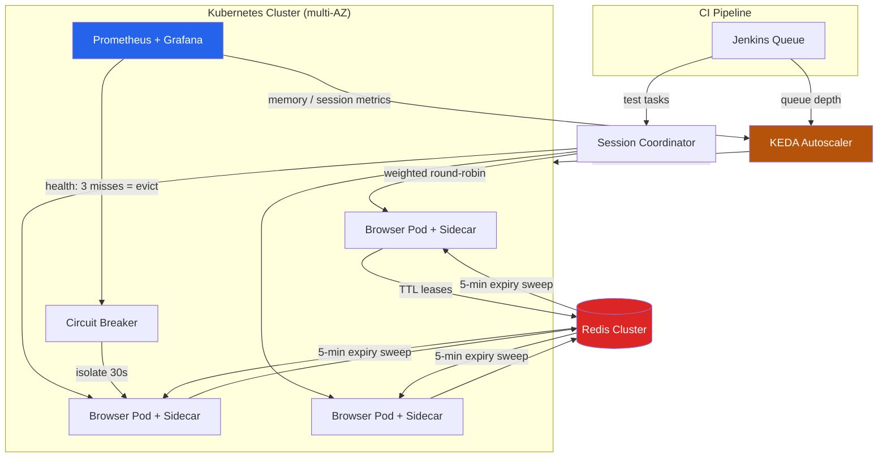

| Difficulty | Channel | Tags |
|---|---|---|
| advanced | system-design | selenium, webdriver, grid |

Every developer has stared at a CI pipeline full of flaky browser tests and wondered whether the infrastructure is the real problem. Blibli.com (PT Global Digital Niaga), one of Indonesia's largest e-commerce platforms, took that question to its logical extreme: they were running thousands of automated browser test scenarios every single hour, on a Selenium grid that sat fully provisioned around the clock — paying for capacity that only spiked during peak CI windows [1]. Their fix didn't just cut costs; it rewired the entire grid to scale from zero to a full burst in seconds. This is the story of what they did, and how the same architecture can carry your grid to 10,000 concurrent sessions with 99.9% uptime.

---

> ### Real-World Case — Blibli.com (PT Global Digital Niaga)
>
> Blibli, one of Indonesia's largest e-commerce platforms, treats automated browser testing as mission-critical — thousands of test scenarios run every hour through its CI pipeline. Their grid ran as Selenoid browser containers on permanently-provisioned Google Compute Engine VMs, meaning they paid 24/7 for capacity that only spiked during peak CI windows, and every browser version upgrade required manually touching each server.
>
> | | |
> |---|---|
> | **Challenge** | Scale a browser-testing grid to handle thousands of hourly Selenium sessions while keeping it reliable and fast — without paying for idle VM fleets around the clock. The old static setup also made maintenance painful: no elastic capacity for burst test runs and manual per-server browser upgrades. |
> | **Solution** | They moved to Selenium Grid running on Google Kubernetes Engine and wired it to KEDA's official selenium-grid autoscaler (maintained by Volvo Cars and SeleniumHQ). KEDA polls the Grid's GraphQL endpoint and spawns browser node pods from zero based on the session queue depth, scaling back down when the queue drains. Idle GKE nodes are drained so compute is released between test windows, and browser versions are updated by changing a single deployment config instead of touching VMs. |
> | **Outcome** | A grid that starts with zero browser pods and only provisions capacity when Jenkins queues tests, eliminating idle infrastructure cost. Blibli quantified the win: a single previously-required GCP N2 Standard VM (8 vCPU / 32 GiB) costs ~$371/month — a fleet of always-on equivalents is avoided because compute now exists only for the duration of test runs. Scaling up for large bursts is now just changing a deployment replica limit with no VM provisioning lead time. |
> | **Lesson** | For bursty test workloads, capacity that runs 24/7 is pure waste — the winning move is treating the grid like a serverless service: scale browser nodes from zero on session-queue depth, and drain cluster nodes when idle. The biggest cost lever in test infrastructure isn't faster browsers, it's not paying for browsers that are doing nothing. |

---

## Hook — The invoice that didn't have to exist

Picture this: it's 2 AM, your CI pipeline is quiet, and somewhere in a data center a fleet of browser containers is churning away — idle, warm, and burning money. Sound familiar? Blibli's grid ran as Selenoid browser containers on permanently-provisioned Google Compute Engine VMs, which meant the infrastructure cost 24/7 for workloads that only materialized during peak test windows [1]. Here is the uncomfortable math: a single GCP N2 Standard VM with 8 vCPU and 32 GiB of RAM runs about $371/month [1]. Now multiply that by a fleet that exists purely to absorb bursts. The real question isn't whether your grid can handle load — it's whether you can afford to keep it standing by. But before you rip out your VM fleet, consider the challenge that lurks behind every scaling decision: 10,000 concurrent sessions, each one a browser process with an appetite for RAM and a stubborn habit of leaking it.

## Problem — The three-headed monster of grid scaling

Scaling a Selenium Grid isn't really about browsers. It's about three problems that sneak up on you in order: capacity, leaks, and failure. Capacity is the obvious one — each browser session wants its own process, and a modern Chrome session can casually consume hundreds of megabytes of RAM. Do the back-of-the-napkin math: 10,000 concurrent sessions at 50 sessions per node means you need at least 200 nodes, each chewing through 2GB of memory [3]. That's a 400GB baseline before you add a single safety margin. Memory leaks are the sneakier enemy. A session that never terminates cleanly leaves a zombie browser container behind, and over hours those zombies accumulate until a node's memory graph looks like a hockey stick. And then there is failure: when a node dies mid-run — a kernel OOM, a flaky network path, a browser version that refuses to boot — every session on it dies with it, and if your grid has no way to isolate the damage, one bad node takes down the whole party. Most teams discover this the hard way, with a red dashboard and a pager going off.

## Real-World Case — Blibli.com: from always-on to always-ready

Blibli.com decided that paying for idle compute was the wrong default, and their solution is a masterclass in event-driven infrastructure. Instead of keeping browser pods permanently provisioned, their grid starts with zero browser pods and only provisions capacity when Jenkins queues tests — a model powered by KEDA (Kubernetes Event-Driven Autoscaling), which watches queue depth the way a traffic controller watches runway occupancy [1]. The quantified win is striking: each previously-required GCP N2 Standard VM (8 vCPU / 32 GiB) costs roughly $371/month, and an entire always-on fleet is now avoided because compute exists only for the duration of test runs [1]. Scaling up for a massive burst is now just a change to a deployment replica limit — no VM provisioning lead time, no infrastructure tickets, no waiting [1]. The plot twist? This wasn't a bespoke, million-dollar platform. It was standard Kubernetes patterns applied with the right trigger. Which raises a dangerous question for anyone still running an always-on grid: what exactly are you paying for every night at 2 AM?

## Deep Dive — The anatomy of a 200-node elastic grid

Building on Blibli's event-driven insight, you can assemble an architecture that handles 10,000 concurrent sessions and shrugs off node failures. It starts with the classic hub-node pattern, but with a twist: the hub is a session coordinator backed by a Redis cluster, and the browser nodes are Kubernetes pods spread across multiple availability zones [2]. The Redis session store is where the magic lives — every session lease is registered with a TTL, so the database itself enforces lifecycles [5]. No TTL means orphaned sessions accumulate; with TTL, Redis quietly expires them, and a periodic sweep job runs every five minutes to garbage-collect anything stale [6]. Resource control comes from Kubernetes primitives: CPU and memory limits per pod (1 CPU and 2GB RAM per node), horizontal pod autoscaling driven by queue depth, and Pod Disruption Budgets that guarantee at least 85% of nodes survive during maintenance windows [9]. The numbers hold together: 200 nodes × 2GB = 400GB baseline, plus a 30% buffer for headroom, lands you at roughly 520GB of cluster memory [3]. For latency, regional load balancing keeps P99 session initiation under 2 seconds [4]. And when a node starts misbehaving, circuit breakers isolate it for a 30-second recovery window — three consecutive failed health checks at the /status endpoint, and the node is removed from rotation [7]. But wait, it gets better. The memory strategy goes beyond cleanup: weekly rolling restarts flush cumulative drift, memory alerts fire at 80% usage before a problem becomes an outage, and canary deployments test new browser images against a slice of real traffic before they touch the fleet [11].

## Workflow — From test queue to healthy node, step by step

Now that you can see the full architecture, here is the workflow that makes it hum, from the moment Jenkins queues a test to the second a result lands back in CI. First, the queue: Jenkins pushes test tasks into a queue, and KEDA watches its depth like a hawk — the moment it grows, the autoscaler provisions browser pods from zero [1]. Second, the lease: the session coordinator registers each session in Redis with a TTL, and a sidecar container tracks the session's lifecycle so cleanup is automatic when the test finishes, crashes, or times out [2]. Third, the routing: a regional load balancer hands sessions to nodes using weighted round-robin based on node capacity and response time, keeping slow nodes out of the rotation [4]. Fourth, the watchdogs: Prometheus scrapes memory and session-duration metrics every cycle, and health probes hit each node's /status endpoint every 10 seconds, removing nodes after three consecutive failures [8]. Fifth, the recovery: a circuit breaker isolates failing nodes for 30-second windows, and leader election prevents split-brain in network partitions [10]. Finally, the renewals: weekly rolling restarts and five-minute Redis expiry scans keep the grid from accumulating memory debt [5]. The diagram below traces the full journey from queue to reconciliation.

## Code Example — A session lifecycle manager that can't leak

Theory is great, but you want to see the pattern in practice. Below is a production-flavored Python session manager that encodes the three pillars of leak-free grids: TTL leases, health-driven circuit breaking, and periodic reconciliation. It uses Redis for session state, Prometheus client libraries to expose metrics, and plain requests against the WebDriver protocol endpoints.

## Lessons Learned — Battle scars from the grid trenches

After watching teams (and grids) go through this journey, several patterns separate the survivors from the incidents. First, always treat session state as ephemeral and lease-based — a session without a TTL is a memory leak with a plan. Second, never scale on CPU alone; queue depth is the leading indicator that actually predicts load, which is exactly why Blibli's KEDA setup watches Jenkins queues [1]. Third, health checks are only as good as your failure thresholds — three consecutive misses before eviction balances flakiness against containment [7]. Fourth, don't underestimate the operations side: memory alerts at 80%, weekly rolling restarts, and canary rollouts for new browser images are the unglamorous habits that keep 99.9% uptime honest [8]. And here is the counterintuitive insight that surprises most developers: the fix for slow grids is often less capacity, not more — because idle capacity masks leaks until they become outages. If you walk away with one action item, audit your grid tonight: count the orphaned browser containers, check how long sessions actually live, and ask whether your nodes exist for the tests you're running or for the ones you ran last month.

---

## Elastic Selenium Grid Architecture Flow

<strong>Original Interview Question</strong>

**Q:** Design a scalable Selenium Grid architecture to handle 10,000 concurrent test sessions with 99.9% uptime, ensuring zero memory leaks through automatic session lifecycle management, real-time monitoring, and graceful node failure recovery across multiple data centers?

**A:** Deploy Kubernetes cluster with auto-scaling node pools, Redis session store with TTL policies, Prometheus metrics for memory monitoring, circuit breakers for node isolation, and sidecar containers for session cleanup. Implement health checks, resource quotas, and rolling updates.

## Conclusion

The journey from always-on to always-ready starts with one honest question: how much of your grid exists for tests that aren't running? Blibli proved the answer can be zero — and in doing so turned infrastructure from a monthly invoice into a just-in-time resource [1]. The tools for the same transformation are sitting in your stack already: Kubernetes autoscaling for capacity, Redis TTLs for lifecycle, Prometheus for visibility, and circuit breakers for failure containment. Start small — add TTL leases to your session store, wire up one health threshold, measure what's actually running at midnight — and let the architecture grow from there. The memorable insight to share with your team: your grid shouldn't be a fleet of parked cars; it should be a ride-hailing service that only moves when a test calls.

---

## References

1. [Blibli.com (PT Global Digital Niaga) incident report](https://medium.com/bliblidotcom-techblog/scaling-selenium-grid-on-gcp-using-keda-which-saves-us-on-the-cost-too-b479c00c5526) — blog
2. [Selenium Grid documentation](https://www.selenium.dev/documentation/grid/) — documentation
3. [Kubernetes Horizontal Pod Autoscaling](https://kubernetes.io/docs/tasks/run-application/horizontal-pod-autoscale/) — documentation
4. [Kubernetes StatefulSets](https://kubernetes.io/docs/concepts/workloads/controllers/statefulset/) — documentation
5. [Redis EXPIRE command reference](https://redis.io/docs/latest/commands/expire/) — documentation
6. [Prometheus overview](https://prometheus.io/docs/introduction/overview/) — documentation
7. [Circuit breaker design pattern](https://en.wikipedia.org/wiki/Circuit_breaker_design_pattern) — documentation
8. [KEDA — Kubernetes Event-Driven Autoscaling](https://keda.sh/docs/) — documentation
9. [Kubernetes Pod Disruption Budgets](https://kubernetes.io/docs/tasks/run-application/configure-pdb/) — documentation
10. [Leader election](https://en.wikipedia.org/wiki/Leader_election) — documentation
11. [Selenoid — Selenium hub replacement](https://github.com/aerokube/selenoid) — documentation

---

**Author:** Satishkumar Dhule — [GitHub](https://github.com/satishkumar-dhule) · [LinkedIn](https://linkedin.com/in/satishkumar-dhule) · [Website](https://satishkumar-dhule.github.io)
