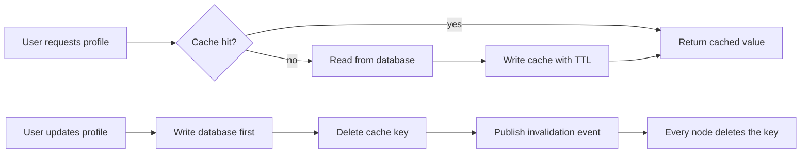

| Difficulty | Channel | Tags |
|---|---|---|
| beginner | backend | redis, memcached, cache-invalidation |

In 2013, Facebook published one of the most-cited systems papers ever written — not about an exotic new database, but about how it kept a humble memcached layer from collapsing under a billion users [1]. That paper became the canonical blueprint for cache invalidation, and its lessons still shape every modern profile service you will ever build. You are about to face the same problem at a much smaller scale, and the exact failure modes that kept Facebook engineers up at night will bite you too. Here is what they learned, and how you can avoid learning it the hard way.

---

> ### Real-World Case — Facebook (Meta)
>
> By 2013 Facebook served over a billion users, but its simple memcached look-aside cache fronting MySQL was showing emergent failure modes: thundering herds after invalidation, stale sets (an old write overwriting a newer cached value), hot keys, and replication lag between cache and database. Every user profile view fanned out into hundreds of cache lookups, so any inconsistency showed up instantly to users.
>
> | | |
> |---|---|
> | **Challenge** | How to keep a distributed, sharded memcached fleet (thousands of servers, billions of requests per second, trillions of cached items) consistent with MySQL when user data is constantly updated, without paying the latency or complexity of Redis-style pub/sub coordination across every node. |
> | **Solution** | They stuck with cache-aside (read-through) but invented a surprising invalidation trick: a daemon called McSqueal that tails MySQL's replication/commit log and issues cache deletes in the same order as database commits — so an invalidation can never arrive before the write it invalidates, eliminating the stale-cache-but-replication-lagged race. They also extended the memcached protocol with leases: on a miss the server issues a token that is invalidated if the key changes, letting the 'winning' client fill the cache while silently dropping the loser's late SET (defeating both thundering herds and stale sets). A dedicated ~1% 'gutter' pool absorbed traffic from failed servers so a dead node never stampeded MySQL. |
> | **Outcome** | The system handled billions of requests per second across a fleet of tens of thousands of memcached servers with single-digit-millisecond end-to-end p95 latency, supporting over a billion users. The paper (NSDI 2013, one of the most-cited systems papers ever) became the canonical blueprint for large-scale cache invalidation and was open-sourced as mcrouter. |
> | **Lesson** | For cache invalidation, correctness and ordering matter more than push-based speed: deriving invalidations from the database's own write stream (the commit log) guarantees they arrive in order, and a simple lease token beats a distributed pub/sub bus for preventing thundering herds and stale writes. Memcached's 'no built-in coordination' isn't a weakness when you coordinate at the storage layer instead. |

---

## Hook — Your Profile Page Just Showed a Photo from 2012

Your profile page just displayed a picture from 2012. No, this is not a nostalgic trip through your camera roll — this is what happens when a stale cached object outlives the database row it was built from. Every user profile service on the planet runs into this exact moment: you add a cache to make reads fast, and then the cache quietly starts lying to you. It is an innocent-looking bug, but the stakes are real: users notice, trust erodes, and support tickets pile up. By the end of this article, you will understand why the lie happens, how to stop it, and why the biggest social network in the world wrote a legendary paper about this very problem.

## Problem — Caching Is Easy, Invalidation Is Where Careers Go to Die

Here is the trap: caching is easy, invalidation is hard. The naive approach is to cache everything and never think about it again — check the cache, return the value, set a TTL, done. That works, right up until a user edits their display name and keeps seeing the old one in the profile card for fifteen minutes. But the problem runs much deeper than one bad response. When you delete a key, a thundering herd of requests suddenly stampedes into the database at once. When you eagerly write the cache back on every update, you invite stale sets — an older write clobbering a newer cached value because two requests raced each other. And if you run multiple cache nodes, a key invalidated on one server stays alive on another, so different users see different versions of the same profile depending on which node answered their request. Suddenly, the innocent cache is the most dangerous component in your stack.

## Real-World Case — Facebook

Now multiply every one of those failure modes by roughly a billion. By 2013, Facebook served over a billion users on a deceptively simple setup: memcached as a look-aside cache in front of MySQL [1]. Every profile view fanned out into hundreds of cache lookups, and the fleet ballooned to tens of thousands of memcached servers handling billions of requests per second [1]. Then the emergent failures arrived: thundering herds after every invalidation, stale sets where old writes clobbered new data, hot keys that turned single servers into bottlenecks, and replication lag that let the cache drift silently away from the database. Every page view was a live test, so any inconsistency surfaced instantly to users [1]. The engineers did not just patch it — they wrote the canonical blueprint, an NSDI 2013 paper that became one of the most-cited systems papers ever, and open-sourced the tooling as mcrouter [7]. The punchline? Even Facebook could not ship perfect consistency with a simple look-aside cache. What they built instead was a system of explicit, disciplined invalidation — and that is exactly what your profile service needs.

## Deep Dive — Cache-Aside, TTLs, and the Redis vs Memcached Plot Twist

Building on Facebook's story, let's examine the two patterns you will actually use. First, cache-aside (look-aside): the read path checks the cache, and on a miss it fetches from the database and backfills the cache. The write path simply deletes the key. That delete is the whole trick — instead of trying to keep cache and database perfectly in sync, you treat the cache as disposable and let the next read rebuild it from the source of truth [5]. Second, TTLs: every entry expires, so even if an invalidation is missed, stale data self-destructs within minutes. For profiles, a TTL between 5 and 30 minutes is the sweet spot — long enough to absorb read load, short enough to bound staleness [4].

The real plot twist arrives with multiple nodes. Delete a key on one server and the other nine still serve the old value. This is where Redis and Memcached split paths. Redis ships pub/sub, so every node can subscribe to an invalidation channel and drop the key the moment someone publishes an update — automatic distributed invalidation [3][6]. Memcached has no such mechanism; you coordinate deletions manually across nodes, which is precisely the coordination nightmare Facebook had to engineer mcrouter to solve [7][8].

Here is the honest trade-off table:

| Decision | Redis | Memcached |
|---|---|---|
| Distributed invalidation | Built-in pub/sub [3][6] | Manual coordination across nodes [7][8] |
| Durability | Persistence built in [3] | None — pure cache [2] |
| Data structures | Rich: sets, hashes, streams [6] | Key-value only [2] |
| Memory overhead | Higher per key | Minimal, excellent per-RAM throughput [2] |
| Complexity | More knobs to tune | Dead simple [2] |

One more nuance worth naming: write-through caching, where updates write to both database and cache, keeps things consistent but doubles write latency and litters the cache with keys nobody ever reads. Most teams discover that delete-on-write beats write-through because you never pay the write cost for data that may never be requested again [5]. As for TTLs — you might think skipping them saves work. It does not; a key without a TTL that survives a missed invalidation becomes a permanent zombie [4].

## Workflow — The Five-Step Invalidation Loop

Putting it all together, your profile service needs a loop, not a one-time decision. First, on the read path, always check the cache first and backfill on a miss using cache-aside [5]. Second, on the write path, commit to the database first — it is the source of truth — and then delete the cached key rather than updating it in place. Third, broadcast the invalidation so every node in the fleet drops the key, via Redis pub/sub or your own coordination layer like mcrouter [7]. Fourth, lean on TTLs as a safety net for anything you miss. Fifth, monitor your cache hit rate, miss rate, and p95 latency, because those numbers tell you when the herd is about to stampede.

The diagram below walks through the complete read and write flow, from request to distributed invalidation — the exact loop Facebook scaled to billions of requests per second.

## Code Example — Deleting Your Way to Fresh Profiles

Here is the pattern in practice — a Python profile service that combines cache-aside reads with delete-on-write invalidation and Redis pub/sub for multi-node freshness. The code below solves the core problem from earlier: stale profiles served to users because an update did not reach every cache node.

## Lessons Learned — What the Fleet Taught Us

So what should you do differently tomorrow? First, delete, do not update: invalidating a key and letting the next read rebuild it beats any in-place update, which races with concurrent reads and produces stale sets — a failure mode Facebook documented at scale [1]. Second, database first, cache second: never let a cache write race ahead of the committed database write. Third, treat TTLs as a safety net, not a strategy — they bound staleness, they do not prevent it [4]. Fourth, design for multi-node invalidation from day one: Redis pub/sub if you want it built in [3], or an explicit coordination layer like mcrouter if you run memcached at scale [7]. Finally, remember the battle scars: a thundering herd is waiting behind every invalidated hot key, so add jitter to your TTLs and think about read replicas before the pager goes off. If this feels like a lot, you are not alone — Facebook's entire engineering culture evolved around exactly these rules [1].

---

## Cache Invalidation Flow

<strong>Original Interview Question</strong>

**Q:** You're building a user profile service that caches frequently accessed profiles. How would you implement cache invalidation when a user updates their profile, and what trade-offs would you consider between Redis and Memcached?

**A:** Implement write-through caching with TTL-based expiration. On profile update, invalidate the cache by deleting the key and writing new data to both the database and cache. Redis offers pub/sub for automatic distributed invalidation, while Memcached requires manual coordination across nodes.

## Conclusion

The next time your profile service serves a photo from 2012, you will know the culprit is not a bug in the database — it is a cache that was trusted more than it deserved. The fix is the same lesson Facebook's fleet learned at a billion users: write to the database, delete the key, and let the next read rebuild [1]. Start tonight: switch any in-place cache updates to delete-on-write, add a 5–30 minute TTL as your safety net, and if you run more than one cache node, wire up pub/sub invalidation before the inconsistency does. One memorable insight to take to your team: the fastest way to keep a cache fresh is to know when to kill it.

---

## References

1. [Facebook (Meta) incident report](https://engineering.fb.com/2013/04/15/core-infra/scaling-memcache-at-facebook) — article
2. [Memcached](https://en.wikipedia.org/wiki/Memcached) — documentation
3. [Redis](https://en.wikipedia.org/wiki/Redis) — documentation
4. [RFC 9111 - HTTP Caching](https://datatracker.ietf.org/doc/html/rfc9111) — documentation
5. [AWS - Database Caching Strategies Using Redis](https://docs.aws.amazon.com/whitepapers/latest/database-caching-strategies-using-redis/caching-patterns.html) — documentation
6. [DigitalOcean - Introduction to Redis Data Structure Types](https://www.digitalocean.com/community/tutorials/introduction-to-redis-data-structure-types) — documentation
7. [facebook/mcrouter](https://github.com/facebook/mcrouter) — documentation
8. [memcached/memcached wiki](https://github.com/memcached/memcached/wiki) — documentation

---

**Author:** Satishkumar Dhule — [GitHub](https://github.com/satishkumar-dhule) · [LinkedIn](https://linkedin.com/in/satishkumar-dhule) · [Website](https://satishkumar-dhule.github.io)
