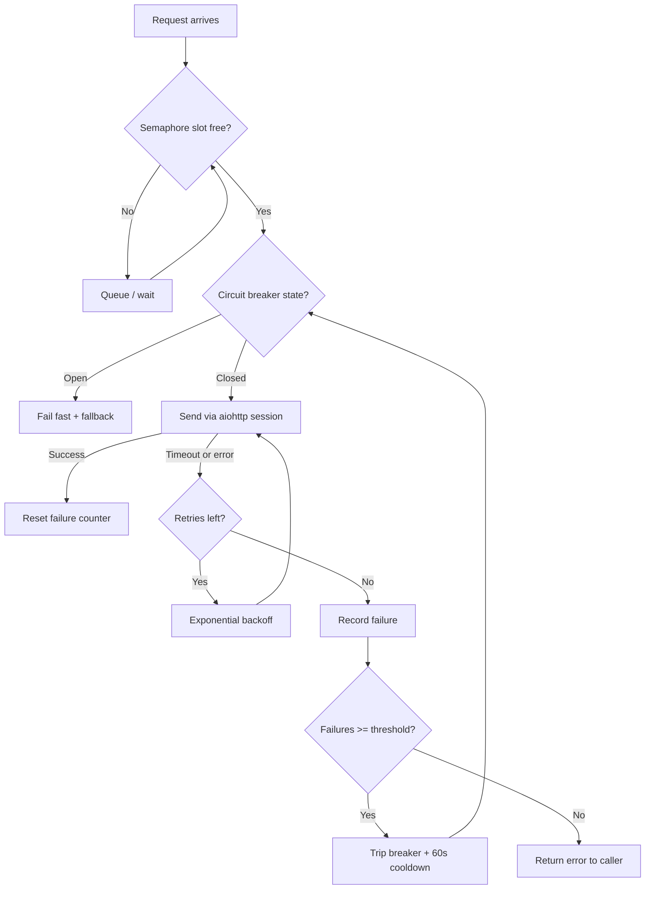

| Difficulty | Channel | Tags |
|---|---|---|
| advanced | backend | asyncio, aiohttp, concurrency |

By 2012, Netflix's API was handling more than a billion incoming calls per day, fanning out to several billion downstream requests across 30+ backend dependencies — and a single slow dependency could exhaust every Tomcat request thread in seconds [1]. That failure mode reshaped how the entire industry thinks about resilience. This article walks the same journey for your aiohttp services: semaphores to cap concurrency, exponential backoff for retries, and circuit breakers that let your system fail gracefully instead of falling over.

---

> ### Real-World Case — Netflix
>
> By 2012 the Netflix API was handling 1+ billion incoming calls per day that fanned out to several billion outgoing calls (a 1:6 ratio) across 30+ backend dependencies, peaking above 100k dependency requests per second. A single dependency that became slow or latent could exhaust every Tomcat request thread in seconds, taking down the entire streaming API. Netflix also realized that even with 99.99% uptime per dependency, 30 dependencies compound to just 99.7% composite availability - roughly 2+ hours of downtime per month.
>
> | | |
> |---|---|
> | **Challenge** | Build a client-side connection/fault-tolerance layer that could prevent a slow or failing downstream service from saturating all available request threads and causing cascade failures - while continuing to serve millions of concurrent users. |
> | **Solution** | Netflix built DependencyCommand (which became the open-source Hystrix library), implementing exactly the pattern in the answer: per-dependency semaphore-based concurrency limits (bulkhead isolation) plus separate thread pools to cap concurrent in-flight calls, aggressive network timeouts with retries, and circuit breakers that tripped at ~50% error rate over a 10-second rolling window to fail fast and shed load until health checks recovered. Any timeout, semaphore rejection, or open circuit routed to a fallback so users got a degraded-but-functional response instead of an error. A key discovery: the semaphore/thread-pool concurrency limits - not the circuit breaker - are the real protection, with circuit breakers being a reactive 'release valve' to relieve pressure on the struggling dependency. |
> | **Outcome** | Netflix reported a dramatic improvement in uptime and resilience, with tens of billions of thread-isolated and hundreds of billions of semaphore-isolated calls executed through Hystrix daily. During production incidents a single failing circuit could trip across the fleet while other circuits stayed healthy and 500s stayed flat because fallbacks kept serving users. The library was open-sourced in 2012 and became the industry-standard reference for resilience patterns in microservices. |
> | **Lesson** | Concurrency limits (semaphores/bulkheads) are the proactive first line of defense - they throttle before anything breaks - while circuit breakers are only a reactive safety valve. Simply raising timeouts and pool sizes when a system is sick is the opposite of the right move: let it shed load, fail fast, and return fallbacks until the root cause recovers. |

---

## Hook — The Deploy Looked Fine. Then the Timeouts Started.

Picture this: you are five minutes past a routine deploy when the alerts start rolling in. Latency on the catalog service is spiking, the error rate is climbing, and your pager is doing its best impression of a fire alarm. The request logs tell a familiar story — every outbound call to a third-party API is timing out, and because your aiohttp client has no limits, each hung request is quietly stacking up alongside thousands of others. Sound familiar?

Here is the uncomfortable truth: most connection pools are built for the happy path. They assume the downstream stays fast, the network stays reliable, and timeouts never actually fire. Production disagrees. And when production disagrees, the failure is rarely contained — it cascades through the entire system like a line of dominos. This article is about building an aiohttp connection pool that survives those moments: a semaphore to cap concurrency, exponential backoff to ride out transient failures, and a circuit breaker to stop one sick service from taking everything down with it.

## Problem — The Domino Effect of a Slow Downstream Service

The core problem is subtle because it hides in plain sight. An async HTTP client like aiohttp gives you thousands of concurrent connections on a single event loop — impressive, until those connections are all waiting on the same slow endpoint. Unlike synchronous frameworks where threads are the scarce resource, asyncio's scarce resource is bounded concurrency. Many developers discover that without a semaphore, one slow dependency invites unlimited concurrent connections, each one creating its own timeout timer, each one consuming memory and file descriptors, each one eventually failing and triggering a retry storm. The system ends up doing more work failing than it ever did succeeding.

Add a naive retry loop on top — retry immediately, retry everything — and you have transformed a 2-second hiccup into a 10-minute outage, a textbook case of failure amplification [9]. This is what engineers mean when they talk about cascade failures: not a single broken service, but a broken service dragging its healthy neighbors down with it [2]. The stakes are simple. If your pool cannot degrade gracefully, it does not matter how fast your code is — the moment a dependency stumbles, your pager owns the night.

## Real-World Case — Netflix, 2012: One Billion Calls and a 1:6 Fan-Out

Building on those stakes, the cautionary tale here comes from Netflix. By 2012, the Netflix API handled over a billion incoming calls per day, fanning out to several billion outgoing calls — a 1:6 ratio — across more than 30 backend dependencies, with spikes above 100,000 dependency requests per second [1]. The infrastructure was humming, but one weak point lurked beneath the surface: any dependency that became slow or latent could exhaust every Tomcat request thread in seconds. A single degraded service, and the entire streaming API collapsed.

The math made the risk even more brutal. Even assuming 99.99% uptime for every individual dependency, 30 dependencies compound to roughly 99.7% composite availability — more than two hours of downtime per month, entirely outside Netflix's control [1]. That sobering arithmetic drove them to build Hystrix, a resilience library that introduced thread isolation, semaphore isolation, and circuit breakers at industrial scale. The results were dramatic: tens of billions of thread-isolated and hundreds of billions of semaphore-isolated calls executed through Hystrix daily, and during production incidents a single failing circuit would trip across the fleet while healthy circuits kept serving users — 500s stayed flat because fallbacks kept the experience alive [1]. Open-sourced in 2012, Hystrix became the industry-standard blueprint for microservice resilience [6].

## Deep Dive — The Resilience Toolkit: Semaphores, Backoff, and Circuit Breakers

Therefore, the question becomes: how do you translate Netflix-grade resilience into a single aiohttp service? You start with three interlocking patterns.

The semaphore is your concurrency gatekeeper. By bounding the number of in-flight requests, you protect your process from unbounded resource consumption, turning a potential stampede into an orderly queue [4]. Your retries then follow exponential backoff — after each failed attempt you wait longer, giving a struggling dependency breathing room instead of hammering it into the ground [3]. And the circuit breaker is your tripwire: once failures cross a threshold, it stops sending requests to the failing dependency for a cooldown window, so you fail fast and cheap instead of slow and expensive [2].

Here is the plot twist many developers miss: a circuit breaker is not about the dependency — it is about you. The breaker exists to save your service's remaining capacity, not to nurse the sick dependency back to health. That reframing changes how you set thresholds. ⚠️ Watch Out: a common mistake is tuning the breaker so aggressively that it trips during normal traffic spikes, turning a healthy-but-busy service into a permanently open circuit.

Choosing between them is not either/or — they compose. Each pattern attacks a different failure mode, which is why production systems layer all three [6][7].

## Workflow — From Chaos to Control: A Resilient Request Pipeline

Consequently, here is the pipeline you want in front of every outbound request. The diagram below tells the story of a single request's journey — and every fork in the road is a decision that keeps your service alive.

**Step 1 — Gate the request.** Acquire a semaphore slot before touching the network. If the pool is saturated, wait; queued requests are cheaper than failing requests.

**Step 2 — Check the breaker.** If the circuit is open, fail fast with a fallback or cached response. Do not waste a semaphore slot on a doomed request.

**Step 3 — Send with a real timeout.** Configure both connect and total timeouts — a connection that hangs forever is worse than one that fails quickly.

**Step 4 — Retry with backoff.** On transient errors, wait 0.5s, then 1s, then 2s — but cap the attempt count so you never loop forever.

**Step 5 — Feed the breaker.** Record successes and failures; trip the circuit after a threshold and cool down before letting traffic through again.

**Step 6 — Clean up.** On shutdown, close the session and drain the queue, or you leak sockets and hang your process.

Every step buys your service a little more headroom when the world catches fire.

## Code Example — Building the ConnectionPoolManager

With the workflow in mind, let's translate it into code. The class below bundles all three patterns into a drop-in manager for aiohttp: a semaphore caps concurrency, exponential backoff softens retries, and a state machine trips the breaker after repeated failures. See the full walkthrough in the explanation below the code.

## Lessons Learned — Battle Scars and the Road Ahead

By now the arc of the journey should be clear: Netflix's billion-call problem was not solved by bigger servers but by smarter boundaries [1]. The same principles scale down to a single aiohttp service. Here is what to do differently tomorrow:

- **Cap concurrency before you need to.** A semaphore costs nothing and saves everything [4].
- **Treat timeouts as a design decision, not a default.** Measure p99 latency and set timeouts accordingly [8].
- **Back off exponentially and never retry everything.** Amplification is the silent killer [3].
- **Trip breakers to protect yourself, not to save the dependency** [2].
- **Clean up your sessions on shutdown.** Leaked sockets are a slow-motion outage.
- **Monitor and tune.** Watch pool utilization, breaker trips, and queue depth, then resize the pool from real metrics, not guesses [9].

🔥 Hot Take: if your service has no circuit breaker, you have not built a distributed system yet — you have built a promise that the network will never fail. It will.

The insight worth sharing with your team: resilience is not about preventing failure — it is about containing it. Netflix could not stop dependencies from breaking; they built a system that failed gracefully anyway. Your aiohttp pool can do the same.

---

## Resilient Request Pipeline

<strong>Original Interview Question</strong>

**Q:** How would you implement a connection pool manager for aiohttp that handles graceful degradation under high load and connection timeouts?

**A:** Implement a connection pool manager for aiohttp using a semaphore to limit concurrent connections, exponential backoff for retrying failed requests, and circuit breaker pattern to gracefully degrade under high load and connection timeouts.

## Conclusion

The moral of this story is that graceful degradation is a design choice, not an accident. Netflix stared down a 1:6 fan-out across 30+ dependencies and learned that the only reliable strategy is to bound, back off, and trip [1]. Tomorrow, add a semaphore to your aiohttp pool. Then add exponential backoff. Then add the breaker. Each layer is cheap on its own; together they are the difference between a pager at 3am and a quiet night. Start small, measure, and let the metrics tell you when to strengthen the next layer — because the network will eventually test you. Make sure you are ready.

---

## References

1. [Netflix incident report](https://netflixtechblog.com/fault-tolerance-in-a-high-volume-distributed-system-91ab4faae74a) — article
2. [Circuit breaker design pattern](https://en.wikipedia.org/wiki/Circuit_breaker_design_pattern) — documentation
3. [Exponential backoff](https://en.wikipedia.org/wiki/Exponential_backoff) — documentation
4. [asyncio synchronization primitives (Semaphore)](https://docs.python.org/3/library/asyncio-sync.html) — documentation
5. [aiohttp ClientSession and ClientTimeout reference](https://docs.aiohttp.org/en/stable/client_reference.html) — documentation
6. [Netflix/Hystrix](https://github.com/Netflix/Hystrix) — documentation
7. [Resilience4j — circuit breaker library](https://github.com/resilience4j/resilience4j) — documentation
8. [Python asyncio documentation](https://docs.python.org/3/library/asyncio.html) — documentation
9. [AWS API error retries and exponential backoff](https://docs.aws.amazon.com/general/latest/gr/api-retries.html) — documentation
10. [aiohttp client quickstart](https://docs.aiohttp.org/en/stable/client_quickstart.html) — documentation

---

**Author:** Satishkumar Dhule — [GitHub](https://github.com/satishkumar-dhule) · [LinkedIn](https://linkedin.com/in/satishkumar-dhule) · [Website](https://satishkumar-dhule.github.io)
