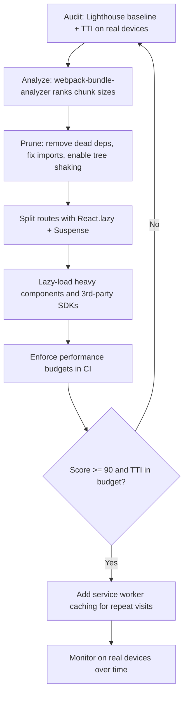

| Difficulty | Channel | Tags |
|---|---|---|
| intermediate | frontend | lighthouse, bundle, lazy-loading |

Millions of swipes depend on a page that loads before patience runs out [1]. When Tinder pushed its web app (Tinder Online) as a serious growth channel, mobile users on slow networks were greeted with loading screens instead of profiles — and every extra second quietly cost engagement. The villain was a monolithic JavaScript bundle carrying code the core experience never needed to boot. This is the story of how one team diagnosed, cut, and measured its way from sluggish to snappy — and how the exact same playbook can take your React app from a Lighthouse 65 to a 90+.

---

> ### Real-World Case — Tinder
>
> As Tinder pushed its web app (Tinder Online) as a serious growth channel, mobile users on slow networks faced sluggish load times. Large monolithic JavaScript bundles contained code not needed to boot the core experience, delaying how quickly the app became interactive and hurting engagement.
>
> | | |
> |---|---|
> | **Challenge** | The main bundle and vendor chunk were bloated (main bundle alone was 166KB and the full initial JS payload was multi-hundreds of KB). Users had to download and execute code for routes and features they weren't even visiting yet, pushing out time-to-interactive. |
> | **Solution** | They implemented route-based code splitting with React Router and React Loadable, using dynamic import() with webpack magic comments to split per-route bundles. They moved common libraries into a single cacheable vendor chunk via the CommonsChunkPlugin, precached route bundles with a Service Worker, and enforced hard performance budgets (~155KB main/vendor, ~55KB async chunks, 20KB CSS). They also upgraded to React 16, used babel-preset-env to trim unused polyfills, enabled scope hoisting, and analyzed bundles with source-map-explorer to find what else could be lazily loaded. |
> | **Outcome** | Main bundle dropped from 166KB to 101KB, and DOMContentLoaded improved from 5.46s to 4.69s. Upgrading to React 16 cut the gzipped vendor chunk by ~7% (react+react-dom went from ~50KB to ~35KB). Performance budgets kept them from regressing. Analysis showed a lazy-loaded Facebook SDK (~200KB) could shave another 1 second off initial load. |
> | **Lesson** | Measure and analyze the bundle before optimizing (source-map-explorer revealed that non-critical components like photos, notifications, and captchas were still shipped before login), split by route and defer everything non-critical, and enforce performance budgets so wins don't get silently undone. Some bundles are hard to split further without architectural changes (their Redux/Saga setup). |

---

## Hook — A loading spinner between you and a match

Picture this: it is late at night, and a user on a 3G connection finally gives the Tinder web app one more try. They tap, the browser spins up a 2.1MB JavaScript bundle, and for over four seconds nothing meaningful happens. Another swipe lost. Another bounce recorded [1]. Sound familiar? Every developer knows that moment when Lighthouse renders its verdict and the score is lower than expected. The tension is real: your product may be brilliant, but if the bundle is a monolith, none of it matters. This article follows Tinder's journey from a bloated bundle to a performance case study — and hands you the exact workflow to repeat it.

## Problem — The 2.1MB bundle nobody asked for

Many developers discover their performance problems the same way: Lighthouse fires, and the result is a sobering 65 out of 100. The report reveals the true culprits — a 2.1MB bundle and a Time to Interactive of 4.2 seconds [2]. Here is the thing nobody tells you: bundlers do not ship bloat on purpose. They ship it because of defaults. Import a charting library for one component and the entire library lands in the initial bundle. Add a third-party SDK for analytics and it boots on every page, even pages that never use it. Consequently, the critical rendering path is blocked by code that has nothing to do with what the user is looking at. The stakes are not cosmetic either. Slow interactive time means users abandon before the app is usable, which directly hurts engagement, conversion, and retention. The core question becomes: how do you keep the experience fast without rewriting the whole app?

## Real-World Case — Tinder Online: performance budgets and the 166KB breakthrough

In 2017, the Tinder team set out to make its progressive web app a serious growth channel, and the results were anything but accidental — they were engineered [1]. Through disciplined bundle analysis and enforced performance budgets, the main bundle dropped from 166KB to 101KB, roughly a 39% reduction. Consequently, DOMContentLoaded improved from 5.46 seconds to 4.69 seconds [1]. The wins kept compounding: upgrading to React 16 cut the gzipped vendor chunk by about 7%, with react and react-dom shrinking from roughly 50KB to 35KB [1]. Here is the plot twist though — the analysis revealed that a lazy-loaded Facebook SDK weighing about 200KB could shave an entire additional second off initial load, simply because most users never needed it at boot [1]. The lesson is counterintuitive: the biggest performance win is not writing faster code, it is refusing to send code nobody asked for. Performance budgets were the guardrail that kept the team from regressing after each refactor [9].

## Deep Dive — Analysis, splitting, and shaking: the anatomy of a fast bundle

Building on Tinder's example, the first rule is: never optimize blind. Run webpack-bundle-analyzer to visualize your bundle and identify the largest chunks — the bloat is usually hiding in a handful of heavy dependencies [5]. Once you see the composition, three levers come into play. First, tree shaking: with proper ES module configuration and sideEffects flags, bundlers can eliminate unused exports, so a utility library that is 90% dead code ships only the 10% you use [7]. Second, code splitting: split by route or by component. Route-based splitting means the initial route loads only its own code, while component-based splitting defers heavy, non-critical features like charts until they are actually rendered [6]. Third, dynamic imports: using the import() syntax turns a static dependency into a fetch-on-demand one [8]. But here is the honest trade-off — splitting is not free. Each lazy boundary introduces a network round trip, so splitting a tiny component can hurt more than it helps. The art is knowing what belongs on the critical path.

## Workflow — The step-by-step optimization pipeline

This leads to a repeatable workflow that mirrors what Tinder's team practiced. It looks like a pipeline: audit, analyze, prune, split, verify, and enforce. Start by capturing a baseline Lighthouse score and TTI on real devices [2]. Then open the bundle analyzer and rank chunks by size [5]. Prune aggressively: remove unused dependencies, fix default imports, and enable tree shaking [7]. Then introduce lazy boundaries at the route level first — it delivers the biggest win for the least effort [6]. For heavy components like charts and editors, add component-level lazy loading behind Suspense [4]. Finally, wire performance budgets into CI so any new dependency that blows the budget fails the build instead of silently slowing production [9]. The diagram below shows this loop, including the important feedback arrow: if the score still misses the target, the loop starts again.

## Code Example — From monolith to lazy-loaded routes

The code below is the practical heart of this article: it shows how to split vendor code at the build level and then use React.lazy with Suspense to defer routes and heavy components. The webpack config carves React out of the shared vendor chunk so it can be cached independently, while the component layer uses dynamic imports so each route downloads only what it needs. React.lazy accepts a function that returns a dynamic import promise, which is exactly the import() syntax that triggers webpack code splitting [3][6]. Wrapping the routes in Suspense gives users a loading fallback instead of a blank screen [4]. Note the error boundary pattern is the production-ready touch: if a lazy chunk fails to download on a flaky network, you want a graceful retry, not a white screen.

## Lessons Learned — What to do differently tomorrow

So what is the takeaway? First, measure before you cut — a bundle analyzer beats guessing every time [5]. Second, split by route before you split by component; it yields the biggest win with the least complexity [6]. Third, enforce budgets or your hard-won gains will quietly erode within a sprint or two [9]. And fourth, remember Tinder's example: the 200KB lazy-loaded SDK was worth a full second of load time precisely because it was off the critical path [1]. The battle scars worth sharing: splitting a tiny component adds round trips that slow you down, sideEffects misconfiguration can silently break tree shaking, and forgetting a loading fallback turns fast loads into confusing blank screens. If this feels overwhelming, you are not alone — but the pipeline is small, and the first pass takes an afternoon. Start with the analyzer, pick one route, split it, and watch your Lighthouse number climb.

---

## Bundle Optimization Pipeline

<strong>Original Interview Question</strong>

**Q:** You're tasked with improving a React app's Lighthouse performance score from 65 to 90+. The bundle size is 2.1MB and Time to Interactive is 4.2s. What specific steps would you take to optimize the bundle and implement lazy loading?

**A:** Implement code splitting with React.lazy() and Suspense, analyze bundle composition with webpack-bundle-analyzer to identify largest chunks, remove unused dependencies and optimize imports, add dynamic imports for heavy components and third-party libraries, implement route-based splitting for better initial load times, and utilize tree shaking with proper ES module configuration.

## Conclusion

The moral of the story: Tinder did not ship faster code — it shipped less code. By analyzing the bundle, pruning dead weight, splitting by route, and enforcing performance budgets, the team cut the main bundle from 166KB to 101KB and shaved real seconds off load time [1]. Tomorrow, open the bundle analyzer, find your single largest chunk, and split it. Then add a performance budget to CI so the bloat never sneaks back. The one insight worth sharing with your team: the fastest code is the code you never send.

---

## References

1. [Tinder incident report](https://calendar.perfplanet.com/2017/a-tinder-progressive-web-app-performance-case-study/) — blog
2. [Time to Interactive — MDN Glossary](https://developer.mozilla.org/en-US/docs/Glossary/Time_to_interactive) — documentation
3. [React.lazy — React Documentation](https://react.dev/reference/react/lazy) — documentation
4. [React Suspense — React Documentation](https://react.dev/reference/react/Suspense) — documentation
5. [webpack-bundle-analyzer](https://github.com/webpack-contrib/webpack-bundle-analyzer) — documentation
6. [Code Splitting — webpack Guides](https://webpack.js.org/guides/code-splitting/) — documentation
7. [Tree Shaking — webpack Guides](https://webpack.js.org/guides/tree-shaking/) — documentation
8. [Dynamic import — MDN JavaScript Reference](https://developer.mozilla.org/en-US/docs/Web/JavaScript/Reference/Operators/import) — documentation
9. [Performance budgets — web.dev](https://web.dev/articles/performance-budgets) — documentation
10. [Service Worker API — MDN](https://developer.mozilla.org/en-US/docs/Web/API/Service_Worker_API) — documentation

---

**Author:** Satishkumar Dhule — [GitHub](https://github.com/satishkumar-dhule) · [LinkedIn](https://linkedin.com/in/satishkumar-dhule) · [Website](https://satishkumar-dhule.github.io)
