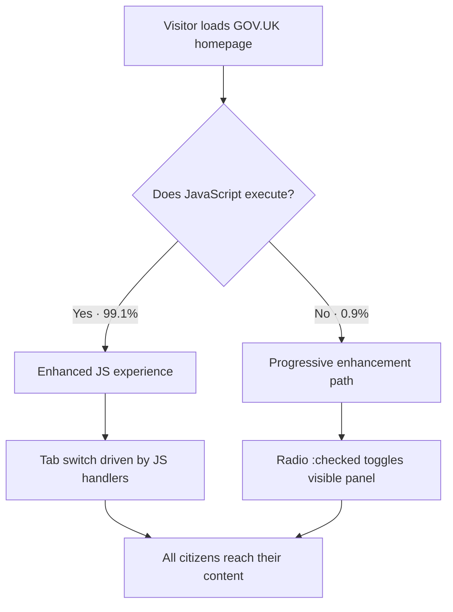

| Difficulty | Channel | Tags |
|---|---|---|
| beginner | frontend | css, flexbox, grid, animations |

In 2016, the Government Digital Service behind GOV.UK revealed a number that quietly reshapes how the web should be built: 0.9% of visits to their homepage — roughly one in every 93 sessions — ran the entire site without JavaScript, and silent script failures outnumbered deliberate disabling by almost four to one [1]. For a platform where citizens file taxes, renew passports, and book driving tests, locking those users out was never an option [1]. So this post walks through building the one UI component that must never depend on JavaScript: a CSS-only tab panel.

---

> ### Real-World Case — GOV.UK (Government Digital Service)
>
> GOV.UK is the UK government's website serving hundreds of millions of sessions per year for services like tax filing, passports, and driving licences, where any user being locked out has real legal and social consequences. In 2013, GDS realized they had no idea how many sessions were experiencing the site without JavaScript, so they instrumented the high-traffic homepage with tracked script/noscript images to find out.
>
> | | |
> |---|---|
> | **Challenge** | Determine how many users actually run the site without JavaScript, and then decide how to build interactive components (tabs, accordions, autocomplete) so critical services remain usable when JS fails to load. |
> | **Solution** | They adopted progressive enhancement as a mandatory practice: build the page to work from HTML first, layer CSS on top, and treat JavaScript purely as an enhancement. Interactive widgets were re-engineered so the baseline (including CSS-only/HTML-native patterns like radio-button toggles and details/summary) works with no JS, and the Service Manual now requires every government service to follow this approach. |
> | **Outcome** | Their homepage experiment found 0.9% of visits (roughly 1 in every 93 sessions) ran without JavaScript, and the surprising kicker: 4,329 visits silently failed to run scripts versus only 1,113 that explicitly had JS disabled — meaning silent failures (old browsers, proxies, extensions, flaky networks) are ~4x more common than deliberate disabling. Because of progressive enhancement, all those users can still access and complete government services. |
> | **Lesson** | No-JS users are a real, measurable population and usually not by choice — so building an HTML/CSS baseline first is worth it, exactly the philosophy behind CSS-only radio-button tabs. But the pattern has a hard boundary: fully accessible tabs (roving tabindex, aria-selected toggling, arrow-key navigation) require JavaScript, so CSS-only tabs are a robust fallback for the ~1% who need it, not a drop-in replacement for a JS-enhanced tab component. |

---

## Hook — 0.9% of your users just quietly disappeared

Every year, hundreds of millions of sessions flow through GOV.UK — citizens paying tax bills, renewing passports, applying for driving licences — and any user locked out of those journeys faces real legal and social consequences [1]. Back in 2013, the team realized something unsettling: they had absolutely no idea how many of those citizens were experiencing the site with JavaScript silently broken. So they instrumented the high-traffic homepage with tracked script and noscript images to find out. The results, published in 2016, are the opening scene of this story: 0.9% of visits ran without JavaScript, with 4,329 sessions failing scripts silently while only 1,113 deliberately disabled them [1]. Now here is the uncomfortable question that raises for your next feature: what happens to your interface when JavaScript simply… does not run?

## Problem — the tab panel everyone builds is a gate

Tab panels are everywhere — design-system documentation, dashboard widgets, pricing pages — and almost everywhere they are built with JavaScript: a click handler, a hidden attribute toggle, a keyboard listener. And that is exactly the problem. The moment tabs rely on JavaScript, they inherit every failure mode of JavaScript: blocked requests, stale caches, broken bundles, aggressive extensions, flaky mobile networks, and, most insidiously, silent errors that fail without so much as a console message [1]. Moreover, JavaScript tabs tend to ship their own accessibility debt — ARIA roles to wire up by hand, roving tabindex for arrow-key navigation, focus management on switch — each one a place for a bug to hide. You might think a few hundred bytes of JS is a fair price, but the real price is paid by the user who gets a blank panel with no way forward. Sound familiar?

## Real-World Case — GOV.UK's 4,329 silent failures

Here is where GOV.UK's experiment stops being a footnote and becomes a lesson. The team instrumented the homepage with tracked script and noscript images and discovered 0.9% of visits — 1 in every 93 sessions — ran without JavaScript [1]. The kicker is the breakdown: 4,329 visits silently failed to execute scripts versus only 1,113 that explicitly disabled JavaScript [1]. In other words, silent failures — old browsers, proxies, extensions, flaky networks — are roughly 4x more common than deliberate choice. Because GOV.UK builds with progressive enhancement, every one of those citizens can still complete their government service [1]. Every tab panel you ship inherits exactly this contract: if the scripts fail, does the content survive?

## Deep Dive — radio buttons, the browser's hidden state machine

Building on that story, the CSS-only tab pattern is the browser's own primitive working for you. A group of radio inputs sharing the same name attribute is a state machine handed to you by the platform: the browser guarantees that exactly one radio is checked at any moment, and clicking a label toggles that state for free [8]. The :checked pseudo-class becomes your selector hook, and sibling combinators decide which panel is visible [2][3]. The real subtleties hide in the details, and this is where the pattern earns its reputation:

- Grid instead of framework: display: grid; grid-template-columns: repeat(2, 1fr); gives the 2x2 desktop grid, and a single media query at 768px collapses it to one column [4].
- aspect-ratio locks the image: aspect-ratio: 16 / 9 keeps the media area fixed no matter the card width [5].
- focus-visible separates intent: :focus-visible styles the ring only for keyboard users, not for mouse clicks [6].
- prefers-reduced-motion is a hard requirement, not a nice-to-have: wrap entrance animations in the no-preference query so motion-sensitive users get static content instantly [7].

Here is the trade-off, laid out honestly:

| Concern | CSS-only tabs | JavaScript tabs |
|---|---|---|
| Works with JS disabled | Yes, always | No |
| Accessibility out of the box | Radio semantics for free | Manual ARIA roles + roving tabindex |
| Keyboard arrow-key navigation | No (Tab key only) | Yes, if implemented correctly |
| Animated transitions between panels | Limited (fade/slide) | Full control (height, state, spring physics) |
| Complexity / bundle size | Zero JS, ~30 lines of CSS | Event listeners, state, focus management |

The punchline: CSS-only trades fancy transition control for absolute resilience. For a design-system docs page — exactly the component GOV.UK's philosophy would endorse — that trade is usually a bargain.

## Workflow — from HTML skeleton to bulletproof panel

This leads to a surprisingly repeatable build process. Once the architecture clicks, the workflow becomes mechanical:

1. Mark up the radio inputs with a shared name and unique ids, then pair each with a label using the for attribute.
2. Position each panel immediately after its label so adjacent-sibling selectors can reach it [3].
3. Hide every panel by default, then reveal only the one following a checked input.
4. Turn the revealed panel into a grid: 2 columns on desktop, 1 below 768px [4].
5. Give cards a 16:9 image area with aspect-ratio, a title, and a meta line.
6. Add staggered entrance animations guarded by prefers-reduced-motion [7].
7. Add a global :focus-visible outline and test with JavaScript disabled.

For visual thinkers, the whole journey looks like the Progressive Enhancement Journey diagram below. The flowchart traces the two paths a visitor can take — and the crucial insight is that both paths end at the same content.

## Code Example — building the CSS-only tab panel

Time to build it. The full markup keeps the radio, label, and panel as direct siblings inside a wrapper — this DOM order is what makes the CSS selectors work, so do not let a linter "helpfully" flatten it. The stylesheet below is the complete pattern:

## Lessons Learned — build what survives the 0.9%

After the build, the takeaways come fast — and a few of them are battle scars worth wearing openly. First, the order of DOM elements is not a style choice: if you move all the radios to the top of the markup, the sibling rules will happily hide every panel, and you will spend twenty minutes wondering why nothing renders [3]. Second, do not use display: none on the radios — opacity plus absolute positioning keeps them keyboard-focusable, which is the entire point [8]. Third, remember that CSS-only tabs do not deliver arrow-key navigation or screen-reader tab semantics; for a marketing page that is fine, but for a complex widget you may legitimately need the ARIA tabs pattern — know when to stay CSS-only and when to hand over to JavaScript [9]. Fourth, test with JavaScript disabled before you deploy; a single DevTools toggle, a curl call, or a GOV.UK-inspired noscript check is enough to catch a broken progressive-enhancement story [1]. Finally, wrap every animation in prefers-reduced-motion and never let decoration override content for someone who asked for calm [7]. Progressive enhancement is not a legacy technique — it is the difference between 0.9% of your users getting your product and 0.9% getting a blank page [1].

---

## Progressive Enhancement Journey

<strong>Original Interview Question</strong>

**Q:** Build a CSS-only tab panel for a design-system docs page. Use radio inputs to switch tabs (no JavaScript). Desktop: a 2x2 grid of cards under each tab; mobile: single column. Each card has a fixed 16:9 image area, a title, and a short meta line. Add a subtle entrance animation with a stagger and keep focus-visible outlines; ensure prefers-reduced-motion is respected?

**A:** Use a set of radio inputs with a shared `name` attribute and corresponding `` elements for each tab section. The `:checked` state of each radio controls visibility of its associated panel via adjacent sibling selectors. Each panel renders a 2×2 card grid on desktop and collapses to a single column on mobile. Cards use `aspect-ratio: 16/9` for fixed image containers, with a title and meta line below.

## Conclusion

The journey started with a number — 0.9%, one in every 93 sessions — and ended with a habit: build the interface that survives when JavaScript does not [1]. Tomorrow, do one thing differently: pick the next tab panel, accordion, or dropdown you touch and build it with nothing but HTML and CSS. Check it with JavaScript disabled, keyboard-only, and with prefers-reduced-motion enabled. If it still works, you have just shipped the resilient kind of UI that GOV.UK would approve of. The one insight to carry to your team: your most loyal users may be the ones who never run your JavaScript — and they are the ones who should never have to know it.

---

## References

1. [GOV.UK (Government Digital Service) incident report](https://technology.blog.gov.uk/2016/09/19/why-we-use-progressive-enhancement-to-build-gov-uk/) — article
2. [MDN — :checked pseudo-class](https://developer.mozilla.org/en-US/docs/Web/CSS/:checked) — documentation
3. [MDN — General sibling combinator](https://developer.mozilla.org/en-US/docs/Web/CSS/General_sibling_combinator) — documentation
4. [MDN — CSS grid layout](https://developer.mozilla.org/en-US/docs/Web/CSS/CSS_grid_layout) — documentation
5. [MDN — aspect-ratio](https://developer.mozilla.org/en-US/docs/Web/CSS/aspect-ratio) — documentation
6. [MDN — :focus-visible](https://developer.mozilla.org/en-US/docs/Web/CSS/:focus-visible) — documentation
7. [MDN — prefers-reduced-motion](https://developer.mozilla.org/en-US/docs/Web/CSS/@media/prefers-reduced-motion) — documentation
8. [MDN — <input type="radio">](https://developer.mozilla.org/en-US/docs/Web/HTML/Element/input/radio) — documentation
9. [W3C ARIA Authoring Practices — Tabs pattern](https://www.w3.org/WAI/ARIA/apg/patterns/tabs/) — documentation
10. [MDN — CSS animation](https://developer.mozilla.org/en-US/docs/Web/CSS/animation) — documentation
11. [Wikipedia — Progressive enhancement](https://en.wikipedia.org/wiki/Progressive_enhancement) — documentation

---

**Author:** Satishkumar Dhule — [GitHub](https://github.com/satishkumar-dhule) · [LinkedIn](https://linkedin.com/in/satishkumar-dhule) · [Website](https://satishkumar-dhule.github.io)
