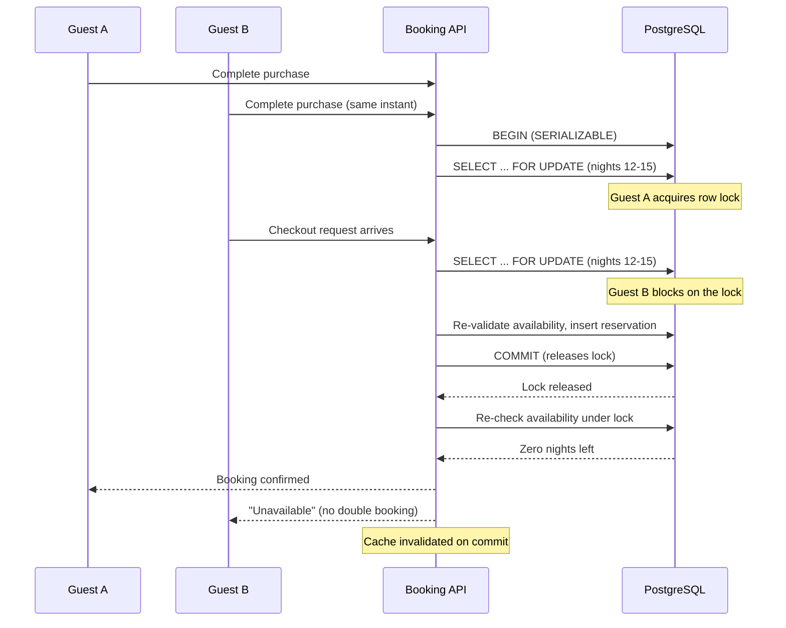

| Difficulty | Channel | Tags |
|---|---|---|
| intermediate | database | acid, isolation-levels, mvcc |

Picture this: Black Friday traffic is spiking, and two buyers hit 'Complete purchase' on the very last unit of the same product in the same millisecond. Both see a confirmation. Both get charged. But only one unit exists. For years, Shopify's checkout lived in this exact nightmare — a gap between two systems that could silently mint two sales out of one product, until they rebuilt reservations with transactional guarantees and survived Black Friday 2025 with zero oversells [1]. This is the story of how databases solve the double-booking problem, and what that journey teaches you about building booking systems that never lie.

---

> ### Real-World Case — Shopify
>
> Shopify's oversell protection system reserves inventory when a buyer hits 'Complete purchase', a short hold that must prevent two concurrent checkouts from claiming the same last unit. For years this ran on Redis, but reservations and the inventory ledger lived in different systems, so a crash between the two writes could cause overselling (two buyers get the last item) or underselling (lost revenue). Earlier attempts to move reservations into MySQL had failed because a single quantity column collapsed under lock contention.
>
> | | |
> |---|---|
> | **Challenge** | Build a reservation/booking system that guarantees ACID correctness — no double-selling the last unit — under Black Friday-scale bursts, where Shopify powers over 14% of U.S. ecommerce and hit a record $5.1 million in sales per minute at peak. A traditional 'one row per item with a quantity column' design created brutal row-lock contention: every concurrent checkout for a hot item queued on the same single lock. |
> | **Solution** | Shopify rebuilt reservations on MySQL using one row per sellable unit instead of one per item, with a bounded pool of rows (capped at 1,000 per item/location) so the SKIP LOCKED scan stays fast. MySQL 8's SELECT ... FOR UPDATE SKIP LOCKED lets concurrent transactions claim different rows in parallel instead of lining up behind a shared counter. They combined this with a composite primary key (shop_id, inventory_item_id, inventory_group_id, id) to cut row locks per reservation from two to one, switched the transaction isolation level from REPEATABLE READ to READ COMMITTED to eliminate gap locks that deadlocked with replenishment, and standardized lock acquisition order to fix deadlock cycles. Reserve and claim now commit in the same ACID transaction as the ledger, eliminating the Redis split-brain class of bugs. |
> | **Outcome** | The system survived Black Friday 2025 peak traffic with zero oversells and zero lost reservations. Cleanup of the checkout path removed 50% of reads and 33% of transactions on the primary database; during high-volume flash sales writer CPU stayed under 50% and reader CPU under 16% with headroom. The plot twist: after weeks of optimizing queries and locks, the real throughput ceiling turned out to be database connection usage — other parts of the checkout path were holding connections too long, not the reservation queries at all. |
> | **Lesson** | The bottleneck is rarely where you're looking. Row locks, isolation levels, and index design only matter if the plumbing around them isn't the real limit — instrument the full path (here, per-caller connection hold time via SQL comment tags aggregated at the ProxySQL layer) before concluding the database engine can't scale. Also worth revisiting: what wasn't possible five years ago (MySQL for this workload) became possible with new features like SKIP LOCKED, and a non-default isolation level (READ COMMITTED) was needed to avoid gap-lock deadlocks. |

---

## Hook — The millisecond that breaks your booking system

Here is a moment every developer who has ever built a checkout dreads: two guests are staring at the same property listing, both click 'Reserve' at the same instant, and both get a confirmed booking. There is one apartment. There are two confirmations. Congratulations — you have just shipped a double booking. The stakes are not just a refund: it is a furious guest at the door, a one-star review, and a support team that grows to love your bug report. Sound familiar? You might assume this is an edge case, but on real platforms it is a daily, high-stakes game of musical chairs. The only question is whether your database is the one holding the chairs — or the one pulling them away.

## Problem — The race condition hiding in plain sight

Double bookings are not caused by malicious users; they are caused by perfectly reasonable database behavior. When two transactions read the same row using a snapshot (MVCC), both see the same available nights — even as the other is committing a reservation [4]. Each transaction believes it won. This is the classic 'lost update' gone sideways, and it compounds the faster your system becomes: the more you scale, the more concurrent readers pile onto the same hot row, and the more opportunities exist for two confirmations to slip through. For an Airbnb-style system, the blast radius is brutal. A double-booking means re-hosting a guest, burning your margin, and eroding the trust that makes a marketplace work. The problem, in one sentence: you need reads that are fast and writes that are provably exclusive, and most databases give you one at the expense of the other.

## Real-World Case — Shopify's inventory reservations war story

Shopify faced the identical problem in a domain where the numbers are even scarier: e-commerce overselling [1]. Their oversell protection reserved inventory when a buyer hit 'Complete purchase' — a short hold that must prevent two concurrent checkouts from claiming the same last unit. For years this ran on Redis, but reservations and the inventory ledger lived in different systems. A crash between the two writes could cause overselling (two buyers get the last item) or underselling (lost revenue) [1]. Moving reservations into MySQL seemed obvious — until earlier attempts collapsed under lock contention on a single quantity column. The fix came from rethinking the data model: separate the inventory ledger into rows you can lock individually instead of one screaming-hot quantity column [1]. The results speak for themselves: the system survived Black Friday 2025 peak traffic with zero oversells and zero lost reservations, and the cleanup removed 50% of reads and 33% of transactions from the primary database, keeping writer CPU under 50% and reader CPU under 16% during flash sales [1]. But here is the plot twist that will stick with you: after weeks of optimizing queries and locks, the real throughput ceiling was neither — it was database connection usage, because unrelated parts of the checkout path were holding connections far too long [1].

## Deep Dive — Isolation levels, locks, and the art of the safe write

Building on Shopify's experience, the textbook answer is SERIALIZABLE isolation, but that phrase hides a spectrum of trade-offs. PostgreSQL implements SERIALIZABLE with serializable snapshot isolation, which detects conflicts and aborts one of the concurrent transactions rather than corrupting data [2]. Meanwhile, row-level locks like SELECT FOR UPDATE give you precise, targeted exclusivity: you lock only the rows for the exact date range you are about to book, not the whole table [3]. The classic decision every team faces is optimistic versus pessimistic concurrency control. Most teams discover that neither is 'correct' — each shines in different traffic patterns [5]:

- **Optimistic (version columns):** Check a version number on write, abort if it changed, retry. Great for low write contention; miserable when every request hammers the same row.
- **Pessimistic (row locks):** Lock the row, do your work, release. Great for hot properties and last-unit scenarios; risky if you hold locks while doing slow work.

| Approach | Lock the row? | Best for | The catch |
| --- | --- | --- | --- |
| Optimistic locking | No, compare version at write | Low contention, rare conflicts | Retries explode under hot-key traffic |
| SELECT ... FOR UPDATE | Yes, targeted rows | Last-unit, hot properties | Lock duration must be tiny |
| SERIALIZABLE + retry | Conflicts detected & aborted | Correctness-critical writes | Higher abort rate at high concurrency |

🔥 **Hot take:** MVCC does not make your reads 'free' — it makes your concurrent writes *safe to fail*. The snapshot is what lets both guests read the availability; the locks and re-validation are what stop both from booking [4]. 

💡 **Insight:** Shopify's real breakthrough was a database design change — spreading a single hot quantity column across granular rows you can lock independently — plus a disciplined choice about how long any lock is held [1]. Locking is a tool, not a strategy; the strategy is holding locks only as long as the critical section demands.

## Workflow — From two confirmations to one winner, step by step

Now the pattern comes together. The full workflow mirrors Shopify's playbook and is easy to follow once you see it as a five-act play. The diagram below shows the two guests racing for the same nights — and why exactly one of them walks away disappointed.

1. **Fast availability check:** Read the availability calendar from a read replica or cache for the snappy user-facing preview. This is a hint, never a guarantee.
2. **Begin SERIALIZABLE:** Open the transaction with SERIALIZABLE isolation so conflicts are detected, not silently merged [2].
3. **Lock the exact date rows:** Run SELECT ... FOR UPDATE on the availability rows for the requested date range. The second guest's lock request blocks right here [3].
4. **Re-validate under the lock:** Re-count the available nights now that you hold the lock. If the first guest already claimed them, abort with a clean 'unavailable' — no refund chaos needed.
5. **Write and commit:** Insert the reservation, decrement the availability, and commit. The commit releases the lock, waking the second guest to fail gracefully [2].
6. **Invalidate the cache:** Push the change through write-through caching so stale availability never misleads the next reader.
7. **Retry on serialization failure:** Wrap the transaction in exponential backoff with jitter for the rare case where a conflict was detected [7].

The mermaid diagram below captures the full drama in one glance: Guest A secures the lock and commits; Guest B waits, re-checks under the lock, finds nothing left, and gets the honest answer instead of a double booking.

## Code Example — Locking your way to exactly one winner

Enough theory — here is what this looks like in practice. The example below is the core booking transaction in Python with psycopg2 against PostgreSQL. It combines row-level locking, re-validation, and retry logic into one atomic unit. This is the 'application-level validation to ensure atomic booking operations' your interviewer was fishing for, and it is exactly the granular-lock pattern Shopify adopted after their quantity-column experiments failed [1].

## Lessons Learned — What Black Friday taught the rest of us

So what should you walk away with? First, the mechanics: SERIALIZABLE isolation detects the conflict, row-level locks prevent it from happening in the first place, and optimistic locking with version columns keeps contention low when conflicts are rare [2][3][5]. Those tools only work when your data model supports them — Shopify proved that a single quantity column is a single point of contention, and that splitting it into lockable rows is the real unlock [1].

⚠️ **Watch out:** The most common mistake is holding locks during slow work — network calls, third-party API calls, heavy validation. Every millisecond your lock is held is a millisecond a buyer's checkout is queued. Keep the critical section tiny, and move everything slow outside the transaction. 

💡 **Insight worth sharing with your team:** After weeks of tuning queries and locks, Shopify discovered the actual bottleneck was database connections being hogged by unrelated parts of the checkout path [1]. Measure your pool, your lock wait times, and your query durations — the ceiling you are chasing is often not the one you think. Many developers debug the perfect lock only to discover the real villain was a leaked connection.

The memorable line to carry with you: **optimize for short locks and honest failures.** Guests can handle a 'sorry, booked' response far better than two confirmation emails for one apartment. That is the whole game.

---

## Booking Transaction Flow

<strong>Original Interview Question</strong>

**Q:** You're building a booking system for Airbnb where multiple users can reserve the same property simultaneously. How would you design the transaction handling to prevent double bookings while maintaining high availability?

**A:** Use SERIALIZABLE isolation with optimistic concurrency control. Implement row-level locks on property availability tables, use MVCC snapshot reads for checking availability, and apply application-level validation to ensure atomic booking operations.

## Conclusion

The moral of this story is simple: concurrency bugs do not announce themselves; they appear at peak traffic, exactly when you can least afford them. Shopify's journey shows that the fix is not a magic isolation level — it is a combination: SERIALIZABLE for honest conflict detection [2], granular row-level locks so hot data does not become a single point of contention [3], and short critical sections so locks never outlive their purpose [1]. Tomorrow, audit your own reservation or inventory path. Are you re-validating under the lock? Is your hot data spread across lockable rows? Do you measure connection hold times as carefully as you measure query latency? The last unit always has two buyers. Your job is to make sure only one walks away happy — and that the other hears 'sorry' before they hear 'confirmed'.

---

## References

1. [Shopify incident report](https://shopify.engineering/scaling-inventory-reservations) — blog
2. [PostgreSQL Transaction Isolation](https://www.postgresql.org/docs/current/transaction-iso.html) — documentation
3. [PostgreSQL Explicit Locking (row-level locks)](https://www.postgresql.org/docs/current/explicit-locking.html) — documentation
4. [Multiversion Concurrency Control (MVCC)](https://en.wikipedia.org/wiki/Multiversion_concurrency_control) — documentation
5. [Optimistic Concurrency Control](https://en.wikipedia.org/wiki/Optimistic_concurrency_control) — documentation
6. [ACID](https://en.wikipedia.org/wiki/ACID) — documentation
7. [Error Retries and Exponential Backoff in AWS](https://docs.aws.amazon.com/general/latest/gr/api-retries.html) — documentation
8. [PostgreSQL MVCC Internals](https://www.postgresql.org/docs/current/mvcc.html) — documentation
9. [Redis](https://en.wikipedia.org/wiki/Redis) — documentation

---

**Author:** Satishkumar Dhule — [GitHub](https://github.com/satishkumar-dhule) · [LinkedIn](https://linkedin.com/in/satishkumar-dhule) · [Website](https://satishkumar-dhule.github.io)
