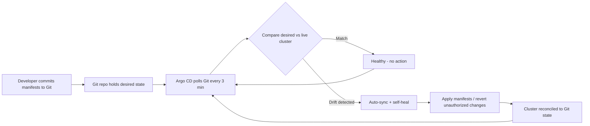

| Difficulty | Channel | Tags |
|---|---|---|
| beginner | devops | argocd, flux, declarative |

Adobe's legacy deployment platform, Moonbeam, once shepherded more than 10,400 pipelines across hundreds of teams — and nearly buckled under the weight of fragile, queue-based deployments and un-auditable configuration drift [1]. In response, the company rebuilt delivery on Flex, a GitOps platform built on Kubernetes and the Argo ecosystem. Deployment queue times collapsed, rollbacks became instant, and a surprise inventory review retired roughly 80% of stale services [1]. This is the story of how declarative GitOps replaced imperative kubectl chaos — and what your team can steal from it.

---

> ### Real-World Case — Adobe
>
> Adobe's legacy internal container platform, Moonbeam, had become increasingly difficult to scale, secure, and operate reliably across hundreds of teams and thousands of services. Deployments were fragile, queue-based, and prone to configuration drift, with no clean path to rollback or audit.
>
> | | |
> |---|---|
> | **Challenge** | Migrate a sprawling enterprise software delivery system — 10,400 pipelines, hundreds of teams, 3,000+ production services — to a modern GitOps operating model without disrupting development velocity, while also achieving security, compliance, and cost goals. |
> | **Solution** | Adobe built 'Flex', a governed delivery platform on Kubernetes and the Argo ecosystem (Argo CD, Workflows, Events, Rollouts). They made Git the single source of truth: all infrastructure and application definitions became declarative, Argo CD continuously reconciled cluster state with approved Git state via auto-sync and self-healing, and Argo Rollouts handled progressive delivery. They wrapped the CNCF tooling in a self-service migration workflow (Node.js/React interface + Argo Workflows) with start/pause/continue/end controls so teams could migrate incrementally. |
> | **Outcome** | All 10,400 pipelines were migrated or decommissioned; the platform now supports 3,000+ developers and 3,000+ production services. Deployment queue times dropped significantly, rollback and change management became faster and auditable, and a surprise plot twist emerged: the migration forced an inventory review that let Adobe retire roughly 80% of stale/duplicate services, contributing substantial infrastructure cost savings. |
> | **Lesson** | Adopting GitOps tooling is only part of the battle — the workflow experience and governance model around it are what make enterprise-scale migration practical. Adobe's biggest regret was not investing in end-to-end migration automation from day one; scripts alone created friction for early adopters. |

---

## Hook — The 3 a.m. kubectl edit nobody remembers making

Picture this: the deployment looks perfect at 10 p.m. By 3 a.m., a pager goes off — CPU is spiking, and someone, somewhere, hand-edited a Deployment hours ago and forgot to mention it. Sound familiar? That is configuration drift, the silent killer of Kubernetes clusters, and it is exactly the enemy Adobe's platform teams were fighting when their legacy container platform began to buckle under hundreds of teams and thousands of services [1]. The fix sounds almost too simple: stop changing the cluster directly, and let Git become the boss. But here is the thing — the hardest part of GitOps is not the technology. It is unlearning every habit built around 'just making a quick change.' The stakes? Adobe bet a platform used by 3,000+ developers on that unlearning [1].

## Problem — Why your cluster drifts, and why it hurts

Before diving into the solution, sit with the problem for a moment. Every kubectl scale, every helm upgrade --force, every quick YAML patch piped over SSH is a change that exists nowhere except inside the running cluster. That is the essence of the imperative approach: you tell the cluster what to do, one command at a time [6]. It feels fast — so fast that most teams discover the true cost only later. Configuration drift builds silently: staging works, production does not. Nobody can answer 'who changed what, and why,' because the answers live in a hundred shell histories instead of one reviewable history. Rollbacks become archaeology, deployments become queue-based rituals, and audits become nightmares. Adobe's legacy platform, Moonbeam, was this problem at enterprise scale — increasingly difficult to scale, secure, and operate reliably across hundreds of teams and thousands of services [1]. When fragile queue-based deployments meet no clean path to rollback or audit, the platform itself becomes the bottleneck. The question that matters: how do you make every change visible, reversible, and reviewable without slowing developers down?

## Real-World Case — Adobe's Moonbeam-to-Flex migration

Here is where the story turns. Adobe did not just replace a tool; it replaced an operating model. Moonbeam was decommissioned in favor of Flex, a GitOps delivery platform built on Kubernetes and the Argo Project ecosystem — Argo CD for continuous reconciliation, Argo Workflows for pipeline orchestration, Argo Events for event-driven automation, and Argo Rollouts for progressive delivery [1]. The scale deserves a pause: all 10,400 pipelines were migrated or decommissioned, more than 100 engineering teams were involved, and the platform now supports 3,000+ developers operating 3,000+ production services across tens of thousands of environments [1]. The migration cut deployment queue times significantly and made rollback and change management faster and fully auditable [1]. Then came the plot twist. The migration forced a full inventory review, and Adobe uncovered thousands of stale, abandoned, and duplicate services — retiring roughly 80% of previously identified services, which alone contributed meaningful infrastructure cost savings [1]. A deployment-tooling project quietly became the largest technical-debt payoff the platform team had ever seen. The takeaway is uncomfortable: you do not know how much cruft you carry until you force yourself to inventory it.

## Deep Dive — Declarative vs imperative: the philosophy separating calm from chaos

So what actually changed under the hood? The distinction is philosophical before it is technical. The imperative approach asks 'how do I get there?' — you type kubectl run, kubectl scale, kubectl apply, and the cluster follows orders in real time [6]. It is immediate, powerful, and utterly forgetful: nothing records your commands unless you remember to. The declarative approach asks a different question: 'what should exist?' You commit a complete description of the desired state to Git, and a controller like Argo CD continuously reconciles the live cluster toward that description [2][5]. The difference is not syntax — it is ownership of the truth.

## Workflow — The reconciliation loop, step by step

Building on the deep dive, here is how the pieces snap together into a living system. This loop is the heartbeat of every Argo CD deployment, and it never stops [4]. First, commit the desired state — plain YAML manifests, Helm charts, or Kustomize overlays — into a Git repository that becomes the single source of truth [9][10]. Second, create an Application CRD that points at that repository, declaring the source URL, target revision, and destination namespace. Third, enable automated sync with a health-check interval — enterprise platforms typically poll every 1 to 5 minutes, and the 3-minute interval used in the original question is a solid default. Fourth, enable selfHeal so unauthorized manual changes are reverted automatically, and prune so resources deleted from Git actually disappear from the cluster [4]. Fifth, let Argo CD reconcile continuously: diff desired versus actual, apply the gap, and report health. Finally, wire notifications — sync failures and drift events should page you before your users ever notice. The diagram below shows the loop visually; notice that Argo CD pulls state from Git rather than Git pushing into the cluster. That 'pull, don't push' design is what makes GitOps work across firewalls, multiple clusters, and at Adobe's scale [7][8].

## Code Example — Bootstrapping a self-healing GitOps application

Putting the workflow into practice, the script below wires up an Argo CD Application from scratch. It is runnable against a dev cluster, and every step maps to one part of the loop you just saw. The full code and a line-by-line walkthrough follow in the code example section — pay special attention to the syncPolicy block, because that is where Adobe-class self-healing actually lives.

## Lessons Learned — Battle scars and the one insight to take to your team

Every journey has its scars, and GitOps adoption has a few classics. Watch out for selfHeal: true without notifications — silent rollbacks nobody knows about until an engineer investigates an 'unexplained' change. Prune disabled is another classic: resources deleted from Git linger as zombies. And committing secrets to the gitops repo turns your audit log into a token giveaway — use Sealed Secrets or an external secrets operator instead. Many developers think declarative means 'nobody can touch the cluster.' Actually, it means everyone can — the changes just get reverted. The workflow that actually works: all changes flow through Git, health checks run on custom resources, release tags become rollback bookmarks, and staging is tested before production every single time [4]. Adobe's own retrospective adds a painful lesson worth borrowing: build the migration tooling first, lead with value instead of mandates, and let the inventory review happen [1]. Here is the actionable version: tomorrow, pick one service, move its manifest into a Git repository, create an Application CRD, and turn on selfHeal in staging. Then watch what happens when someone kubectl edits a replica count. It will be gone within minutes — and that moment is when GitOps finally clicks.

---

## GitOps Reconciliation Loop

<strong>Original Interview Question</strong>

**Q:** You're setting up GitOps for a microservices deployment. How would you configure ArgoCD to automatically sync changes from your Git repository to Kubernetes, and what's the difference between declarative and imperative approaches in this context?

**A:** I'd configure ArgoCD by setting up a Git repository containing Kubernetes manifests or Helm charts, creating an Application CRD that points to the Git repository, enabling auto-sync with a health check interval of 3 minutes, and implementing self-healing to automatically revert any manual changes. The declarative approach involves defining the desired state in Git through YAML manifests, Helm charts, or Kustomize configurations, where ArgoCD continuously reconciles the actual state with the desired state. In contrast, the imperative approach uses kubectl commands to make direct changes to the cluster, bypassing the Git repository as the single source of truth.

## Conclusion

Adobe's migration from Moonbeam to Flex is proof that GitOps is not a buzzword — it is an operating model that turned a fragile, un-auditable platform into one supporting 3,000+ developers and 3,000+ production services, while retiring 80% of stale workloads along the way [1]. The journey is the same one your team can start tomorrow: pick a service, put its manifest in Git, create an Application CRD with selfHeal and prune, and let the reconciliation loop do the heavy lifting. The one insight worth sharing with your team: in GitOps, Git is not just where your configuration lives — it is the answer to every question you will ask at 3 a.m. The next time someone reaches for kubectl edit, remind them the cluster will just fix itself. The real question is whether they wanted the fix.

---

## References

1. [Adobe incident report](https://www.cncf.io/case-studies/adobe/) — article
2. [Argo CD - Declarative GitOps for Kubernetes](https://argo-cd.readthedocs.io/en/stable/) — documentation
3. [Argo CD Declarative Setup](https://argo-cd.readthedocs.io/en/stable/operator-manual/declarative-setup/) — documentation
4. [Argo CD Automated Sync Policy](https://argo-cd.readthedocs.io/en/stable/user-guide/auto_sync/) — documentation
5. [Kubernetes Declarative Configuration Management](https://kubernetes.io/docs/tasks/manage-kubernetes-objects/declarative-config/) — documentation
6. [Kubernetes Imperative Management with kubectl](https://kubernetes.io/docs/tasks/manage-kubernetes-objects/imperative-command/) — documentation
7. [GitOps on Wikipedia](https://en.wikipedia.org/wiki/GitOps) — article
8. [OpenGitOps Principles](https://opengitops.dev/) — documentation
9. [Helm Documentation](https://helm.sh/docs/) — documentation
10. [Kubernetes SIGs Kustomize](https://github.com/kubernetes-sigs/kustomize) — documentation

---

**Author:** Satishkumar Dhule — [GitHub](https://github.com/satishkumar-dhule) · [LinkedIn](https://linkedin.com/in/satishkumar-dhule) · [Website](https://satishkumar-dhule.github.io)
