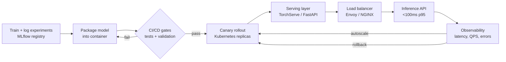

| Difficulty | Channel | Tags |
|---|---|---|
| beginner | devops | mlops, deployment |

Shopify's ML platform, Merlin, was humming along nicely running batch predictions — until product categorization, search, and recommendations demanded real-time answers for millions of merchants [1]. Overnight, the rules of the game changed: latency mattered in a way it never did for offline batch jobs, and dozens of teams with different frameworks suddenly needed one generalized path to production [1]. This is the story of that shift, and what it reveals about the difference between model deployment and model serving.

---

> ### Real-World Case — Shopify
>
> Shopify Data built Merlin, its ML platform, and needed to move models from batch jobs into real-time inference for user-facing features like product categorization, search, and recommendations. At the scale of millions of merchants, latency suddenly mattered in a way it never did for offline batch prediction, and dozens of teams with different frameworks needed one generalized path to production.
>
> | | |
> |---|---|
> | **Challenge** | Build an online inference capability that could serve models trained with different libraries (TensorFlow, PyTorch, XGBoost) with low latency, while cleanly separating the serving layer from deployment infrastructure — and make autoscaling, rolling updates, monitoring, staging/production configs, and rollback work like any other production service. |
> | **Solution** | Shopify split the two concerns explicitly. The serving layer is a Python API that loads the model and artifacts into memory and handles requests — implemented either as boilerplate FastAPI or as MLServer (Seldon), which supports REST, gRPC, request batching, and the standardized V2 inference protocol. Each use case runs as its own dedicated service on Shopify's Kubernetes clusters (GKE), with its own namespace, autoscaling settings, and separate staging vs. production resource configs. Deployment is automated end-to-end: merging code triggers a Buildkite pipeline that builds the Docker image, then Shipit deploys it to Kubernetes. Models are versioned in the Comet ML model registry, and the Pano online feature store (built on Feast) serves features during inference at low latency, with per-service monitoring dashboards for latency, requests/sec, and CPU. |
> | **Outcome** | Data scientists gained a generalized, low-friction path from trained model to low-latency real-time inference at Shopify scale (millions of merchants), with rolling deployments, automatic model updates, per-environment resource tuning that reduced infrastructure cost, and observability baked into every Merlin Service. |
> | **Lesson** | Deployment and serving are different layers with different jobs: serving is the runtime API that loads the model and answers inference requests fast (and is where request routing, batching, and versioning live), while deployment is the surrounding infrastructure — CI/CD pipelines, Kubernetes orchestration, autoscaling, and rollback. Treating them as separate, reusable platform layers lets many teams onboard without reinventing serving or deployment infra. |

---

## Hook — The Deploy Looked Fine. Then the Latency Pager Went Off.

It's 3 a.m., and the pager just went off. The deploy looked fine. The tests passed. The dashboard said healthy. And yet, somewhere in a Kubernetes cluster, a user-facing feature is returning 504s because a freshly scaled-up pod is still loading a 500 MB model into memory. Sound familiar? This is the moment every ML team meets the difference between deployment and serving — the exact wall Shopify hit when it moved Merlin from batch predictions to real-time inference [1]. Because when you stop computing answers overnight and start computing them on demand, the rules of the game change entirely.

## Problem — The 'Just Run It' Myth

Deployment and serving sound like the same thing, and that illusion is expensive. Deployment is the lifecycle around a model: CI/CD pipelines, container builds, infrastructure provisioning, monitoring, and rollback strategies — the world of Kubernetes, MLflow, and GitHub Actions [2][3]. Serving is the live moment: a running API that loads the model into memory, routes requests, and returns predictions within a latency budget — the world of TensorFlow Serving, TorchServe, BentoML, and FastAPI [4][5][6]. Many developers discover the hard way that you can deploy a model nobody can serve, and serve a model that was never safely deployed. The problem compounds at scale: batch jobs forgive a slow first call, but a recommender behind a search box does not. So the stakes are concrete — latency budgets, infrastructure cost, and the reputation of the team shipping the 'fast' feature that isn't fast.

## Real-World Case — Shopify Turns Merlin Real-Time

Shopify turned this abstract tension into a platform decision. Its ML platform, Merlin, had long run predictions as batch jobs — perfectly fine when the answers weren't needed until the morning. Then product categorization, search, and recommendations started leaning on ML, and suddenly the merchant was staring at the screen waiting for the answer. At the scale of millions of merchants, latency suddenly mattered in a way it never had before [1]. Here is the plot twist: fixing it was never about one clever model. Dozens of teams, each with their own framework and assumptions, needed one generalized path from a trained model to low-latency real-time inference [1]. Shopify built that path so every model became a Merlin Service with rolling deployments, automatic model updates, per-environment resource tuning that reduced infrastructure cost, and observability baked into every single service [1]. That's the pattern to steal: not a serving framework, but a platform where the serving concerns are solved once for everyone.

## Deep Dive — Deployment vs. Serving: The Trade-Offs No One Teaches You

Building on Shopify's approach, the useful mental model is this: deployment is how you ship it, serving is how you keep the promise. Each discipline has its own failure modes, and the trade-offs are where senior-level thinking lives.

A quick side-by-side:

| | Deployment | Serving |
|---|---|---|
| Core job | Ship the model safely | Answer requests fast |
| Typical tools | Kubernetes, Docker, Terraform, MLflow | TorchServe, FastAPI, Envoy |
| Main risk | Bad rollout, no rollback path | Cold start, latency spikes |
| Unit of work | Pipeline run | Individual request |

The first trade-off is latency versus throughput. A real-time product feature needs p95 latency under 100 ms, while a nightly batch job cares about total throughput. These goals can conflict — batching requests improves throughput but adds latency, which is why many systems expose one endpoint optimized for speed and another for bulk jobs. The second trade-off is batch versus real-time inference. Batch is cheap and forgiving; real-time must absorb traffic bursts, which is exactly why Kubernetes horizontal pod autoscaling exists [8]. The third trade-off is cold starts — the counterintuitive gotcha. Scaling up a new replica looks like progress until you realize the first request to that pod pays a multi-second penalty while the model loads. Teams fix this with warm pools, preloaded model caches, and readiness gates.

Scaling adds another layer. Horizontal scaling adds replicas to handle concurrency; vertical scaling adds GPU memory and CPU, which is bounded by the hardware you can actually buy [2]. And because serving is a commitment to correctness over time, versioning and rollback are non-negotiable: canary rollouts, traffic splitting, and A/B testing let you ship a new model without betting the product on it. MLOps research frames all of this as technical debt — the config, glue code, and pipeline drift that silently erode a system long after the model stops changing [7]. Platforms like SageMaker and Vertex AI exist precisely to package these decisions as sensible defaults rather than leaving every team to rediscover them [10]. Ironically, the more 'boring' the serving layer becomes, the more time teams get back for actual modeling — which is exactly the journey the ML maturity curve describes [9].

## Workflow — From Notebook to Low-Latency Inference in Six Steps

This leads to the practical payoff: a repeatable path from notebook to live inference. Figure 1 below is the generalized flow teams end up with — every step is a gate, and every gate is a chance to catch a mistake early.

1. Train and log experiments — the MLflow registry becomes the source of truth for model versions [3].
2. Package the model — freeze dependencies, pin the version, build a container.
3. Run CI/CD gates — validation, tests, and drift checks before anything reaches production.
4. Roll out gradually — canary and traffic-splitting keep a bad model from becoming an outage [8].
5. Serve behind a load balancer — Envoy or NGINX route requests to warm replicas.
6. Observe and autoscale — latency, QPS, and error metrics feed the loop, and rollback stays one click away.

The diagram captures this whole journey in one picture — from training, through CI/CD, all the way to the autoscaling loop that keeps the latency promise alive.

## Code Example — A Serving Service That Won't Embarrass You

Here is the serving layer that makes the workflow real. This minimal FastAPI service follows the two rules that matter most: load the model exactly once at startup, and expose a latency-aware endpoint. It pulls the model from an MLflow registry, so versioning and rollback live in infrastructure rather than in code [3].

## Lessons Learned — What To Do Differently Tomorrow

The journey from batch to real-time is rarely about a single model — it's about the system around it. Here is what to take away:

- Deployment and serving are separate disciplines. Own the pipeline and the runtime with different tools, different metrics, and different people.
- Load the model once at startup. The classic performance bug is model loading on every single request.
- Plan for cold starts. Warm pools and readiness gates protect your p95 when autoscaling kicks in.
- Bake observability in from day one. Shopify wired monitoring into every Merlin Service, and that's exactly why rollback and resource tuning were possible [1].
- Design rollback before you design traffic. Canary rollouts and registry-backed versions make 'undo' a click instead of an emergency [3].
- Standardize one path before frameworks multiply. The biggest win in the Merlin story was one generalized path serving dozens of teams [1].

The metric that matters most: can you ship a model on Friday afternoon without waking up on Saturday? If the answer is no, the gap between your deployment and your serving is where the work is.

---

## From Training to Real-Time Inference

<strong>Original Interview Question</strong>

**Q:** Explain the key differences between model serving and model deployment in ML systems, including specific technologies, scaling considerations, and real-world implementation patterns?

**A:** Deployment encompasses CI/CD pipelines, infrastructure setup, and monitoring using tools like Kubernetes, MLflow, and SageMaker. Serving focuses on runtime inference APIs with frameworks like TensorFlow Serving, TorchServe, or BentoML, handling request routing, model versioning, and autoscaling. Key trade-offs include latency vs throughput, batch vs real-time inference, and cold start optimization.

## Conclusion

Shopify's Merlin didn't crack real-time inference with a single clever model — it built a generalized, low-friction path from trained model to live prediction at the scale of millions of merchants, with rolling deployments, automatic updates, cost-saving resource tuning, and observability baked into every service [1]. The same shift is waiting in every ML organization: batch is comfortable, but real-time is where the product value lives. Tomorrow, pick one model and give it a registry entry, a CI/CD gate, a warm serving container, and a latency dashboard — that's the whole pattern in miniature. And the insight to carry forward: deployment is how you ship it, serving is how you keep the promise.

---

## References

1. [Shopify incident report](https://shopify.engineering/shopifys-machine-learning-platform-real-time-predictions) — article
2. [What is Kubernetes?](https://kubernetes.io/docs/concepts/overview/what-is-kubernetes/) — documentation
3. [MLflow](https://github.com/mlflow/mlflow) — documentation
4. [TensorFlow Serving](https://github.com/tensorflow/serving) — documentation
5. [TorchServe](https://github.com/pytorch/serve) — documentation
6. [BentoML](https://github.com/bentoml/BentoML) — documentation
7. [Hidden Technical Debt in Machine Learning Systems](https://arxiv.org/abs/1503.05993) — paper
8. [Kubernetes Horizontal Pod Autoscaling](https://kubernetes.io/docs/tasks/run-application/horizontal-pod-autoscale/) — documentation
9. [MLOps](https://en.wikipedia.org/wiki/MLOps) — documentation
10. [Amazon SageMaker](https://docs.aws.amazon.com/sagemaker/) — documentation

---

**Author:** Satishkumar Dhule — [GitHub](https://github.com/satishkumar-dhule) · [LinkedIn](https://linkedin.com/in/satishkumar-dhule) · [Website](https://satishkumar-dhule.github.io)
