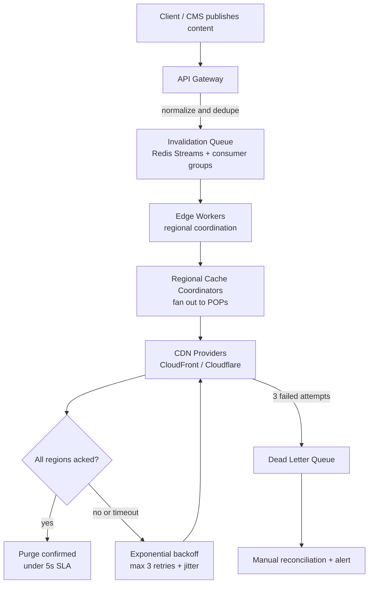

| Difficulty | Channel | Tags |
|---|---|---|
| intermediate | system-design | edge, caching, purging |

In 2011, Fastly made a promise that sounded simple and turned out to be anything but: instant purge. The company said it could invalidate cached content across every cache server in dozens of POPs worldwide in roughly 150 milliseconds — and spent years building a purpose-built distributed system, codenamed Powderhorn, to keep that promise alive [1]. This is the story of how to build the same guarantee for your own stack: a pipeline that propagates purges globally in under five seconds while absorbing 10,000 invalidations per second.

---

> ### Real-World Case — Fastly
>
> When Fastly launched in 2011, its founding promise was 'instant purge' — invalidating cached content across its entire global CDN network almost immediately. But propagating a purge to every cache server across dozens of POPs in ~150ms, while surviving network partitions, packet loss, and DDoS attacks, turned out to be one of the hardest distributed-systems problems the company faced. The system they built is codenamed Powderhorn.
>
> | | |
> |---|---|
> | **Challenge** | Deliver every cache-invalidation request to all cache servers worldwide in ~150ms (under a 5-second SLA by 30x) while remaining available even when POPs are cut off from each other. The obvious design — a centralized purge queue that fans out to all servers — was rejected because it is a single point of failure and stalls when a central worker loses connectivity to parts of the network. |
> | **Solution** | They built Powderhorn on Bimodal Multicast, a gossip-based reliable broadcast protocol. On receiving a purge, a cache server immediately deletes the object locally and UDP-broadcasts the message to all peer servers (the fast, lossy path); in parallel, a periodic gossip loop has servers exchange message summaries and backfill anything missed (the reliable path). They validated it with Jepsen (network partitions, packet loss, high latency) and then observed it in production. |
> | **Outcome** | Purge latency is typically bounded purely by network delay — under 150ms to every cache server globally, and much lower within a region (still under 150ms over a decade later, approaching the ~65ms speed-of-light floor for a planet-wide message). During a real firewall-misconfiguration network partition, 95th-percentile purge latency rose two orders of magnitude but purges still completed in ~10 seconds; during an 8-minute DDoS-driven outage, every purge was eventually recovered with p95 latency under a minute — an order of magnitude faster than competing CDNs. |
> | **Lesson** | For fast global cache invalidation, don't centralize the purge queue: a decentralized peer-to-peer gossip design — where each POP deletes locally and immediately forwards to peers, with periodic reconciliation to catch dropped messages — is both faster (propagation bounded only by the speed of light) and more reliable than a central coordinator that becomes a single point of failure. |

---

## Hook — the promise that nearly broke a CDN

It was 2011, and a brand-new CDN called Fastly was betting its entire future on a single sentence: instant purge. No 'please wait while caches expire,' no 'up to 60 seconds for propagation.' Every cache server across dozens of points of presence (POPs), everywhere on Earth, invalidated almost immediately — a number that sounds like marketing until you realize it is still true more than a decade later, edging toward the ~65ms speed-of-light floor for a planet-wide message [1]. The team discovered what you, too, will discover the first time someone asks for sub-five-second invalidation: purging a cache is not an API call, it is a distributed systems problem wearing an API's clothing.

Now imagine your job is to hit a 5-second global propagation SLA while 10,000 invalidations pour in every second. That is the challenge at the center of this story, and by the end you will have the full blueprint — queueing, edge compute, batch purging, backoff, and the one counterintuitive trick that makes everything easier.

## Problem — every cached byte is a stale byte waiting to happen

The fundamental problem: caches exist to make content fast, and every cached byte is a stale byte waiting to happen. If you cannot purge quickly, your users see old prices, old articles, and old build artifacts — and your CDN quietly becomes a liability instead of an accelerator [8].

Here is the tension. A global CDN serves content from hundreds of POPs, each one an independent copy of your state. When content changes, every one of those copies must be invalidated, and 'eventually' is not a word your product team wants to hear. Meanwhile, the system has to sustain 10,000 invalidations per second at 99.99% availability, with strong consistency across regions — purges must be acknowledged, ordered, and propagated, not fire-and-forget.

Sound unreasonable? It is not. Here is what a 5-second SLA really demands:
- Latency: global propagation in under 5 seconds
- Throughput: 10K+ invalidations per second, sustained
- Availability: 99.99% uptime (about 52 minutes of downtime per year)
- Consistency: strong — no region serves a purge another region missed

The real question is not whether this is possible. Fastly proved it was back in 2011 [1]. The question is how you make it survivable — because the moment the network glitches, the pager glows.

## Real-World Case — Fastly

The system that keeps Fastly's promise alive is codenamed Powderhorn, and its design reads like a masterclass in pessimism. Instead of hoping for a clean network, it assumes packets vanish, partitions happen, and attackers will try to knock the whole thing over [1].

The numbers tell the story. In normal operation, purge propagation reaches every cache server globally in under 150ms — a full order of magnitude better than your 5-second SLA, because that slack is exactly where the failure budget lives. During a real firewall misconfiguration that caused a network partition, 95th-percentile purge latency jumped two orders of magnitude — yet purges still completed in roughly 10 seconds. During an 8-minute DDoS-driven outage, every single purge was eventually recovered, with p95 latency under a minute — an order of magnitude faster than competing CDNs handling the same incident [1].

Notice what Fastly optimized for: not the happy path, but the guarantee that nothing is ever silently lost. That is the same philosophy you need, at a smaller scale, when your invalidation queue sits between an API gateway, Cloudflare, and CloudFront.

This leads directly to the interview scenario: 10,000 invalidations per second, a 5-second SLA, and two very different CDN providers to coordinate. The happy path is easy. Everything after this point is the failure path — and the failure path is the design.

## Deep Dive — batching, TTLs, and the consistency trade-off

Start with the obvious answer, then break it. You could call the Cloudflare purge API for every invalidation, right? At 10,000 per second, that is a rate-limit nightmare and an API bill that needs its own CFO. So the first insight: batch. Group invalidations — up to 100 paths per API call — and your request count drops by 90% [3]. CloudFront supports the same batching model through its invalidation API, which means one coordinator can speak to both providers behind a single abstraction [2].

Now the plot twist that changes how you think about the entire problem. Here is the thing though: the fastest purge is the one you never need. Many developers design a purge system in isolation and discover too late that a 2-second TTL with Cache-Control: max-age=2, must-revalidate makes 90% of purges unnecessary — the cache revalidates against origin before the stale window ever matters [4][5]. The 5-second purge SLA becomes a safety net for the 10% of content that must be instant, not a full-time job for your edge. That reframe is what separates workable designs from heroic ones.

Underneath the purges sits a queue, because at 10K requests per second you cannot afford synchronous coupling. Redis Streams with consumer groups give you ordered, durable, at-least-once delivery with independent consumption across edge regions [10]. Edge Workers (for example, Cloudflare Workers) run the regional coordination logic as close to the POPs as possible, shrinking the control-plane distance between 'content changed' and 'cache expired' [12].

This is where consistency bites. Strong consistency across regions means every POP must acknowledge — but the network is not reliable, and the CAP theorem guarantees you cannot hold strict consistency and partition tolerance at the same moment [11]. The escape hatch Fastly found: use eventual consistency with reconciliation as the floor, and drive the happy path to strong consistency fast enough that the difference is invisible. Propagate synchronously with acknowledgment; when the network partitions, fall back to a retry-and-reconcile loop instead of failing the request.

Every one of these layers needs failure handling, and there is a battle-tested toolkit for it:
- Circuit breaker: after 5 consecutive failures, stop trying and fail fast — the queue stops hammering a dead provider [6]
- Exponential backoff with jitter: 50ms, 100ms, 200ms — jitter breaks the thundering-herd re-request spike that plain backoff causes [7]
- Dead letter queue: purges that exhaust their 3 retries land here, for manual reconciliation instead of silent loss
- Health checks: regional endpoints monitored continuously, so a broken region is detected before users feel it

Which leaves one question begging: how does all of this actually flow together at runtime? That is the workflow.

## Workflow — from purge request to global confirmation

Building on the design, here is the concrete pipeline that turns a purge request into a 5-second global guarantee, end to end. The flow is linear most of the time and loop-back exactly when you need it — the moment a region fails to acknowledge.

1. API Gateway receives the purge request and normalizes it (dedupe, wildcard expansion).
2. The normalized invalidation is written to a Redis Stream; consumer groups divide work across edge regions [10].
3. Edge Workers pull batches of up to 100 paths and fan out to Regional Cache Coordinators [12].
4. Coordinators call the CDN providers — CloudFront and Cloudflare purge APIs — in parallel [2][3].
5. Each region acknowledges; when every region acks, the purge is confirmed within the 5-second SLA.
6. Timeout or rejection? Exponential backoff with jitter, up to 3 retries [7].
7. Three failures? The purge lands in the dead letter queue for manual reconciliation, and an alert fires.

Below is the same story as a diagram — notice that the loop (step 6) and the escape hatch (step 7) are first-class citizens, not afterthoughts.

[Mermaid diagram: Cache Invalidation Pipeline]

One detail worth calling out: the diagram's decision point is the heart of the design. It is tempting to treat 'acknowledge' as binary, but in practice the coordinator distinguishes success, partial failure, and timeout. Partial failures trigger regional rollback — purge the affected POP, leave the healthy ones alone — while timeouts defer to retry. That distinction is the difference between a purge that self-heals and a purge that lingers in someone's queue forever.

## Code Example — a production-shaped purge coordinator

Now the pattern gets concrete. Here is the core of a distributed purge coordinator in JavaScript — batch purging against the Cloudflare API, wrapped in a circuit breaker with exponential backoff and jitter, and a dead letter queue as the final safety net.

[Code]

Walking through it:
- The CircuitBreaker class is the fail-fast sentinel. If 5 consecutive requests fail, it flips to open and the queue stops hammering a provider that is clearly down — exactly the pattern Martin Fowler documented years ago [6].
- backoffWithJitter(attempt) computes 50ms, 100ms, 200ms plus a random offset. The jitter is not cosmetic; without it, thousands of queues retry in the same millisecond, turning a small failure into a self-inflicted spike [7].
- purgeBatch sends up to 100 paths per API call. At 10K invalidations per second, that collapses your API request rate to roughly 100 per second — the 90% cost and rate-limit reduction the original design promised [3].
- Failed batches retry up to 3 times; exhausted ones go to pushToDeadLetter, preserving the 'never silently lose a purge' guarantee from the Fastly story [1].
- drainQueue is the consumer loop: pull a batch from the Redis Stream consumer group, purge in parallel, and let the breaker and retries handle the chaos [10].

Note that the Authorization header reads from an environment variable — tokens never belong in source code.

## Lessons Learned — what the battle scars teach us

After following this journey — from Fastly's 150ms promise to your own 5-second coordinator — the takeaways write themselves. Here is what to carry back to your team.

- Short TTLs beat heroic purges. Cache-Control: max-age=2, must-revalidate means most invalidations never need to happen at all [4][9]. Design the cache strategy first; the purge system becomes a safety net, not a full-time job.
- Batch everything. 100 paths per API call is a 90% cost and rate-limit reduction [3]. If your purge volume is spiky, this is the difference between working and throttled.
- Assume the network lies. Partitions, packet loss, DDoS — Fastly's Powderhorn survived all of them because failure handling was the design, not a bolt-on [1]. Circuit breakers, jittered backoff, and dead letter queues are not optional extras.
- Consistency is a spectrum, not a switch. Strong consistency on the happy path, eventual consistency with reconciliation as the floor — that is how you get both speed and survivability [11].
- Region-aware recovery. Purge only affected regions, roll back regionally, and keep healthy POPs serving. Blast radius is the real SLA.

The battle scars are well documented: teams that skip the dead letter queue discover lost purges mid-incident; teams that use plain exponential backoff trigger thundering herds on recovery [7]; teams that treat 'eventually consistent' as 'ignore it' get burned by stale pricing pages at the worst possible moment. We have all been there — staring at a dashboard full of unacknowledged invalidations at 2am.

The one sentence to share with your team: a 5-second purge SLA is not a feature of your CDN — it is a property of your control plane. Design the control plane like a distributed system, and the promise becomes boring. Boring is exactly what you want at 3am.

---

## Cache Invalidation Pipeline

<strong>Original Interview Question</strong>

**Q:** How would you design a multi-region CDN cache purging system that guarantees content propagation within 5 seconds while handling 10,000 concurrent invalidations per second?

**A:** Implement Cloudflare API + AWS CloudFront with distributed invalidation queue, edge compute coordination, and 2-second TTL. Use batch invalidation, exponential backoff, and regional cache headers for 5-second SLA.

## Conclusion

The journey that started with a CDN's founding bet in 2011 ends with a design you can actually build: queue the invalidations, batch them, coordinate at the edge, and treat every failure mode as a first-class path. Fastly's lesson is not that 150ms purges are achievable — it is that they stay achievable under partitions and attacks because the system was built to absorb chaos [1]. Tomorrow, start smaller: instrument your current cache invalidation end to end, measure where the 5 seconds actually go, and introduce one resilience mechanism at a time — batching first, jittered backoff second, dead letter queue third. You will find that the counterintuitive truth holds: the best purge is the one your cache TTL made unnecessary, and the fastest system is the one you stopped being afraid to fail.

---

## References

1. [Building Fast and Reliable Purging System](https://www.fastly.com/blog/building-fast-and-reliable-purging-system) — blog
2. [Removing content from a distribution — Amazon CloudFront](https://docs.aws.amazon.com/AmazonCloudFront/latest/DeveloperGuide/Invalidation.html) — documentation
3. [Purge cached content — Cloudflare API](https://developers.cloudflare.com/api/operations/zone-purge-purge_cached_content) — documentation
4. [Cache-Control — HTTP — MDN](https://developer.mozilla.org/en-US/docs/Web/HTTP/Headers/Cache-Control) — documentation
5. [RFC 9111: HTTP Caching](https://datatracker.ietf.org/doc/html/rfc9111) — documentation
6. [CircuitBreaker — Martin Fowler](https://martinfowler.com/bliki/CircuitBreaker.html) — blog
7. [Error retries and exponential backoff in AWS](https://docs.aws.amazon.com/general/latest/gr/api-retries.html) — documentation
8. [Content delivery network — Wikipedia](https://en.wikipedia.org/wiki/Content_delivery_network) — documentation
9. [HTTP caching — MDN](https://developer.mozilla.org/en-US/docs/Web/HTTP/Caching) — documentation
10. [Redis Streams — Redis documentation](https://redis.io/docs/latest/develop/data-types/streams/) — documentation
11. [CAP theorem — Wikipedia](https://en.wikipedia.org/wiki/CAP_theorem) — paper
12. [Cloudflare Workers — documentation](https://developers.cloudflare.com/workers/) — documentation

---

**Author:** Satishkumar Dhule — [GitHub](https://github.com/satishkumar-dhule) · [LinkedIn](https://linkedin.com/in/satishkumar-dhule) · [Website](https://satishkumar-dhule.github.io)
