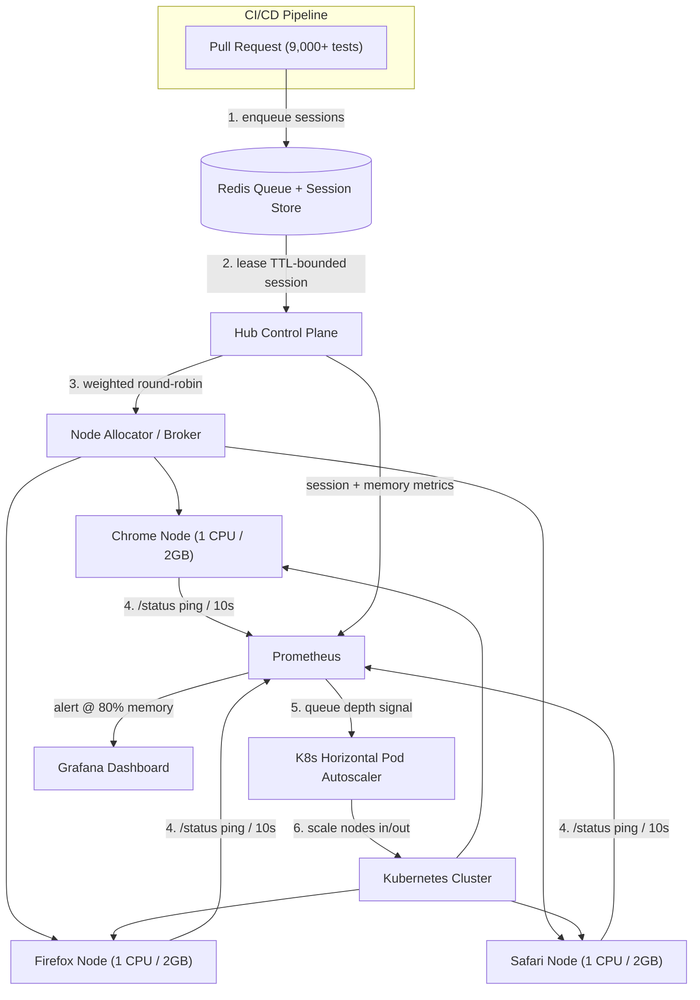

| Difficulty | Channel | Tags |
|---|---|---|
| advanced | system-design | selenium, webdriver, grid |

It is 3 a.m. and the pager is going off again. Your pull request's UI suite has been running for four hours, and somewhere inside a swarm of headless browsers, one flaky test has silently devoured a Jenkins executor. This is the exact wall Expedia Group slammed into in late 2014, when their UI automation outgrew everything a single CI farm could chew through [1]. Their answer — a distributed grid that eventually ran 1,000 tests in five minutes — holds every pattern you need to design a grid that survives 10,000 concurrent sessions with zero memory leaks and 99.9% uptime. What follows is that journey: the struggle, the architecture, and the battle scars.

---

> ### Real-World Case — Expedia Group
>
> Until late 2014, Expedia's ~9,000 UI automation tests ran directly on 350+ Jenkins executors, with suites taking hours and scaling to 14k+ tests across microservice CI/CD pipelines becoming impossible. They needed all UI tests on a PR to finish in roughly the time of the slowest single test, while keeping infrastructure costs sane.
>
> | | |
> |---|---|
> | **Challenge** | Static Selenium Grids couldn't handle hundreds of concurrent sessions: hubs were manually provisioned, scaling up nodes took 2-4 minutes, and third-party cross-browser vendors charged per parallel connection (about $350k for just 120 parallel sessions, ~$2.41M for 1,000). They needed elastic auto-scaling with no idle resource waste and zero manual hub/node management. |
> | **Solution** | They built Distributed Automation on SeleniumGridScaler (Selenium Grid + EC2 API): the hub auto-spawns EC2 nodes on demand, packs 15 Chrome/Firefox sessions per c5.xlarge node, terminates nodes on idle, and shuts down hubs on demand using per-second billing — paying only for active test time. They later evolved this into DA-Kube: Kubernetes (EKS) with Helm charts and Traefik ingress, giving each microservice its own disposable containerized grid that scales to 300-500 browser pods, using PodDisruptionBudgets, node affinity/taints for spot instances, and working around AWS private-IP exhaustion (a c5.2xlarge only fits ~19 browser pods despite reserving ~30 IPs). |
> | **Outcome** | 100+ hubs running 140k-150k+ UI tests daily, with ~4,500 EC2 nodes created, used, and terminated every day; 1,000 tests complete in 5 minutes and full suites in the time of the slowest test. Cost dropped to roughly $80,000/year for unlimited internal parallelism versus ~$2.41M/year for 1,000 third-party parallel connections. |
> | **Lesson** | A scale-to-zero, pay-per-use auto-scaling grid turns a near-prohibitive fixed cost (per-parallel-session licensing) into a small elastic bill — but moving to containerized grids brings unexpected ceiling problems like AWS private-IP exhaustion per node, and graceful draining/termination (not just spawning) is where session reliability and cost savings are actually won. |

---

## Hook — The suite that never ends and the pager that never sleeps

Picture this: you have 9,000 UI tests, 350 executors, and a queue that stretches into tomorrow morning. Every merge is gated by a wall of green checkmarks that arrives hours late — if it arrives at all. Sound familiar? Now imagine your CEO asking why a single pull request can't have all its UI tests finished in roughly the time of the slowest test, while the infrastructure bill stays sane. That is not a hypothetical performance review; it is exactly what Expedia Group faced before they rebuilt their automation around a distributed grid [1]. The real question hiding underneath: how do you design a Selenium Grid that handles 10,000 concurrent sessions, survives node failures gracefully, and never, ever leaks memory? The short answer is that you cannot bolt this onto a cluster of beefy VMs. The long answer is what this article is about.

## Problem — Why "just add more executors" breaks at scale

Every team starts the same way: one Jenkins executor, then ten, then a hundred. The first few hundred tests are fine. Then the cracks appear. Browser processes linger after a test finishes, quietly holding RAM hostage until a node crawls. A single stuck session occupies a whole slot while 50 other tests wait behind it. Nobody can tell you which node is healthy and which one is about to topple over. The classic reflex is to throw bigger machines at the problem — but vertical scaling has a hard ceiling, and horizontal scaling without orchestration just multiplies the chaos.

Here is what makes this genuinely hard rather than merely tedious. At 10,000 concurrent sessions spread across 200 nodes, the failure modes compound: a memory leak of 50 MB per orphaned browser process across a day of sessions becomes gigabytes of reclaimed-but-never-released RAM. A node that hangs takes 50 sessions down with it. A full queue with no backpressure turns a routine deployment into an all-hands incident. Many developers discover that the bottleneck is never the test code — it is the lifecycle management around it: who creates sessions, who destroys them, who notices when a node dies, and who is allowed to scale the fleet [2]. Solve those four questions and the 10,000-session target stops looking like a moonshot.

## Real-World Case — Expedia Group: from hours to five minutes

Until late 2014, Expedia Group ran roughly 9,000 UI automation tests directly on 350+ Jenkins executors. Suites took hours, and with 14,000+ tests spread across microservice CI/CD pipelines, the model was becoming impossible. Their team's mandate was brutal and specific: every UI test for a pull request had to finish in roughly the time of the slowest single test, and the cost had to stay under control [1].

So they built a distributed automation system, and the numbers are almost hard to believe. The system grew to 100+ hubs running 140,000–150,000+ UI tests daily, with roughly 4,500 EC2 nodes created, used, and terminated every single day. A 1,000-test suite completes in about 5 minutes, and full suites finish in the time of the slowest test. The cost twist is the plot twist: running their own grid dropped the bill to roughly $80,000/year for unlimited internal parallelism — versus an estimated $2.41M/year for 1,000 third-party parallel connections [1]. The supposedly "simple" outsourced option was thirty times more expensive. If Expedia can spawn and kill 4,500 nodes a day and stay green, the architecture you need for 10,000 sessions is not a fantasy. It is a toolkit of patterns — which is exactly what the next section opens up.

## Deep Dive — The anatomy of a leak-proof, self-healing grid

Building on Expedia's blueprint, the canonical design centers on a hub-node pattern running on Kubernetes, with browser nodes as StatefulSets spread across availability zones so that losing one data center never loses the fleet [4]. The hub doesn't hold session state in memory the way a naive single-process grid does — that is the number one source of leaks. Instead, sessions live in a Redis cluster with TTL-based expiration, so even a test that dies mid-flight gets its slot reclaimed automatically [5]. Think of it as a lease, not a lock: the moment a session is granted, the clock is already ticking.

Now the math. To carry 10,000 concurrent sessions at 50 sessions per node, you need 200 nodes minimum. At 2 GB of RAM per node, that is 400 GB of baseline memory; add a 30% buffer for bursty queues and you're provisioning a ~520 GB cluster. Each pod gets a hard CPU and memory ceiling — 1 CPU and 2 GB per node — enforced by Kubernetes resource quotas so one runaway browser can't starve its neighbors. Scaling is driven by the queue, not by your calendar: a Horizontal Pod Autoscaler watches queue depth and grows or shrinks node pools in response, which is how Expedia's fleet avoided both idle gold-plating and peak-hour meltdowns [3].

Health and failure isolation complete the picture. Every node exposes an HTTP /status endpoint polled every 10 seconds; three consecutive failures and the node is removed from the routing pool immediately. A circuit breaker in the hub applies Hystrix-style patterns, isolating a flaky node for a 30-second recovery window before it earns another chance [7]. This is the critical distinction that separates a "grid" from a "haunted house":

| Dimension | Naive executor farm | Managed Selenium grid |
| --- | --- | --- |
| Scaling | Manual, overnight, panic-driven | Queue-depth-driven HPA [3] |
| Session cleanup | Nobody's job | Redis TTL + sidecar cleaners [5] |
| Failure isolation | One sick node stalls the queue | Circuit breaker trips in ~30s [7] |
| Observability | Log archaeology at 3 a.m. | Prometheus + Grafana trends [6] |
| Utilization | Peak-provisioned, idle at night | Scales to match demand |

Consequently, memory management stops being a heroic cleanup effort and becomes a set of boring, automatic routines: weekly rolling restarts flush accumulated fragmentation, alerts fire at 80% memory usage, garbage collection is tuned for short-lived browser objects, and init containers sweep stale Docker volumes while Redis expiration scans run every 5 minutes [6]. But how does all of this actually flow at runtime? That's the workflow question.

## Workflow — Six steps from queue to green build

This leads to the moment-by-moment choreography that makes the architecture work. The diagram below — call it "Session Lifecycle and Autoscaling Flow" — shows the entire journey from pull request to completed test. Here is how it unfolds:

1. **Enqueue** — The CI pipeline pushes test requests into a Redis-backed queue with a TTL-bounded lease for each session.
2. **Lease** — The hub control plane pops a session and registers it in the Redis session store; the TTL starts ticking immediately.
3. **Allocate** — A weighted round-robin broker picks the healthiest available node based on capacity and response time.
4. **Health-verify** — Every node reports /status every 10 seconds to Prometheus; three misses remove it from rotation.
5. **Scale** — The HPA reads queue depth and memory metrics and scales node pools in or out automatically [3].
6. **Observe & recover** — Grafana surfaces trends, circuit breakers quarantine failing nodes, and the Redis TTL reaps anything abandoned [5][6].

Three hardening layers sit underneath. Pod Disruption Budgets guarantee at least 85% of the fleet stays available during maintenance, so a rolling upgrade never looks like an outage [8]. Canary deployments with traffic splitting let a new browser version prove itself on a few percent of sessions before it touches the fleet. And split-brain prevention uses leader election so that a network partition between data centers cannot leave two hubs fighting over the same sessions.

The flow reads like a relay race: the queue hands a baton to the hub, the hub hands it to the healthiest node, and Prometheus is the referee watching every lap. The final piece — the part that turns this from a diagram into a working system — is the code that enforces the lease and the breaker.

## Code Example — TTL leases and circuit breakers in Python

The two most important lines in any Selenium Grid are not the test assertions — they are the moment a session is leased and the moment it is released. Here is a production-style Python pattern that puts a hard TTL on every session so a leaked test cannot leak memory, plus a circuit breaker that stops routing work to a dying node:

## Lessons Learned — The six scars that 10,000 sessions will teach you

So what does all of this mean for your Monday-morning plan? Step back and the whole journey collapses into a few scars worth keeping:

- **Treat sessions as leases, not locks.** If a session has no expiration, a crash guarantees a leak. A Redis TTL makes cleanup automatic and boring — and boring is exactly what you want [5].
- **The hub must be stateless.** Session state in process memory is the original sin. Move it to Redis, and the hub becomes disposable.
- **Fail fast, quarantine quickly.** A /status probe every 10 seconds and a circuit breaker that trips after 3 failures keeps one sick node from dragging down 49 healthy ones [7].
- **Scale on queue depth, not on your best guess.** HPA driven by queue metrics is the difference between a $2.41M bill and an $80K bill — Expedia's numbers prove it [1][3].
- **Automate the lifecycle, not just the tests.** Weekly rolling restarts, 80% memory alerts, and GC tuning are the unglamorous routines that prevent the 3 a.m. pager call [6].
- **Hardening is not optional.** Pod Disruption Budgets at 85%, canary deployments, and leader election turn a fragile distributed system into a durable one [8].

The famous mistake is believing the tests are the hard part. They are not. The lifecycle around them is. Start with one node pool, one Redis session store with TTLs, and one health check; measure memory trends in Grafana from day one; and only then chase the 200-node fleet. When you get there — and you will get there — the pager stays quiet, and the suite finishes in the time of the slowest test.

---

## Session Lifecycle and Autoscaling Flow

<strong>Original Interview Question</strong>

**Q:** Design a scalable Selenium Grid architecture to handle 10,000 concurrent test sessions with 99.9% uptime, ensuring zero memory leaks through automatic session lifecycle management, real-time monitoring, and graceful node failure recovery across multiple data centers?

**A:** Deploy Kubernetes cluster with auto-scaling node pools, Redis session store with TTL policies, Prometheus metrics for memory monitoring, circuit breakers for node isolation, and sidecar containers for session cleanup. Implement health checks, resource quotas, and rolling updates.

## Conclusion

The moral of the story is that the 3 a.m. pager was never about flaky tests — it was about lifecycle management. Expedia didn't win by writing better assertions; they won by treating every session as a bounded lease, every node as disposable, and every failure as expected [1]. So start small but start structurally: add a Redis session store with TTLs, wire one health check into a circuit breaker, and put Prometheus on the memory trends from day one. Do that, and the day your suite hits 10,000 concurrent sessions, it will feel like a Tuesday. The insight to share with your team: the tests were never the hard part — the lifecycle around them is.

---

## References

1. [Expedia Group incident report](https://medium.com/expedia-group-tech/distributed-automation-how-to-run-1000-ui-automation-tests-in-5mins-cf9a84ca32d1) — blog
2. [Selenium Grid Documentation](https://www.selenium.dev/documentation/grid/) — documentation
3. [Kubernetes Horizontal Pod Autoscaling](https://kubernetes.io/docs/tasks/run-application/horizontal-pod-autoscale/) — documentation
4. [Kubernetes StatefulSet Documentation](https://kubernetes.io/docs/concepts/workloads/controllers/statefulset/) — documentation
5. [Redis EXPIRE Command (TTL-based expiration)](https://redis.io/docs/latest/commands/expire/) — documentation
6. [Prometheus Overview](https://prometheus.io/docs/introduction/overview/) — documentation
7. [Martin Fowler — CircuitBreaker](https://martinfowler.com/bliki/CircuitBreaker.html) — blog
8. [Kubernetes Pod Disruption Budgets](https://kubernetes.io/docs/tasks/run-application/configure-pdb/) — documentation
9. [Amazon EKS — What Is Amazon Elastic Kubernetes Service?](https://docs.aws.amazon.com/eks/latest/userguide/what-is-eks.html) — documentation

---

**Author:** Satishkumar Dhule — [GitHub](https://github.com/satishkumar-dhule) · [LinkedIn](https://linkedin.com/in/satishkumar-dhule) · [Website](https://satishkumar-dhule.github.io)
