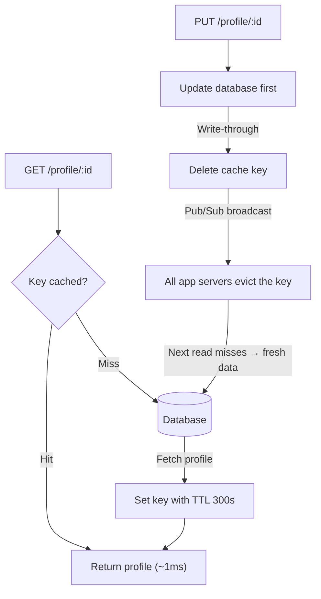

| Difficulty | Channel | Tags |
|---|---|---|
| beginner | backend | redis, memcached, cache-invalidation |

By 2013, Facebook was serving more than a billion users, and nearly every read on the platform — profiles, posts, the entire social graph — ran through a memcached fleet so vast it was the largest cache deployment in the world [1]. The layer held trillions of items and absorbed over a billion requests per second, yet a single naive 'delete the key on update' could stampede the MySQL layer hard enough to threaten the whole site [1]. This post walks through that failure mode, the fix that tamed it, and the Redis-versus-Memcached decisions every developer has to make long before their service is that big. By the end, you will know how to build cache invalidation that survives contact with real users.

---

> ### Real-World Case — Facebook (Meta)
>
> By 2013 Facebook served over a billion users, and nearly every user-visible read (profiles, posts, the social graph) hit its memcached layer - the largest cache deployment in the world. A naive 'delete the key on update' + cache-aside approach broke down at that scale, and a single hot profile or post being invalidated could stampede the MySQL layer.
>
> | | |
> |---|---|
> | **Challenge** | Cache invalidation at global scale: keeping a cache-aside memcached fleet consistent with the primary database across thousands of servers and multiple datacenters with no transactional guarantees. Two failure modes dominated: stale sets (a slow DB read writing an old value back over a freshly invalidated key) and thundering herds (every client refetching the same hot key at once after invalidation), plus the underlying Redis-vs-Memcached choice. |
> | **Solution** | Facebook deliberately stuck with Memcached over Redis, betting on simplicity, and scaled it to billions of requests per second. To fix invalidation they extended the memcached protocol with lease tokens: a cache miss returns a lease, the DB write that invalidates the key revokes outstanding leases so stale sets are dropped, and only one client per key is allowed to refill the cache in a ~10s window (single-flight). Invalidation is broadcast by McSqueal reading MySQL binlogs via mcrouter, and cross-region invalidations ride the binlog stream so a stale value is never served ahead of the replicated write. |
> | **Outcome** | Leases cut peak database query rate on affected keys from ~17K/s down to ~1.3K/s; the cache fleet served over 1 billion requests/sec holding trillions of items, with end-to-end p95 latency in single-digit milliseconds, powering over a billion users. |
> | **Lesson** | The hard part of caching is invalidation, not the cache itself - plain 'delete the key on update' fails via stale-set races and thundering herds, so you need coordination primitives like leases/single-flight. And simplicity can beat feature richness: Facebook scaled stock Memcached to extremes while Redis's advanced data structures were not the deciding factor. |

---

## Hook — The 3 A.M. page that costs a company its whole morning

Picture this: it is 3 a.m., and your pager lights up because a single celebrity profile got updated. One writer at the social network saved a change, your cache layer deleted one key, and suddenly thousands of application servers all asked the database for the same row at the same instant. That is the thundering herd, and it does not care that you followed the textbook [2].

Here is the uncomfortable truth every developer discovers eventually: cache invalidation is harder than caching. Any fool can store a value with a time-to-live. The hard part is the moment of invalidation — the split second when the cache is wrong and the database is about to feel the full weight of your traffic. Sound familiar? If you have ever stared at a 500 error at 2 a.m. while the database replica lag meter climbed, you already know the stakes. This is the story of why the simplest invalidation strategy breaks at scale, and what to do about it.

## Problem — The profile that refuses to go stale

So you are building a user profile service that caches frequently accessed profiles. The naive approach feels obvious: on read, check the cache; on miss, hit the database and store the result; on update, delete the key and let the next read rebuild it. Many developers ship exactly this and call it a day [5]. It works — right up until it does not.

Three failure modes lurk inside that innocent plan. First, staleness: if you delete on update but another process still holds the old value, or your TTL is too long, users see ghost data — a profile that says 'single' hours after the wedding photos drop. Second, the stampede: a hot key gets deleted, and every concurrent request misses simultaneously, multiplying your database load by the number of app servers instead of by one [7]. Third, distribution: if you run multiple servers, server A invalidates its copy but server B still serves the old value, because nobody told it the update happened.

This leads to the core question of the whole design: when your cache is wrong, who notices, and how fast? The answer determines whether you get a slow blip or a full-blown outage. And here is the plot twist — the answer is not 'delete faster.' It is deleting smarter.

## Real-World Case — Facebook (Meta)

Now scale that mental model to the largest cache deployment ever built. By 2013, Facebook served over a billion users, and its memcached fleet — tens of thousands of servers holding trillions of items — was answering more than a billion requests per second with end-to-end p95 latency in the single-digit milliseconds [1]. Nearly every user-visible read passed through that layer, which is precisely why invalidation became a matter of life and death for the database underneath.

Facebook's engineers found that a simple 'delete the key and let the herd re-query' strategy was catastrophic for hot profiles and posts [1]. A single popular item being invalidated would send a wave of cache misses straight into MySQL, and at their scale a stampede meant real outage risk. Their fix was leases: before a server fills a cache miss, it acquires a short-lived lease for the key, so that when a stampede happens, exactly one request goes to the database and the rest wait — or serve a slightly stale value — until the lease holder repopulates the cache [1].

The numbers tell the story. Leases cut the peak database query rate on affected keys from roughly 17,000 queries per second down to about 1,300 — a 13x reduction — while keeping freshness guarantees intact [1]. For the thousands of developers who will never operate a fleet this size, the lesson is the same shape: invalidation is not a database problem, it is a coordination problem. And the tools you choose decide how cheap that coordination gets.

## Deep Dive — Write-through, TTLs, and the Redis vs. Memcached fork in the road

Building on the Facebook story, the interview question you are facing asks for two things: a sane invalidation pattern and an honest comparison of Redis versus Memcached. Let us take them in order.

The pattern most teams land on is write-through with TTL-based expiration. On a profile update, you write the new data to the database first, then delete the cache key (or update it) so the next read pulls fresh data [7]. On reads, you use cache-aside: serve from cache, and only on a miss do you query the database and repopulate. A TTL between 5 and 30 minutes acts as a safety net — even if an invalidation never fires, the entry expires and forces a refresh, bounding how stale your data can ever get [5].

But wait, it gets better — because now you have to choose your cache. This is the fork in the road, and the two options are not interchangeable.

| Dimension | Redis | Memcached |
|---|---|---|
| Distributed invalidation | Pub/sub lets one node broadcast 'key X changed' to every other node instantly [9] | No pub/sub — you build your own coordination layer |
| Persistence | Optional snapshots and AOF so restarts survive [4] | In-memory only; a restart is a full cold start |
| Data structures | Strings, hashes, sets, sorted sets, streams [4] | Key-value strings only |
| Memory overhead | Higher per key, richer features | Lower per key, leaner for pure caching [3] |
| Horizontal scaling | Cluster mode with hash slots [8] | Simpler sharding, famously easy to scale out [3] |
| Best fit | Complex invalidation, durability, counters | Pure read-heavy caching at minimum cost |

The conventional wisdom says 'Memcached is faster for pure caching.' Here is the counterintuitive part: for a user profile service, Redis usually wins — not on raw throughput, but because pub/sub gives you the distributed invalidation that the Facebook story showed you need [9][7]. Memcached is faster per request and leaner in memory, but every distributed invalidation feature becomes your problem to build [3]. When a service is small, either works. When it grows, the coordination you bought upfront with Redis starts paying interest.

## Workflow — The five-step invalidation playbook

This leads to a concrete, repeatable workflow you can apply the next time you touch a caching service. It mirrors the flow in the diagram below, which tells the visual story of the read path and the write path living side by side.

1. **Read cache-first (cache-aside).** Check the cache for the key. On a hit, return in about a millisecond [2].
2. **Backfill on miss.** If the key is missing, query the database exactly once and store the result with a TTL — 300 seconds is a sane default for profiles [7].
3. **Write database-first (write-through).** On an update, persist to the database before touching the cache, so the database always remains the source of truth [7].
4. **Invalidate by deletion.** Delete the cache key rather than overwriting it. Overwriting keeps a stale object alive for slow readers; deletion guarantees the next read is fresh [5].
5. **Broadcast the invalidation.** Publish the key change on a channel, and let every app server's subscriber evict the same key so no node serves stale data [9].

A quick word on the diagram: the top half is the read path, the bottom half is the write path, and the TTL is the silent safety net wrapped around both. Every request you serve from cache is a database query you did not have to run [6].



## Code Example — Write-through invalidation in Python with Redis

Here is what the playbook looks like in practice. The example below implements the read path and the write path you just walked through, using redis-py and a single pub/sub channel for distributed invalidation. Copy the shape of it, not the toy — the patterns transfer to Go, Node, or anything else that talks to Redis [8].

```python
import redis

cache = redis.Redis(host="cache-cluster", port=6379, decode_responses=True)
TTL_SECONDS = 300  # 5 minutes bounds how stale a profile can get

def get_profile(profile_id: int) -> str:
    """Cache-aside read: check the cache first, fall back to the DB."""
    key = f"profile:{profile_id}"

    cached = cache.get(key)
    if cached is not None:
        return cached  # hit: ~1ms, zero database load

    profile = fetch_profile_from_db(profile_id)  # miss: exactly one DB query
    if profile is not None:
        cache.setex(key, TTL_SECONDS, profile)  # repopulate under a TTL
    return profile

def update_profile(profile_id: int, new_data: dict) -> None:
    """Write-through: persist first, then invalidate so the next read is fresh."""
    save_profile_to_db(profile_id, new_data)     # the DB stays the source of truth
    cache.delete(f"profile:{profile_id}")        # delete, don't overwrite, to dodge a stampede
    cache.publish("profile-updates", profile_id) # tell every node to evict the key

def invalidation_worker() -> None:
    """One subscriber per app server keeps all nodes in sync via pub/sub."""
    pubsub = cache.pubsub()
    pubsub.subscribe("profile-updates")
    for message in pubsub.listen():  # fires on every published update
        if message["type"] == "message":
            cache.delete(f"profile:{message['data']}")
```

Walking through it section by section: `get_profile` implements cache-aside — it reads the key, returns on a hit, and on a miss does one database query and repopulates with a 300-second TTL. The TTL matters because it is your automatic invalidation when the manual one never fires [5].

`update_profile` implements write-through with deletion. Notice the order: the database write happens before any cache operation, so a crash mid-update leaves you with an old cache entry rather than a new one pointing at old data. Deleting instead of overwriting is the key decision — overwriting hands the stale object to any in-flight request, while deletion forces the next reader to build a fresh value [7].

Finally, `invalidation_worker` is the distributed half. Every application server subscribes to the `profile-updates` channel, and when any node publishes a profile id, every node evicts that key from its own cache. That single channel is the coordination layer that Facebook had to build by hand with leases — Redis gives it to you out of the box [9]. One note: the delete happens locally on each node, so a node that was down during the broadcast stays stale until its TTL expires. That is exactly why the TTL safety net exists.

## Lessons Learned — Battle scars, hot keys, and the one insight to take back

If this feels like a lot, you are not alone — every team that ships a caching layer learns these lessons the hard way. Here are the battle scars, distilled so you do not have to earn them yourself.

**🔥 Hot take:** the delete-on-update pattern is not wrong. Deleting without a stampede guard is wrong. Facebook did not abandon invalidation; they added leases around the rebuild step, cutting database load on hot keys from 17K to 1.3K queries per second [1].

**⚠️ Watch out for the overwrite trap.** Updating the cache in place instead of deleting keeps stale data alive for every reader that started before the update. Delete first, repopulate on demand, and let the TTL clean up the stragglers [5].

**💡 Insight: the TTL is not optional.** A 5-to-30-minute TTL is your guaranteed correctness floor. Invalidation might fail, a pub/sub message might get lost, a node might restart — the TTL is what catches all of it [7].

**🎯 Key point: measure before you optimize.** Cache hit rate, latency percentiles, and database query rate are the metrics that tell you whether your invalidation is working. A 99% hit rate can still hide a hot key that is stampeding MySQL every five minutes. Monitor the per-key outliers, not just the fleet average [2].

**Pro tip after watching many services grow:** start with Redis, use pub/sub for invalidation from day one, and treat Memcached as the upgrade path for a specific, measured bottleneck — not the default. Redis's persistence and data structures are the insurance policy you will eventually need, and retrofitting coordination into Memcached is far more painful than choosing it upfront [4][3].

And when you do build it, remember the story this started with: at a billion requests per second, the difference between 17,000 and 1,300 database queries per second is the difference between a cached day and an outage [1].

---

## Cache Invalidation Flow: Read and Write Paths


<details>
<summary><strong>Original Interview Question</strong></summary>

**Q:** You're building a user profile service that caches frequently accessed profiles. How would you implement cache invalidation when a user updates their profile, and what trade-offs would you consider between Redis and Memcached?

**A:** Implement write-through caching with TTL-based expiration. On profile update, invalidate the cache by deleting the key and writing new data to both the database and cache. Redis offers pub/sub for automatic distributed invalidation, while Memcached requires manual coordination across nodes.

</details>

## Conclusion

So what should you do differently tomorrow? When you next touch a caching layer, stop treating invalidation as a footnote and start treating it as the coordination problem it really is. Write database-first, delete on update, put a 5-to-30-minute TTL under every key, and use Redis pub/sub to broadcast invalidations across every node — the pattern Facebook leaned on when delete-on-update nearly took down the biggest cache fleet in history [1][9]. The one insight worth repeating to your team: at scale, a cache is not a place you store data, it is a coordination layer between your users and your database — and the TTL is the only thing standing between a quiet night and a 3 a.m. pager [2]. Start with the playbook, measure your hit rates and per-key outliers, and you will never watch 17,000 queries per second slam into MySQL again [7].

---

## References

1. [Facebook (Meta) incident report](https://www.usenix.org/conference/nsdi13/technical-sessions/presentation/nishtala) — paper
2. [Cache (computing) — Wikipedia](https://en.wikipedia.org/wiki/Cache_(computing)) — documentation
3. [Memcached — Wikipedia](https://en.wikipedia.org/wiki/Memcached) — documentation
4. [Redis — Wikipedia](https://en.wikipedia.org/wiki/Redis) — documentation
5. [HTTP caching — MDN](https://developer.mozilla.org/en-US/docs/Web/HTTP/Caching) — documentation
6. [RFC 9111: HTTP Caching](https://datatracker.ietf.org/doc/html/rfc9111) — documentation
7. [Database caching strategies using Redis — AWS](https://docs.aws.amazon.com/whitepapers/latest/database-caching-strategies-using-redis/caching-patterns.html) — documentation
8. [redis/redis — GitHub](https://github.com/redis/redis) — documentation
9. [Redis Pub/Sub documentation](https://redis.io/docs/latest/develop/interact/pubsub/) — documentation
10. [ElastiCache for Redis — Caching strategies](https://docs.aws.amazon.com/AmazonElastiCache/latest/red-ug/Strategies.html) — documentation

---

**Author:** Satishkumar Dhule — [GitHub](https://github.com/satishkumar-dhule) · [LinkedIn](https://linkedin.com/in/satishkumar-dhule) · [Website](https://satishkumar-dhule.github.io)
