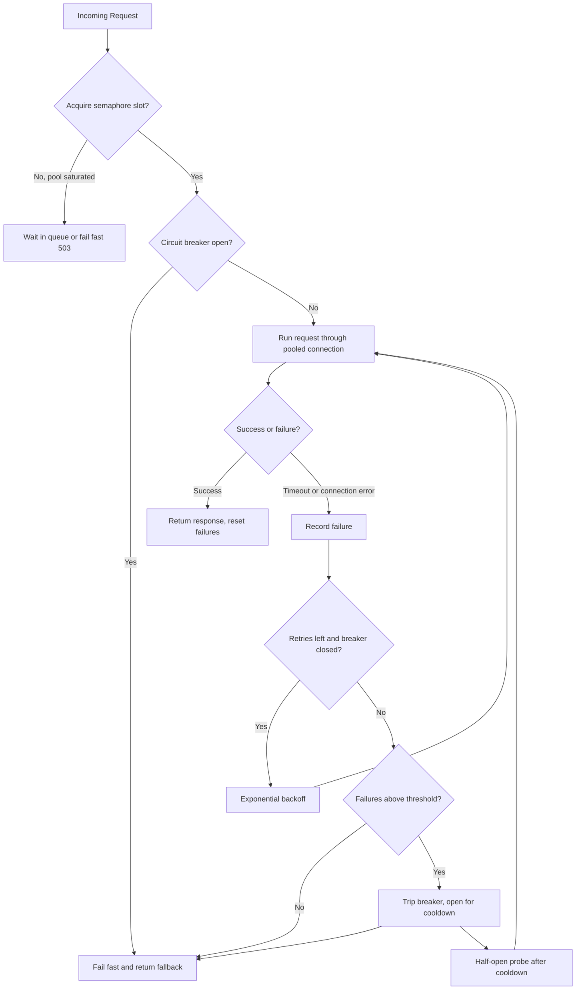

| Difficulty | Channel | Tags |
|---|---|---|
| advanced | backend | asyncio, aiohttp, concurrency |

Picture this: one service in your dependency chain starts answering in seconds instead of milliseconds, and before you can open a debugger, your entire API is on fire. Netflix lived this exact nightmare in the early 2010s, when a single degraded dependency could saturate its entire Tomcat thread pool in seconds and take down one of the highest-traffic APIs on the internet [1]. The lesson from that near-catastrophe is timeless: client code needs to fail gracefully, not pile up. This article walks through building a production-grade connection pool manager for aiohttp — with semaphores, exponential backoff, and circuit breakers — so your app degrades with dignity instead of collapsing.

---

> ### Real-World Case — Netflix
>
> In the early 2010s, Netflix's API tier depended on dozens of internal services. Whenever a single dependency became slow or failed under high volume, blocked request threads would pile up and saturate all available Tomcat threads in seconds or sub-seconds, taking down the entire API. The Netflix API was one of the highest-traffic services on the internet, so this cascading failure risk was existential.
>
> | | |
> |---|---|
> | **Challenge** | Prevent a single latent or failing dependency from cascading into a full API outage. The API needed to survive when one of its dozens of underlying services degraded — not just retry or timeout, but actively shed load, fail fast, and continue serving users in a degraded mode. |
> | **Solution** | Netflix built Hystrix, a latency and fault-tolerance library implementing exactly the pattern described in the answer: per-dependency thread pools and semaphores (bulkhead) to cap concurrent connections/calls, aggressive network timeouts plus thread-level timeouts, a circuit breaker that trips after an error threshold (e.g. 50% errors in a 10-second window) and short-circuits requests until health checks recover, and fallbacks for graceful degradation. The dependency commands were also executed with timeouts so callers could 'walk away' from latent connections instead of waiting indefinitely. |
> | **Outcome** | The API stopped collapsing when a single dependency degraded. Circuits tripping caused requests to fail fast (returning fallbacks) instead of piling up, keeping Tomcat request threads available for healthy dependencies and enabling rapid recovery once the failing service returned. Netflix open-sourced Hystrix in 2012 and it became the industry-standard blueprint for resilience patterns (timeouts, semaphores, bulkheads, circuit breakers) later adopted in resilience4j and countless other libraries. |
> | **Lesson** | Graceful degradation is not just about retrying and backoff — the most important protection is active load shedding. When a dependency is unhealthy, fail fast and trip the circuit so you stop hammering it (and stop burning your own threads), because under sustained latency, request threads pile up so fast they can take down the entire service in seconds. |

---

## Hook — One slow service, one very bad Tuesday

It is 9:42 a.m. on a Tuesday, and the deploy went out clean. Tests passed. Metrics looked green. Your aiohttp client is quietly processing thousands of requests a second. Then one of the dozens of services your application depends on — a search index, a recommendations API, some internal microservice nobody owns anymore — starts answering in 4 seconds instead of 40 milliseconds. At first, nothing seems wrong. But watch what happens inside your connection pool. Every request that used to release its connection in milliseconds now parks it for seconds. Your pool of 100 connections evaporates. New requests queue up behind the slow ones, time out, and retry — generating more load, more timeouts, more chaos. Sound familiar? It should. This exact chain reaction once took down one of the busiest APIs on the internet [1]. The good news: the fix is something you can build in an afternoon.

## Problem — The silent concurrency killer in your HTTP client

Building on that story, here is the uncomfortable truth: the aiohttp client you already ship with does none of this protection by default. It gives you a ClientSession, a connection limit, and timeouts [4]. What it does not give you is a circuit breaker, automatic backoff, or any notion of a health check — those decisions are left entirely to you. Consequently, the failure modes are predictable and brutal. First, you run out of connections: when responses slow down, the pool saturates, and every new request either waits or fails [5]. Second, you amplify the damage with naive retries: blind retries pile fresh load onto a service that is already struggling, which is why retrying without backoff is often worse than not retrying at all [3]. Third, you get a cascade: errors propagate up the async stack, and though asyncio's cooperative scheduling normally keeps one slow coroutine from blocking others [11], connection starvation quietly defeats that guarantee and drags healthy requests down with the sick ones. The stakes could not be higher. In a high-traffic system, a connection pool that cannot degrade gracefully is not a performance problem — it is a survivability problem.

## Real-World Case — Netflix, the API that refused to fall over

This is not hypothetical. In the early 2010s, Netflix ran one of the highest-traffic APIs on the internet, and its API tier depended on dozens of internal services [1]. The architecture worked beautifully — right up until one dependency slowed down. Because blocked requests piled up faster than Tomcat threads could be reclaimed, a single degraded service could saturate the entire thread pool in seconds or sub-seconds, collapsing the whole API. The impact was existential: the API did not degrade gradually, it fell over completely. Netflix's response became legendary in systems engineering. The team introduced what the industry now calls the circuit breaker pattern [2], combined it with thread isolation and fail-fast behavior, and packaged the whole thing as Hystrix — open-sourced in 2012 [8]. The effect was transformative. When a circuit tripped, requests failed fast and returned fallbacks instead of piling up, keeping request threads available for healthy dependencies and enabling rapid recovery once the failing service returned. The pattern's DNA now lives on in libraries like resilience4j [9], and the same ideas — timeouts, semaphores, bulkheads, circuit breakers — remain the standard blueprint for resilience in every language. Netflix stopped its API from collapsing by treating failure as an expected event rather than a surprise. Your aiohttp client deserves the same philosophy.

## Deep Dive — Semaphores, backoff, and circuit breakers: the resilience toolbox

So how does that philosophy translate to Python? This leads to four tools, each solving a different failure mode, that you can layer together. The semaphore is your bulkhead: asyncio.Semaphore caps how many requests can be in flight at once, so one slow dependency can consume at most N connections instead of all of them [6][10]. The timeout is your tripwire: aiohttp.ClientTimeout ensures no request hangs forever, converting a forever-waiting failure into a fast failure [5]. Exponential backoff is your recovery lane: after a failure you retry after 0.5s, then 1s, then 2s, giving a struggling service room to breathe instead of hammering it [3]. And the circuit breaker is your traffic judge: after a threshold of consecutive failures, the breaker opens and requests fail fast with a fallback, then a half-open probe tests whether the service has recovered [2]. Here is the plot twist: your goal is not to succeed on every request. It is to fail fast on most of them when things go wrong, so you can succeed on the ones that matter. Many developers think resilience means keep trying harder. In reality, well-designed systems do the opposite — they give up quickly, systematically, and with a plan. That mindset changes everything:

| Failure mode | Naive response | Resilient response |
|---|---|---|
| Slow dependency | Requests pile up until the pool saturates | Semaphore + timeout: cap concurrency, fail fast |
| Transient blip | Blind retry adds more load | Exponential backoff: retry with increasing delays |
| Persistently failing service | Every request dies slowly | Circuit breaker: fail fast, probe recovery |
| One bad service | Cascade drags everything down | Bulkhead isolation: contain the blast radius |

## Workflow — From request to resilient request, step by step

With the toolbox in hand, the question becomes: how do you wire it together? Here is the mental model — think of every request as moving through a funnel, not a freeway. Step one, acquire a semaphore slot; if the pool is saturated, wait briefly or fail fast with a 503. Step two, check the circuit breaker; if it is open, skip the network call entirely and return a fallback. Step three, run the request through the shared session under a hard timeout. Step four, on success, reset the failure counter; on timeout or connection error, record a failure and decide: retry with exponential backoff, or trip the breaker once the threshold is passed [2][3]. The diagram below captures this journey visually — a request either flows through to success or gets redirected into a fail-fast path that protects the whole system.

One design decision worth spelling out: a single shared ClientSession with connection keepalive dramatically reduces TCP handshake overhead compared to creating a session per request [12]. Pair it with a semaphore that matches your pool limit, and you get honest backpressure — a queue that absorbs short bursts [7] while the circuit breaker protects you from long outages.

## Code Example — Building your own ConnectionPoolManager

Enough theory — here is a production-flavored implementation that combines all four tools into one class. The key design decisions are embedded as comments: one shared session for keepalive, a semaphore as the bulkhead, exponential backoff on retry, and a circuit breaker with a cooldown window. The code below is ready to drop into your service and adapt.

## Lessons Learned — What Netflix's war scars teach us today

After this journey, several hard-won lessons emerge. First, timeouts are not optional — every request needs one, and it should be shorter than your users' patience [5]. Second, retries without backoff are an anti-pattern; always make them exponential and cap them [3]. Third, a circuit breaker only works if you also reset it on success — the half-open probe is what lets the system recover instead of staying down forever [2]. Fourth, connection leaks are the silent killer: always close the session on shutdown, or you will leak sockets and file descriptors until your process dies mysteriously. Fifth, test the degraded path, not just the happy path — inject timeouts and connection failures into your CI and watch how the pool actually behaves.

Here is what to do differently tomorrow: wrap your aiohttp calls in a semaphore, put a hard timeout on every request, and add a small circuit breaker before you need it. The cost is a few dozen lines. The cost of not doing it is what Netflix nearly paid.

---

## Connection Pool Flow with Circuit Breaker

<strong>Original Interview Question</strong>

**Q:** How would you implement a connection pool manager for aiohttp that handles graceful degradation under high load and connection timeouts?

**A:** Implement a connection pool manager for aiohttp using a semaphore to limit concurrent connections, exponential backoff for retrying failed requests, and circuit breaker pattern to gracefully degrade under high load and connection timeouts.

## Conclusion

The journey started with a nightmare: one slow service taking down an entire API [1]. It ends with a system that treats failure as data — capping concurrency with a semaphore, buying time with exponential backoff, and cutting losses with a circuit breaker. Netflix learned this lesson the hard way in the early 2010s, and the industry has been rebuilding it ever since [8]. You do not have to wait for your own near-meltdown to adopt it. Ship the resilient pool this week, monitor your failure rates, and sleep easier knowing your client degrades with dignity instead of collapsing at the first slow dependency it meets.

---

## References

1. [Netflix incident report](https://netflixtechblog.com/fault-tolerance-in-a-high-volume-distributed-system-91ab4faae74a) — article
2. [Circuit breaker design pattern](https://en.wikipedia.org/wiki/Circuit_breaker_design_pattern) — article
3. [Exponential backoff](https://en.wikipedia.org/wiki/Exponential_backoff) — article
4. [aiohttp documentation](https://docs.aiohttp.org/en/stable/) — documentation
5. [aiohttp Client Reference (timeouts and connectors)](https://docs.aiohttp.org/en/stable/client_reference.html) — documentation
6. [asyncio synchronization primitives (Semaphore)](https://docs.python.org/3/library/asyncio-sync.html) — documentation
7. [asyncio Queues](https://docs.python.org/3/library/asyncio-queue.html) — documentation
8. [Netflix Hystrix](https://github.com/Netflix/Hystrix) — documentation
9. [Resilience4j](https://github.com/resilience4j/resilience4j) — documentation
10. [Bulkhead pattern](https://en.wikipedia.org/wiki/Bulkhead_pattern) — article
11. [asyncio documentation](https://docs.python.org/3/library/asyncio.html) — documentation
12. [HTTP persistent connection](https://en.wikipedia.org/wiki/HTTP_persistent_connection) — article

---

**Author:** Satishkumar Dhule — [GitHub](https://github.com/satishkumar-dhule) · [LinkedIn](https://linkedin.com/in/satishkumar-dhule) · [Website](https://satishkumar-dhule.github.io)
