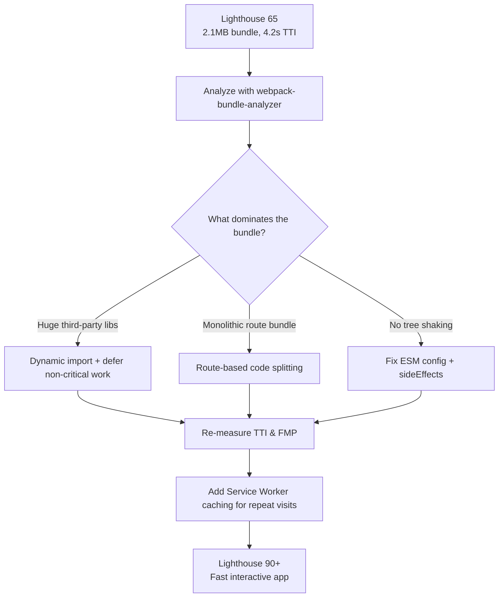

| Difficulty | Channel | Tags |
|---|---|---|
| intermediate | frontend | lighthouse, bundle, lazy-loading |

Ever wondered why your React app feels snappy in the browser yet crawls on a mid-range phone? Pinterest learned the hard way in 2016: its mobile web monolith shipped over 2.5MB of JavaScript and took a staggering 23 seconds to become interactive on typical hardware [1]. Even worse, the company had already proven that a 60% page-load improvement lifted mobile signup conversion by 40% [1]. That gap between what you ship and what your users feel is the exact story you are about to walk through — starting with a Lighthouse score you can almost certainly relate to.

---

> ### Real-World Case — Pinterest
>
> In 2016-2017, Pinterest's mobile web experience was a monolith: it shipped over 2.5MB of JavaScript (~1.5MB main bundle plus 1MB lazily loaded) and took a staggering 23 seconds to become interactive on mid-range mobile hardware. Slow load times were directly hurting a business that had already proven that a 60% page-load improvement lifted mobile signup conversion by 40%.
>
> | | |
> |---|---|
> | **Challenge** | Cut multi-megabyte JavaScript payloads and time-to-interactive on mobile without breaking the site, while keeping hundreds of shared components across *.pinterest.com subsites from silently re-bloating the bundle. They needed to know exactly what was in their webpack bundles and where to split. |
> | **Solution** | In a 3-month React 16 + Redux + webpack rewrite, Pinterest broke bundles into three webpack chunk categories: a ~73KB vendor chunk (react, redux, react-router), a ~72KB entry chunk (app shell + store), and small 13-18KB async route chunks loaded via React Router-based code splitting. They built and open-sourced Bonsai, a webpack bundle analyzer, to find dependency-heavy modules and duplicate code across chunks, then added route preloading, Service Worker caching (cache-first), per-locale precache configs, and an ESLint rule plus size-budget alerts to keep bundles from regrowing. |
> | **Outcome** | Core bundle cut from 650KB to 150KB; First Meaningful Paint dropped from 4.2s to 1.8s and Time To Interactive from 23s to 5.6s, further to 3.9s on repeat visits via Service Worker caching. Business results included a 40% decrease in Pinner wait time, 15% increase in SEO traffic, and 15% increase in signup conversion. |
> | **Lesson** | Splitting isn't just about shrinking the initial bundle — using bundle analysis to deduplicate async chunks can be counterintuitively better. Pinterest deliberately increased their entry chunk by 20% by moving duplicated code into it, which cut the size of every lazily-loaded chunk by up to 90%. Also: performance regresses fast, so tooling (budget alerts, lint rules, bundle analyzers) must be automated to keep wins permanent. |

---

## Hook — The 65 Staring Back at You

This post begins where a lot of interviews and Q4 roadmap meetings do: with a Lighthouse score of 65 staring back at you. The bundle weighs in at 2.1MB. Time to Interactive sits at 4.2 seconds. Nobody argues that the app is slow — the metrics say so — but the question everyone dreads is: what do you actually do about it? Start deleting random libraries? Throw a CDN at it and hope? Most teams freeze here because performance work feels like a minefield where one wrong move breaks a feature. Here is the thing though: the fix is not a single silver bullet. It is a repeatable sequence — analyze, split, lazy-load, tree-shake, cache — and once you see it, you will spot the same pattern in every fast app you open. Sound familiar? Then keep reading, because the sequence starts with understanding the real enemy.

## Problem — A 2.1MB JavaScript Monolith

Before touching a single import statement, it helps to understand what you are actually fighting: JavaScript parse and execution cost. The browser must download, parse, compile, and execute every byte of that 2.1MB before a single interaction works. On a desktop with a 300Mbps fiber link, that is annoying. On a mid-range Android phone over a congested 3G network, it is the difference between a user signing up and a user closing the tab. Consequently, bundle size is not a cosmetic concern — it is a conversion metric. Many developers discover this the hard way: the localhost version loads in a blink because the dev server skips optimization, so the slow bundle only reveals itself in production. Moreover, the pain compounds silently, because developers rarely test on the exact devices their users carry. The stakes become clear when you realize that every 100KB of JavaScript you defer is potentially seconds of interactivity you reclaim. But how bad can it really get? Ask Pinterest.

## Real-World Case — Pinterest

This is precisely the bind Pinterest found itself in. In 2016, their mobile web app was a monolith shipping roughly 2.5MB of JavaScript — a 1.5MB main bundle plus another 1MB loaded lazily — and it took an agonizing 23 seconds to become interactive on mid-range hardware [1]. To make the sting sharper, Pinterest already knew the upside: an earlier experiment showed that a 60% improvement in page load lifted mobile signup conversion by 40% [1]. So the team committed to a systematic rebuild rather than a band-aid. They cut the core bundle from 650KB to 150KB, dropping First Meaningful Paint from 4.2s to 1.8s and Time to Interactive from 23s down to 5.6s — and then to 3.9s on repeat visits thanks to Service Worker caching [1]. The business numbers tell the rest of the story: a 40% decrease in Pinner wait time, a 15% increase in SEO traffic, and a 15% increase in signup conversion [1]. That is what happens when performance stops being a nice-to-have and becomes product strategy. The plot twist? None of it required an exotic framework — it required the same toolkit you have access to today.

## Deep Dive — Bundle Analysis, Code Splitting, and the Art of Lazy Loading

Building on that win, let's unpack the machinery behind it, starting with the tool that should be the first thing you run: webpack-bundle-analyzer. It renders your bundle as a treemap, and the first time you open it, the reaction is usually the same — one gigantic rectangle labelled 'node_modules' dominating the view [4]. That visual instantly tells you which libraries earn their bytes and which are just riding along. From there, the two levers are code splitting and tree shaking. Route-based splitting with React.lazy() and Suspense creates one chunk per route, so users only download the code for the page they actually opened [2][9]. Component-based splitting goes a step further: heavy widgets like charts or editors load only when they enter the screen [9]. Here is the counterintuitive part though — lazy loading is not free. Every chunk is a separate network request, and a Suspense boundary without a thoughtful fallback can cause jarring spinner flashes. You might think tree shaking is automatic these days, but it only works reliably when your dependencies ship proper ES modules and declare "sideEffects": false in their package.json — CommonJS libraries silently defeat it [3][6]. The third lever, Service Worker caching, is what turned Pinterest's repeat visits into a 3.9s TTI: the shell gets cached, so the second visit skips the network dance entirely [1][7]. Consequently, the full strategy is not a single optimization — it is a layered system where analysis informs where you split, splitting enables caching, and caching multiplies the gains.

## Workflow — From Lighthouse 65 to 90+ in Seven Steps

Armed with that understanding, the journey from 65 to 90+ becomes a seven-step loop you can repeat on any project. It begins, always, with measurement: capture a Lighthouse baseline and export your bundle stats so you have hard numbers to defend your changes with [5]. Second, run webpack-bundle-analyzer and rank your chunks by size — the biggest one is your first target [4]. Third, apply route-based splitting so each route ships only its own code [3]. Fourth, hunt the remaining offenders: any dependency that could be dynamically imported — date pickers, markdown renderers, charting libraries — becomes a candidate. Fifth, verify tree shaking by checking that vendors ship ES modules and setting sideEffects appropriately [6]. Sixth, add lazy loading for images and below-the-fold content [10]. Finally, wire up a Service Worker so repeat visits skip the network [7]. The diagram below maps the entire loop — notice how every step funnels back into a re-measurement, because an optimization you cannot measure is an opinion, not a fix. Along the way, you will face a recurring choice between two splitting strategies, and the tradeoff matters more than you might think:

## Code Example — Wiring Lazy Loading Into a Real App

Now it is time to make this concrete. The example below is the exact shape of a real production setup: route-based splitting for pages, component-based splitting for heavy widgets, an ErrorBoundary so a failed chunk download never blanks the whole app, and a webpack magic comment to keep chunk names debuggable. Here is the pattern in practice:

## Lessons Learned — What the Numbers Taught Us

After the rebuild, Pinterest's numbers turned into the industry's reference point — and the takeaways generalize far beyond their codebase [1]. The first lesson: performance work is a feedback loop, not a one-time cleanup; every feature that lands should be re-measured, because a single careless dependency can silently undo weeks of work. Second, lazy loading changes your mental model of 'loading' — the app is no longer a binary loaded-or-not state but a prioritized sequence of chunks. Third, the biggest wins were boring: cutting dead code, fixing module formats, and caching the shell. Finally, and maybe most importantly, the business case writes itself when you can point at a 40% decrease in Pinner wait time and a 15% rise in signup conversion [1] — numbers like those are what turn a technical cleanup into a roadmap priority. If this feels overwhelming, you are not alone; every team that ships a big bundle has stood exactly where you are. The one insight worth sharing with your team tomorrow? Your bundle size is a product decision, and every chunk you defer is a second of your users' attention that you hand back to them.

---

## Bundle Optimization Flow

<strong>Original Interview Question</strong>

**Q:** You're tasked with improving a React app's Lighthouse performance score from 65 to 90+. The bundle size is 2.1MB and Time to Interactive is 4.2s. What specific steps would you take to optimize the bundle and implement lazy loading?

**A:** Implement code splitting with React.lazy() and Suspense, analyze bundle composition with webpack-bundle-analyzer to identify largest chunks, remove unused dependencies and optimize imports, add dynamic imports for heavy components and third-party libraries, implement route-based splitting for better initial load times, and utilize tree shaking with proper ES module configuration.

## Conclusion

The journey from a 65 Lighthouse score to 90+ is the same journey Pinterest took: measure, analyze, split, lazy-load, tree-shake, and cache — then measure again. What once took them 23 seconds to become interactive now takes your app seconds, and the return on that effort shows up not just in dashboards but in signups and revenue [1]. So here is the challenge: run webpack-bundle-analyzer on your current build this week, find the single biggest chunk, and split it. Then watch what happens to your Lighthouse number — and your users.

---

## References

1. [Pinterest incident report](https://medium.com/dev-channel/a-pinterest-progressive-web-app-performance-case-study-3bd6ed2e6154) — article
2. [Dynamic import() — MDN Web Docs](https://developer.mozilla.org/en-US/docs/Web/JavaScript/Reference/Operators/import) — documentation
3. [Code Splitting — webpack documentation](https://webpack.js.org/guides/code-splitting/) — documentation
4. [webpack-bundle-analyzer](https://github.com/webpack/webpack-bundle-analyzer) — documentation
5. [Lighthouse — automated auditing for performance and accessibility](https://github.com/GoogleChrome/lighthouse) — documentation
6. [Tree shaking — MDN Web Docs glossary](https://developer.mozilla.org/en-US/docs/Glossary/Tree_shaking) — documentation
7. [Service Worker API — MDN Web Docs](https://developer.mozilla.org/en-US/docs/Web/API/Service_Worker_API) — documentation
8. [Progressive web app — Wikipedia](https://en.wikipedia.org/wiki/Progressive_web_app) — documentation
9. [How To Implement Lazy Loading Routes with React.lazy()](https://www.digitalocean.com/community/tutorials/react-lazy-loading) — blog
10. [Lazy loading — MDN Web Docs](https://developer.mozilla.org/en-US/docs/Web/Performance/Lazy_loading) — documentation

---

**Author:** Satishkumar Dhule — [GitHub](https://github.com/satishkumar-dhule) · [LinkedIn](https://linkedin.com/in/satishkumar-dhule) · [Website](https://satishkumar-dhule.github.io)
