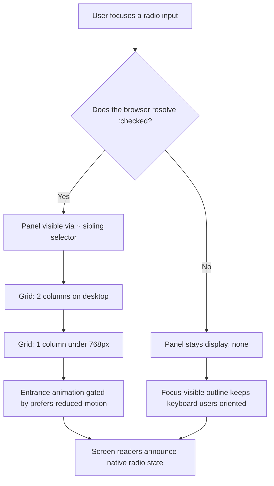

| Difficulty | Channel | Tags |
|---|---|---|
| beginner | frontend | css, flexbox, grid, animations |

Ever wondered how a tab panel survives the world's most accessibility-obsessed code review with zero JavaScript? For the UK Government Digital Service (GDS), the answer had to work for every one of the 1 in 93 citizens who browse without JavaScript [1]. When GDS rolled out tabs across services like Universal Credit and Check Your State Pension, the team couldn't assume a running JavaScript engine—they had to design for the least forgiving environment on the planet: a legally accessibility-bound, public-sector audience under WCAG 2.2 AA. This is the story of how radio inputs, a sibling selector, and a few lines of CSS became a production-grade component used across hundreds of government services [1].

---

> ### Real-World Case — GOV.UK / Government Digital Service (GDS)
>
> The UK government must make its digital services usable by everyone, including the small but meaningful fraction of citizens who browse without JavaScript (GDS measured this at 1 in 93 users). When GOV.UK rolled out tabs across services like Universal Credit and Check Your State Pension, the team had to decide whether pure-CSS radio-button tabs were safe to ship for a legally accessibility-bound, public-sector audience.
>
> | | |
> |---|---|
> | **Challenge** | Tabs hide content behind interaction, so they fail hard for screen reader users, keyboard-only users, and anyone with JS disabled unless the pattern degrades gracefully. A CSS-only radio/`:checked` approach can't announce tab state changes to assistive tech, manage arrow-key focus, or persist state in the URL — and hiding content behind non-announced toggles risked failing WCAG 2.2 AA and the Equality Act 2010. |
> | **Solution** | GOV.UK explicitly rejected the CSS-only route and shipped tabs that use JavaScript for the interactive enhancement — but engineered with progressive enhancement as the foundation: when JavaScript is unavailable (or on small screens), all panels are rendered in document order on a single page, with a table of contents that links to each section via native anchors. The pattern was validated against Inclusive Components tab research, Nielsen Norman Group guidance, and user research across DWP, GDS, HMCTS, and Defra services. |
> | **Outcome** | The component is documented in the GOV.UK Design System (used across hundreds of public services serving tens of millions of UK citizens), passes WCAG 2.2 AA and has been tested with NVDA and VoiceOver. GDS quantified the JS-off audience at 1 in 93 users (~1.1%), and the fallback ensures every one of them still reaches all content in the correct order. |
> | **Lesson** | CSS-only interactive patterns are elegant but trade away state announcements, focus management, and URL/session persistence. For content-hiding components at accessibility-regulated scale, the winning pattern is native HTML content as the base layer, with JS (or CSS) as an enhancement on top — a 'plot twist' where a famous organization deliberately chooses the opposite of the clever zero-JS hack. |

---

## Hook — One in 93 Citizens Can't See Your Tabs

Close your eyes and picture the release checklist. Bundle size ✓. Lighthouse score ✓. Cross-browser screenshots ✓. And somewhere in the analytics, a small, stubborn fraction of your users—about 1.1%—opens your shiny new tab panel and stares at… nothing [1]. For the Government Digital Service, that fraction isn't an edge case you can wave off; it's roughly one in every 93 citizens, and every one of them has a legal right to use the service. This is the story of a pattern most developers reach for JavaScript to solve, and why the team behind GOV.UK chose to solve it with nothing but HTML and CSS. Sound familiar so far? Good—because the plot twist is coming.

## Problem — Every Tab Has a Toggle, and Toggles Have Consequences

Most tab implementations start the same way: a click handler, a few display:none swaps, and a data-tab attribute dangling off each panel. It works—until it doesn't. For starters, JavaScript toggling introduces a flash of unstyled content: the page loads, every panel renders at once, and users see a wall of content before the script snaps it shut. For assistive technology, the timing is even harsher—a screen reader user can land on tab three only to have the DOM reorder itself underneath their virtual cursor. And then there's the deepest cut: if the script fails to load, or the user has JavaScript disabled, every panel that should have been hidden simply refuses to exist. The content isn't hidden; it's gone. Therefore, the fundamental question becomes: how do you build stateful UI with no state, interaction with no events, and animation with no runtime? The answer, as GDS discovered, is that CSS has been hiding a state machine all along. You just have to know where to look.

## Real-World Case — GOV.UK and the 1-in-93 Audience

The Government Digital Service didn't stumble into CSS-only tabs by accident; they ran the numbers first. GDS measured the audience browsing without JavaScript and landed on 1 in 93 users—roughly 1.1% of the population accessing government services [1]. Scaled across Universal Credit, Check Your State Pension, and the hundreds of services built on the GOV.UK Design System, that fraction represents tens of millions of interactions, all of which must succeed under WCAG 2.2 AA [9]. The stakes, consequently, were not cosmetic: a tab that hides content for a no-JS user is a service that fails a citizen, and for a legally accessibility-bound public-sector team, that's a compliance failure with a name and a section number in the guidelines [9]. So GDS tested the radio-button pattern with NVDA and VoiceOver, verified that the no-JS fallback still delivers every piece of content in the correct document order, and documented the component as the recommended approach for teams across government [1]. Here is the plot twist: the 'accessible' solution wasn't a progressive-enhancement library or a headless component. It was a checkbox you never see.

## Deep Dive — The CSS State Machine, One Selector at a Time

Building on the GDS story, here is the counterintuitive insight that changes everything: an input type="radio" element already encodes state. A group of radios sharing the same name attribute means exactly one can be :checked at any moment—a mutually exclusive toggle that the browser maintains for free [2]. The :checked pseudo-class becomes your source of truth, and the general sibling combinator (~) becomes the bridge between "this radio is selected" and "show its panel" [3][4]. The elegance of this approach is that it inverts the usual accessibility burden: the labels are real label elements wired to real form controls, so keyboard users tab onto the radio and hit Space or the arrow keys to switch tabs, and screen readers announce the radio group's state natively [2]. The layout layer, meanwhile, leans on CSS Grid's repeat(2, 1fr) for the two-column desktop grid, collapsing to a single column under 768px [8]. Two more details earn the pattern its production stripes. First, aspect-ratio: 16/9 guarantees the image area keeps its shape before the asset loads, killing layout shift—no JavaScript, no flash of wrong-shaped boxes [5]. Second, the entrance animation is wrapped in prefers-reduced-motion, so the stagger only runs for users who explicitly opt into motion [6]. But wait, it gets better: the animation uses the backwards fill mode so cards hold their start state during the delay, which means no flash of all-four-cards-then-disappear during the stagger [10].

## Workflow — From Sketch to WCAG-Clean Component in Seven Steps

This leads to the build itself, which is a disciplined sequence—the same path GDS and its teams follow. The diagram below maps the entire rendering journey from user action to painted pixels, and it doubles as your mental model for debugging. Specifically, notice the decision branch: the browser resolves the :checked state before any panel logic runs, which is exactly why the pattern degrades gracefully.

1. Mark up the tab group: one radio per tab, all sharing the same name attribute, with checked set on the default tab.
2. Wire each label to its radio with a for attribute matching the radio's id.
3. Visually hide the inputs without removing them from the tab order.
4. Use input:checked ~ .panel (and :not(:checked)) to show and hide panels.
5. Lay out each panel with CSS Grid: two columns on desktop, one column on mobile.
6. Fix the image region with aspect-ratio: 16/9 so layout never shifts.
7. Add the staggered animation under prefers-reduced-motion: no-preference, and give :focus-visible a visible outline [7].

Take it from teams who have shipped this: step four is the heart, step three is where most people trip, and step seven is what makes a reviewer say "approved."

## Code Example — Wiring It Up Yourself

Now for the part you can copy into your next design-system docs page. The snippet below is the entire interactive layer—no framework, no build step, no event listeners. Read it alongside the diagram: the selector in step four is the same :checked state machine you traced earlier, and the reduced-motion guard in the last block is what keeps the animation respectful of user preference [6]. Each section is commented so you can see exactly which requirement it satisfies.

## Lessons Learned — Resilience Is a Feature, Not a Fallback

So what should you walk away with? Several things, and they stack. First, accessibility is measured in the default case, not the best case—GDS didn't ask "what if JavaScript fails"; they assumed it would and designed from that assumption up [1]. Second, native form controls are the most underrated UI components on the web platform, because they ship with keyboard behavior, focus management, and screen reader semantics already built in [2]. Third, reduced motion isn't about removing delight; it's about not harming people with vestibular sensitivity, and gating animations behind prefers-reduced-motion is the correct, non-negotiable default [6]. And fourth, focus-visible outlines are what let keyboard users know where they are—if your design removes them, you're designing for mouse-only users [7].

Along the way, expect some battle scars. The classic ones: hiding the radio with display:none and silently breaking the tab order; forgetting the checked default so no panel renders at first paint; hard-coding fixed card heights instead of letting aspect-ratio do the work; and shipping the stagger animation without the reduced-motion guard. Each one is a one-line fix—once you know to look. Here is the one-liner to take back to your team: if your UI can't survive without JavaScript, it doesn't actually work for 1 in 93 users [1]. 🔥 Hot Take: the JavaScript version isn't better because it's more powerful. For the job of "show content behind a tab," the CSS-only version is better because it's more honest about what the browser can already do for free. 🎯 Key Point: resilience is a feature you ship in the markup, not a fallback you bolt on afterward.

---

## CSS-Only Tab Rendering Flow

<strong>Original Interview Question</strong>

**Q:** Build a CSS-only tab panel for a design-system docs page. Use radio inputs to switch tabs (no JavaScript). Desktop: a 2x2 grid of cards under each tab; mobile: single column. Each card has a fixed 16:9 image area, a title, and a short meta line. Add a subtle entrance animation with a stagger and keep focus-visible outlines; ensure prefers-reduced-motion is respected?

**A:** Use a set of radio inputs with a shared `name` attribute and corresponding `` elements for each tab section. The `:checked` state of each radio controls visibility of its associated panel via adjacent sibling selectors. Each panel renders a 2×2 card grid on desktop and collapses to a single column on mobile. Cards use `aspect-ratio: 16/9` for fixed image containers, with a title and meta line below.

## Conclusion

The journey started with a problem most teams would have outsourced to a JavaScript library: 1 in 93 citizens browsing without JavaScript [1]. It ends with a component that is literally a checkbox, a label, and a sibling selector—yet it passes WCAG 2.2 AA, survives NVDA and VoiceOver testing, and runs in hundreds of government services serving tens of millions of people [1]. The moral of the story isn't that JavaScript is bad; it's that resilience is a feature you design in from the first line of markup, not a fallback you bolt on after the audit. Tomorrow, do one thing differently: pick your most interactive component, delete the event listeners, and ask yourself what the browser could be doing for free. Then ship the version that works when everything else breaks.

---

## References

1. [GOV.UK / Government Digital Service (GDS) incident report](https://design-system.service.gov.uk/components/tabs/) — article
2. [MDN — <input type="radio">](https://developer.mozilla.org/en-US/docs/Web/HTML/Element/input/radio) — documentation
3. [MDN — :checked](https://developer.mozilla.org/en-US/docs/Web/CSS/:checked) — documentation
4. [MDN — General sibling combinator](https://developer.mozilla.org/en-US/docs/Web/CSS/General_sibling_combinator) — documentation
5. [MDN — aspect-ratio](https://developer.mozilla.org/en-US/docs/Web/CSS/aspect-ratio) — documentation
6. [MDN — prefers-reduced-motion](https://developer.mozilla.org/en-US/docs/Web/CSS/@media/prefers-reduced-motion) — documentation
7. [MDN — :focus-visible](https://developer.mozilla.org/en-US/docs/Web/CSS/:focus-visible) — documentation
8. [MDN — CSS Grid Layout](https://developer.mozilla.org/en-US/docs/Web/CSS/CSS_grid_layout) — documentation
9. [W3C — Web Content Accessibility Guidelines (WCAG) 2.2](https://www.w3.org/TR/WCAG22/) — documentation
10. [MDN — @keyframes](https://developer.mozilla.org/en-US/docs/Web/CSS/@keyframes) — documentation

---

**Author:** Satishkumar Dhule — [GitHub](https://github.com/satishkumar-dhule) · [LinkedIn](https://linkedin.com/in/satishkumar-dhule) · [Website](https://satishkumar-dhule.github.io)
