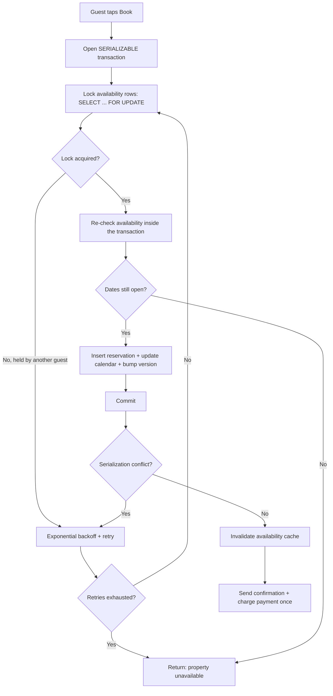

| Difficulty | Channel | Tags |
|---|---|---|
| intermediate | database | acid, isolation-levels, mvcc |

When Airbnb split its Rails monolith into a service-oriented architecture, every booking and payment stopped being a single database transaction and became a distributed one spanning calendars, payments, and notifications. A guest who double-tapped 'Book' could trigger a naive client retry that charged them twice or created a duplicate reservation — the exact double-booking race the platform had to engineer out of existence [1]. The fix was not about buying a faster database; it was about designing for the worst-case millisecond. This is the story of how teams keep one cabin from being sold to two guests, and what it means for your own transaction design.

---

> ### Real-World Case — Airbnb
>
> As Airbnb migrated from a Rails monolith to a service-oriented architecture, every booking and payment became a distributed transaction spanning multiple services. When a guest's request timed out or they double-tapped 'Book', a naive client retry could charge the guest twice or create a duplicate booking — the exact double-booking race the platform had to eliminate.
>
> | | |
> |---|---|
> | **Challenge** | Guaranteeing that a payment/booking request is processed exactly once (never twice) across a distributed microservice architecture without a global transaction coordinator, while preserving low latency and high availability for millions of daily booking requests. |
> | **Solution** | Airbnb built 'Orpheus', a general-purpose idempotency library embedded in every payments service. Each request carries an idempotency key, and the framework acquires a database row-level lock on that key (a lease) so only one in-flight attempt can proceed — making a double-click or retry collapse into a single operation. Requests are split into Pre-RPC/RPC/Post-RPC phases, with each phase wrapped in a single atomic DB transaction. Counterintuitively, Orpheus reads and writes idempotency state ONLY from the sharded master database: reading from replicas would let replica lag turn a safe retry into a double charge. They scale by sharding on the idempotency key rather than adding read replicas. |
> | **Outcome** | Airbnb achieved 99.999% (five nines) payment consistency after launching Orpheus while annual payment volume simultaneously doubled. |
> | **Lesson** | Don't blindly use read replicas for consistency-critical operations — a few seconds of replica lag can equal a double charge/double booking. Correctness-critical state belongs on the master (sharded to scale), and 'check-then-act' bugs are best closed by row-level locks on an idempotency key plus atomic transactions, not by application-level guards or a standalone idempotency service that inherits the same distributed failures. |

---

## Hook — One cabin, two thumbs, zero milliseconds to spare

Picture this: it is Friday at 5:47 PM, and a lakefront cabin in Oregon just went live on Airbnb. Two families, neither aware of the other, tap 'Book' within 400 milliseconds of each other. Behind the scenes, two requests are racing toward the same rows in a database that can only have one winner.

If the transaction layer does its job, exactly one family gets a confirmation and the other sees a graceful 'unavailable.' If it does not, you have an overbooked property, two furious guests, and a support ticket that escalates straight into an engineer's evening. That is the stakes: a correctness bug measured in milliseconds that shows up as real money and lost trust. Airbnb faced this problem at planetary scale, and the engineering decisions made there are the same ones that keep your checkout, inventory, and seat-reservation endpoints honest [1].

## Problem — The lost update that double-sells everything

At its core, the double-booking bug is a classic lost update. Two transactions read the same 'available' state, both pass the availability check, and both write — the last writer silently wins. Many developers discover the hard way that READ COMMITTED, the default isolation level in PostgreSQL and most other databases, offers no protection here: it prevents dirty reads but lets each statement see a fresh snapshot, so your check-then-act pair is wide open to interleaving [2].

This leads to a deceptively clean code path that is actually deadly: check availability in one query, then insert the reservation in a second, with no transaction boundary between them. Between the check and the write, the property is a free-for-all. Sound familiar? It is the same pattern that produces oversold concert tickets, exhausted inventory, and gift cards drained twice. The uncomfortable truth is that ACID guarantees [5] only mean something when you use them deliberately — and most ORMs quietly default you straight past the protections you need.

## Real-World Case — Airbnb

Airbnb lived this problem at the worst possible scale. As the company migrated from its Rails monolith to a service-oriented architecture, every booking and payment became a distributed transaction spanning multiple services — and distributed transactions fail in exciting new ways [1]. When a guest's request timed out, or they double-tapped 'Book,' a naive client retry could charge them twice or create a duplicate booking. That is the double-booking race with real money attached: not two families fighting over a cabin row, but two charges fighting over a payment row.

Teams responded by building Orpheus, a payments platform that treats every payment as a single logical transaction with idempotency keys and exactly-once semantics [1]. The results were stunning: Airbnb achieved 99.999% (five nines) payment consistency after launching Orpheus, while annual payment volume simultaneously doubled [1]. Here is the counterintuitive insight buried in that story: the fix was not a cleverer lock. It was making the system behave as if a retry was always one request, never two.

## Deep Dive — Why SERIALIZABLE is an abort-and-retry protocol in disguise

Building on Airbnb's lesson, before you can copy their approach you need to understand the tools underneath. Modern databases like PostgreSQL use multiversion concurrency control (MVCC): each transaction reads from its own snapshot of committed data, so readers never block writers and writers never block readers [4]. That is a huge win for availability — but it changes how you think about conflicts. A conflict is no longer detected the moment a second writer shows up; it is detected at commit time, when the database discovers the two writes were not serializable.

Here is the plot twist: SERIALIZABLE in PostgreSQL does not lock your rows. It uses serializable snapshot isolation (SSI), which detects serialization anomalies and aborts one of the conflicting transactions at commit [2][6]. In other words, SERIALIZABLE is an abort-and-retry protocol in disguise. Many developers assume it is a strict, blocking fortress — in reality, it is a referee that occasionally smacks a writer and expects you to run the race again. That is precisely why retry logic with exponential backoff is not optional polish; it is the core of the design.

By contrast, SELECT ... FOR UPDATE is the pessimistic alternative: the second transaction blocks on the lock and waits its turn instead of aborting [3]. Under high contention on a hot property, long-held locks can cascade into queue pileups; under normal load, blocking is predictable and easy to reason about. So which do you pick? The honest answer is: it depends on contention and transaction length. Layering SERIALIZABLE on top of FOR UPDATE is usually redundant — the lock already serializes you.

## Workflow — From tap to confirmation, step by step

This leads to a concrete workflow that combines pessimistic row locking with optimistic retry semantics. The sequence is:

1. Open a transaction at SERIALIZABLE isolation so the read of availability matches the write that follows.
2. Acquire row-level locks on every availability-calendar row in the requested date range with SELECT ... FOR UPDATE [3].
3. Re-validate availability inside the transaction, after the lock is held — never before. Any pre-check done outside the transaction is only a UX hint, not a guarantee.
4. Insert the reservation and update the calendar rows atomically, bumping a version column for optimistic-change tracking.
5. Commit. If the database aborts you with a serialization failure, back off exponentially and retry, up to a bounded limit.
6. After a successful commit, invalidate the availability cache so other guests stop seeing stale 'available' rows.

If any step fails or retries are exhausted, return a clean 'unavailable' to the guest. For the distributed layer beyond the database — the payment that follows a booking — adopt Airbnb's trick and make every request idempotent with a client-generated key, so a retry can never create a second charge [1]. The diagram below tells the visual story of this flow, including the loop where serialization conflicts send a transaction back to the start.

## Code Example — A booking transaction that cannot double-sell

Here is a production-shaped implementation in Python using psycopg2 against PostgreSQL. It combines pessimistic locking on the availability rows with a bounded exponential-backoff retry loop for serialization failures — the two mechanisms from the workflow above.

The transaction does four things in order: it rolls back to guarantee a clean state per attempt, locks the availability rows so competing guests queue instead of racing, re-checks for overlapping reservations while holding the lock, and finally inserts the reservation and flips the calendar rows to 'booked.' If the database aborts the commit because another transaction won the race, the sleep with exponential backoff gives the conflict time to clear before the next attempt — and the loop gives up after a bounded number of tries so the guest gets a fast, honest answer.

## Lessons Learned — Battle scars from the double-booking wars

After this journey, a few rules of thumb stand out — each one paid for with real incidents somewhere:

- **Lock rows, not tables.** A dedicated availability-calendar table lets you lock only the date range a guest wants. Locking the whole property row serializes every request for that property and turns a hot cabin into a traffic jam.
- **Check and act must share a transaction.** The authoritative availability check happens after SELECT FOR UPDATE, inside the same transaction that writes. Availability reads from read replicas are fine for displaying the calendar — never for the final decision.
- **Retries are the design, not the afterthought.** With MVCC-based SERIALIZABLE, aborts are a feature of correctness [2]. Add exponential backoff, jitter, a retry cap, and a circuit breaker for properties that are constantly contended.
- **Invalidate caches after commit, not before.** Write-through caches that are cleared mid-transaction briefly advertise already-booked dates as available [3].
- **Think idempotently at every layer.** Airbnb's Orpheus shows the database is only half the battle — once requests cross service boundaries, a retry must be indistinguishable from the original request [1].

Many developers also learn this painful version of the lesson: 'fixing' a double-booking bug by pointing the availability check at a leader replica just moves the race. And if you are evaluating managed alternatives, DynamoDB's transaction APIs offer comparable atomicity guarantees with a different consistency model [7]. The principles — bounded conflict, retry, and idempotency — travel with you no matter which database you land on.

---

## Booking Transaction Flow

<strong>Original Interview Question</strong>

**Q:** You're building a booking system for Airbnb where multiple users can reserve the same property simultaneously. How would you design the transaction handling to prevent double bookings while maintaining high availability?

**A:** Use SERIALIZABLE isolation with optimistic concurrency control. Implement row-level locks on property availability tables, use MVCC snapshot reads for checking availability, and apply application-level validation to ensure atomic booking operations.

## Conclusion

Go back to that Oregon cabin. Two families tapped 'Book' within 400 milliseconds, and exactly one confirmation went out — not because the database is magical, but because someone designed the transaction to lock first, re-check under the lock, commit atomically, and retry when the referee blew the whistle. The real moral is bigger than bookings: Airbnb's Orpheus story shows that once requests cross service boundaries, correctness depends on making every retry indistinguishable from the original request [1]. So tomorrow, take one endpoint you own — a booking, a checkout, an inventory decrement — and ask two questions: What happens if two users hit it at once? And what happens if one user hits it twice? If you cannot answer both without a double-sell, you have found your next engineering project. The locks, the retries, and the idempotency keys are the tools — and now you know exactly how to wield them.

---

## References

1. [Airbnb incident report: Avoiding Double Payments in a Distributed Payments System](https://medium.com/airbnb-engineering/avoiding-double-payments-in-a-distributed-payments-system-2981f6b070bb) — article
2. [PostgreSQL Documentation: Transaction Isolation](https://www.postgresql.org/docs/current/transaction-iso.html) — documentation
3. [PostgreSQL Documentation: Explicit Locking](https://www.postgresql.org/docs/current/explicit-locking.html) — documentation
4. [Multiversion Concurrency Control](https://en.wikipedia.org/wiki/Multiversion_concurrency_control) — documentation
5. [ACID](https://en.wikipedia.org/wiki/ACID) — documentation
6. [A Critique of ANSI SQL Isolation Levels](https://arxiv.org/abs/1410.6597) — paper
7. [Amazon DynamoDB: Transaction APIs](https://docs.aws.amazon.com/amazondynamodb/latest/developerguide/transaction-apis.html) — documentation
8. [PostgreSQL Source Repository](https://github.com/postgres/postgres) — documentation

---

**Author:** Satishkumar Dhule — [GitHub](https://github.com/satishkumar-dhule) · [LinkedIn](https://linkedin.com/in/satishkumar-dhule) · [Website](https://satishkumar-dhule.github.io)
