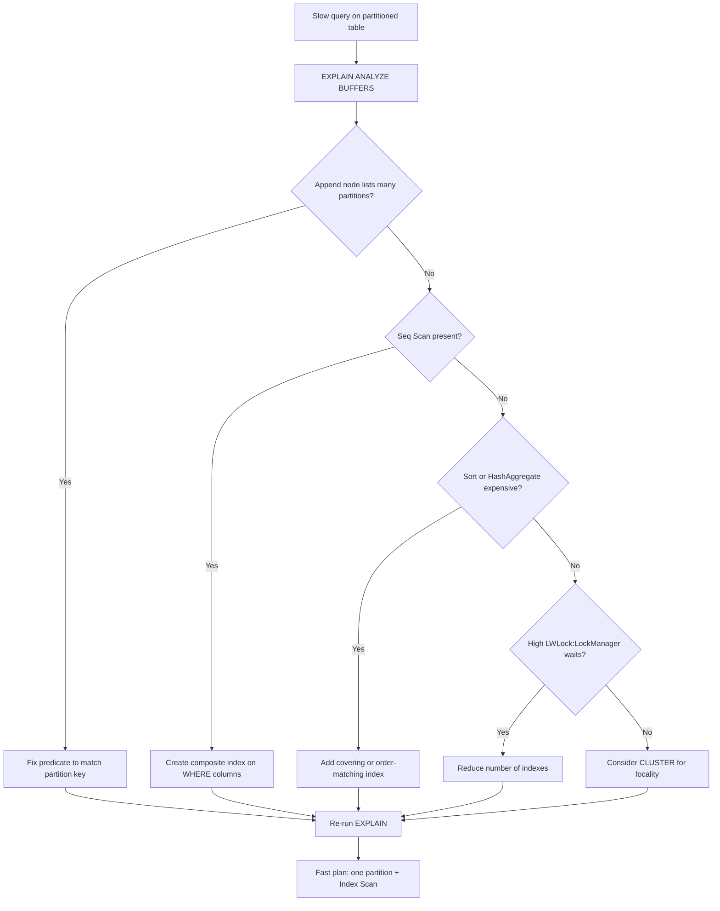

| Difficulty | Channel | Tags |
|---|---|---|
| intermediate | database | explain, query-plan, partitioning |

In April 2023, GitLab did what every team does eventually — a routine hardware upgrade. Minutes later, production was on fire for 2 hours and 15 minutes, with hundreds of PostgreSQL connections frozen on a single wait event: LWLock:LockManager [1]. The enemy was not the new hardware. It was a partitioned table, too many indexes, and a query pattern that quietly defeated partition pruning. This is the story of how a "fast" table brought down a platform — and the exact diagnostic path, starting with one EXPLAIN plan, that keeps your 100M-row tables from doing the same.

---

> ### Real-World Case — GitLab
>
> In April 2023, GitLab performed a routine database hardware upgrade on GitLab.com, shifting traffic to new n2-generation GCP read replicas. Within minutes they hit severe production degradation that lasted 2 hours 15 minutes, with hundreds of database connections stuck on PostgreSQL's LWLock:LockManager wait event.
>
> | | |
> |---|---|
> | **Challenge** | GitLab runs a multi-terabyte PostgreSQL database (ci_builds alone was ~2.5 TB) with many partitioned tables and dozens of indexes per table (projects had 57 indexes). Two forces combined: the planner must lock every table and index at plan time, and many high-frequency queries filtered on columns other than the partition key, so PostgreSQL could not prune partitions and scanned all of them. At a peak of ~60,000 queries/second per replica, LockManager contention became the bottleneck — queries weren't slow because of bad index usage or data scans, they were queuing on a global lightweight lock. |
> | **Solution** | Using bpftrace and pg_locks analysis, engineers traced the degradation to slow-path vs fast-path lock acquisition on the Lock Manager. Mitigations included rolling back the hardware change, then systematically dropping unused indexes, making queries partition-pruning-compatible by including the partition key in WHERE clauses (so EXPLAIN showed partitions being pruned), caching at the application tier, adding read replicas, and using prepared statements to shift locking from plan time to execution time. |
> | **Outcome** | The 2h15m degradation was rolled back and the investigation (GitLab scalability issue #2301) became the canonical public case study for LWLock:LockManager contention on partitioned tables. It was cited in AWS RDS documentation, covered by pganalyze's 5mins of Postgres, and its key takeaway — 'ensure partitioned tables are queried in a way that is compatible with partition pruning' — plus index reduction unblocked the hardware upgrade. |
> | **Lesson** | On a large partitioned table, a slow query is often not a scan problem: check EXPLAIN to see how many partitions are actually pruned and whether the partition key appears in the WHERE clause, and remember that at scale every extra index and partition adds plan-time lock overhead that can collapse under concurrency. |

---

## Hook — The Deploy Looked Fine. Then Everything Froze.

It was a routine Tuesday in April 2023. GitLab's team shifted traffic to fresh n2-generation read replicas after a hardware upgrade, expecting business as usual. Instead, the pager went off within minutes. Database connections piled up by the hundreds, each one stuck on the same wait event — LWLock:LockManager — and a quick deploy turned into a 2-hour-15-minute production outage [1]. Here is the twist: the new hardware was fine. The real culprit had been hiding in the database all along, disguised as a well-intentioned best practice. Every table had been partitioned by date. Every query had an index. And still, performance collapsed.

Sound familiar? If you work with PostgreSQL at scale, that gut-punch feeling is a rite of passage. The good news is that the eventual fix was tiny. The even better news is that the diagnostic skill that finds it takes minutes to learn — and it starts with a single command.

## Problem — The 100M-Row Table That Ignores Your Filters

Picture the scene: a PostgreSQL table with 100 million rows, partitioned by date. A query filters on a clean date range — "give me everything in January 2024 with status = completed." Logically, the database should only touch a fraction of those rows. But the query still crawls. Where does the time go?

Many developers make a fatal assumption: partitioning is a performance guarantee. It is not. Partitioning is an optimization you must actively cooperate with — the planner has to prove it can skip partitions for pruning to work [3]. The cost of failing to cooperate is measured in slow queries, angry users, and 2 a.m. pages.

Three suspects explain almost every case of a slow partitioned query:

- Partition pruning silently not happening — the planner scans partitions the query never needed
- Indexes that exist but never get used — sequential scans plowing through millions of rows instead
- Expensive operations hiding behind the scenes — sorts and hash aggregates that balloon as result sets grow

Here is what makes this so maddening: none of these problems show up in your logs. No error message. No warning. Just a query that used to feel fine and now, at 100M rows, feels like watching paint dry. Spotting them requires reading the query plan the way a detective reads a crime scene. And as GitLab discovered, ignoring what the plan reveals can take your entire platform down [1].

## Real-World Case — GitLab's LWLock:LockManager Meltdown

Back to April 2023. GitLab.com was migrating to new n2-generation GCP read replicas as part of a routine hardware upgrade. Within minutes of shifting traffic, severe degradation hit — and it lasted 2 hours and 15 minutes before the team rolled back [1]. The diagnosis became legendary in the Postgres community: hundreds of connections contending on LWLock:LockManager, a low-level lightweight lock protecting PostgreSQL's lock manager tables.

But here is the plot twist that makes this case so instructive. The bottleneck was not the replica hardware or a misconfigured parameter. It was that partitioned tables were being queried in a way incompatible with partition pruning — combined with a large number of indexes on those partitions. Every query that failed to prune touched far more partitions than necessary, and the sheer volume of index operations serialized through the lock manager. The database wasn't slow; it was trampling itself [1].

The fix was disarmingly simple: reduce the number of indexes, and ensure queries are written so pruning can actually happen. Once applied, the upgrade went through. The investigation — GitLab scalability issue #2301 — became a canonical reference, cited in AWS RDS documentation and covered by pganalyze's "5 Minutes of Postgres" [1].

This leads to an uncomfortable realization: the same patterns that slowed GitLab's platform are sitting in your schema right now — perfectly normal-looking indexes on partitioned tables. The question is whether you find them through an EXPLAIN plan or through an incident postmortem.

## Deep Dive — Reading the EXPLAIN Plan Like a Detective

Consequently, the first skill to master is reading EXPLAIN output. The query planner produces a tree of nodes, and each node tells you something. For a partitioned table, the critical node is the Append node — where the planner joins results from the partitions it decided to scan. The number of child plans beneath it is your partition-pruning verdict: one child means pruning worked beautifully; ten children mean the planner scanned partitions you never asked for [3].

However, pruning alone does not guarantee speed. The planner can prune correctly and still choose a sequential scan over every surviving partition if the index does not look selective enough. Specifically, an index on the partition key alone rarely helps a query that also filters on another column, because the planner has to fetch the table row to check the extra condition. The solution is a composite index — but only when the column order matches your query patterns. A B-tree index on (event_date, status) [7] lets the planner resolve both predicates from the index itself, and if you select only columns the index contains, you get index-only scans [2].

Now for the part that surprises everyone: after the plan is efficient, watch for Sort nodes and HashAggregate operations. Sorting 100M rows just to answer a question about one month is a hidden tax no amount of indexing can fix — unless your index already returns rows in the right order, letting PostgreSQL skip the sort entirely [6].

And the deepest twist of all, the one GitLab paid 2 hours of production for: indexes are not free. Every index adds write overhead and, at scale, lock-manager contention. That is why "just add an index" can actively hurt you on partitioned tables [1].

Here is a quick reference for what the plan is telling you:

| Symptom in EXPLAIN | Likely cause | Fix |
|---|---|---|
| Append shows many partitions | Pruning not happening | Make predicate compatible with the partition key |
| Seq Scan on surviving partitions | No useful index | Composite index matching WHERE clauses |
| Sort on huge result set | Wrong index order | Covering or order-matching index [6] |
| High LWLock:LockManager waits | Too many indexes | Drop unused indexes, reduce lock pressure [1] |

This table is the cheat sheet, but it raises the obvious question: how do you walk through this systematically without chasing your tail? That is where a repeatable workflow comes in.

## Workflow — A Step-by-Step Diagnostic Path

Building on the deep dive, here is the diagnostic workflow that turns this from guesswork into a repeatable process. It is the same loop GitLab's engineers ultimately used — run the plan, read the verdict, fix the one thing, and re-run. The decision tree below is the mental map you will walk through on every slow partitioned query, from the initial EXPLAIN through the fix.

(The diagram referenced above — "Partitioned Query Diagnostic Flow" — shows the loop: diagnose, branch on what the Append and Scan nodes reveal, apply exactly one fix, and re-run until the plan is fast.)

1. Run EXPLAIN (ANALYZE, BUFFERS) on the slow query. The BUFFERS clause adds page-read counts that expose how much data the query physically touches [2].
2. Check the Append node. If it lists more partitions than your date filter implies, your predicate is defeating pruning.
3. Look for Seq Scan nodes. A sequential scan across partitioned data is your biggest red flag.
4. Search for Sort and HashAggregate nodes. These indicate expensive operations you can eliminate with the right index.
5. Create a composite index matching the WHERE clause, then re-run the EXPLAIN and compare costs before and after.
6. If your reads are heavily date-range biased, evaluate CLUSTER to co-locate rows physically and shrink the I/O footprint.

Each step is independent and verifiable, so you never have to guess. And the entire loop takes minutes, not hours — assuming you know what to look for. The code that follows makes steps one through five concrete.

## Code Example — From Slow Plan to Fast Plan

Here is the full sequence in action — the exact commands a team runs to diagnose and fix a slow partitioned query. The example uses psql, but the SQL works in any client, and the bash wrapper is what makes it scriptable for a runbook.

## Lessons Learned — What Changes Tomorrow

Every war story leaves battle scars, and GitLab's 2-hour outage leaves a valuable set. Consequently, here is what you can do tomorrow, without waiting for a pager to force the issue:

- Trust the plan, not the schema. Partitioning and indexing are promises; EXPLAIN (ANALYZE, BUFFERS) is the audit that verifies them [2].
- Verify pruning on every hot path. One predicate that cannot be pruned can silently undo the entire benefit of partitioning [1].
- Measure your index budget. On partitioned tables, many indexes multiply into lock-manager contention at scale — reduce aggressively, the way GitLab did [1].
- Audit index usage with pg_stat_user_indexes and drop the indexes nobody touches [8].
- Prefer composite indexes whose column order mirrors your WHERE clauses, and let them double as sort providers [6].
- Re-run the plan after every change. Optimization is a loop, not a one-shot event.

⚠️ Watch Out: CLUSTER and CREATE INDEX CONCURRENTLY are power tools. Clustering locks the table, and building indexes concurrently still adds write overhead — schedule them, and drop indexes you no longer query [4].

🎯 Key Point: The most expensive query in your system is usually not the one that is slow today — it is the one that becomes slow when your data grows 10x. The skill you build today is the insurance policy for that day.

If this feels overwhelming, you are not alone. The good news is that the diagnostic loop is small, repeatable, and it pays for itself the first time it saves you from a 2-hour incident.

---

## Partitioned Query Diagnostic Flow

<strong>Original Interview Question</strong>

**Q:** You have a PostgreSQL table with 100M rows partitioned by date. A query filtering on a specific date range is still slow. What would you check in the EXPLAIN plan and how would you optimize it?

**A:** Check partition pruning effectiveness, index utilization patterns, and expensive sort operations. Create composite indexes on (date, filtered_columns) and evaluate clustering strategies for optimal data access.

## Conclusion

Two hours and fifteen minutes of production pain taught GitLab something profound: the database was never broken — the query patterns and index pile-up simply outgrew the schema [1]. The same journey is waiting for your 100M-row table: start with the hook of a slow query, follow the trail through the Append node, and land on a plan you can prove. Run EXPLAIN (ANALYZE, BUFFERS) on your slowest partitioned query this week. Count the partitions in the Append node, count the Seq Scans, and ask whether each index earns its keep. The one insight worth sharing with your team? A partition is only as fast as your ability to prove the planner actually uses it.

---

## References

1. [GitLab incident report](https://ardentperf.com/2024/03/03/postgres-indexes-partitioning-and-lwlocklockmanager-scalability) — article
2. [PostgreSQL: Using EXPLAIN](https://www.postgresql.org/docs/current/using-explain.html) — documentation
3. [PostgreSQL: Table Partitioning](https://www.postgresql.org/docs/current/ddl-partitioning.html) — documentation
4. [PostgreSQL: CREATE INDEX](https://www.postgresql.org/docs/current/sql-createindex.html) — documentation
5. [PostgreSQL: CLUSTER](https://www.postgresql.org/docs/current/sql-cluster.html) — documentation
6. [PostgreSQL: Indexes and ORDER BY](https://www.postgresql.org/docs/current/indexes-ordering.html) — documentation
7. [Wikipedia: B-tree](https://en.wikipedia.org/wiki/B-tree) — documentation
8. [PostgreSQL: Monitoring Statistics](https://www.postgresql.org/docs/current/monitoring-stats.html) — documentation

---

**Author:** Satishkumar Dhule — [GitHub](https://github.com/satishkumar-dhule) · [LinkedIn](https://linkedin.com/in/satishkumar-dhule) · [Website](https://satishkumar-dhule.github.io)
