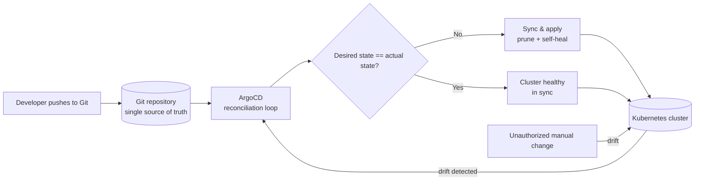

| Difficulty | Channel | Tags |
|---|---|---|
| beginner | devops | argocd, flux, declarative |

At Adobe, an internal platform called Moonbeam had become the bottleneck nobody wanted to admit: deployments were queue-based and push-style, requiring constant manual intervention and suffering from configuration drift across 10,000+ pipelines [1]. So Adobe rebuilt delivery as Flex — a GitOps platform built on ArgoCD that treats Git as the single source of truth [1]. The result? 10,400 pipelines migrated or decommissioned, 3,000+ production services now shipping for 3,000+ developers, and a plot twist that retired roughly 80% of the stale infrastructure Adobe thought it needed [1]. This is that story — and the ArgoCD patterns your cluster can borrow from it.

---

> ### Real-World Case — Adobe
>
> Adobe's legacy internal platform 'Moonbeam' (CaaS) had become impossible to scale: deployments were queue-based and push-style, requiring manual intervention and suffering from configuration drift across 10,000+ pipelines. Adobe rebuilt delivery as 'Flex', a GitOps platform built on ArgoCD that treats Git as the single source of truth.
>
> | | |
> |---|---|
> | **Challenge** | Moving thousands of production services off an imperative, push-based deployment model where engineers applied changes directly to clusters and environments drifted apart, with no audit trail or rollback path. |
> | **Solution** | Adobe adopted the Argo project ecosystem (ArgoCD, Argo Workflows, Argo Events, Argo Rollouts) to make Git the source of truth. ArgoCD continuously reconciles live cluster state against declarative manifests in Git — auto-syncing approved changes and reverting any manual drift — replacing fragile queue-based push deployments with declarative, pull-based delivery. |
> | **Outcome** | 10,400 pipelines were migrated or decommissioned; GitOps now supports 3,000+ production services for 3,000+ developers across hundreds of teams. An unexpected bonus: the migration surfaced thousands of stale/abandoned services — roughly 80% of the previously identified inventory was safely retired, contributing 'meaningful cost savings' and cutting deployment queue times significantly. |
> | **Lesson** | The declarative approach is a forcing function for hygiene: putting everything in Git made drift, duplicate, and dead services visible. Also, technology adoption alone wasn't enough — the workflow and governance model built around ArgoCD is what made enterprise-scale GitOps migration practical. |

---

## Hook — The deploy looked fine. Then the dashboard went red.

It is 3am and your pager just went off. The deploy you merged six hours ago looked perfect — the pipeline said green, the log tail looked clean. But somewhere between your repository and your live cluster, reality quietly drifted from intent. A manual `kubectl scale` here, a one-off label patch there, a cron job that rewrote a Deployment "just for now." Sound familiar? Many developers have lived this exact loop: queue-based deploys, imperative hotfixes, and a "works on my cluster" culture that turns every release into a gamble. The stakes are bigger than one bad deploy, though. When configuration drift compounds across thousands of services, your entire delivery platform becomes the bottleneck — and that is exactly what happened inside Adobe before the company rebuilt everything [1].

## Problem — When your pipeline becomes the bottleneck

At the heart of every Kubernetes war story sits a quiet villain: configuration drift. You declared a desired state, but someone ran a direct command, an operator tweaked a label, or a hotfix bypassed review. One drift is a shrug. Ten thousand drifts are an outage [3]. The imperative approach — firing `kubectl` commands straight at a cluster — feels fast in the moment, and that is precisely the trap. Every imperative change bypasses version control, so there is no audit trail, no rollback button, and no way to reproduce any environment from scratch [10]. The declarative approach flips the script: the complete desired state lives in Git, and the cluster becomes a dumb renderer of that intent [3]. When would you actually care? The moment your team hits its fifth microservice, or the night an on-call engineer hotfixes a live cluster and nobody can explain how the environment changed. That is the moment you realize you have two sources of truth — and you can trust neither.

## Real-World Case — Adobe's Moonbeam to Flex

Adobe's story is the definitive proof that this is not a theoretical concern. Adobe's legacy internal platform, Moonbeam (CaaS), had become impossible to scale: deployments were queue-based and push-style, requiring manual intervention and suffering from configuration drift across 10,000+ pipelines [1]. So Adobe rebuilt delivery as Flex, a GitOps platform built on ArgoCD that treats Git as the single source of truth [1]. The numbers are staggering: 10,400 pipelines were migrated or decommissioned, and GitOps now supports 3,000+ production services for 3,000+ developers across hundreds of teams [1]. But here is the plot twist nobody saw coming. The migration surfaced thousands of stale and abandoned services — roughly 80% of the previously identified inventory was safely retired, contributing meaningful cost savings and cutting deployment queue times significantly [1]. Adobe did not just modernize its delivery; going declarative cleaned house along the way. When the source of truth lives in Git, it becomes brutally obvious which services deserve to exist at all.

## Deep Dive — Declarative vs imperative, and the counterintuitive tradeoff

Building on Adobe's transformation, the real question is: what actually changes when you go declarative? ArgoCD runs a reconciliation loop that polls your Git repository at a configurable interval — typically every 1 to 5 minutes — and compares the desired state in Git against the actual state of the cluster [2]. When they match, nothing happens. When they do not, ArgoCD applies the difference. That continuous convergence is the entire magic trick. The Application CRD is the bridge: it points at a repo, a path, and a destination cluster, turning your Git commit history into deploy history [9]. Auto-sync applies changes automatically, with `prune` removing anything that disappears from Git [2]. And self-healing? That is the plot twist. Self-healing actively reverts any unauthorized manual `kubectl` change — your cluster learns to fight back [2]. You might think that sounds aggressive. It is. And that is the point. You might also think Helm and Kustomize are optional flavor, but they are how you compose config across environments instead of copying YAML folders [5][6]. The tradeoff, in a nutshell:

## Workflow — From Git commit to converged cluster

This leads to the workflow that turns the theory into muscle memory. First, choose how you express desired state — Helm charts for packaged, templated apps, Kustomize overlays for environment-specific tweaks, or plain YAML for simple cases [5][6]. Second, register your repository with ArgoCD as the recognized single source of truth [2]. Third, define an Application CRD that says "watch this path, keep this namespace in sync" [9]. Fourth, enable automated sync with prune and self-healing so ArgoCD owns convergence, not your on-call rotation [2]. Finally, watch the reconciliation loop run — every few minutes, Git and cluster shake hands and any drift gets corrected. The diagram below shows the loop in visual form: Git flows into the reconciliation engine, desired and actual state are compared, and unauthorized manual changes get swept back into line. Once this loop is running, deploying a change is a one-word act: merge. The cluster follows automatically.

## Code Example — A production-grade Application in one manifest

Now the fun part: making it real. The script below walks through a production-grade ArgoCD setup — install, repo registration, and an Application manifest that wires auto-sync, pruning, self-healing, and retry backoff into one declarative object. Run it in a sandbox first; when the Application is applied, ArgoCD converges the namespace to exactly what the repository says, and nothing else.

## Lessons Learned — Battle scars, plot twists, and what to do tomorrow

Every war story has battle scars, and GitOps migrations are no exception. First, start with self-healing off for the first week — you want to see the drift reports before your cluster starts reverting people's work. Second, never run two deployment paths in parallel; the moment humans can bypass Git, the audit trail collapses and drift returns [3]. Third, let `prune` be scary — run it — because that is how Adobe discovered 80% of its service inventory was dead weight [1]. Fourth, treat RBAC as part of the design: if no human has write access to the cluster, then every change is a Git commit and every change is reviewable [8]. The patterns that scale: keep manifests small and composable, set sane health-check intervals (3 minutes works well for most teams), and make `kubectl apply` a forbidden action in production. Tomorrow, pick one service, move it into a declarative config, enable auto-sync, and measure your deploy queue time before and after. The metrics will sell the rest of the migration for you.

---

## GitOps Reconciliation Loop

<strong>Original Interview Question</strong>

**Q:** You're setting up GitOps for a microservices deployment. How would you configure ArgoCD to automatically sync changes from your Git repository to Kubernetes, and what's the difference between declarative and imperative approaches in this context?

**A:** I'd configure ArgoCD by setting up a Git repository containing Kubernetes manifests or Helm charts, creating an Application CRD that points to the Git repository, enabling auto-sync with a health check interval of 3 minutes, and implementing self-healing to automatically revert any manual changes. The declarative approach involves defining the desired state in Git through YAML manifests, Helm charts, or Kustomize configurations, where ArgoCD continuously reconciles the actual state with the desired state. In contrast, the imperative approach uses kubectl commands to make direct changes to the cluster, bypassing the Git repository as the single source of truth.

## Conclusion

The journey ends where it began: a queue-based deployment nightmare at Adobe scale [1]. The transformation there carries a lesson for every developer: when Git becomes the single source of truth, your cluster stops being a mysterious black box and becomes a reproducible function of your repository. Start small — pick one service, move it to a declarative config, enable auto-sync, and let ArgoCD reconcile. Tomorrow, when your team ships, you will know exactly how the state got there, because the answer is always the same: it came from Git. That is the insight worth sharing with your team: in GitOps, a deploy is not an event. It is a convergence.

---

## References

1. [Adobe incident report](https://www.cncf.io/case-studies/adobe/) — article
2. [Argo CD Documentation](https://argo-cd.readthedocs.io/en/stable/) — documentation
3. [Declarative Management of Kubernetes Objects Using Configuration Files](https://kubernetes.io/docs/tasks/manage-kubernetes-objects/declarative-config/) — documentation
4. [GitOps](https://en.wikipedia.org/wiki/GitOps) — article
5. [Helm Documentation](https://helm.sh/docs/) — documentation
6. [kubernetes-sigs/kustomize](https://github.com/kubernetes-sigs/kustomize) — documentation
7. [OpenGitOps — CNCF GitOps Working Group](https://opengitops.dev/) — documentation
8. [Argo CD repository](https://github.com/argoproj/argo-cd) — documentation
9. [Argo CD Declarative Setup](https://argo-cd.readthedocs.io/en/stable/operator-manual/declarative-setup/) — documentation
10. [kubectl reference](https://kubernetes.io/docs/reference/kubectl/) — documentation

---

**Author:** Satishkumar Dhule — [GitHub](https://github.com/satishkumar-dhule) · [LinkedIn](https://linkedin.com/in/satishkumar-dhule) · [Website](https://satishkumar-dhule.github.io)
