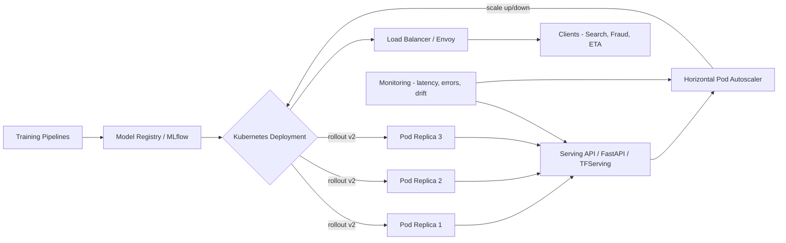

| Difficulty | Channel | Tags |
|---|---|---|
| beginner | devops | mlops, deployment |

At peak, DoorDash's search traffic hammered its ML stack with over 100,000 predictions every single second — and the fragmented approach couldn't keep up [1]. Every team ran its own in-house scoring service, duplicating infrastructure, burning memory, and inflating latency, until they built Sibyl, a centralized real-time prediction service that now peaks above 1 million predictions per second [1]. That moment exposes the two jobs most teams collapse into one: deploying a model and serving it. They are not the same thing — and confusing them is how production ML quietly breaks.

---

> ### Real-World Case — DoorDash
>
> As DoorDash's ML usage exploded across search ranking, ETA prediction, fraud detection, and dasher assignment, each service was doing its own in-house scoring, causing duplicated ML infrastructure, memory pressure, and performance problems. DoorDash built a centralized, real-time prediction service called Sibyl to handle all online model serving while keeping training pipelines and feature computation in separate systems.
>
> | | |
> |---|---|
> | **Challenge** | They needed a low-latency, high-throughput serving layer that could convince downstream services to call it instead of embedding prediction logic in each service — targeting hundreds of thousands of predictions per second with strict latency (sub-second for search/homepage ranking, which ranks ~1,000 restaurants per request). They had to balance batch vs real-time inference, model loading, and thread/CPU efficiency. |
> | **Solution** | Sibyl is a Kotlin service with LightGBM/PyTorch prediction calls executed via C++ through JNI, using gRPC, a separate feature store and model store, coroutine-based concurrency, models loaded once at startup and cached, and configurable batch requests so clients can send 1-to-N predictions in a single call. They later isolated high-traffic 'noisy neighbor' models into their own clusters to scale search-ranking traffic independently. |
> | **Outcome** | Load testing on live search traffic peaked at over 100,000 predictions/sec; migrating fraud and dasher-pay models delivered a 3x latency drop versus the old service; the platform grew to support dozens of models serving over 10 billion predictions per day at a peak of 1M+ predictions/sec; model authoring time fell from up to a week to a few hours after migrating scoring to a computational-graph format. |
> | **Lesson** | Batch size is not monotonic — tuning request chunk size (optimal ~100-200 stores) showed that smaller batches actually increased latency due to request queuing, while huge batches hit network propagation limits. Effective model serving is a distinct concern from training/deployment: separate the serving runtime from model stores, feature stores, and CI/CD pipelines, and isolate noisy-neighbor tenants to scale predictably. |

---

## Hook — Everyone says "just deploy the model." They're wrong.

Here is a question worth sitting with: is your model "in production" because a container is running, or because it can answer 10,000 requests a second without falling over? Many developers discover the difference at the worst possible moment — the Friday-afternoon rollout. The image builds, the pod starts, the health check passes, and then the first real user request takes 2.3 seconds. The model is deployed. It is absolutely not being served. Sound familiar? This article walks through why DoorDash rebuilt its entire prediction platform around that distinction — and what the gap between deployment and serving means for your latency budget, your autoscaling rules, and your 2 a.m. on-call.

## Problem — The gap between "it runs" and "it scales"

Strictly speaking, deployment is the journey a model takes to reach a running environment: CI/CD pipelines that test and package it, infrastructure provisioning, health checks, monitoring, and rollback strategies [3][5]. Serving is what happens after — the runtime act of turning requests into predictions under a latency budget. Think of deployment as the runway and boarding process; serving is the flight itself. Consequently, you can deploy flawlessly and still fail to serve: the model loads cold, the inference thread pool is exhausted, or the pod autoscales five minutes too late. The stakes are real. A recommender that adds 300 ms to page load quietly costs conversions; a fraud model that falls behind invites bad actors through the front door. But here is the plot twist: the technology stacks barely overlap. Deployment leans on Kubernetes, Terraform, and MLflow [3][5]; serving leans on TensorFlow Serving, TorchServe, or FastAPI behind a load balancer [2][9].

## Real-World Case — DoorDash and the birth of Sibyl

DoorDash did not wake up one day with a serving problem. It grew into one. As ML usage exploded across search ranking, ETA prediction, fraud detection, and dasher assignment, each service rolled its own in-house scoring — causing duplicated ML infrastructure, memory pressure, and performance problems that no single team could fix [1]. Their answer was Sibyl, a centralized real-time prediction service handling all online model serving, while keeping training pipelines and feature computation in separate systems [1]. The numbers tell the story: load testing on live search traffic peaked above 100,000 predictions per second; migrating fraud and dasher-pay models delivered a 3x latency drop versus the old service; and the platform grew to dozens of models serving over 10 billion predictions per day, peaking past 1 million predictions per second [1]. Model authoring time fell from up to a week to a few hours once scoring moved to a computational-graph format [1]. That last number is the sneaky insight: when you separate serving from everything else, you don't just fix latency — you change how fast teams can ship models at all.

## Deep Dive — Deployment vs. serving: the real trade-offs

With the DoorDash story as context, the difference stops being academic. Deployment is about getting the artifact to the cluster safely and reversibly; serving is about keeping that artifact fast, versioned, and elastic under live traffic [2]. The tools reflect this split:

| Concern | Deployment | Serving |
|---|---|---|
| Primary job | Ship, provision, monitor, roll back [3][5] | Inference APIs, routing, versioning, autoscaling [2][9] |
| Typical tools | Kubernetes, Terraform, MLflow, SageMaker [5][8] | TensorFlow Serving, TorchServe, BentoML, FastAPI, Envoy [2][6][9] |
| Scaling unit | Pod replicas via HPA [4] | Requests per second, model loading |
| Failure mode | Wrong image in production | Cold start, thread exhaustion, slow autoscale |
| Metric that matters | Deployment frequency, MTTR | p50/p95 latency, throughput, error rate |

This leads to the core trade-offs every serving design confronts. Latency versus throughput: real-time search needs sub-100 ms responses, while batch scoring happily churns through gigabytes at sub-second intervals. Batch versus real-time inference: batch pipelines maximize GPU utilization; real-time APIs optimize for tail latency. And cold start optimization — loading a multi-gigabyte model into GPU memory on a new pod can take minutes, which is exactly why DoorDash keeps model weights pre-warmed and shared [1]. Specifically, horizontal scaling (more replicas) handles concurrency, while vertical scaling (bigger GPUs) handles memory-bound models [4]. Teams also layer A/B testing on top via traffic splitting, but only after the serving layer supports versioned endpoints that let two models coexist. What if you get all this wrong? The next section shows the workflow that keeps you on the rails.

## Workflow — From model file to production traffic

Building on the DoorDash blueprint, the journey from trained artifact to live traffic follows six steps, visualized in the "From Training Pipeline to Production Inference" diagram below:

1. **Train and register** — training pipelines push artifacts (weights, graph, metadata) into a model registry like MLflow [5].
2. **Version and validate** — the registry pins a version, runs offline evaluation, and gates promotion.
3. **Deploy** — Kubernetes rolls out new pod replicas with readiness probes, keeping the old version until the new one passes [3].
4. **Serve** — the serving layer (TensorFlow Serving, BentoML, or a FastAPI endpoint) loads the versioned model and exposes predict/health routes [2][6][9].
5. **Route and scale** — a load balancer fans traffic across replicas while the horizontal pod autoscaler adds capacity based on CPU or request rate [4].
6. **Observe and roll back** — latency percentiles, error rates, and drift feed monitoring; a bad rollout flips back to the previous version.

The trick many teams miss: deployment and serving live on different clocks. Deployment is a discrete event you can undo. Serving is a continuous contract with your users — and it needs its own scaling rules, not a copy of your CI/CD config.

## Code Example — A production-style serving API in FastAPI

Here is the serving half of the story, minus the cluster noise. This FastAPI service pins a model version at startup, exposes a health endpoint for Kubernetes probes, and reports latency on every prediction — the three minimum requirements for a service that will survive autoscaling and rollouts [9].

## Lessons Learned — What DoorDash teaches every ML team

If DoorDash's 10 billion daily predictions teach anything, it's that serving is a discipline, not a feature [1]. Here is what to carry into your next rollout:

- **Separate the jobs.** Deployment and serving solve different problems with different tools. Building one giant pipeline that does both makes every change risky and every rollout slow.
- **Pay the cold-start tax once.** Load models at startup, pre-warm weights, and never read the model file inside a request handler.
- **Pin versions in serving, not just in the registry.** A serving endpoint should know exactly which model it runs, so rollback is a config change, not a re-deploy.
- **Autoscale on serving signals.** Replicas based on request rate and latency beat CPU-based rules for inference workloads [4].
- **Measure what your users feel.** Track p95 latency and error rate at the serving layer; deployment metrics alone will hide the pain.

One battle scar worth avoiding: teams that A/B test at the model level before the serving layer can route traffic safely. Set up versioned endpoints first; then, and only then, split traffic.

---

## From Training Pipeline to Production Inference

<strong>Original Interview Question</strong>

**Q:** Explain the key differences between model serving and model deployment in ML systems, including specific technologies, scaling considerations, and real-world implementation patterns?

**A:** Deployment encompasses CI/CD pipelines, infrastructure setup, and monitoring using tools like Kubernetes, MLflow, and SageMaker. Serving focuses on runtime inference APIs with frameworks like TensorFlow Serving, TorchServe, or BentoML, handling request routing, model versioning, and autoscaling. Key trade-offs include latency vs throughput, batch vs real-time inference, and cold start optimization.

## Conclusion

The next time someone says "just deploy the model," remember DoorDash: a platform serving 10 billion predictions a day at peaks over a million per second didn't come from a bigger deployment — it came from treating serving as its own discipline, with its own stack, its own scaling rules, and its own latency budget [1]. Tomorrow, pick one small change: pin model versions at your serving endpoint, expose a health probe that reports the version, or add p95 latency to your monitoring dashboard. That single shift — deployment gets you to the runway, serving gets you to your users — is the insight worth sharing with your team this week.

---

## References

1. [DoorDash incident report](https://doordash.engineering/2020/06/29/doordashs-new-prediction-service/) — article
2. [TensorFlow Serving](https://github.com/tensorflow/serving) — documentation
3. [Kubernetes Deployments](https://kubernetes.io/docs/concepts/workloads/controllers/deployment/) — documentation
4. [Kubernetes Horizontal Pod Autoscaling](https://kubernetes.io/docs/tasks/run-application/horizontal-pod-autoscale/) — documentation
5. [MLflow](https://github.com/mlflow/mlflow) — documentation
6. [BentoML](https://github.com/bentoml/BentoML) — documentation
7. [gRPC Documentation](https://grpc.io/docs/what-is-grpc/introduction/) — documentation
8. [AWS SageMaker Machine Learning Concepts](https://docs.aws.amazon.com/sagemaker/latest/dg/how-it-works-mlconcepts.html) — documentation
9. [FastAPI Documentation](https://fastapi.tiangolo.com/) — documentation

---

**Author:** Satishkumar Dhule — [GitHub](https://github.com/satishkumar-dhule) · [LinkedIn](https://linkedin.com/in/satishkumar-dhule) · [Website](https://satishkumar-dhule.github.io)
