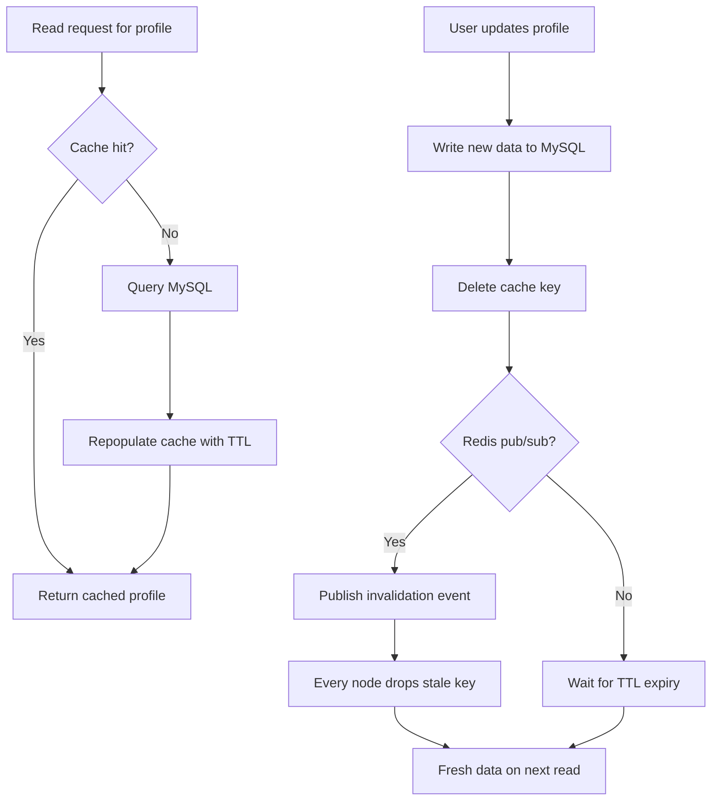

| Difficulty | Channel | Tags |
|---|---|---|
| beginner | backend | redis, memcached, cache-invalidation |

In 2013, Meta (then Facebook) stood at a crossroads: every page load fanned out into hundreds of cache lookups, and each write to MySQL risked serving stale profiles to over a billion users [1]. That is the raw mathematics of cache invalidation at planetary scale — and it is the same problem you will face, just on a smaller stage. This article walks through the write-through strategy, the Redis-versus-Memcached trade-offs, and the invalidation decisions that separate a smooth read from a stale one. By the end, you will know exactly what to do when a profile update needs to be visible everywhere, instantly.

---

> ### Real-World Case — Meta (Facebook)
>
> By 2013 Facebook's front-end was serving billions of requests per second with user profile and timeline data cached in thousands of memcached servers fronting MySQL. A single page load could fan out into hundreds of cache lookups, and every write to MySQL risked serving stale cached profiles across a fleet that kept growing globally.
>
> | | |
> |---|---|
> | **Challenge** | Cache invalidation at massive scale: when a user updated their profile, how do you invalidate cached copies across thousands of nodes and multiple geographic regions without races? Naive update-in-place causes 'stale set' race conditions (a slow request overwrites newer data), and cache misses can trigger thundering herds that crush the database. |
> | **Solution** | Facebook used delete-based invalidation (idempotent deletes, never sets, after a DB write) plus a dedicated invalidation daemon (McSqueal) that tailed the MySQL commit log, extracted affected keys, and broadcast invalidations to all clusters. To close the remaining race window they extended memcached with a lease protocol that invalidates a client's write token if a delete arrives mid-fill, and rate-limits lease issuance to defuse thundering herds. Notably, they deliberately chose memcached over Redis for the front-end cache because its simplicity was a feature. |
> | **Outcome** | The system grew to handle billions of requests per second and hold trillions of items in the world's largest memcached deployment, serving over a billion users. Single-server throughput was pushed from ~50,000 to 200,000+ requests/sec after switching reads to UDP, and the lease mechanism eliminated most stale reads while protecting the storage layer from stampedes. |
> | **Lesson** | Deletes beat sets for invalidation (they're idempotent), and pushing invalidation into the storage layer (commit-log daemon) beats manual per-node coordination — you don't need Redis pub/sub to do this well. Simpler tools win at scale; the counterintuitive part is that the hardest cache bug isn't forgetting to invalidate, it's the stale-set race between a read-miss and a concurrent delete, which only a cache-server-enforced lease truly solves. |

---

## Hook — the stale profile staring back at you

Every developer has been there: you update a profile, refresh the page, and the old name is still staring back at you. Somewhere, a stale cache entry is living rent-free in your infrastructure, quietly serving yesterday's data to today's users. Now multiply that single stale read by a billion users and a fleet of thousands of cache servers, and you have the exact problem that kept Meta's storage engineers busy through the early 2010s [1]. This is the story of cache invalidation — the quiet villain that decides whether your users see fresh data or a ghost of the past.

## Problem — caches are built on a beautiful lie

Caches are built on a beautiful lie. You copy hot data into faster storage so reads are instant, but the moment the source of truth changes, every cached copy becomes a liability. Profile services are the classic victim: profiles are read constantly, updated rarely, and the worst failure mode is silent — no error, no 500, just confidently wrong data. Sound familiar? The problem compounds because reads fan out. One page view can trigger hundreds of cache lookups, each one a chance to serve a stale profile, and each miss a chance to hammer the database behind it [1]. The stakes are real: stale profiles erode trust in identity checks, order history, and anything else users assume is current.

## Real-World Case — Meta (Facebook)

By 2013, Meta's front end was serving billions of requests per second, with profile and timeline data cached across thousands of memcached servers sitting in front of MySQL [1]. A single page load could fan out into hundreds of cache lookups, and every write to MySQL risked poisoning the entire fleet with stale copies — a fleet that kept growing as more users and regions came online [1]. The paper that emerged from this fight, 'Scaling Memcache at Facebook,' reads like a manual for surviving cache chaos at planetary scale [1]. Meta pushed single-server throughput from roughly 50,000 to 200,000+ requests per second by switching reads to UDP, and introduced a lease mechanism that eliminated most stale reads while protecting the storage layer from cache stampedes [1]. That deployment grew to hold trillions of items while serving over a billion users — and invalidation was the foundation everything else stood on.

## Deep Dive — write-through, TTLs, and the Redis versus Memcached fork in the road

Building on Meta's war stories, let's talk about patterns you can deploy tomorrow. The first decision is the read path. Most services use cache-aside (lazy loading): check the cache, and on a miss, query the database and repopulate the cache. It is simple, and it means the cache only holds data people actually request [2]. The write path is where opinions diverge. Write-through sounds appealing — write to both the database and the cache on every update — but it drags the cache into every write's latency and fills it with data nobody reads. The leaner play: persist to the database first, then delete the cache key. The next read takes the miss, and the cache heals itself [2]. Add a TTL — 5 to 30 minutes is the sweet spot for profiles — and you get a safety net that cleans up even when your code forgets [2][8]. But here is the plot twist: deletes and TTLs handle correctness on one server. In a distributed world, every node keeps its own copy, so invalidation has to travel. Redis offers pub/sub: publish an event, and every subscribed node drops the stale key within milliseconds [3]. Memcached has no broadcast primitive — invalidation requires manual coordination, typically shorter TTLs and a background purge [4]. 💡 Insight: delete-on-update inverts the write-through instinct for good reasons — an in-flight old read can race a write-through and re-insert stale data, while deleting forces the next read to rebuild from the source of truth [2]. ⚠️ Watch Out: without stampede protection, a cold cache plus a traffic spike turns a single stale-key purge into a database-melting thundering herd [5].

## Workflow — keeping profiles fresh, step by step

With the trade-offs mapped, here is a workflow that keeps profiles fresh without over-engineering. The diagram below traces both journeys: the happy read and the update that sets invalidation in motion. First, serve reads cache-aside: on a hit, return immediately; on a miss, query MySQL and repopulate with a TTL [2]. Second, on update, write the new profile to the database first — the database is the source of truth, so it must win. Third, delete the cache key instead of writing through; this avoids stale values and keeps write latency flat [2]. Fourth, if you run Redis, publish an invalidation event so every node drops the key at once, rather than waiting for each node's TTL to expire [3]. Fifth, monitor cache hit rates and write amplification — a hit rate below 85% usually means your key design needs work, and creeping TTLs signal you are sweeping mistakes under the rug [1][6].

## Code Example — a profile service that kills stale data on arrival

Time to make this concrete. This Python profile service implements cache-aside reads, delete-on-update invalidation, a TTL backstop, and Redis pub/sub for distributed invalidation [3]. It accepts any store that exposes get/set/delete, so you can swap Redis for Memcached by changing one argument — losing only the broadcast step. The explanation below the code walks through why each line earns its place.

## Lessons Learned — what the billion-user battle taught us

Stepping back, three lessons emerge. First, delete beats write-through for update-heavy data — persisting first and letting the cache heal on the next read keeps writes fast and correctness high [2]. Second, TTLs are the emergency brake, not the strategy; they cap how long stale data can survive, but they should run 5 to 30 minutes for profiles, not hours [2][8]. Third, choose your invalidation transport by topology: Redis pub/sub when you need instant, coordinated invalidation across nodes [3], Memcached when you need raw throughput and can tolerate manual coordination or shorter TTLs [4]. The battle scars are real: teams that skip stampede protection rediscover it the hard way when a cold cache collapses under a traffic spike [5], and teams that skip monitoring cannot tell a healthy cache from a quietly stale one [6]. 🔥 Hot Take: write-through caching is the most socially acceptable way to make every write slower and the cache less useful — reserve it for read-mostly, low-write data. 🎯 Key Point: if this feels overwhelming, you are not alone — Meta's engineers published an entire paper about the same struggle [1].

---

## Cache Invalidation Flow

<strong>Original Interview Question</strong>

**Q:** You're building a user profile service that caches frequently accessed profiles. How would you implement cache invalidation when a user updates their profile, and what trade-offs would you consider between Redis and Memcached?

**A:** Implement write-through caching with TTL-based expiration. On profile update, invalidate the cache by deleting the key and writing new data to both the database and cache. Redis offers pub/sub for automatic distributed invalidation, while Memcached requires manual coordination across nodes.

## Conclusion

The story comes full circle. Meta started with a simple truth — a page load that fans out into hundreds of cache lookups cannot also serve stale data to a billion users [1]. Their solution was not one clever trick but a stack of deliberate choices: cache-aside reads, delete-on-update invalidation, TTL backstops, and a lease mechanism that protects storage from stampedes [1]. You can apply the same playbook today, at any scale. Tomorrow, when you design your profile service, do not ask which cache is faster — ask how stale data dies, then make sure it dies everywhere, and fast. That is the one insight worth taking back to your team: invalidation is not a cleanup chore, it is the feature.

---

## References

1. [Meta (Facebook) incident report — Scaling Memcache at Facebook](https://www.usenix.org/conference/nsdi13/technical-sessions/presentation/nishtala) — paper
2. [Redis documentation — Caching patterns](https://redis.io/docs/latest/develop/use/patterns/caching/) — documentation
3. [Redis documentation — Pub/Sub](https://redis.io/docs/latest/develop/use/pubsub/) — documentation
4. [Memcached wiki](https://github.com/memcached/memcached/wiki) — documentation
5. [Wikipedia — Cache stampede](https://en.wikipedia.org/wiki/Cache_stampede) — blog
6. [AWS ElastiCache documentation — Caching strategies](https://docs.aws.amazon.com/AmazonElastiCache/latest/mem-ug/Strategies.html) — documentation
7. [Python documentation — functools.lru_cache](https://docs.python.org/3/library/functools.html#functools.lru_cache) — documentation
8. [Wikipedia — Time to live](https://en.wikipedia.org/wiki/Time_to_live) — blog
9. [Redis GitHub repository](https://github.com/redis/redis) — documentation
10. [Memcached GitHub repository](https://github.com/memcached/memcached) — documentation

---

**Author:** Satishkumar Dhule — [GitHub](https://github.com/satishkumar-dhule) · [LinkedIn](https://linkedin.com/in/satishkumar-dhule) · [Website](https://satishkumar-dhule.github.io)
