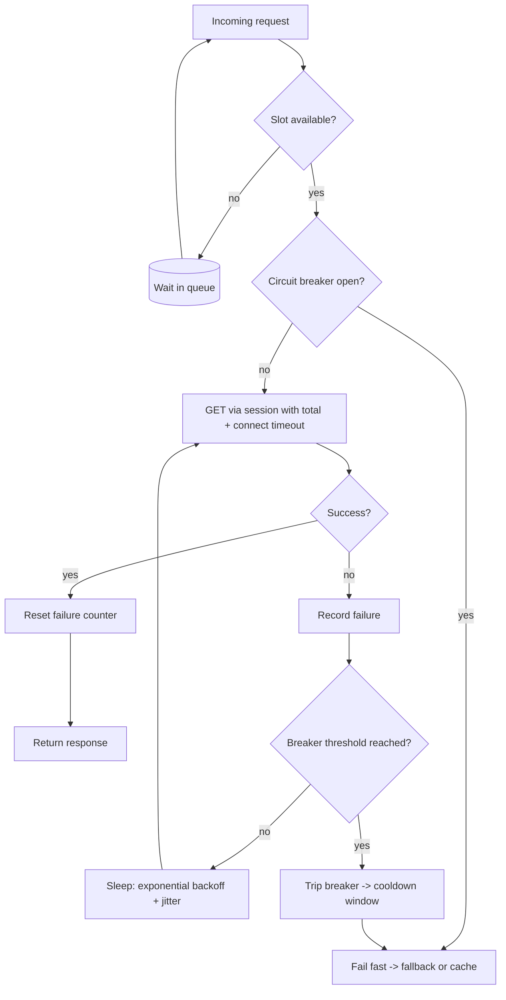

| Difficulty | Channel | Tags |
|---|---|---|
| advanced | backend | asyncio, aiohttp, concurrency |

Every developer has that one dependency — the service that goes quiet and quietly takes the whole app down with it. Netflix lived this nightmare at a scale you will likely never touch: over 1 billion API requests per day fanning out to several billion downstream calls, where a single slow dependency could saturate request threads in seconds [1]. This is the story of how they survived it — and how you can bring the same resilience to your aiohttp connection pool before the pager rings.

---

> ### Real-World Case — Netflix
>
> The Netflix API brokers catalog and subscriber metadata to hundreds of device types by calling dozens of internal services, processing over 1 billion requests per day that fan out to several billion downstream calls (a 1:6 ratio) with peaks of 100k+ dependency requests per second. With that many moving parts, a single slow or failing dependency could saturate the API's request threads in seconds and take the entire service down.
>
> | | |
> |---|---|
> | **Challenge** | When one of ~30 dependencies fails or becomes latent, the failure cascades: blocked request threads pile up until the whole API is unusable, and users lose streaming. Even mathematically perfect dependencies were the problem — 30 dependencies each with 99.99% uptime combine to only 99.7% availability, meaning 2+ hours of downtime per month. Netflix needed to keep streaming alive even when backend services degraded. |
> | **Solution** | Netflix built the Hystrix fault-tolerance layer, which wraps every dependency call with: network timeouts and retries, isolated per-dependency thread pools, semaphores (via tryAcquire, never a blocking call) to cap concurrent calls, and circuit breakers that trip at a threshold like 50% error rate in a 10-second rolling window. When a circuit trips, requests fail fast or fall back to degraded responses (custom fallback, fail-silent, or fail-fast), shedding load so the failing system can recover instead of being pounded further. |
> | **Outcome** | Hystrix grew to execute 10+ billion thread-isolated and 200+ billion semaphore-isolated command executions per day at Netflix with a dramatic improvement in uptime. In one documented production incident, a bug caused the API to be throttled by its database, the circuit breaker automatically tripped on 157 of 200 servers, and the fallback local query cache served most of the active data set — video views per second stayed essentially flat, meaning members barely noticed a database failure. |
> | **Lesson** | Graceful degradation under load is about deliberately failing fast and shedding pressure, not adding more resources — Netflix warns that the instinct to enlarge thread pools, queues, and timeouts when a circuit trips is self-DDoS. A resilient system trips the circuit, serves a degraded-but-functional fallback, and keeps healthy dependencies isolated from the struggling one so recovery is fast. |

---

## Hook — The Slow Dependency That Sneaks Up on You

It was a normal Tuesday. Your API is humming along, p95 latency looks great, and then one of your fifteen microservices decides to feel slow. Just slow — not down. No pager, no alert. But every connection in your pool now waits a little longer, every timeout piles up, and within minutes your concurrency is exhausted and requests are backing up into a queue that nobody asked for. Sound familiar? This is the slow dependency problem, and it is one of the most dangerous failure modes in distributed systems precisely because it is invisible right up until it becomes catastrophic. Netflix knows this intimately: with a 1:6 fan-out ratio — every API request triggering roughly six downstream calls — a single laggard could collapse the entire platform in seconds [1]. What many developers discover too late is that the fix isn't more connections. It's fewer, smarter ones.

## Problem — Your Connection Pool Is a Single Point of Failure

Here is the trap: connection pools feel like plumbing, so they rarely get the respect they deserve. Most aiohttp apps create a bare ClientSession, set a timeout, and call it a day. That works — until it doesn't. The math is unforgiving. If a dependency's response time doubles, each connection is occupied twice as long, so the pool's effective capacity halves, and requests queue in a deadly spiral. Because asyncio runs on a single event loop, a hung request doesn't block the loop itself — but it still burns a slot in the pool, a slot that could have served a healthy request [2]. Retries make it worse: when many clients retry simultaneously, you get a retry storm that multiplies load on an already struggling service. Consequently, the stakes are high: a misconfigured timeout, a leaked connection, or an unhandled exception can turn a routine deploy into a 2am incident. And here's the uncomfortable part — by the time you see the symptom (timeouts, backlog), the cascade is usually already in motion.

## Real-World Case — Netflix

You might be thinking: sure, but that's Netflix-scale. My service will never have that problem. The plot twist is that the failure mode is identical at every scale. Netflix processes over 1 billion requests per day that fan out to several billion downstream calls — a 1:6 ratio — with peaks of over 100,000 dependency requests per second [1]. One slow or failing dependency could saturate the API's request threads in seconds and take the entire service down. Their answer was Hystrix, a latency-and-fault-tolerance library that isolates dependencies behind circuit breakers. The payoff was dramatic and quantified. In one documented production incident, a bug caused the API to be throttled by its own database; the circuit breaker automatically tripped on 157 of 200 servers, and a fallback local query cache served most of the active data set. Video views per second stayed essentially flat — members barely noticed a database failure [1]. Let that sink in: their users couldn't tell that a core dependency had failed. That is the destination. This article is the road map for getting there with aiohttp.

## Deep Dive — Four Tools, One Mission: Fail Fast and Gracefully

Building on the Netflix story, the real insight is that resilience comes from controlled failure, not from avoiding failure. That's the counterintuitive core: you actually want the request to fail fast, because a hung request is a dead slot, while a cleanly failed one frees capacity for the healthy traffic behind it. Four mechanisms work together to make this happen. First, semaphore-based limiting: a semaphore caps how many requests are in flight at once — your concurrency ceiling, enforced in pure async, with no OS threads involved [7]. Second, the circuit breaker: track consecutive failures, and after a threshold (say 5), trip the breaker and reject new requests for a cooldown window (say 60 seconds), giving the ailing service breathing room instead of a pile-on [4]. Third, exponential backoff: when you do retry, double the wait between attempts — 0.5s, 1s, 2s — and add jitter to avoid synchronized retry waves that all hit the recovery at once [5]. Finally, health checks and pruning: probe connections periodically, drop dead ones, and warm up fresh connections at startup so your first wave of traffic doesn't pay the TCP handshake tax [3]. Here's the trade-off developers need to understand: thread isolation versus semaphore isolation. Netflix ran both — 10+ billion thread-isolated and 200+ billion semaphore-isolated executions per day [1]. For aiohttp, semaphore isolation is almost always the right call, because blocking threads inside an async app defeats the entire purpose of going async.

## Workflow — The Request Lifecycle, Toll Booth Edition

Now that the concepts are clear, let's trace the flow they form. Think of it as a toll booth with a breakdown lane: every request must first prove it fits through the gate (semaphore), then check whether the road ahead is closed (circuit breaker), and if there's a crash, retry with growing pauses before finally diverting traffic to the fallback lane. The lifecycle looks like this. First, acquire a slot — await the semaphore; if the pool is saturated, requests queue at the app layer instead of piling up OS connections [7]. Second, check the breaker — if it's open, fail fast with a fallback or cached response; do not touch the network [4]. Third, attempt the request — with a total timeout and keepalive enabled on a shared TCP connector to avoid repeated handshakes [6][8]. Fourth, on success, reset the failure counter — a single win flushes the memory of past pain. Fifth, on failure, record it, then retry with exponential backoff and jitter [5]. Sixth, trip the breaker — when failures exceed the threshold inside the cooldown window, the breaker opens and traffic diverts to fallback. The diagram below tells the whole story at a glance. Notice the deliberate loop: the retry path circles back to the request, but the breaker is what ultimately breaks the cycle. Without steps two and six, you would just have a retry storm grinding a sick service into the ground [4][5].

## Code Example — A Production-Minded Connection Pool Manager

Here's where theory meets the keyboard. The example below layers semaphore limiting, a circuit breaker, and exponential backoff onto a shared aiohttp session — the exact pattern from the workflow above, ready to wire into your app lifecycle.

## Lessons Learned — Battle Scars, Pitfalls, and the So What

Every one of these patterns exists because someone, somewhere, learned the hard way. Here are the battle scars worth collecting before they collect you. First, connection leaks: always close the session on shutdown, or you will leak sockets and file descriptors in tests, workers, and serverless cold starts alike — the stop() method is not optional. Second, SSL validation: verify certificates in production; disabling verification turns your pool into a man-in-the-middle buffet. Third, inadequate timeouts: set both total and connect timeouts; a missing total timeout lets a dead dependency hold a slot hostage [8]. Fourth, retry storms: uncoordinated retries multiply load precisely when the target is weakest — backoff without jitter just shifts the problem by a constant [5]. Fifth, error propagation: asyncio surfaces exceptions differently than threaded code, and swallowing or double-wrapping them makes debugging a nightmare [2]. Finally, the biggest lesson of all: the circuit breaker isn't about the failing service — it's about protecting the healthy ones behind it. Netflix's members didn't notice a database failure because the system chose to fail fast and degrade gracefully rather than hang and collapse [1].

---

## Connection Pool Request Flow

<strong>Original Interview Question</strong>

**Q:** How would you implement a connection pool manager for aiohttp that handles graceful degradation under high load and connection timeouts?

**A:** Implement a connection pool manager for aiohttp using a semaphore to limit concurrent connections, exponential backoff for retrying failed requests, and circuit breaker pattern to gracefully degrade under high load and connection timeouts.

## Conclusion

The moral of the story is deceptively simple: a system's resilience is measured not by how it handles success, but by how it fails. Netflix proved that a database meltdown can be invisible to users when the architecture knows how to fail fast and degrade gracefully [1]. Your aiohttp app can carry the same DNA — a semaphore for bounded concurrency, a circuit breaker for controlled failure, exponential backoff to avoid retry storms, and honest timeouts so dead dependencies never hold a slot hostage. Start small: ship the semaphore and explicit timeouts this week, then layer in the breaker and backoff once you've observed real failure patterns. The memorable insight to share with your team: the goal is never 'everything works' — it's 'nothing breaks everything.'

---

## References

1. [Netflix incident report](https://netflixtechblog.com/fault-tolerance-in-a-high-volume-distributed-system-91ab4faae74a) — article
2. [asyncio — Asynchronous I/O documentation](https://docs.python.org/3/library/asyncio.html) — documentation
3. [aiohttp documentation — ClientSession and timeout configuration](https://docs.aiohttp.org/en/stable/) — documentation
4. [Circuit breaker design pattern](https://en.wikipedia.org/wiki/Circuit_breaker_design_pattern) — article
5. [AWS — Error retries and exponential backoff](https://docs.aws.amazon.com/general/latest/gr/api-retries.html) — documentation
6. [RFC 7230 — HTTP/1.1 Message Syntax and Routing (persistent connections)](https://datatracker.ietf.org/doc/html/rfc7230) — documentation
7. [asyncio synchronization primitives — Semaphore](https://docs.python.org/3/library/asyncio-sync.html) — documentation
8. [aiohttp Client Quickstart — timeouts and connection management](https://docs.aiohttp.org/en/stable/client_quickstart.html) — documentation

---

**Author:** Satishkumar Dhule — [GitHub](https://github.com/satishkumar-dhule) · [LinkedIn](https://linkedin.com/in/satishkumar-dhule) · [Website](https://satishkumar-dhule.github.io)
